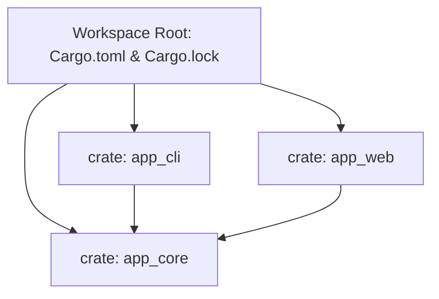

# 📦 Cargo Workspaces, Features & Performance-Profile

Wenn dein Rust-Projekt wächst, möchtest du deinen Code in mehrere voneinander unabhängige Crates aufteilen, bedingte Funktionen steuern und die maximale Performance aus deinen Release-Builds herausholen.

In diesem Kapitel lernen wir Cargo-Workspaces, Feature-Flags und fortgeschrittene Release-Profile für den Produktivbetrieb kennen.

---

## 🧠 1. Cargo Workspaces (Multi-Crate Projekte)

Ein **Cargo Workspace** ist ein Verzeichnisverbund, der es dir ermöglicht, mehrere zusammengehörende Crates in einem gemeinsamen Repository zu verwalten. 



### Die Vorteile von Workspaces:
* **Gemeinsamer `target/`-Ordner:** Alle Crates teilen sich den komprimierten Build-Ordner. Das spart gigantisch viel Speicherplatz und Beschleunigt die Kompilierzeit!
* **Einheitliche `Cargo.lock`:** Garantiert, dass alle Crates exakt dieselben Abhängigkeitsversionen nutzen.

### Einrichtung der Haupt-`Cargo.toml` im Wurzelverzeichnis:
```toml
[workspace]
members = [
    "crates/app_core",
    "crates/app_cli",
    "crates/app_web",
]
resolver = "2"
```

---

## 🧠 2. Feature Flags (Bedingte Kompilierung)

Mit Feature-Flags kannst du bestimmte Funktionalitäten deines Crates optional machen. Anwender installieren nur das, was sie wirklich brauchen.

### Definition in `Cargo.toml`:
```toml
[package]
name = "mein_crate"
version = "0.1.0"

[features]
# Standardmäßig aktivierte Features
default = ["json"]

# Optionale Feature-Definitionen
json = ["dep:serde_json"] # Aktiviert die optionale Abhängigkeit serde_json
postgres = []

[dependencies]
serde_json = { version = "1.0", optional = true }
```

### Verwendung im Rust-Code (`src/lib.rs`):
```rust
// Dieser Code wird nur kompiliert, wenn das Feature "postgres" aktiviert ist!
#[cfg(feature = "postgres")]
pub fn verbinde_datenbank() {
    println!("Verbinde mit PostgreSQL...");
}

#[cfg(not(feature = "postgres"))]
pub fn verbinde_datenbank() {
    println!("Nutze In-Memory-Datenbank...");
}
```

Ausführen im Terminal:
```bash
cargo build --features postgres
cargo build --all-features
cargo build --no-default-features
```

---

## 🧠 3. Fortgeschrittene Performance-Profile

In der `Cargo.toml` kannst du exakt steuern, wie der Rust-Compiler im `--release`-Modus optimiert.

### Das Ultimative High-Performance-Profil:
```toml
[profile.release]
# Level 3: Maximale Geschwindigkeitsoptimierung
opt-level = 3

# LTO (Link-Time Optimization): Verbindet Optimierungen über Crate-Grenzen hinweg!
lto = true

# Codegen-Units = 1: Verlangsamt das Kompilieren, erzeugt aber schnelleren Maschinencode
codegen-units = 1

# Panics führen direkt zum Abbruch (spart Stack-Unwinding-Code)
panic = "abort"

# Entfernt alle Debug-Symbole aus der Binärdatei (macht die Datei winzig)
strip = true
```

---

## 🛠️ Praxis-Aufgaben

### Aufgabe: Feature-Prüfung in Rust
Vervollständige die bedingte Kompilierung:

```rust
fn main() {
    // todo: Nutze das cfg!-Makro, um zur Laufzeit zu prüfen, ob das Feature "json" aktiv ist
    if cfg!(feature = "json") {
        println!("JSON-Unterstützung ist aktiviert!");
    } else {
        println!("Keine JSON-Unterstützung.");
    }
}
```

---

## 💡 Zusammenfassung

| Konzept | Zweck |
| :--- | :--- |
| **Workspace** | Verwaltung mehrerer Crates mit einem gemeinsamen `target/`-Ordner. |
| `[features]` | Optionale Module und Abhängigkeiten zur Compilezeit steuern. |
| `lto = true` | *Link-Time Optimization* für maximale Binär-Performance. |
| `strip = true` | Entfernt Symbole für extrem kleine Dateigrößen. |
