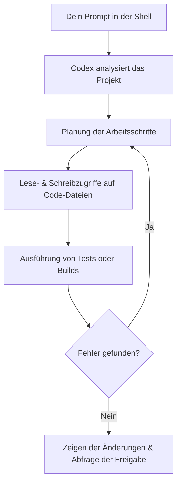

# 💻 Codex CLI – Der Terminal-Assistent von OpenAI

*Lass die generative KI von OpenAI direkt in deiner Shell Code schreiben, testen und ausführen.*

---

In dieser Lektion lernen wir **Codex CLI** kennen. Codex CLI ist ein von OpenAI entwickeltes Kommandozeilen-Werkzeug (CLI), das es dir ermöglicht, die hochentwickelten Sprach- und Reasoning-Modelle von OpenAI direkt in deiner vertrauten Terminal-Umgebung zu nutzen. Codex CLI fungiert als ein autonomer Software-Agent: Er kann dein Projektverzeichnis analysieren, Code-Dateien modifizieren, Compiler-Fehler beheben und Shell-Befehle ausführen – alles gesteuert durch einfache, natürliche Sprache.

Für angehende Rust-Programmierer bietet Codex CLI eine hervorragende Möglichkeit, interaktiv an Projekten zu arbeiten, ohne die Shell verlassen zu müssen. Der Agent kann `cargo build` ausführen, Fehlermeldungen des Compilers direkt interpretieren und Korrekturvorschläge machen.

---

## 🧠 Theorie: Was ist Codex CLI?

### Was unterscheidet Codex CLI von Web-Chats?

Klassische Chat-Oberflächen (wie ChatGPT im Browser) erfordern ständiges Kopieren und Einfügen von Code und Fehlermeldungen. Codex CLI arbeitet hingegen direkt auf deinem lokalen Dateisystem.

| Eigenschaft | ChatGPT im Web | Codex CLI |
| :--- | :--- | :--- |
| **Schnittstelle** | Browser (GUI) | Terminal (CLI) |
| **Dateizugriff** | Nur manueller Upload/Download | Direkter, lokaler Lese- und Schreibzugriff |
| **Befehlsausführung** | Keine | Kann Shell-Befehle ausführen (z. B. `cargo test`) |
| **Autonomie** | Niedrig (du musst alles übertragen) | Hoch (Agent plant und korrigiert selbstständig) |
| **Sicherheit** | Keine lokalen Auswirkungen | Ausführung von Befehlen erfordert Benutzerfreigabe |

### Der Agenten-Loop (Reaktionsschleife)

Wenn du Codex CLI eine Aufgabe erteilst, läuft im Hintergrund eine Schleife ab:



1. **Analysieren & Lesen:** Der Agent scannt die Struktur des Rust-Projekts und liest relevante Dateien (wie `Cargo.toml` oder `src/main.rs`).
2. **Planen:** Basierend auf der Aufgabe entwirft das Modell eine Strategie.
3. **Schreiben & Ausführen:** Codex modifiziert den Code und führt Befehle wie `cargo check` aus.
4. **Verifizieren:** Bei Fehlern korrigiert sich der Agent selbst, bis der Build oder die Tests erfolgreich sind.
5. **Freigeben:** Codex zeigt dir ein präzises Diff (Vergleich vor/nachher). Keine Änderung wird ohne dein finales Einverständnis ins Repository geschrieben.

---

## 🛠️ Praxis-Aufgaben

### Aufgabe A: Installation und Einrichtung

1. Codex CLI setzt eine aktive Node.js-Umgebung voraus. Stelle sicher, dass Node.js installiert ist.
2. Installiere Codex CLI global auf deinem System:
   * **macOS / Linux:**
     ```bash
     curl -fsSL https://chatgpt.com/codex/install.sh | sh
     ```
   * **Windows (via npm):**
     ```bash
     npm install -g @openai/codex
     ```
3. Navigiere in das Verzeichnis deines Rust-Projekts.
4. Starte die Authentifizierung und die Ersteinrichtung mit:
   ```bash
   codex login
   ```
5. Folge den Anweisungen im Terminal, um dich mit deinem OpenAI-Konto zu verknüpfen.

---

### Aufgabe B: Projekt-Onboarding

1. Starte Codex CLI im interaktiven Modus:
   ```bash
   codex
   ```
2. Stelle dem Agenten folgende Einstiegsfrage:
   ```text
   Analysiere die Cargo.toml und gib mir eine Übersicht, welche externen Crates dieses Projekt nutzt und was der Einstiegspunkt ist.
   ```
3. Beobachte im Terminal, wie der Agent die Dateien scannt und die Antwort formuliert.
4. Beende die Session mit dem Slash-Befehl `/exit`.

---

### Aufgabe C: Compiler-Fehler beheben lassen

1. Öffne deine `src/main.rs` in einem Editor und baue bewusst einen kleinen Fehler ein (z. B. entferne ein Semikolon am Ende einer Zuweisung).
2. Starte Codex CLI mit einer direkten Aufgabe aus deiner Shell:
   ```bash
   codex "Führe cargo check aus und behebe alle Fehler, die du findest"
   ```
3. Verfolge die Schritte der KI: Sie wird den Compiler-Fehler sehen, die entsprechende Zeile lokalisieren, den Fehler korrigieren und dir das Diff zur Freigabe vorlegen.
4. Bestätige die Änderung, wenn sie korrekt aussieht.

---

### Aufgabe D: Pipeline-Chaining (Pipes)

1. Du kannst die Standardausgabe anderer CLI-Tools direkt an Codex übergeben. Generiere beispielsweise eine Commit-Nachricht basierend auf deinen aktuellen Git-Änderungen:
   ```bash
   git diff | codex -p "Schreibe eine prägnante Git-Commit-Nachricht für dieses Diff"
   ```
2. Lass dir Testergebnisse erklären, ohne dass der Agent deinen Code verändert:
   ```bash
   cargo test 2>&1 | codex -p "Erkläre mir einfach, warum dieser Test fehlgeschlagen ist"
   ```

---

### Aufgabe E: Read-Only Modus für maximale Sicherheit

1. Wenn du Codex CLI nur als Berater nutzen möchtest und verhindern willst, dass die KI Dateien schreibt oder Befehle auf deinem System ausführt, starte das Tool im Read-Only-Modus:
   ```bash
   codex --readonly
   ```
2. Versuche, Codex CLI in diesem Modus anzuweisen, eine neue Datei anzulegen. Beobachte, wie der Agent dies verweigert und erklärt, dass er keine Schreibrechte besitzt.

---

### Aufgabe F: Nützliche Slash-Befehle nutzen

1. Starte eine interaktive Sitzung mit `codex`.
2. Probiere folgende Slash-Befehle aus und beobachte ihre Wirkung:
   * `/clear` – Setzt den Kontext und den Chatverlauf zurück.
   * `/config` – Öffnet das Menü zur Anpassung von Modellparametern und Berechtigungen.
   * `/exit` – Beendet die aktuelle Sitzung sicher.

---

## 🚀 50 Projektvorschläge

Hier findest du 50 Projektideen, die du als Rust-Einsteiger umsetzen kannst. Nutze Codex CLI dabei als deinen Co-Piloten und Mentor, um die Aufgaben schrittweise zu lösen.

> [!IMPORTANT]
> **Keine fertigen Codelösungen!**
> Rust lernt man am besten, indem man selbst tippt. Nutze Codex CLI, um dir die Konzepte erklären zu lassen, Fehler zu suchen oder Teilschritte zu planen. Der fertige Code sollte aus deiner eigenen Feder stammen!

### 🟢 Einstieg (1–10): Einfache CLI-Tools und Spiele

1. **Zahlenratespiel**
   * *Konzept:* Der Computer generiert eine Zufallszahl, die du erraten musst.
   * *Lernziel:* Kontrollfluss, Zufallszahlen generieren, Benutzereingaben lesen.
   * *Codex-Prompt-Tipp:* `„Erkläre mir, wie ich in Rust Benutzereingaben von der Standard-Eingabe einlese und in eine Ganzzahl umwandele.“`
2. **CLI-Taschenrechner**
   * *Konzept:* Ein Programm, das einfache Rechenoperationen (`+`, `-`, `*`, `/`) auf zwei Zahlen anwendet.
   * *Lernziel:* Enums für Operatoren, `match`-Anweisungen, grundlegendes Error-Handling.
   * *Codex-Prompt-Tipp:* `„Wie kann ich ein Enum definieren, das mathematische Operationen darstellt, und eine Match-Anweisung darauf anwenden?“`
3. **In-Memory To-Do-Liste**
   * *Konzept:* Aufgaben im RAM hinzufügen, auflisten und als erledigt markieren.
   * *Lernziel:* Arbeiten mit `Vec<T>` und Structs.
   * *Codex-Prompt-Tipp:* `„Hilf mir bei der Definition einer Struktur für ein To-Do-Item und wie ich eine Liste davon in einem Vector verwalte.“`
4. **Wortzähler (Word Counter)**
   * *Konzept:* Ein CLI-Tool, das die Wörter, Zeilen und Zeichen einer Textdatei zählt.
   * *Lernziel:* Datei-I/O (`std::fs::File`), Strings verarbeiten.
   * *Codex-Prompt-Tipp:* `„Wie öffne ich eine Textdatei in Rust und lese sie Zeile für Zeile ein?“`
5. **Temperatur-Konverter**
   * *Konzept:* Werte zwischen Celsius, Fahrenheit und Kelvin hin und her rechnen.
   * *Lernziel:* Mathematische Operationen, Datentypen konvertieren.
   * *Codex-Prompt-Tipp:* `„Wie definiere ich Funktionen für mathematische Formeln und stelle sicher, dass Gleitkommazahlen korrekt gerundet werden?“`
6. **Passwort-Generator**
   * *Konzept:* Erstellt ein sicheres, zufälliges Passwort basierend auf Längen- und Zeichendefinitionen.
   * *Lernziel:* Umgang mit Arrays, Vektoren und zufälliger Auswahl.
   * *Codex-Prompt-Tipp:* `„Wie wähle ich in Rust zufällig Elemente aus einem Array von Zeichen aus?“`
7. **FizzBuzz Deluxe**
   * *Konzept:* Das klassische FizzBuzz, bei dem der Benutzer die Teiler und Wörter frei konfigurieren kann.
   * *Lernziel:* Schleifen, Modulo-Operationen, CLI-Argumente parsen.
   * *Codex-Prompt-Tipp:* `„Wie lese ich Kommandozeilenargumente ohne externe Crates aus der std::env::args-Liste?“`
8. **Einheitenumrechner**
   * *Konzept:* Konvertiert Längen (Meter, Fuß, Meilen) oder Gewichte (Gramm, Pfund, Unzen).
   * *Lernziel:* Strukturierung von Formeln in separaten Modulen.
   * *Codex-Prompt-Tipp:* `„Wie erstelle ich in Rust eine modulare Struktur, um Berechnungen in eine eigene Datei auszulagern?“`
9. **Anagramm-Prüfer**
   * *Konzept:* Prüft, ob zwei eingegebene Wörter Anagramme voneinander sind.
   * *Lernziel:* Strings manipulieren, Zeichen sortieren.
   * *Codex-Prompt-Tipp:* `„Wie zerlege ich einen String in Rust in seine einzelnen Zeichen (Chars), sortiere diese und vergleiche sie?“`
10. **Römische Zahlen Konverter**
    * *Konzept:* Wandelt arabische Zahlen in römische Zahlen um und umgekehrt.
    * *Lernziel:* String-Generierung, komplexe Match-Logik.
    * *Codex-Prompt-Tipp:* `„Welche Algorithmen eignen sich für die Konvertierung von Zahlen in römische Ziffern und wie bilde ich das in Match-Blöcken ab?“`

---

### 🟡 Mittelstufe (11–25): Dateiverarbeitung, Algorithmen und Netzwerke

11. **Markdown-zu-HTML Konverter**
    * *Konzept:* Liest eine einfache `.md`-Datei und konvertiert Überschriften und Absätze in HTML-Tags.
    * *Lernziel:* Text-Parsing, String-Ersetzungen.
    * *Codex-Prompt-Tipp:* `„Wie kann ich Zeilenanfänge prüfen (z. B. auf '#') und den Rest der Zeile in ein HTML-Tag einpacken?“`
12. **CSV-Daten-Parser**
    * *Konzept:* Parst eine CSV-Datei ohne externe Abhängigkeiten und gibt die Daten tabellarisch aus.
    * *Lernziel:* String-Splitting, Vektoren aus Vektoren (`Vec<Vec<String>>`).
    * *Codex-Prompt-Tipp:* `„Wie spalte ich eine CSV-Zeile unter Berücksichtigung von Kommas auf?“`
13. **Einfacher HTTP-Client**
    * *Konzept:* Sendet einen GET-Request an eine URL und gibt den Response-Body aus (z. B. mit `reqwest`).
    * *Lernziel:* Umgang mit externen Crates, asynchrones Rust (`tokio`).
    * *Codex-Prompt-Tipp:* `„Erkläre mir, wie ich die reqwest-Bibliothek in Cargo.toml einbinde und einen einfachen asynchronen GET-Request durchführe.“`
14. **Log-Datei-Filter**
    * *Konzept:* Durchsucht Logdateien nach bestimmten Levels (INFO, WARN, ERROR) und exportiert die Treffer.
    * *Lernziel:* Filtern von Iteratoren, Datei-Schreiben.
    * *Codex-Prompt-Tipp:* `„Wie nutze ich filter() auf einem Iterator von Zeilen, um nur Zeilen zu behalten, die ein bestimmtes Wort enthalten?“`
15. **JSON-Konfigurations-Lader**
    * *Konzept:* Liest eine Konfigurationsdatei im JSON-Format und parst sie in ein Rust-Struct (mit `serde`).
    * *Lernziel:* Serialisierung und Deserialisierung, Attribute in Rust.
    * *Codex-Prompt-Tipp:* `„Wie benutze ich Serde-Derive, um eine JSON-Struktur automatisch in ein Rust-Struct zu übersetzen?“`
16. **Kontaktdatenbank mit Datei-Persistenz**
    * *Konzept:* Erstellt ein Adressbuch, das Kontakte hinzufügt und diese in einer lokalen Textdatei speichert.
    * *Lernziel:* Structs, Implementierung von Methoden (`impl`), Dateiverwaltung.
    * *Codex-Prompt-Tipp:* `„Wie implementiere ich Methoden auf einem Struct, um Daten zu serialisieren und in eine Datei zu schreiben?“`
17. **Hangman mit ASCII-Grafik**
    * *Konzept:* Das klassische Galgenmännchen-Spiel im Terminal mit visueller ASCII-Art des Galgens.
    * *Lernziel:* Zustandsverwaltung, String-Vergleiche, Terminal-Ausgabe manipulieren.
    * *Codex-Prompt-Tipp:* `„Wie verwalte ich den Spielzustand (erratene Buchstaben, verbleibende Versuche) sauber in einem Rust-Struct?“`
18. **Datei-Verschlüssler**
    * *Konzept:* Verschlüsselt und entschlüsselt eine Datei mit einem einfachen XOR-Schlüssel.
    * *Lernziel:* Byte-Arrays (`&[u8]`), Bitweise Operationen, Dateiverarbeitung auf Byte-Ebene.
    * *Codex-Prompt-Tipp:* `„Wie lese ich eine Datei als Byte-Stream ein und wende eine XOR-Operation auf jedes Byte an?“`
19. **Verschlüsselter Passwort-Manager**
    * *Konzept:* Speichert Logins lokal in einer Datei, die mit einem Master-Passwort gesichert ist (z. B. mit `aes-gcm`).
    * *Lernziel:* Kryptographie in Rust, Sicherheits-Best-Practices.
    * *Codex-Prompt-Tipp:* `„Welche Crates eignen sich für AES-Verschlüsselung in Rust und wie installiere ich sie?“`
20. **Port-Scanner**
    * *Konzept:* Prüft, welche Ports einer IP-Adresse aktiv auf Verbindungen lauschen.
    * *Lernziel:* Netzwerkschnittstellen (`std::net::TcpStream`), Timeouts.
    * *Codex-Prompt-Tipp:* `„Wie versuche ich eine TCP-Verbindung zu einer IP und einem Port mit einem kurzen Timeout aufzubauen?“`
21. **URL-Shortener CLI**
    * *Konzept:* Erstellt kurze Schlüssel für lange URLs und speichert diese Zuordnung in einer lokalen Map.
    * *Lernziel:* `HashMap`, Generierung von kurzen Hashes.
    * *Codex-Prompt-Tipp:* `„Wie speichere ich Schlüssel-Wert-Paare in einer HashMap und sichere diese dauerhaft in einer Datei?“`
22. **Task-Planer (Mini-Cron)**
    * *Konzept:* Führt bestimmte Aufgaben in vorgegebenen Sekunden-Intervallen aus.
    * *Lernziel:* Threads (`std::thread`), Pausieren (`std::time::Duration`).
    * *Codex-Prompt-Tipp:* `„Wie erstelle ich einen Hintergrund-Thread, der in einer Endlosschleife schläft und periodisch eine Funktion triggert?“`
23. **RSS-Feed-Reader**
    * *Konzept:* Holt Feeds von Nachrichten-Websites und listet die neuesten Schlagzeilen im Terminal auf.
    * *Lernziel:* XML-Parsing, Web-Anfragen.
    * *Codex-Prompt-Tipp:* `„Welche Crates helfen beim XML-Parsing in Rust und wie extrahiere ich damit bestimmte Tags?“`
24. **Rekursiver Datei-Finder**
    * *Konzept:* Durchsucht ein Verzeichnis und alle Unterverzeichnisse nach Dateien mit einer bestimmten Endung.
    * *Lernziel:* Rekursion, `std::fs::read_dir`, Fehlerbehandlung bei fehlenden Rechten.
    * *Codex-Prompt-Tipp:* `„Wie durchlaufe ich Verzeichnisse rekursiv und filtere nach Dateiendungen, während ich Berechtigungsfehler ignoriere?“`
25. **IP-Adressen-Validierer**
    * *Konzept:* Prüft, ob eine eingegebene IPv4- oder IPv6-Adresse syntaktisch korrekt ist.
    * *Lernziel:* Reguläre Ausdrücke (Crate `regex`) oder manuelles String-Parsing.
    * *Codex-Prompt-Tipp:* `„Wie nutze ich das regex-Crate, um ein Pattern für IPv4-Adressen abzugleichen?“`

---

### 🔵 Fortgeschritten (26–40): Bibliotheken, Server und Systemnähe

26. **Multi-threaded Webserver**
    * *Konzept:* Ein minimaler Webserver, der statische HTML-Seiten über einen selbst programmierten Thread-Pool ausliefert.
    * *Lernziel:* TCP-Sockets, Channels (`std::sync::mpsc`), Threads.
    * *Codex-Prompt-Tipp:* `„Wie implementiere ich einen einfachen Thread-Pool in Rust, um TCP-Verbindungen parallel zu verarbeiten?“`
27. **Redis-Klon (In-Memory Key-Value Store)**
    * *Konzept:* Ein Server, der per TCP Befehle wie `GET`, `SET` und `DEL` entgegennimmt und Werte speichert.
    * *Lernziel:* Netzwerkprotokolle parsen, Concurrency, `Arc` und `Mutex`.
    * *Codex-Prompt-Tipp:* `„Wie teile ich eine HashMap sicher auf mehrere Threads auf, indem ich Arc und Mutex kombiniere?“`
28. **Git-Status-Checker**
    * *Konzept:* Analysiert das aktuelle Verzeichnis und zeigt an, ob ungesicherte Änderungen vorliegen.
    * *Lernziel:* Systembefehle ausführen (`std::process::Command`), Output parsen.
    * *Codex-Prompt-Tipp:* `„Wie führe ich einen Shell-Befehl wie 'git status' aus Rust heraus aus und lese dessen Ausgabe ein?“`
29. **Markdown-Wiki mit Webinterface**
    * *Konzept:* Ein Webserver, der Markdown-Dateien aus einem Ordner liest, rendert und im Browser anzeigt.
    * *Lernziel:* Web-Routing (z. B. mit `axum`), HTML-Templates (z. B. `tera`).
    * *Codex-Prompt-Tipp:* `„Wie richte ich mit axum eine Route ein, die einen Pfad-Parameter akzeptiert und eine Datei ausliest?“`
30. **Chat-Server mit WebSockets**
    * *Konzept:* Mehrere Clients können sich verbinden und Nachrichten in Echtzeit austauschen.
    * *Lernziel:* Asynchrone Streams, WebSockets, Broadcast-Channels.
    * *Codex-Prompt-Tipp:* `„Wie richte ich einen WebSocket-Server mit tokio-tungstenite ein und leite Nachrichten an alle verbundenen Clients weiter?“`
31. **Einfaches Build-Tool**
    * *Konzept:* Liest eine Konfigurationsdatei (z. B. `tasks.json`) und führt definierte Build-Schritte nacheinander aus.
    * *Lernziel:* Prozesssteuerung, Abhängigkeitsbäume validieren.
    * *Codex-Prompt-Tipp:* `„Wie führe ich mehrere Prozesse nacheinander aus und breche ab, wenn ein Prozess mit einem Exit-Code ungleich 0 endet?“`
32. **CPU- und RAM-Monitor**
    * *Konzept:* Ein Terminal-Dashboard, das die Auslastung der Systemressourcen grafisch anzeigt.
    * *Lernziel:* TUI-Entwicklung (z. B. `ratatui`), System-APIs auslesen (z. B. `sysinfo`).
    * *Codex-Prompt-Tipp:* `„Wie kann ich mit dem sysinfo-Crate die CPU-Last abfragen und die Werte periodisch aktualisieren?“`
33. **Bildbearbeitungs-CLI**
    * *Konzept:* CLI-Tool zum Konvertieren, Skalieren oder Graufärben von Bildern.
    * *Lernziel:* Umgang mit Binärdaten, das `image`-Crate verwenden.
    * *Codex-Prompt-Tipp:* `„Wie lade ich ein Bild mit dem image-Crate, wende einen Graustufen-Filter an und speichere es unter neuem Namen?“`
34. **Template-Engine**
    * *Konzept:* Ersetzt Platzhalter wie `{{name}}` in einer Textvorlage durch Werte aus einer Map.
    * *Lernziel:* String-Parsing, reguläre Ausdrücke, Text-Generierung.
    * *Codex-Prompt-Tipp:* `„Wie implementiere ich einen einfachen Parser, der Platzhalter im Format {{key}} findet und durch Werte aus einer HashMap ersetzt?“`
35. **SQLite Aufgabenplaner**
    * *Konzept:* Speichert To-Dos persistent in einer lokalen SQLite-Datenbank.
    * *Lernziel:* Datenbankanbindung mit `sqlx` oder `rusqlite`.
    * *Codex-Prompt-Tipp:* `„Wie binde ich rusqlite ein, erstelle eine Tabelle und führe SQL-INSERT-Statements in Rust aus?“`
36. **Cargo Dependency Grapher**
    * *Konzept:* Parst die `Cargo.lock` und gibt die Abhängigkeiten als Text-Graph oder DOT-Format aus.
    * *Lernziel:* Graphenstrukturen, Lockdateien parsen.
    * *Codex-Prompt-Tipp:* `„Wie parst man eine Cargo.lock-Datei im TOML-Format und baut daraus eine Abhängigkeitsstruktur auf?“`
37. **DNS-Lookup Tool**
    * *Konzept:* Frägt DNS-Server nach IP-Adressen und MX-Einträgen für Domains ab.
    * *Lernziel:* Netzwerkprotokolle, DNS-Pakete verstehen.
    * *Codex-Prompt-Tipp:* `„Wie kann ich mit der Bibliothek trust-dns-resolver einen DNS-A-Record-Lookup durchführen?“`
38. **Sudoku-Löser**
    * *Konzept:* Findet Lösungen für unvollständige Sudoku-Rätsel.
    * *Lernziel:* Backtracking-Algorithmus, zweidimensionale Arrays.
    * *Codex-Prompt-Tipp:* `„Wie implementiere ich einen rekursiven Backtracking-Algorithmus in Rust auf einem 9x9-Array?“`
39. **Datei-Duplikate-Finder**
    * *Konzept:* Scannt Ordner und identifiziert doppelte Dateien durch Vergleich ihrer Hashes.
    * *Lernziel:* Hashing-Bibliotheken (z. B. `sha2`), Dateivergleiche.
    * *Codex-Prompt-Tipp:* `„Wie berechne ich den SHA-256-Hash einer Datei in Rust effizient, ohne die gesamte Datei auf einmal in den Speicher zu laden?“`
40. **Custom Shell**
    * *Konzept:* Eine eigene Shell, die Befehle ausführt, Pipes unterstützt (`|`) und Verzeichniswechsel erlaubt.
    * *Lernziel:* `fork` und `exec` Konzepte (bzw. `std::process`), Pfadmanipulationen.
    * *Codex-Prompt-Tipp:* `„Wie implementiere ich einen Command-Parser für meine Shell, der Eingaben an Pipes aufsplittet und an std::process::Command weiterleitet?“`

---

### 💀 Challenge (41–50): Komplexe Systeme und Simulationen

41. **Lisp/Scheme-Interpreter**
    * *Konzept:* Liest Lisp-Code ein, baut einen AST und wertet ihn aus.
    * *Lernziel:* Rekursive Datentypen (`Box<T>`), Lexer, Parser, AST-Strukturen.
    * *Codex-Prompt-Tipp:* `„Wie definiere ich eine rekursive Enum-Struktur für einen Abstract Syntax Tree (AST) in Rust unter Verwendung von Box?“`
42. **CHIP-8 Emulator**
    * *Konzept:* Emuliert eine klassische 8-Bit-Konsole inklusive CPU, Speicher und Grafik-Ausgabe.
    * *Lernziel:* Bitweise Operationen, Memory-Mapping, grafische Darstellung (z. B. mit `sdl2` oder `minifb`).
    * *Codex-Prompt-Tipp:* `„Wie simuliere ich den Speicher und die Register einer CPU in Rust und verarbeite Opcode-Bytes?“`
43. **Blockchain-Prototyp**
    * *Konzept:* Implementiert eine einfache Blockchain mit Proof-of-Work und Validierung der Kette.
    * *Lernziel:* Kryptographie, Verkettung von Strukturen, Nebenläufigkeit bei der Miner-Suche.
    * *Codex-Prompt-Tipp:* `„Wie entwerfe ich eine Struktur für Blöcke, die den Hash des vorherigen Blocks referenzieren und Proof-of-Work berechnen?“`
44. **Mini-Torrent-Client**
    * *Konzept:* Liest eine `.torrent`-Datei, parst die Daten und kontaktiert den Tracker.
    * *Lernziel:* Bencode-Parsing, asynchrone TCP-Verbindungen zu Peers.
    * *Codex-Prompt-Tipp:* `„Wie parst man Bencode in Rust und wie sendet man den Handshake an einen Peer über eine TCP-Verbindung?“`
45. **Text-Editor im Terminal**
    * *Konzept:* Ein interaktiver Editor mit Zeilennummern, Suchen und Speichern (ähnlich wie Nano).
    * *Lernziel:* Terminal-Steuerung im Raw-Mode (z. B. `crossterm`), Cursor-Positionierung.
    * *Codex-Prompt-Tipp:* `„Wie versetze ich das Terminal mit crossterm in den Raw-Modus und fange Tastatureingaben ab, ohne auf Enter zu warten?“`
46. **Conways Spiel des Lebens (Multithreaded)**
    * *Konzept:* Eine Zell-Simulation, bei der die Berechnung der nächsten Generation auf mehrere Threads aufgeteilt wird.
    * *Lernziel:* Thread-Synchronisation, Barrieren (`std::sync::Barrier`), Gitter-Updates.
    * *Codex-Prompt-Tipp:* `„Wie synchronisiere ich mehrere Threads mit einer Barrier, um sicherzustellen, dass alle die aktuelle Generation fertig berechnet haben?“`
47. **IRC-Client**
    * *Konzept:* Verbindet sich mit einem IRC-Netzwerk, tritt Channels bei und sendet/empfängt Nachrichten.
    * *Lernziel:* Textprotokolle über TCP, asynchrone Event-Loops.
    * *Codex-Prompt-Tipp:* `„Wie erstelle ich eine asynchrone Schleife, die gleichzeitig eingehende Socket-Nachrichten liest und Tastatureingaben sendet?“`
48. **Web-Scraper**
    * *Konzept:* Extrahiert strukturierte Daten von Websites (z. B. Preisvergleiche) und speichert sie.
    * *Lernziel:* HTML-Parsing (z. B. `scraper` oder `html5ever`), Fehlertoleranz.
    * *Codex-Prompt-Tipp:* `„Wie benutze ich das scraper-Crate, um CSS-Selektoren auf ein HTML-Dokument anzuwenden und Textinhalte auszulesen?“`
49. **Eigener Memory Allocator**
    * *Konzept:* Schreibt einen benutzerdefinierten Allocator für Rust, der den Speicher selbst verwaltet.
    * *Lernziel:* Unsafe Rust, Speicher-Layouts, das `GlobalAlloc` Trait.
    * *Codex-Prompt-Tipp:* `„Wie implementiere ich das GlobalAlloc-Trait in Rust und welche unsafe-Methoden müssen überschrieben werden?“`
50. **Datei-Synchronisations-Tool (Rsync-Klon)**
    * *Konzept:* Synchronisiert zwei Verzeichnisse (lokal oder über das Netzwerk), indem nur veränderte Blöcke übertragen werden.
    * *Lernziel:* Netzwerk-Programmierung, Datei-Fingerprints, Delta-Algorithmen.
    * *Codex-Prompt-Tipp:* `„Wie vergleiche ich die Metadaten und Hashes von Dateien in zwei Verzeichnissen, um eine Liste von geänderten Dateien zu erstellen?“`

---

## 💡 Zusammenfassung

| Begriff | Erklärung |
| :--- | :--- |
| **Agentic AI** | Ein KI-System, das eigenständig plant, Tools ausführt und Fehler korrigiert. |
| **Codex CLI** | OpenAIs Befehlszeilen-Coding-Agent, der auf reasoning-Modellen basiert. |
| **Agenten-Loop** | Die kontinuierliche Schleife aus Analyse, Codegenerierung, Testlauf und Korrektur. |
| **Pipes / Chaining** | Das Weiterleiten von Terminal-Ausgaben anderer Befehle direkt als Kontext in die KI. |
| **Read-Only Modus** | Sicherheits-Modus, bei dem der Agent keine lokalen Dateien verändern oder Shell-Befehle ausführen darf. |

---

## 📚 Weiterführende Links

* [Offizielle OpenAI Codex CLI Dokumentation](https://chatgpt.com/codex)
* [OpenAI GitHub Repository](https://github.com/openai/codex)
* [Rust CLI Book – Leitfaden für CLI-Entwicklung in Rust](https://rust-cli.github.io/book/index.html)
