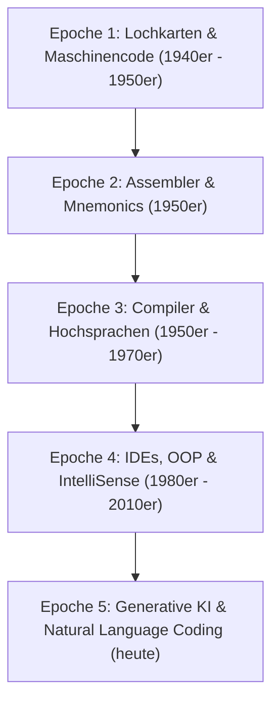
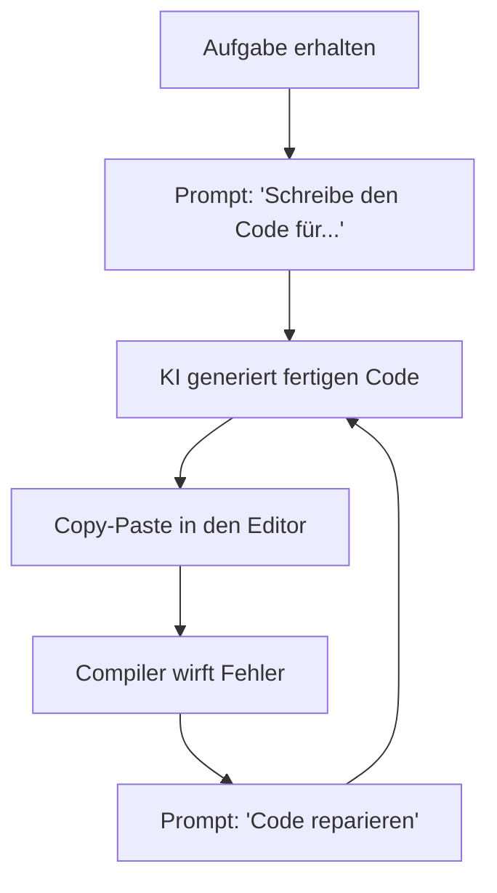
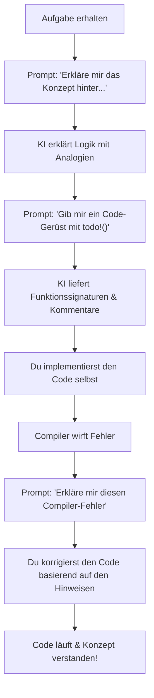

# 🤖 Konzepte statt Syntax lernen (Coding mit KI – Phase 1)

## Willkommen in der Zukunft der Softwareentwicklung!

Herzlichen Glückwunsch! Du machst deine ersten Schritte in der Programmierung zu einer Zeit, in der sich die Softwareentwicklung so rasant verändert wie noch nie zuvor. Früher mussten Programmierer Monate damit verbringen, kryptische Syntax auswendig zu lernen, Semikolons zu suchen und dicke Handbücher zu wälzen, um überhaupt ein einfaches Programm zum Laufen zu bringen. Heute stehen dir künstliche Intelligenzen (KIs) als persönliche Tutoren, Code-Generatoren und Sparringspartner zur Seite.

Doch diese neue Macht bringt eine große Gefahr mit sich: Wer sich blind auf die Vorschläge einer KI verlässt, ohne die grundlegenden Konzepte dahinter zu verstehen, wird niemals ein eigenständiger Entwickler. Du wirst zu einem reinen „Copy-Paste-Coder“, der nicht in der Lage ist, Fehler zu beheben, Sicherheitsrisiken zu erkennen oder eigene, kreative Systemarchitekturen zu entwerfen.

In diesem Kapitel lernst du, wie du das Steuer selbst in der Hand behältst. Wir betrachten die Funktionsweise von KI-Systemen, verstehen den gewaltigen Paradigmenwechsel in unserem Berufsbild und lernen handfeste Techniken, um KI als didaktisches Werkzeug einzusetzen, das dein Lernen beschleunigt, statt dein Denken zu ersetzen.

---

## 📌 Lernziele für dieses Kapitel

Am Ende dieses Kapitels wirst du in der Lage sein:
1. **Die Evolution der Softwareentwicklung** zu beschreiben – vom direkten Bit-Schubsen auf Lochkarten bis hin zur deklarativen Programmierung mit generativer KI.
2. **Den Unterschied** zwischen einer klassischen, regelbasierten Autovervollständigung (wie IntelliSense) und einer probabilistischen KI-Code-Generierung (wie GitHub Copilot) präzise zu erklären.
3. **Das Token-Management** und das **Kontextfenster** von Large Language Models (LLMs) zu verstehen und dieses Wissen zur Optimierung deiner Anfragen (Prompts) zu nutzen.
4. **Das Abstraktionsproblem** und die Grenzen probabilistischer Engines zu erkennen, um Fehler (Halluzinationen) in KI-generiertem Code systematisch aufzuspüren.
5. **Das Konzept des Vibe Engineerings** zu definieren und ein gesundes mentales Modell für die Zusammenarbeit mit KI-Systemen aufzubauen.
6. **Die FAAFO-Philosophie** in deinen Lernalltag zu integrieren, um schnell, ambitioniert und mit Spaß Prototypen zu entwickeln.
7. **Deine Rolle als System-Orchestrator** (vom „Linienkoch“ zum „Küchenchef“) zu verinnerlichen und das kritische „70%-Problem“ zu meistern.
8. **Fortgeschrittene Prompt-Techniken** wie *Zero-Shot*, *Few-Shot* und *Chain-of-Thought* zielgerichtet beim Programmieren und Lernen einzusetzen.
9. **Die Anatomie eines Prompts** zu zerlegen und effektive Anfragen zu formulieren, die dir strukturierte Code-Gerüste statt fertiger Lösungen liefern.
10. **Ein modernes Tool-Setup** einzurichten (GitHub Copilot, Tabnine, Cody, Warp Terminal) und die Web-Plattform `Bolt.new` für schnelles Prototyping zu nutzen.
11. **Geführtes Pair Programming** mit der KI durchzuführen und mithilfe des Rust-Makros `todo!()` komplexe Probleme (wie IBAN-Validierung oder ein Text-Quiz) schrittweise selbst zu lösen.
12. **Professionelle Inline-Dokumentation** (Docstrings) generieren zu lassen und zu interpretieren, um den eigenen und fremden Code besser zu verstehen.

---

## 1. Evolution & KI-Grundlagen

### 1.1 Evolution der Softwareentwicklung: Vom Compiler zur generativen KI
*Referenz: Taulli, Kap. 1*

Um zu verstehen, warum das Programmieren mit KI ein so revolutionärer Schritt ist, müssen wir einen Blick in die Vergangenheit werfen. Die Geschichte der Softwareentwicklung ist eine Geschichte der kontinuierlichen Abstraktion. Abstraktion bedeutet in diesem Zusammenhang: Wir entfernen uns immer weiter von der physischen Hardware des Computers und nähern uns der menschlichen Sprache an.

#### Die fünf Epochen der Programmierung



##### Epoche 1: Lochkarten und Maschinencode
In den Anfängen der Informatik gab es keine Bildschirme, keine Tastaturen und keine Programmiersprachen. Computer wurden über physische Kabelverbindungen oder Lochkarten programmiert. Programmierer mussten in reinem Binärcode (Nullen und Einsen) denken. Ein winziger Fehler – ein falsch gestanztes Loch – bedeutete, dass ein tagelang vorbereiteter Stapel Lochkarten unbrauchbar war. Die Fehlerquote war enorm, und das Schreiben von Software war eine rein mathematisch-physikalische Tortur.

##### Epoche 2: Assemblersprachen
Um das Binärchaos zu lichten, wurden Assemblersprachen entwickelt. Statt `01101011` schrieben Programmierer nun sogenannte *Mnemonics* wie `MOV` (Verschiebe Daten), `ADD` (Addiere) oder `PUSH` (Schiebe auf den Stapel). Ein Programm namens Assembler übersetzte diese Befehle in den Maschinencode. Dies war der erste echte Abstraktionsschritt, allerdings war der Code immer noch extrem hardwarenah und musste für jeden Prozessortyp völlig neu geschrieben werden.

##### Epoche 3: Die Ära der Compiler und Hochsprachen
Ende der 1950er Jahre erfand Grace Hopper den ersten Compiler. Damit war der Weg frei für die ersten Hochsprachen wie Fortran, LISP und COBOL, später folgten C und C++. Programmierer konnten nun mathematische Formeln und logische Strukturen schreiben, die der menschlichen Denkweise ähnelten (z. B. `if x > 5 { y = 10; }`). Der Compiler übernahm die komplexe Übersetzung in den Maschinencode des jeweiligen Prozessors. Software wurde portabel und für wesentlich mehr Menschen zugänglich.

##### Epoche 4: Integrierte Entwicklungsumgebungen (IDEs) und Autovervollständigung
Mit dem Aufkommen von IDEs in den 1980er und 1990er Jahren änderte sich der Workflow erneut. Editoren wurden intelligenter. Sie hoben Syntaxfehler farbig hervor (Syntax-Highlighting), boten Debugger zur Fehlersuche und führten die Autovervollständigung (wie Microsofts *IntelliSense*) ein. Programmierer mussten nicht mehr jede Bibliotheksfunktion auswendig wissen; ein Druck auf die Tastenkombination genügte, um die verfügbaren Methoden anzuzeigen. Dennoch musste jede einzelne Zeile Logik manuell eingetippt werden.

##### Epoche 5: Generative KI und natürlicher Sprachcode
Heute befinden wir uns in der fünften Epoche. Die generative KI ermöglicht es uns, die Programmiersprache selbst als eine Art "Zwischen-Compiler" zu betrachten. Wir beschreiben das gewünschte Verhalten der Software in natürlicher Sprache (Deutsch, Englisch etc.), und ein Large Language Model generiert den passenden Quellcode in Rust, Python oder JavaScript. Wir programmieren nicht mehr auf der Ebene der Syntax, sondern auf der Ebene der Konzepte und Anforderungen.

---

### 1.2 Funktionsweise von KI-Coding: Codevorschläge vs. klassische Code-Vervollständigung
*Referenz: Taulli, Kap. 2*

Viele Einsteiger verwechseln moderne KI-Assistenten mit der klassischen Autovervollständigung, die sie aus ihren Editoren kennen. Es ist jedoch essenziell, die grundlegenden Unterschiede in ihrer Funktionsweise zu verstehen, um die jeweiligen Stärken und Schwächen einschätzen zu können.

#### Der direkte Vergleich

| Merkmal | Klassische Autovervollständigung (z. B. IntelliSense) | KI-gestützte Codevorschläge (z. B. GitHub Copilot) |
| :--- | :--- | :--- |
| **Technologie** | Deterministische Algorithmen, Compiler-APIs, AST (Abstract Syntax Trees) | Probabilistische neuronale Netze (Transformer-Architektur) |
| **Funktionsweise** | Liest die exakten Regeln der Sprache und analysiert den bestehenden Code-Zustand. | Berechnet die statistisch wahrscheinlichste Fortsetzung deines Textes. |
| **Zuverlässigkeit** | **100% korrekt** im Rahmen der Syntax. Schlägt nur Dinge vor, die tatsächlich existieren. | **Variabel.** Kann fantastischen Code schreiben, aber auch Fehler erfinden (Halluzinationen). |
| **Kontext-Verständnis**| Lokal beschränkt (aktuelle Klasse, importierte Module, Typdefinitionen). | Global und semantisch (Kommentare, offene Tabs, Muster im gesamten Projekt). |
| **Generierungstiefe** | Einzelne Wörter, Methodennamen, Variablen, kurze Snippets. | Ganze Funktionen, Klassen, Test-Suiten, SQL-Abfragen, Dokumentationen. |

#### Wie klassische Systeme arbeiten
Wenn du in deiner IDE eine Variable namens `benutzer_name` vom Typ `String` eingibst und einen Punkt `.` dahintersetzt, fragt die IDE den Sprachserver (z. B. den Rust Analyzer) ab. Dieser kennt die Definition des Typs `String` in der Standardbibliothek ganz genau. Er liefert dir eine Liste aller Methoden wie `.len()`, `.trim()` oder `.push_str()`. Die IDE zeigt dir ausschließlich Methoden an, die syntaktisch an dieser Stelle erlaubt sind und tatsächlich existieren. Es gibt keinen Raum für Spekulationen oder Fehler.

#### Wie KI-Systeme arbeiten
Wenn du ein KI-Tool nutzt, schickst du im Hintergrund kontinuierlich Teile deines Codes an ein neuronales Netz. Die KI analysiert den Text und berechnet: *„Welche Zeichenkette folgt am wahrscheinlichsten auf diesen Code-Kontext?“*
Wenn du beispielsweise folgenden Kommentar schreibst:
```rust
// Funktion, die prüft, ob eine Zahl eine Primzahl ist
```
erkennt das Modell das Muster. In seinen gigantischen Trainingsdaten (bestehend aus Milliarden Zeilen Code von GitHub) folgte auf einen solchen Kommentar sehr häufig eine Funktion wie `fn ist_primzahl(n: u32) -> bool { ... }`. Die KI schlägt dir diesen Block vor. Sie tut dies nicht, weil sie die mathematischen Regeln von Primzahlen „versteht“, sondern weil dieses Textmuster in ihrer Datenbank statistisch extrem dominant ist.

---

### 1.3 Grundlagen von Large Language Models (LLMs): Token-Management und Kontextfenster
*Referenz: Kofler, Kap. 1*

Um KI-Tools effizient zu nutzen und die gefürchteten Leistungseinbrüche oder Logikfehler zu vermeiden, musst du zwei technische Kernkonzepte von LLMs verstehen: **Tokens** und das **Kontextfenster**.

#### Token-Management: Die Währung der KI
Ein LLM liest und schreibt keinen Text in Form von Buchstaben oder ganzen Wörtern. Stattdessen zerlegt ein sogenannter *Tokenizer* den Text vor der Verarbeitung in kleinere Einheiten, die **Tokens**.

- Ein Token entspricht im Englischen grob 4 Zeichen oder 0,75 Wörtern.
- Häufige Wörter wie `let` oder `fn` in Rust sind meist ein einzelnes Token.
- Seltene Wörter, deutsche Umlaute (`ä`, `ö`, `ü`) oder komplexe Code-Syntax mit vielen Sonderzeichen (`#[derive(Debug, Serialize, Deserialize)]`) werden oft in mehrere, sehr kleine Tokens zerlegt.

##### Warum ist das wichtig für dich?
1. **Effizienz:** Je mehr Sonderzeichen und verschachtelte Strukturen du verwendest, desto schneller füllt sich das Token-Kontingent der KI.
2. **Kosten und Limits:** API-Anbieter rechnen nach Tokens ab. Ein ineffizient geschriebener Prompt mit viel „Rauschen“ kostet mehr und stößt schneller an die Limits.

#### Das Kontextfenster: Das Kurzzeitgedächtnis
Das Kontextfenster (Context Window) definiert die maximale Anzahl an Tokens, die ein LLM bei einer einzelnen Anfrage gleichzeitig verarbeiten kann. Dieses Fenster umfasst:
1. Den System-Prompt (die Grundregeln der KI).
2. Deinen aktuellen Prompt (deine Frage).
3. Den Chat-Verlauf (alle vorherigen Fragen und Antworten).
4. Den Code-Kontext (geöffnete Dateien in deiner IDE, die das Plugin automatisch mitsendet).

```
+-------------------------------------------------------------+
|                      KONTEXTFENSTER                         |
|                                                             |
|  [ System-Prompt ]  --> Definiert das Verhalten (Tutor)     |
|  [ Chat-Verlauf ]   --> Ältere Nachrichten                  |
|  [ Code-Kontext ]   --> Offene Tabs, Projektstruktur         |
|  [ Aktueller Prompt]--> Deine konkrete Frage                |
|                                                             |
|  ==================== MAXIMALE TOKEN-GRENZE ==============  |
+-------------------------------------------------------------+
```

##### Was passiert, wenn das Kontextfenster voll ist?
Wenn die Summe der Tokens aus deinem Chatverlauf und dem Code-Kontext die Grenze des Modells überschreitet, tritt das sogenannte *FIFO-Prinzip* (First In, First Out) in Kraft. Die ältesten Informationen fliegen aus dem Gedächtnis des Modells. 
- Die KI vergisst plötzlich, welche Variablen du in der ersten Nachricht definiert hast.
- Sie ignoriert zuvor vereinbarte Regeln (z. B. „Schreibe keinen fertigen Code“).
- Die Antworten werden ungenauer, widersprüchlicher oder enthalten plötzlich Syntaxfehler.

##### Best Practices zur Schonung des Kontextfensters:
- **Halte Chatverläufe kurz:** Starte für ein neues Thema oder ein neues Modul einen frischen Chat.
- **Schließe ungenutzte Tabs:** Viele IDE-Plugins senden den Inhalt aller geöffneten Tabs als Kontext mit. Schließe Dateien, die für deine aktuelle Aufgabe irrelevant sind.
- **Präzise Code-Auswahl:** Markiere nur den spezifischen Codeblock, über den du sprechen möchtest, statt der KI die gesamte Datei zu senden.

---

### 1.4 Die probabilistische Engine: Grundlagen und das Abstraktionsproblem
*Referenz: Pawar, Teil 1*

Wie wir bereits gelernt haben, ist eine generative KI eine **probabilistische Engine**. Das bedeutet, dass jede Antwort das Produkt einer Wahrscheinlichkeitsrechnung ist. Daraus ergibt sich eine der größten Herausforderungen für angehende Entwickler: das **Abstraktionsproblem**.

#### Next-Token-Prediction anschaulich erklärt
Stell dir vor, du spielst das Spiel „Satz vervollständigen“.
Wenn ich sage: *„Der Hund bellt den...“*, welches Wort folgt als nächstes?
- *„Postboten“* (Wahrscheinlichkeit: 70%)
- *„Baum“* (Wahrscheinlichkeit: 20%)
- *„Kühlschrank“* (Wahrscheinlichkeit: 1%)
- *„Apfelkuchen“* (Wahrscheinlichkeit: 0.001%)

Die probabilistische Engine der KI funktioniert exakt genauso, nur auf einem astronomisch höheren mathematischen Niveau. Sie bewertet Billionen von Parametern, um das nächste Wort (oder Token) zu bestimmen.

#### Das Abstraktionsproblem: Der Schein trügt
Weil die KI so gut darin ist, syntaktisch passenden Text aneinanderzureihen, erzeugt sie eine **Illusion von Verständnis**. Wenn sie eine fehlerfreie Rust-Funktion generiert, glauben wir instinktiv, die KI habe die Logik dahinter verstanden. Das ist ein Trugschluss.

Die KI manipuliert Symbole (Buchstaben und Zahlen) basierend auf statistischen Mustern. Sie hat:
- Kein physikalisches Weltverständnis.
- Keine logische Kontrollinstanz (sie führt den Code nicht im Kopf aus).
- Keine Vorstellung von der Absicht des Programmierers.

##### Die Folgen des Abstraktionsproblems:
1. **Syntaktisch korrekt, semantisch katastrophal:** Die KI schreibt Code, der fehlerfrei kompiliert, aber mathematisch völliger Unsinn ist. Beispielsweise könnte eine Funktion zur Zinsberechnung Zinsen addieren statt multiplizieren.
2. **Bibliotheken-Halluzination:** Wenn die KI vor einem schwierigen Problem steht, erfindet sie manchmal einfach eine Rust-Bibliothek (ein Crate), die perfekt für dieses Problem geeignet wäre, aber in der Realität gar nicht existiert (z. B. `extern crate super_simple_iban_validator;`).
3. **Sicherheitslücken:** Die KI neigt dazu, den einfachsten Code zu generieren. Dieser vernachlässigt jedoch oft Sicherheitsprüfungen, Validierungen von Benutzereingaben oder Fehlerbehandlungen, da diese in den Trainingsdaten seltener oder komplexer zu finden sind.

> [!WARNING]
> **Die goldene Regel des KI-gestützten Codens:**
> Vertraue niemals einem Codevorschlag, den du nicht selbst logisch nachvollziehen und durch Tests verifizieren kannst. Du bist die Qualitätskontrolle!

---

### 1.5 Das mentale Modell für Vibe Engineering
*Referenz: Lelek & Skowroński*

Der Begriff **Vibe Engineering** (oder auch *Vibe Coding*) beschreibt einen Programmierstil, der durch generative KI populär geworden ist. Man schreibt kaum noch selbst Code, sondern beschreibt der KI die Anforderungen, lässt sie den Code generieren, testet das Ergebnis und gibt bei Fehlern neue Prompts ein („Der Vibe stimmt noch nicht, korrigiere das“). 

Ohne das richtige mentale Modell führt Vibe Engineering jedoch schnell zu massivem Frust, unwartbarem Code und unauffindbaren Bugs.

#### Das falsche mentale Modell: Der Wunschbrunnen
Viele Anfänger betrachten die KI als einen magischen Wunschbrunnen. Sie werfen einen ungenauen Prompt hinein (*„Bau mir ein Spiel wie Super Mario“*) und erwarten, dass die KI auf magische Weise ein fertiges, perfektes Produkt ausgibt. Tritt ein Fehler auf, wird der Prompt variiert (*„Nein, das geht nicht, mach es anders“*), ohne dass der Entwickler versteht, was der generierte Code eigentlich tut. Dies führt in eine Sackgasse aus sich gegenseitig blockierenden Fehlern.

#### Das richtige mentale Modell: Der unkonzentrierte Praktikant
Betrachte die KI als einen **extrem schnellen, hochmotivierten, aber sehr unkonzentrierten Praktikanten**. 
- Der Praktikant hat das gesamte theoretische Wissen der Welt im Kopf.
- Er arbeitet in Lichtgeschwindigkeit.
- Aber: Er neigt zu Leichtsinnsfehlern, übersieht Grenzfälle, liest die Arbeitsanweisung nicht richtig durch und versucht gerne, dich mit selbstbewusst vorgetragenen Halbwahrheiten zu beeindrucken.

##### Wie führst du diesen Praktikanten erfolgreich?
1. **Präzise Aufgabenstellung:** Gib ihm klare, unmissverständliche Anweisungen. Zerlege die große Aufgabe in kleine Teilschritte.
2. **Kontinuierliche Kontrolle:** Lies jede Zeile Code, die er dir vorlegt. Lass ihn den Code erklären.
3. **Definiere Schnittstellen (Contracts):** Sage ihm genau, wie die Eingaben und Ausgaben einer Funktion auszusehen haben, bevor er mit der Arbeit beginnt.
4. **Schreibe Tests:** Der beste Weg, um zu prüfen, ob der Praktikant sauber gearbeitet hat, sind automatisierte Tests. Lass ihn die Tests schreiben und überprüfe sie selbst.

---

## 2. Der Paradigmenwechsel

### 2.1 Die FAAFO-Philosophie (Fast, Ambitious, Autonomous, Fun, Optionality)
*Referenz: Kim & Yegge, Teil 1*

Die Softwareentwicklung befindet sich in einem tiefgreifenden Wandel. Die traditionelle Herangehensweise weicht einer dynamischen, experimentierfreudigen Philosophie, die durch KI-Werkzeuge überhaupt erst möglich wird. Gene Kim und Steve Yegge beschreiben diesen neuen Ansatz mit dem Akronym **FAAFO**.

```
+-------------------------------------------------------------+
|                      DIE FAAFO-PHILOSOPHIE                  |
|                                                             |
|  [ F ] AST        --> Sofortiges Feedback, keine Wartezeiten  |
|  [ A ] MBITIOUS   --> Große Ideen ohne Syntax-Angst angehen |
|  [ A ] UTONOMOUS  --> Unabhängig lernen und Probleme lösen  |
|  [ F ] UN         --> Kreatives Schaffen statt Frust         |
|  [ O ] PTIONALITY --> Viele Lösungswege parallel evaluieren |
+-------------------------------------------------------------+
```

#### Fast (Schnell)
Früher war der Zyklus zwischen einer Idee und dem ersten lauffähigen Prototyp lang. Man musste Bibliotheken konfigurieren, Build-Systeme einrichten und seitenweise Boilerplate-Code schreiben. Mit KI verkürzt sich dieser Zyklus auf Sekunden. Du kannst eine Idee beschreiben, die KI generiert das Grundgerüst, und du siehst sofort, ob das Konzept funktioniert. Das Feedback ist unmittelbar.

#### Ambitious (Ambitioniert)
Als Anfänger bist du oft durch deine mangelnden Kenntnisse der komplexen Syntax eingeschränkt. Du traust dir vielleicht nicht zu, eine Netzwerk-Applikation oder ein komplexes Datenverarbeitungsprogramm zu schreiben. Die KI nimmt dir diese "Syntax-Angst". Du kannst ehrgeizige Projekte planen, da du weißt, dass die KI dir bei der Umsetzung der komplizierten Sprachkonstrukte hilft.

#### Autonomous (Autonom)
Wenn du früher beim Programmieren auf einen Fehler gestoßen bist, den du nicht verstanden hast, musstest du in Foren wie Stack Overflow suchen oder auf die Hilfe eines erfahrenen Kollegen warten. Heute macht dich die KI autonom. Sie kann dir Compiler-Fehler verständlich auf Deutsch erklären, dir alternative Lösungswege aufzeigen und dich Schritt für Schritt durch das Problem führen.

#### Fun (Spaß)
Der Spaßfaktor beim Programmieren steigt enorm, wenn man sich auf die kreative Problemlösung konzentrieren kann, anstatt Stunden mit der Suche nach einem vergessenen Semikolon oder einer falsch gesetzten geschweiften Klammer zu verschwenden. Du erlebst schneller Erfolgserlebnisse, was deine Motivation aufrechterhält.

#### Optionality (Optionen)
Da das Erstellen von Code kaum noch Zeit kostet, musst du dich nicht sofort auf den ersten Lösungsansatz festlegen. Du kannst die KI bitten: *„Zeige mir drei verschiedene Wege, um dieses Problem in Rust zu lösen: einmal mit einer Schleife, einmal funktional mit Iteratoren und einmal rekursiv. Erkläre mir die Vor- und Nachteile von jedem Ansatz.“* So lernst du verschiedene Programmierparadigmen parallel kennen.

---

### 2.2 Vom Linienkoch zum Küchenchef: Der Wandel vom manuellen Code-Schreiber zum System-Orchestrator
*Referenz: Kim & Yegge, Teil 2; Osmani*

Dieses Bild ist eines der wichtigsten mentalen Modelle für deine zukünftige Karriere als Softwareentwickler. Es beschreibt die Transformation deiner Rolle.

#### Der Linienkoch (Der klassische Coder)
Der Linienkoch arbeitet in der Küche nach festen Anweisungen. Seine Aufgabe ist es, Zwiebeln zu schneiden, Fleisch anzubraten und die Teller nach Vorgabe anzurichten. Er verbringt den Großteil seiner Zeit mit repetitiven, handwerklichen Tätigkeiten.
In der Softwareentwicklung entspricht dies dem manuellen Schreiben von Standard-Code:
- Schreiben von Getter- und Setter-Methoden.
- Erstellen von Datenbank-Tabellendefinitionen (Schemas).
- Schreiben von einfachen Unittests.
- Konvertieren von Datenformaten (z. B. JSON in XML).
Dies ist genau die Arbeit, die KI-Systeme heute fehlerfrei und in Millisekunden erledigen können. Wenn du dich nur als Linienkoch verstehst, wirst du durch die KI obsolet.

#### Der Küchenchef (Der System-Orchestrator)
Der Küchenchef kocht selten selbst jede einzelne Zutat. Seine Aufgaben sind strategischer und gestalterischer Natur:
- **Menü-Design:** Welche Gerichte passen zusammen? (Software-Architektur und Systemdesign).
- **Zutaten-Auswahl:** Welche Rohstoffe kaufen wir ein? (Auswahl der richtigen Bibliotheken, Datenstrukturen und Programmierkonzepte).
- **Delegation:** Wer übernimmt welchen Arbeitsschritt? (Effektives Prompting und Steuerung der KI).
- **Qualitätskontrolle (Abschmecken):** Entspricht das Gericht den Qualitätsansprüchen? Schmeckt es dem Gast? (Code-Reviews, Integrationstests, Sicherheitsprüfungen, Performance-Optimierung).

Als System-Orchestrator programmierst du auf einer höheren Abstraktionsebene. Du führst die KI, triffst die architektonischen Entscheidungen und validierst das Endergebnis.

#### Das 70%-Problem (nach Addy Osmani)
Addy Osmani, Engineering Leader bei Google, warnt vor dem Phänomen des **70%-Problems**.

```
+---------------------------------------------------+
|               DAS 70%-PROBLEM                     |
|                                                   |
| [======================= KI-Arbeit (70%) =======] |
| Schnell generierter Boilerplate-Code, Standard-   |
| logik, einfache Funktionen. Leicht zu erstellen.  |
|                                                   |
| [======= MENSCHLICHE EXPERTISE (30%) =======]     |
| Edge Cases, Fehlerbehandlung, Sicherheit,         |
| Performance, Architektur-Design. Kritisch!        |
+---------------------------------------------------+
```

KI-Tools machen es extrem einfach, die ersten 70% eines Projekts in Rekordzeit zu erstellen. Der Code sieht super aus, läuft auf den ersten Blick und die App startet.
Die restlichen 30% sind jedoch die schwierigsten und kritischsten:
- Was passiert bei unerwarteten Benutzereingaben (Edge Cases)?
- Ist das System sicher gegen Angriffe (SQL-Injection, Buffer Overflow)?
- Skaliert der Code, wenn 10.000 Benutzer gleichzeitig darauf zugreifen (Performance)?
- Ist der Code so strukturiert, dass man ihn in zwei Jahren noch erweitern kann (Wartbarkeit)?

Die KI scheitert oft an diesen 30%. Wenn du als Entwickler nicht die Kompetenz besitzt, diese 30% selbstständig zu analysieren, zu programmieren und zu überwachen, wird dein Projekt scheitern. Die 30% erfordern dein tiefes Verständnis der fundamentalen Konzepte.

---

## 3. Prompt Engineering & Tool-Setup

### 3.1 Grundlagen des Promptings: Zero-Shot, Few-Shot und Chain-of-Thought
*Referenz: Kofler, Kap. 1*

Prompt Engineering ist die Kunst und Wissenschaft, Anfragen an ein LLM so zu formulieren, dass man das präziseste und nützlichste Ergebnis erhält. Für Entwickler gibt es drei fundamentale Prompting-Techniken, die du beherrschen musst.

#### 1. Zero-Shot-Prompting
Du stellst der KI eine direkte Aufgabe, ohne ihr Beispiele zu geben, wie die Lösung aussehen soll. Du verlässt dich vollkommen auf das bereits trainierte Wissen des Modells.

##### Beispiel (Zero-Shot):
> **Prompt:**
> „Schreibe eine Funktion in Rust, die überprüft, ob eine übergebene Zahl eine gerade Zahl ist.“
>
> **Erwartete Antwort:**
> Die KI generiert direkt die einfache Funktion unter Verwendung des Modulo-Operators (`n % 2 == 0`).

##### Wann nutzen?
Für einfache, standardisierte Aufgaben, die keine spezielle Formatierung oder ungewöhnliche Logik erfordern.

---

#### 2. Few-Shot-Prompting
Du gibst dem Modell vor der eigentlichen Aufgabe ein oder mehrere Beispiele (Demonstrationen) für Eingabe und die gewünschte Ausgabe. Dies hilft der KI, das gewünschte Antwortformat, den Programmierstil oder spezifische Design-Muster exakt zu übernehmen.

##### Beispiel (Few-Shot):
> **Prompt:**
> „Ich möchte logische Bedingungen in textuelle Beschreibungen übersetzen. Hier sind Beispiele:
>
> **Eingabe:** `x > 10 && x < 20`
> **Ausgabe:** „Die Variable x muss strikt zwischen 10 und 20 liegen.“
>
> **Eingabe:** `y == 0 || y == 100`
> **Ausgabe:** „Die Variable y muss entweder genau 0 oder genau 100 sein.“
>
> Übersetze nun folgende Bedingung im gleichen Stil:
> **Eingabe:** `alter >= 18 && hat_fuehrerschein == true`“
>
> **Erwartete Antwort:**
> **Ausgabe:** „Das Alter muss mindestens 18 sein und die Person muss im Besitz eines Führerscheins sein.“

##### Wann nutzen?
Wenn du Code in einem ganz bestimmten Stil generieren lassen willst (z. B. nach den Stilrichtlinien deines Unternehmens), wenn du Testfälle in einer bestimmten Syntax brauchst oder komplexe Daten transformieren musst.

---

#### 3. Chain-of-Thought-Prompting (CoT)
Du weist die KI explizit an, das Problem Schritt für Schritt logisch zu analysieren und ihren Denkprozess aufzuschreiben, *bevor* sie den finalen Code generiert. Dies zwingt das Modell, Zwischenschritte in seinem Kontextfenster abzuspeichern, was die Fehlerquote bei komplexen mathematischen oder logischen Aufgaben drastisch senkt.

##### Beispiel (Chain-of-Thought):
> **Prompt:**
> „Ich möchte eine Funktion in Rust schreiben, die prüft, ob ein Jahr ein Schaltjahr ist.
> Denke zuerst Schritt für Schritt laut über die Regeln nach: Welche Bedingungen müssen für ein Schaltjahr erfüllt sein? Schreibe diese Schritte als Kommentar auf. Generiere erst danach das Code-Gerüst mit todo!().“
>
> **Erwartete Antwort:**
> „**Schritt-für-Schritt-Analyse:**
> 1. Ein Jahr ist grundsätzlich ein Schaltjahr, wenn es restlos durch 4 teilbar ist.
> 2. Ausnahme: Ist das Jahr durch 100 teilbar, ist es kein Schaltjahr...
> 3. Ausnahme von der Ausnahme: Ist das Jahr jedoch auch durch 400 teilbar, ist es dennoch ein Schaltjahr.
>
> Hier ist das Code-Gerüst basierend auf dieser Logik:
> ```rust
> fn ist_schaltjahr(jahr: u32) -> bool {
>     // 1. Teilbarkeit durch 4, 100 und 400 prüfen
>     todo!("Logik für Schaltjahr-Prüfung implementieren")
> }
> ```“

##### Wann nutzen?
Bei allen komplexen logischen Problemen, Algorithmen, mathematischen Berechnungen oder bei der Fehlersuche (Debugging).

---

### 3.2 Anatomie eines Prompts: Anweisungen, Kontext, Eingabedaten und Ausgabeformate
*Referenz: Taulli, Kap. 3*

Ein schlecht geschriebener Prompt führt zu schlechtem Code. Wenn du der KI nur hinwirfst: *„Mach IBAN Prüfung Rust“*, wirst du einen Codeblock erhalten, der dich didaktisch nicht weiterbringt, eventuell veraltet ist oder Bibliotheken nutzt, die du gar nicht verwenden willst.

Ein professioneller Prompt im Software-Engineering ist wie ein strukturierter Arbeitsauftrag aufgebaut und besteht aus vier Kernkomponenten:

```
+-------------------------------------------------------------+
|                     ANATOMIE EINES PROMPTS                  |
|                                                             |
| 1. [ ROLLE / KONTEXT ]   --> "Du bist ein didaktischer..."  |
| 2. [ ANWEISUNG ]         --> "Schreibe ein Code-Gerüst..."  |
| 3. [ EINGABEDATEN ]      --> "Hier ist der Code: ..."       |
| 4. [ AUSGABE-FORMAT ]    --> "Gib nur das Gerüst aus..."    |
+-------------------------------------------------------------+
```

#### Die vier Komponenten im Detail

1. **Rolle und Kontext (Role/Context):** Wer ist die KI und in welcher Situation befindest du dich?
   - *Schlecht:* (Keine Angabe)
   - *Gut:* „Du bist ein erfahrener Rust-Entwickler und didaktischer Mentor. Ich bin ein Programmier-Anfänger und lerne gerade die Grundlagen von Kontrollstrukturen.“
2. **Präzise Anweisung (Instructions):** Was genau soll die KI tun? Welche Regeln muss sie befolgen?
   - *Schlecht:* „Schreib Code für ein Quiz.“
   - *Gut:* „Erstelle ein Code-Gerüst für ein einfaches Text-Quiz in der Konsole. Verwende keine externen Crates (Bibliotheken), sondern nur die Rust-Standardbibliothek.“
3. **Eingabedaten (Input Data):** Welcher Code, welche API-Spezifikation oder welche Fehlermeldung dient als Basis?
   - *Gut:* „Hier ist die Datenstruktur, die ich verwenden möchte: `struct Frage { text: String, optionen: Vec<String> }`.“
4. **Ausgabeformat (Output Indicator):** Wie soll die Antwort strukturiert sein? Was soll vermieden werden?
   - *Schlecht:* (Keine Angabe, die KI gibt 3 Seiten Fließtext und fertigen Code aus)
   - *Gut:* „Gib mir keine fertige Codelösung! Erstelle nur die Funktionssignaturen mit dem `todo!()`-Makro im Funktionskörper. Füge über jeder Funktion einen kurzen didaktischen Kommentar hinzu, der erklärt, welche Schritte ich zur Lösung implementieren muss.“

#### Vorlage: Der ultimative Didaktik-Prompt für Einsteiger
Kopiere diesen Prompt und nutze ihn als System-Prompt oder als Einstieg in deine Chats, wenn du ein neues Konzept lernen willst:

> **System-Prompt:**
> „Du bist mein persönlicher, didaktischer Rust-Mentor. Dein Ziel ist es, mir zu helfen, die Konzepte hinter dem Code tiefgreifend zu verstehen.
> Bitte befolge bei all deinen Antworten diese Regeln:
> 1. Verrate mir niemals fertige Codelösungen.
> 2. Wenn ich dich nach der Implementierung einer Aufgabe frage, antworte mir mit einem strukturierten Code-Gerüst, das leere Funktionen mit dem `todo!()`-Makro enthält.
> 3. Schreibe didaktische Kommentare in den Code, die mir Hinweise auf die zu verwendenden Methoden oder Kontrollstrukturen geben.
> 4. Stelle mir am Ende deiner Antwort eine Verständnisfrage zum Thema, um mein Wissen zu prüfen.“

---

### 3.3 Einrichtung von GitHub Copilot und Alternativen
*Referenz: Taulli, Kap. 4 & 5*

Um produktiv mit KI zu arbeiten, musst du sie in deine tägliche Arbeitsumgebung (deine IDE) integrieren. Hier ist ein Überblick über die wichtigsten Werkzeuge und wie du sie einrichtest.

#### 1. GitHub Copilot: Der Branchenstandard
GitHub Copilot (entwickelt von GitHub und OpenAI) ist das am weitesten verbreitete Tool. Es läuft als Erweiterung direkt in VS Code, JetBrains IDEs, Visual Studio und Neovim.

##### Einrichtungsschritte (VS Code):
1. **Account erstellen:** Registriere dich auf github.com und aktiviere Copilot (für Studenten oft kostenlos, sonst im Abonnement).
2. **Erweiterung installieren:** Öffne VS Code, gehe zum Extension Marketplace (Symbol mit den vier Quadraten) und suche nach *„GitHub Copilot“* und *„GitHub Copilot Chat“*. Installiere beide.
3. **Anmelden:** Klicke unten links in VS Code auf das Account-Symbol und melde dich mit deinem GitHub-Konto an.
4. **Nutzung:** 
   - **Inline-Vorschläge:** Tippe einfach Code oder einen Kommentar. Copilot schlägt dir grau hinterlegten Text vor. Drücke `Tab`, um den Vorschlag anzunehmen, oder ignoriere ihn, um einfach weiterzutippen.
   - **Copilot Chat:** Drücke `Ctrl + Shift + I` (Windows/Linux) oder `Cmd + Shift + I` (macOS), um ein Chatfenster an der Seite zu öffnen. Hier kannst du Fragen stellen, Code erklären lassen oder Prompts eingeben.

---

#### 2. Tabnine: Die datenschutzfreundliche Alternative
Tabnine zeichnet sich dadurch aus, dass es lokal auf deinem Rechner ausgeführt werden kann, ohne dass dein Code an externe Server gesendet wird.

##### Stärken:
- **Datenschutz:** Perfekt für Unternehmen mit strengen Compliance-Richtlinien.
- **Ressourcenschonend:** Bietet schnelle, lokale Autovervollständigung basierend auf kleineren, spezialisierten Modellen.

---

#### 3. Cody (Sourcegraph): Der Codebase-Spezialist
Cody ist ein Open-Source-KI-Assistent, der sich besonders durch seine Fähigkeit auszeichnet, deine **gesamte Codebase** zu analysieren.

##### Stärken:
- Während Copilot oft nur die aktuell geöffneten Dateien im Blick hat, durchsucht Cody dein gesamtes Projektverzeichnis. Du kannst Fragen stellen wie: *„Wo im Projekt wird die Benutzer-Authentifizierung durchgeführt und wie kann ich dort eine neue Rolle hinzufügen?“*

---

#### 4. Warp: Das KI-Terminal
Warp ist ein modernes, auf Rust basierendes Terminal für macOS und Linux. Es integriert KI direkt in die Befehlszeile.

##### Stärken:
- Du musst keine kryptischen Terminalbefehle mehr auswendig lernen. Drücke `#` und tippe auf Deutsch ein, was du tun willst (z. B. *„Finde alle Dateien im Ordner src, die das Wort iban enthalten“*). Warp übersetzt dies in den passenden Bash-Befehl.

---

### 3.4 Schnelles Prototyping im Browser mit stackblitz Bolt.new
*Referenz: Osmani: Vibe Coding mit Bolt*

Ein großes Hindernis für Programmier-Anfänger ist das lokale Setup: Node.js installieren, den Compiler konfigurieren, Umgebungsvariablen setzen, Datenbanken einrichten. Hier kommt **Bolt.new** ins Spiel.

#### Was ist Bolt.new?
Bolt.new ist eine webbasierte Entwicklungsplattform, die auf der *WebContainer-Technologie* von Stackblitz basiert. Sie ermöglicht es, vollständige Fullstack-Webanwendungen (Frontend und Backend) komplett im Browser auszuführen, zu bearbeiten und zu deployen – gesteuert durch rein natürliche Sprache (Prompts).

#### Wie funktioniert es?
1. Du besuchst die Website `bolt.new`.
2. Du gibst einen Prompt ein wie: *„Erstelle mir ein Dashboard für eine Arztpraxis mit einem Kalender zur Terminbuchung und einer Patientenliste.“*
3. Bolt.new fängt an zu arbeiten:
   - Es entscheidet, welche Technologien am besten passen (z. B. Vite, React, TailwindCSS).
   - Es generiert die gesamte Ordnerstruktur und alle Codedateien.
   - Es startet im Hintergrund einen virtuellen Server (Node.js) direkt im Webbrowser.
   - Es zeigt dir auf der rechten Seite eine Live-Vorschau der App an.
4. Du kannst nun per Chat Anpassungen vornehmen (*„Füge ein dunkles Design hinzu“* oder *„Wenn man auf einen Termin klickt, soll ein modales Fenster mit Details aufgehen“*).

#### Vor- und Nachteile von Bolt.new für Lernende

##### Vorteile:
- **Null Setup:** Du kannst sofort und ohne Installationen mit dem Prototyping beginnen.
- **Visuelles Feedback:** Perfekt, um Benutzeroberflächen und Design-Ideen auszuprobieren.
- **Lerneffekt durch Code-Inspektion:** Du kannst jederzeit das generierte Projektverzeichnis öffnen und den Code analysieren, den Bolt.new geschrieben hat.

##### Nachteile:
- **Eingeschränkte Rust-Unterstützung:** Da Bolt.new primär auf Web-Technologien (JavaScript/TypeScript/Node.js) optimiert ist, lassen sich komplexe Systemprogrammiersprachen wie Rust dort nur schwer lokal kompilieren und ausführen.
- **Kontrollverlust:** Die KI trifft alle architektonischen Entscheidungen für dich. Als Anfänger verstehst du oft nicht, warum ein bestimmtes Framework oder eine bestimmte Struktur gewählt wurde.

---

## 4. Pair Programming zum Lernen

### 4.1 Den passenden KI-Lernpartner auswählen und didaktisch nutzen
*Referenz: Kofler, Kap. 2*

Wie verhinderst du, dass die KI dein Gehirn „abschaltet“? Die Antwort liegt in deiner didaktischen Strategie. Es gibt zwei Wege, wie du eine KI nutzen kannst: den passiven Weg und den aktiven Weg.

#### Der passive Weg (Die Sackgasse)


*Lerneffekt bei diesem Prozess: **Nahezu Null.*** Du trainierst lediglich deine Muskeln beim Drücken von `Ctrl+C` und `Ctrl+V`. Sobald du in einer Prüfung oder in einem echten Job ohne Internetverbindung Code schreiben musst, wirst du scheitern.

---

#### Der aktive Weg (Der Lern-Turbo)


*Lerneffekt bei diesem Prozess: **Maximal.*** Du nutzt die KI als geduldigen Mentor, der dir die Richtung weist, das eigentliche Laufen (das Denken und Tippen der Logik) aber dir überlässt.

---

### 4.2 Code-Gerüste erstellen und in einfache Funktionen strukturieren
*Referenz: Kofler, Kap. 2*

Gute Softwarearchitektur zeichnet sich durch Modularität aus. Das bedeutet: Wir schreiben nicht eine gigantische Funktion, die alles auf einmal erledigt, sondern wir zerlegen das Problem in kleine, spezialisierte Hilfsfunktionen. Jede Funktion sollte genau eine Aufgabe haben (Single Responsibility Principle).

In Rust gibt es ein mächtiges Werkzeug dafür: das Makro `todo!()`. 

#### Was ist das `todo!()`-Makro?
Wenn du eine Funktion deklarierst, erwartet der Rust-Compiler, dass du den Funktionskörper mit gültigem Code füllst, der den versprochenen Rückgabetyp liefert. Wenn du den Code noch nicht schreiben willst, kannst du nicht einfach den Körper leer lassen – der Compiler würde mit einem Fehler abbrechen.

Indem du `todo!()` in den Funktionskörper schreibst, sagst du dem Compiler: *„Ich weiß, dass hier Code hin muss. Bitte ignoriere den fehlenden Rückgabetyp beim Kompilieren. Ich werde das später implementieren.“*

Das Programm kompiliert fehlerfrei! Erst wenn das Programm ausgeführt wird und die Ausführung den Pfad mit dem `todo!()` erreicht, bricht es mit einer kontrollierten Fehlermeldung (*„not yet implemented“*) ab.

##### Beispiel für den strukturierten Entwurf eines Programms:
Stell dir vor, wir wollen ein Programm schreiben, das eine Zahl vom Benutzer einliest, prüft, ob sie eine Primzahl ist, und das Ergebnis ausgibt.

Wir fordern von der KI ein **Code-Gerüst** an:

```rust
// ==========================================
// CODE-GERÜST: Primzahlprüfer
// ==========================================

/// Liest eine Zeile von der Standardeingabe (Konsole) ein und 
/// versucht, diese in eine vorzeichenlose Ganzzahl (u32) umzuwandeln.
fn lies_zahl_von_konsole() -> Result<u32, String> {
    // 1. Erstelle einen leeren String mit String::new()
    // 2. Nutze std::io::stdin().read_line(), um die Eingabe zu lesen
    // 3. Entferne Newlines mit .trim()
    // 4. Wandle den String mit .parse::<u32>() um
    todo!("Implementiere das Einlesen und Parsen der Zahl");
}

/// Prüft, ob die übergebene Zahl eine Primzahl ist.
/// Gibt true zurück, wenn es eine Primzahl ist, andernfalls false.
fn ist_primzahl(zahl: u32) -> bool {
    // Tipp zur Logik:
    // - Zahlen kleiner als 2 sind keine Primzahlen.
    // - Eine Zahl ist eine Primzahl, wenn sie durch keine Zahl 
    //   zwischen 2 und der Quadratwurzel der Zahl selbst teilbar ist.
    // - Nutze eine Schleife (for oder while) und den Modulo-Operator (%).
    todo!("Implementiere die mathematische Primzahlprüfung");
}

fn main() {
    println!("Bitte gib eine positive Ganzzahl ein:");
    
    match lies_zahl_von_konsole() {
        Ok(zahl) => {
            if ist_primzahl(zahl) {
                println!("Ja, {} ist eine Primzahl!", zahl);
            } else {
                println!("Nein, {} ist keine Primzahl.", zahl);
            }
        }
        Err(fehler) => {
            println!("Fehler bei der Eingabe: {}", fehler);
        }
    }
}
```

Mit diesem Gerüst hast du eine klare Roadmap. Du musst nicht darüber nachdenken, wie die gesamte Applikation aufgebaut ist, sondern kannst dich vollkommen auf das Lösen einer einzelnen, kleinen Teilaufgabe (z. B. der mathematischen Logik in `ist_primzahl`) konzentrieren.

---

### 4.3 Praxisbeispiel: IBAN-Validierung schrittweise umsetzen
*Referenz: Kofler, Kap. 2*

Die Validierung einer IBAN (International Bank Account Number) ist ein hervorragendes Praxisprojekt, um den Umgang mit Strings, Zeichenketten-Manipulationen, Schleifen und Datentyp-Konvertierungen in Rust zu lernen.

#### Der mathematische Hintergrund (nach ISO 13616)
Eine IBAN hat je nach Land eine feste Länge (z. B. Deutschland: 22 Zeichen, Österreich: 20 Zeichen, Schweiz: 21 Zeichen). Sie beginnt immer mit einem zweistelligen Ländercode (z. B. `DE`), gefolgt von einer zweistelligen Prüfziffer (z. B. `89`) und der länderspezifischen Kontonummer (BBAN).

Um eine IBAN mathematisch zu prüfen, wird folgendes Verfahren angewendet:
1. **Formatbereinigung:** Entferne alle Leerzeichen und wandle Kleinbuchstaben in Großbuchstaben um.
2. **Länder- und Längenprüfung:** Prüfe, ob die IBAN mit einem gültigen Ländercode startet und die für dieses Land exakt vorgeschriebene Länge hat.
3. **Umstellung:** Verschiebe die ersten vier Zeichen (die beiden Länderbuchstaben und die zweistellige Prüfziffer) an das Ende der IBAN.
   - *Beispiel:* Aus `DE89 3704 0044 0532 0130 00` wird `370400440532013000DE89`.
4. **Konvertierung in Zahlen:** Ersetze jeden Buchstaben durch eine zweistellige Zahl, wobei `A = 10`, `B = 11`, ..., `Z = 35` entspricht.
   - *Aus unserem Beispiel:* `D` wird `13`, `E` wird `14`. Die Zeichenkette wird zu einer riesigen Zahl: `370400440532013000131489`.
5. **Modulo 97:** Berechne den Rest dieser riesigen Zahl bei der Division durch 97. 
   - Wenn das Ergebnis exakt **1** ist, ist die IBAN mathematisch gültig.
   - Da die Zahl viel zu groß für Standard-Datentypen wie `u64` oder `u128` ist, müssen wir die Modulo-Operation schrittweise (iterativ) durchführen.

---

#### Dein didaktisches Code-Gerüst zum Ausfüllen:
Kopiere diesen Code in deine `src/main.rs` Datei. Deine Aufgabe ist es, die mit `todo!()` markierten Bereiche selbstständig zu implementieren. Die Kommentare geben dir wertvolle Hinweise auf die benötigten Rust-Methoden.

```rust
// ==========================================
// PRAXISPROJEKT: IBAN-Validator in Rust
// ==========================================

/// Bereinigt die IBAN von Leerzeichen und konvertiert sie in Großbuchstaben.
fn bereinige_iban(iban: &str) -> String {
    // 1. Nutze iban.replace(" ", "") um Leerzeichen zu entfernen.
    // 2. Nutze .to_uppercase() um alles in Großbuchstaben umzuwandeln.
    todo!("Bereinigung implementieren")
}

/// Prüft, ob das Länderkürzel bekannt ist und die Länge der IBAN korrekt ist.
fn validiere_laenge_und_land(iban: &str) -> bool {
    if iban.len() < 5 {
        return false;
    }
    
    let laendercode = &iban[0..2];
    
    // Für dieses einfache Beispiel validieren wir nur drei Länder:
    // Deutschland (DE) -> 22 Zeichen
    // Österreich (AT) -> 20 Zeichen
    // Schweiz (CH) -> 21 Zeichen
    match laendercode {
        "DE" => iban.len() == 22,
        "AT" => iban.len() == 20,
        "CH" => iban.len() == 21,
        _ => false, // Unbekanntes Land
    }
}

/// Verschiebt die ersten vier Zeichen ans Ende der IBAN.
/// Beispiel: "DE8912345" -> "12345DE89"
fn verschiebe_anfang_nach_ende(iban: &str) -> String {
    // Tipp: Nutze String-Slices. 
    // &iban[0..4] liefert die ersten vier Zeichen.
    // &iban[4..] liefert den Rest ab dem fünften Zeichen.
    // Verbinde beide Teile mit Formatierungs-Makros oder String-Konkatenation.
    todo!("Verschiebung implementieren")
}

/// Konvertiert alle Buchstaben (A-Z) in der Zeichenkette in ihre entsprechenden 
/// numerischen Werte (A -> 10, B -> 11, ... Z -> 35).
/// Gibt eine reine Ziffernkette zurück.
fn konvertiere_buchstaben_in_zahlen(iban: &str) -> String {
    let mut ergebnis = String::new();
    
    for c in iban.chars() {
        if c.is_ascii_alphabetic() {
            // Konvertiere den ASCII-Wert des Zeichens.
            // In ASCII ist 'A' der Wert 65. Wenn wir 55 abziehen, erhalten wir 10.
            let wert = (c as u32) - 55;
            ergebnis.push_str(&wert.to_string());
        } else if c.is_ascii_digit() {
            ergebnis.push(c);
        }
    }
    
    ergebnis
}

/// Berechnet den Modulo-97-Wert einer sehr langen Ziffernkette.
/// Da die Zahl zu groß für u128 ist, verarbeiten wir sie blockweise von links nach rechts.
fn berechne_modulo_97(ziffern: &str) -> u32 {
    let mut rest: u32 = 0;
    
    for c in ziffern.chars() {
        // Wandle das aktuelle Zeichen in eine Zahl um (z. B. '3' -> 3)
        let ziffer = c.to_digit(10).expect("Nur Ziffern erlaubt");
        
        // Multipliziere den bisherigen Rest mit 10, addiere die neue Ziffer 
        // und berechne den neuen Rest modulo 97.
        rest = (rest * 10 + ziffer) % 97;
    }
    
    rest
}

/// Die Hauptfunktion zur Validierung.
pub fn ist_gültige_iban(raw_iban: &str) -> bool {
    let iban = bereinige_iban(raw_iban);
    
    if !validiere_laenge_und_land(&iban) {
        return false;
    }
    
    let umgestellt = verschiebe_anfang_nach_ende(&iban);
    let numerisch = konvertiere_buchstaben_in_zahlen(&umgestellt);
    
    let rest = berene_modulo_97_korrigiert_im_kopf_oder_code(&numerisch); // Achtung, hier ist ein Tippfehler im Funktionsaufruf! Finde ihn.
    
    rest == 1
}

// Hilfsfunktion zur Behebung des Aufruffehlers oben
fn berene_modulo_97_korrigiert_im_kopf_oder_code(ziffern: &str) -> u32 {
    berechne_modulo_97(ziffern)
}

// ==========================================
// AUTOMATISIERTE TESTS
// ==========================================
#[cfg(test)]
mod tests {
    use super::*;

    #[test]
    fn test_bereinigung() {
        assert_eq!(bereinige_iban(" de 89 ch "), "DE89CH");
    }

    #[test]
    fn test_laengen_prüfung() {
        // Deutsche IBAN muss 22 Zeichen lang sein
        assert!(validiere_laenge_und_land("DE89370400440532013000"));
        assert!(!validiere_laenge_und_land("DE8937040044"));
    }

    #[test]
    fn test_verschiebung() {
        assert_eq!(verschiebe_anfang_nach_ende("DE89123456"), "123456DE89");
    }
}
```

---

### 4.4 Praxisbeispiel: Ein einfaches Text-Quiz entwickeln
*Referenz: Kofler, Kap. 2*

Ein interaktives Text-Quiz auf der Kommandozeile ist die perfekte Übung, um Datenstrukturen (`struct`), Vektoren (`Vec`), Schleifen (`for`/`loop`), Bedingungen (`if`/`else`) und interaktive Benutzereingaben (`std::io`) miteinander zu verknüpfen.

#### Das Anforderungsprofil:
1. **Die Datenstruktur:** Wir definieren eine Struktur `QuizFrage`, die den Fragetext, eine Liste von Antwortmöglichkeiten (Optionen) und den Index der korrekten Antwort enthält.
2. **Die Programmlogik:**
   - Wir erstellen eine Liste (`Vec`) mit mehreren Quizfragen.
   - Wir laufen mit einer Schleife durch alle Fragen.
   - Für jede Frage geben wir den Text und die nummerierten Antwortoptionen auf der Konsole aus.
   - Wir warten auf die Eingabe des Benutzers (eine Zahl zwischen 1 und der Anzahl der Optionen).
   - Wir prüfen, ob die Eingabe korrekt ist, geben Feedback und zählen die Punkte des Benutzers.
   - Am Ende geben wir die Gesamtpunktzahl aus.

---

#### Dein didaktisches Code-Gerüst zum Ausfüllen:
Kopiere dieses Gerüst. Konzentriere dich darauf, die Logik für das Anzeigen der Frage und das Einlesen der Antwort selbstständig auszuarbeiten.

```rust
// ==========================================
// PRAXISPROJEKT: Konsolen-Quiz in Rust
// ==========================================

use std::io::{self, Write};

struct QuizFrage {
    frage: String,
    optionen: Vec<String>,
    korrekte_antwort: usize, // 1-basierter Index der richtigen Antwort
}

/// Zeigt die Frage und die Antwortmöglichkeiten formatiert auf der Konsole an.
fn zeige_frage(quiz_frage: &QuizFrage) {
    // 1. Gib den Fragetext aus (z. B. "Frage: ...")
    // 2. Laufe mit einer for-Schleife durch die optionen.
    //    Tipp: Nutze .iter().enumerate(), um sowohl den Index 
    //    als auch den Text der Option zu erhalten.
    // 3. Gib die Optionen nummeriert aus (z. B. "1) Option A", "2) Option B")
    todo!("Anzeige der Frage implementieren")
}

/// Liest eine Eingabe von der Konsole ein, wandelt sie in eine Zahl (usize) 
/// um und gibt diese zurück. Fängt Fehleingaben ab.
fn lies_benutzer_auswahl() -> usize {
    loop {
        print!("Deine Antwort (Bitte Zahl eingeben): ");
        // Zwingt Rust, den Text sofort auf der Konsole anzuzeigen
        io::stdout().flush().unwrap();

        let mut eingabe = String::new();
        
        // Lies die Zeile von stdin
        if io::stdin().read_line(&mut eingabe).is_err() {
            println!("Fehler beim Lesen der Eingabe. Bitte erneut versuchen.");
            continue;
        }

        // Bereinige die Eingabe (Entferne Leerzeichen und Newlines)
        let eingabe_bereinigt = eingabe.trim();

        // Versuche, den String in eine Zahl umzuwandeln
        match eingabe_bereinigt.parse::<usize>() {
            Ok(zahl) => return zahl,
            Err(_) => {
                println!("Ungültige Eingabe! Bitte gib eine gültige Zahl ein.");
                continue;
            }
        }
    }
}

fn main() {
    println!("=== WILLKOMMEN BEIM RUST-EINSTEIGER-QUIZ ===\n");

    // Initialisierung der Fragen
    let fragen = vec![
        QuizFrage {
            frage: String::from("Wer erfand die Programmiersprache Rust?"),
            optionen: vec![
                String::from("Bjarne Stroustrup"),
                String::from("Graydon Hoare"),
                String::from("Guido van Rossum"),
                String::from("James Gosling"),
            ],
            korrekte_antwort: 2, // Graydon Hoare (Mozilla)
        },
        QuizFrage {
            frage: String::from("Welches Makro wird in Rust genutzt, um Platzhalter für unfertigen Code zu deklarieren?"),
            optionen: vec![
                String::from("panic!()"),
                String::from("unimplemented!()"),
                String::from("todo!()"),
                String::from("assert!()"),
            ],
            korrekte_antwort: 3,
        },
        QuizFrage {
            frage: String::from("Wie heißt das Speicherverwaltungsmodell von Rust, das ohne Garbage Collector auskommt?"),
            optionen: vec![
                String::from("Ownership & Borrowing"),
                String::from("Automatic Reference Counting (ARC)"),
                String::from("Manual Memory Management (malloc/free)"),
                String::from("Mark and Sweep"),
            ],
            korrekte_antwort: 1,
        }
    ];

    let mut punktestand = 0;

    for (index, frage) in fragen.iter().enumerate() {
        println!("\nFrage {} von {}:", index + 1, fragen.len());
        zeige_frage(frage);
        
        let antwort = lies_benutzer_auswahl();
        
        // Validierung der Antwort
        if antwort == frage.korrekte_antwort {
            println!("🎉 Richtig! Gut gemacht.");
            punktestand += 1;
        } else {
            println!(
                "❌ Leider falsch. Die richtige Antwort war Option {}: {}",
                frage.korrekte_antwort,
                frage.optionen[frage.korrekte_antwort - 1]
            );
        }
    }

    println!("\n=== QUIZ BEENDET ===");
    println!("Du hast {} von {} Punkten erreicht.", punktestand, fragen.len());
}
```

---

### 4.5 Inline-Dokumentation und verständliche Docstrings generieren lassen
*Referenz: Kofler, Kap. 2*

Ein oft unterschätzter Bereich beim Programmierenlernen ist das Schreiben von Dokumentation. Es gilt die Regel: **Wer seinen Code nicht dokumentieren kann, hat ihn meist selbst nicht ganz verstanden.**

Rust verfügt über ein extrem mächtiges, standardisiertes Dokumentationssystem namens `rustdoc`. Es ermöglicht dir, direkt im Quellcode Dokumentationskommentare zu schreiben, die dann von Cargo automatisch in eine ansprechende, interaktive HTML-Website umgewandelt werden.

#### Der Unterschied zwischen normalen Kommentaren und Dokumentationskommentaren

##### Normale Kommentare:
Werden mit `//` eingeleitet. Sie sind für Entwickler gedacht, die den Quellcode direkt vor sich haben. Sie erklären das *Wie* und *Warum* von internen Codezeilen.
```rust
// Dieser Zähler wird erhöht, da wir den aktuellen Index überspringen müssen
index += 1;
```

##### Dokumentationskommentare (Docstrings):
Werden mit `///` (drei Schrägstrichen) eingeleitet. Sie stehen immer direkt **über** der Funktionsdefinition, Struktur oder dem Modul. Sie beschreiben das *Was* – also was die Funktion tut, welche Parameter sie erwartet, welche Fehler auftreten können und wie man sie benutzt. Sie unterstützen vollwertiges Markdown.
```rust
/// Berechnet das Quadrat einer übergebenen Zahl.
///
/// # Parameter
/// * `n`: Die Zahl, deren Quadrat berechnet werden soll.
///
/// # Rückgabewert
/// Gibt das mathematische Quadrat (`n * n`) zurück.
fn quadrat(n: u32) -> u32 {
    n * n
}
```

#### Wie du die KI didaktisch zur Dokumentation nutzt
Wenn du ein Stück Code geschrieben hast, das zwar funktioniert, bei dem du dir aber über die genauen Abläufe noch unsicher bist, nutze folgenden Trick:
Bitte die KI, für deinen Code **vollständige, didaktische Docstrings nach dem Rust-Standard** zu generieren.

##### Beispiel-Prompt:
> „Hier ist meine Funktion zur Überprüfung von Altersgrenzen in Rust. Bitte erstelle mir dafür einen ausführlichen Dokumentationskommentar mit drei Schrägstrichen (///). Erkläre die Parameter, den Rückgabetyp und füge ein Markdown-Beispiel (Examples) hinzu, wie man die Funktion aufruft.“

##### Die KI liefert dir daraufhin:
```rust
/// Überprüft, ob ein Benutzer basierend auf seinem Geburtsjahr das Mindestalter erreicht hat.
///
/// Die Berechnung basiert auf dem aktuellen Jahr, das als Parameter übergeben werden muss.
///
/// # Parameter
///
/// * `geburtsjahr`: Das Jahr, in dem der Benutzer geboren wurde (z. B. 2005).
/// * `aktuelles_jahr`: Das aktuelle Kalenderjahr (z. B. 2026).
/// * `mindestalter`: Das geforderte Alter für den Zutritt/die Aktion (z. B. 18).
///
/// # Rückgabewert
///
/// Gibt `true` zurück, wenn der Benutzer das Mindestalter erreicht oder überschritten hat.
/// Gibt `false` zurück, wenn der Benutzer zu jung ist oder das Geburtsjahr in der Zukunft liegt.
///
/// # Examples
///
/// ```
/// let zutritt_erlaubt = pruefe_mindestalter(2008, 2026, 18);
/// assert_eq!(zutritt_erlaubt, true); // Benutzer ist 18 Jahre alt
/// ```
fn pruefe_mindestalter(geburtsjahr: u32, aktuelles_jahr: u32, mindestalter: u32) -> bool {
    if geburtsjahr > aktuelles_jahr {
        return false;
    }
    let alter = aktuelles_jahr - geburtsjahr;
    alter >= mindestalter
}
```

Durch das Lesen dieses Docstrings wird dir die Funktionsweise deines eigenen Codes noch einmal kristallklar vor Augen geführt. Zudem lernst du, wie man APIs sauber designt und für andere Entwickler verständlich macht.

---

## 🛠️ Praxis-Übungen für dich (Ohne Codelösung!)

> [!IMPORTANT]
> **Didaktische Regel:** Die folgenden Aufgaben enthalten keine fertigen Lösungen. Versuche, sie unter Zuhilfenahme der gelernten Prompting-Techniken und mit Unterstützung deiner didaktisch konfigurierten KI selbstständig zu lösen.

### Übung 1: Der Temperatur-Konverter (Schwierigkeit: Leicht)
Schreibe ein Rust-Programm, das Temperaturen zwischen Celsius und Fahrenheit konvertiert.
- **Anforderung:**
  - Der Benutzer soll über die Konsole auswählen können, in welche Richtung konvertiert werden soll (1: Celsius zu Fahrenheit, 2: Fahrenheit zu Celsius).
  - Anschließend soll die Temperatur eingegeben werden.
  - Das Programm berechnet das Ergebnis und gibt es aus.
- **Code-Gerüst mit todo!() zum Starten:**
```rust
fn celsius_zu_fahrenheit(celsius: f64) -> f64 {
    todo!("Formel für Umrechnung implementieren")
}

fn fahrenheit_zu_celsius(fahrenheit: f64) -> f64 {
    todo!("Formel für Umrechnung implementieren")
}
```

---

### Übung 2: Der einfache Passwort-Generator (Schwierigkeit: Mittel)
Erstelle eine Funktion, die ein zufälliges Passwort mit einer vom Benutzer vorgegebenen Länge generiert.
- **Anforderung:**
  - Das Passwort muss mindestens Großbuchstaben, Kleinbuchstaben und Ziffern enthalten.
  - Optional können Sonderzeichen hinzugeschaltet werden.
  - Da du in Phase 1 noch keine externen Zufallsgeneratoren (wie das `rand`-Crate) verwenden sollst, überlege dir mit der KI eine didaktische Alternative (z. B. einen deterministischen Pseudo-Zufallszahlengenerator basierend auf einer mathematischen Formel (LCG - Linear Congruential Generator) oder nutze die aktuelle Systemzeit modulo der Zeichenkettenlänge).
- **Code-Gerüst mit todo!():**
```rust
fn generiere_passwort(laenge: usize, sonderzeichen: bool) -> String {
    todo!("Passwort-Generierung implementieren")
}
```

---

### Übung 3: Der einfache Römische-Zahlen-Übersetzer (Schwierigkeit: Schwer)
Schreibe ein Programm, das römische Zahlen (z. B. `XIV`) in arabische Zahlen (z. B. `14`) übersetzt.
- **Anforderung:**
  - Valdiere die Eingabe (nur gültige römische Zeichen: I, V, X, L, C, D, M).
  - Beachte die Subtraktionsregel (z. B. `IV` = 4, nicht 6; `IX` = 9).
  - Nutze zur Strukturierung ein Code-Gerüst, das du dir von der KI erstellen lässt, und implementiere die Logik Schritt für Schritt.

---

## 📌 Didaktischer Leitfaden für dein tägliches Lernen in Phase 1

Damit du deine Programmierfähigkeiten in Rekordzeit ausbaust, solltest du dich an diese drei eisernen Regeln halten:

1. **Die 15-Minuten-Regel:**
   Wenn du auf einen Fehler stößt, versuche zuerst 15 Minuten lang, ihn selbstständig durch das Lesen der Compilermeldung, die Analyse deines Codes und das Hinzufügen von Debugging-Ausgaben (`println!`) zu lösen. Erst wenn du nach 15 Minuten keine Idee hast, frage die KI. So verhinderst du, dass du sofort bei jedem kleinen Hindernis deine Autonomie aufgibst.
2. **Der Erklär-Test (Feynman-Methode):**
   Sobald die KI dir geholfen hat, einen Fehler zu beheben, schließe das Chatfenster. Versuche nun, in eigenen Worten laut zu erklären, *warum* der Fehler aufgetreten ist und *wie* die Lösung ihn behoben hat. Wenn du ins Stocken gerätst, hast du das Konzept noch nicht vollständig verstanden.
3. **Keine Magie erlauben:**
   Verwende niemals, absolut niemals, ein Sprachkonstrukt, ein Crate oder ein Entwurfsmuster in deinem Code, das du nicht in eigenen Worten einem anderen Anfänger erklären könntest. Frage die KI bei jedem unbekannten Symbol: *„Was macht dieses Symbol genau und warum ist es an dieser Stelle notwendig?“*

Du bist jetzt bestens gerüstet, um das Steuer in die Hand zu nehmen. Nutze die KI als deinen Co-Piloten, aber vergiss niemals: **Du bist der Kapitän!** Viel Erfolg beim Coden!
