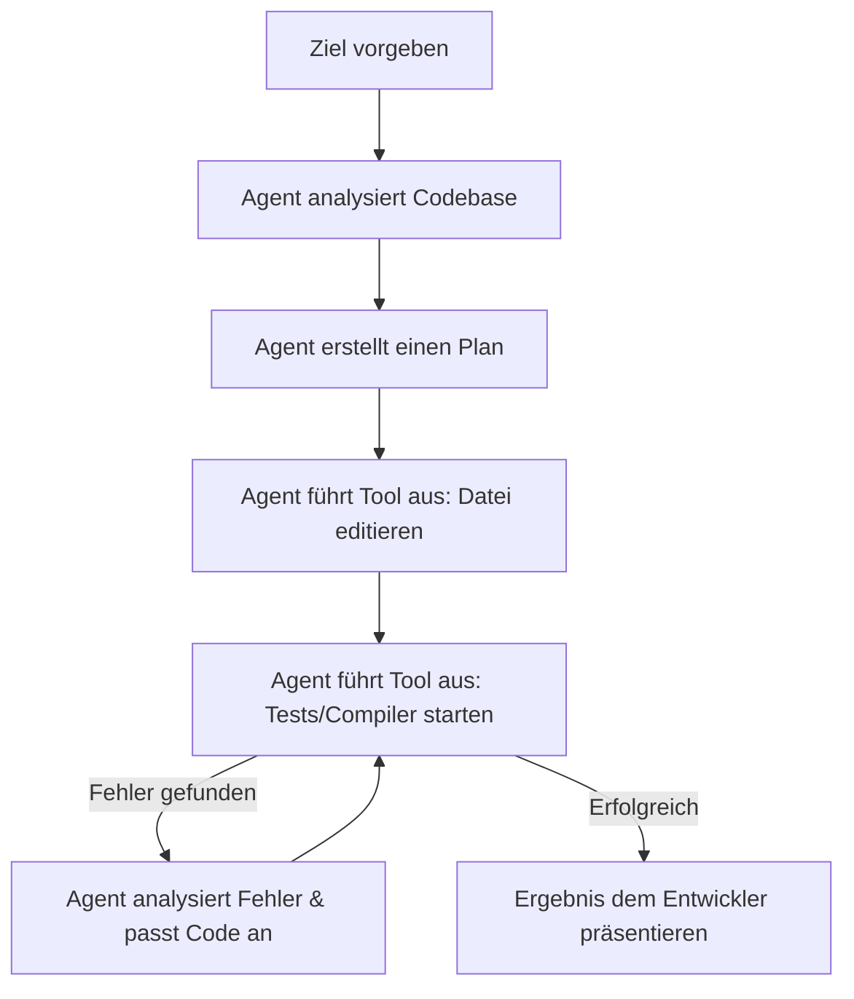

# 💡 Phase 10: Metaprogrammierung & Agentic Coding (Autonome Workflows)

## Willkommen in der Zukunft der Softwareentwicklung! 🚀

Herzlichen Glückwunsch, du hast die finale Phase erreicht! In den bisherigen Kapiteln hast du gelernt, wie du Programmierkonzepte verstehst und KI-Assistenten als intelligente Partner einsetzt. Jetzt gehen wir den entscheidenden Schritt weiter: Wir wechseln von passiven KI-Helfern zu **autonomen Agenten** und **Metaprogrammierung**. 

Hier geht es nicht mehr nur darum, dass eine KI dir Codezeilen vorschlägt. Stattdessen orchestrierst du autonome Workflows (sogenanntes *Agentic Coding*), bei denen die KI selbstständig plant, Dateien liest und schreibt, Befehle ausführt, Tests laufen lässt und Fehler behebt. Du wirst vom reinen Coder zum **Software-Architekten** und **System-Orchestrator**.

Egal ob du mit **Python, JavaScript/TypeScript, Java, C, C++ oder Rust** arbeitest: Die Konzepte in diesem Kapitel sind universell und sprachneutral einsetzbar. Sie helfen dir, komplexe Systeme sicher zu planen und zu bauen.

---

## 🧠 Theorie: Autonome Agenten & Systemdesign

Um in dieser Ära der Softwareentwicklung erfolgreich zu sein, musst du verstehen, wie autonome Agenten arbeiten, wo ihre Grenzen liegen und wie du die Kontrolle über die Architektur behältst.

### 1. Das „70%-Problem“ (Beyond Vibe Coding)
*Referenz: Addy Osmani (Beyond Vibe Coding)*

Es ist verblüffend einfach geworden, mit KI-Tools wie Cursor oder Bolt.new in Sekundenschnelle lauffähigen Code zu generieren. Das nennen wir oft **„Vibe Coding“**: Du beschreibst ein Feature in natürlicher Sprache, lehnst dich zurück, und die KI baut es für dich. Doch Vorsicht! Hier lauert das **70%-Problem**:
*   **Die ersten 70%** (Boilerplate-Code, Standardfunktionen, grundlegende UI-Strukturen) erledigt die KI fehlerfrei und rasend schnell.
*   **Die verbleibenden 30%** machen den Unterschied zwischen einem Prototyp und professioneller Produktionssoftware aus. Dazu gehören:
    *   Robuste Fehlerbehandlung und Edge-Cases.
    *   Sicherheit (Security), Skalierbarkeit und Performance.
    *   Software-Architektur und langfristige Wartbarkeit.
    *   Die Integration komplexer Drittsysteme.

> [!IMPORTANT]
> **Die Küchenchef-Analogie:**
> Stell dir die KI wie einen sehr schnellen, aber unerfahrenen Jungkoch (Sous-Chef) vor. Er kann Gemüse schneiden und einfache Suppen ansetzen (die 70%). Doch die Menüplanung, die Qualitätskontrolle, das Abschmecken und die Koordination der Küche (die kritischen 30%) liegen allein bei dir als Küchenchef. Verlässt du dich blind auf den Jungkoch, schmeckt das Essen am Ende vielleicht ungenießbar.

---

### 2. Das Agentic-Coding-Paradigma: Agenten vs. Assistenten
*Referenz: Tom Taulli, Kap. 3; Michael Kofler, Kap. 3*

Was unterscheidet klassische KI-Assistenten von modernen, autonomen Agenten?

*   **Passive Assistenten (z. B. klassisches Copilot-Autocomplete):** Sie reagieren nur auf deine Tastatureingaben. Sie schreiben Zeile für Zeile Code weiter und haben kein Verständnis für das Gesamtprojekt.
*   **Autonome Agenten (z. B. Claude Code, Antigravity CLI, Cursor Composer):** Sie arbeiten zielorientiert. Du gibst ihnen ein Ziel (z. B. *„Füge eine Benutzeranmeldung hinzu und stelle sicher, dass alle Tests grün sind“*). Der Agent erstellt einen Plan, nutzt Werkzeuge (Tools) wie das Lesen von Dateien, das Ausführen von Terminal-Befehlen und das Beheben von Compiler-Fehlern in einer Schleife, bis das Ziel erreicht ist.



---

### 3. Agentic Coding Best Practices & Workflows
*Referenz: Tomasz Lelek & Artur Skowroński (Vibe Engineering)*

Wenn du autonome Agenten in deine tägliche Arbeit integrierst, solltest du dich an diese Best Practices halten, um das Chaos in deiner Codebase zu verhindern:

*   **Modularität first:** Je kleiner und fokussierter deine Dateien und Module sind, desto präziser können Agenten daran arbeiten. Große, unübersichtliche Dateien führen schnell zu Kontextverlust und Fehlern.
*   **Versionskontrolle als Sicherheitsnetz:** Lass einen Agenten *niemals* auf einer ungesicherten Codebase arbeiten. Erstelle vor jedem Agenten-Aufruf einen Git-Commit oder Branch. Wenn der Agent sich verrennt, kannst du den Zustand sofort zurücksetzen (`git reset --hard`).
*   **Verifikation statt blindem Vertrauen:** Führe nach jeder Aktion des Agenten manuelle Reviews durch und lasse deine automatisierten Test-Suiten laufen. Du bist der Gatekeeper für die Codequality!
*   **Regeln festlegen:** Nutze Konfigurationsdateien wie `.cursorrules` oder System-Prompts, um dem Agenten architektonische Leitplanken zu setzen (z. B. *„Keine externen Bibliotheken ohne Rücksprache verwenden“* oder *„Schreibe immer Unit-Tests für neue Funktionen“*).

---

### 4. Autonomes Arbeiten im Terminal (Claude Code & Antigravity CLI)
*Referenz: Michael Kofler, Kap. 3*

Terminal-Agenten laufen direkt in deiner Konsole. Tools wie `Claude Code` oder die `Antigravity CLI` (`agy`) sind direkt mit deiner Shell verbunden. Sie können:
1.  Deine Codebase nach bestimmten Mustern durchsuchen (Grep).
2.  Fehler direkt im Terminal patchen.
3.  Git-Befehle ausführen (Branches erstellen, Commits schreiben).
4.  Lernprozesse automatisieren, indem sie nach Fehlern suchen und Lösungswege vorschlagen.

Der Vorteil: Kein ständiges Kopieren von Code zwischen Browser und Editor mehr. Die KI agiert wie ein virtueller Terminal-Entwickler.

---

### 5. Agentic Coding mit Cursor (Composer)
*Referenz: Michael Kofler, Kap. 3*

Cursor ist ein auf VS Code basierender Editor, der speziell für KI-gestütztes Arbeiten entwickelt wurde. Die wichtigste Funktion für autonomes Arbeiten ist der **Composer** (meist über `Cmd+I` oder `Strg+I` erreichbar). 
Während normale Chats immer nur eine Datei bearbeiten, kann der Composer:
*   Änderungen über **mehrere Dateien hinweg** koordinieren.
*   Neue Dateien erstellen, bestehende modifizieren und Import-Pfade in abhängigen Dateien automatisch anpassen.
*   Einen visuellen Diff-Vergleich (Vorher/Nachher) anzeigen, bei dem du jede Änderung einzeln akzeptieren oder ablehnen kannst.

---

### 6. Komplexe Web-Apps im Browser: stackblitz Bolt.new
*Referenz: Addy Osmani (Vibe Coding mit Bolt)*

Bolt.new nutzt eine Technologie namens **WebContainers**, um ein komplettes Betriebssystem (Node.js, npm, Compiler) direkt im Webbrowser auszuführen. 
*   Du beschreibst eine Web-App (z. B. *„Erstelle mir ein Dashboard für ein Haushaltsbuch mit Diagrammen“*).
*   Bolt.new erstellt das Projekt, installiert alle notwendigen Packages, baut die Komponenten und startet einen lokalen Server im Browser.
*   Du kannst der KI live beim Schreiben zusehen und die fertige App sofort ausprobieren und deployen – alles ohne eine einzige Zeile Code auf deinem lokalen Rechner konfigurieren zu müssen. Dies eignet sich hervorragend für schnelles Prototyping (Rapid Prototyping).

---

### 7. Model Context Protocol (MCP)
*Referenz: Michael Kofler, Kap. 9*

Das **Model Context Protocol (MCP)** ist ein offener Standard, der von Anthropic entwickelt wurde. Es löst eines der größten Probleme von KIs: den Mangel an aktuellem Kontext und externen Werkzeugen.

*   **Wie funktioniert es?** MCP fungiert als standardisierte Schnittstelle (API) zwischen der KI (Client) und externen Datenquellen oder Programmen (MCP-Servern).
*   **Was kann angebunden werden?**
    *   **Datenbanken:** Die KI kann direkt SQL-Datenbanken abfragen.
    *   **Lokale Dokumente:** Anbindung an firmeninterne Wikis oder Wissensdatenbanken.
    *   **Web-APIs:** Websuchen, GitHub-Repositories, Slack-Kanäle oder Kalender.
*   **Eigene Custom Skills:** Du kannst selbst kleine MCP-Server (in Python, Node.js oder Rust) schreiben, um deiner KI maßgeschneiderte Werkzeuge zur Verfügung zu stellen (z. B. Zugriff auf deine spezielle Hardware-API).

```
┌───────────┐         Model Context Protocol         ┌──────────────┐
│  KI-Agent │ ─────────────────────────────────────> │  MCP-Server  │
│ (Client)  │ <───────────────────────────────────── │ (Daten/Tools)│
└───────────┘                                        └──────────────┘
                                                             │
                                             ┌───────────────┴───────────────┐
                                             ▼                               ▼
                                     [Lokale Datenbank]             [Web-Such-API]
```

---

### 8. Teambildung & Zusammenarbeit in der KI-Ära
*Referenz: Tomasz Lelek & Artur Skowroński (Vibe Engineering)*

Die Rolle des Softwareentwicklers verändert sich grundlegend:
*   **Vom Coder zum Reviewer:** Du schreibst weniger Code selbst, verbringst aber mehr Zeit mit dem Lesen, Verifizieren und Testen von generiertem Code.
*   **Funktionsübergreifende Teams:** Da KIs komplexe technische Hürden abbauen, können Designer, Produktmanager oder Fachexperten schneller funktionale Prototypen erstellen.
*   **Architektur-Konsens:** In Teams wird es umso wichtiger, klare Schnittstellen und Design-Patterns zu vereinbaren. Wenn jeder Entwickler seine KI wild Code generieren lässt, entsteht unkontrollierbares System-Chaos („Software-Wildwuchs“).

---

### 9. Team-Workflows & PR-Automatisierung (KI-gestützte Pull Requests & Review-Bots)
*Referenz: Tomasz Lelek & Artur Skowroński (Vibe Engineering)*

Die Integration von KI endet nicht auf deinem lokalen Rechner. In modernen Entwicklungsteams automatisieren KI-Systeme den gesamten Weg vom lokalen Commit bis zum fertigen Release im Haupt-Branch.

*   **Automatisierte PR-Beschreibungen:** Beim Erstellen eines Pull Requests (PR) analysiert eine KI die Unterschiede im Code (`git diff`) und schreibt automatisch eine strukturierte Zusammenfassung der Änderungen, der betroffenen Komponenten und der durchgeführten Tests. Das spart Entwicklern Zeit und sorgt für einheitlich dokumentierte PRs.
*   **Review-Bots in CI/CD:** Als Teil deiner Continuous Integration / Continuous Deployment (CI/CD)-Pipeline (z. B. GitHub Actions oder GitLab CI) können KI-Review-Bots (wie *PR-Agent* oder *CodiumAI*) den Code analysieren. Sie hinterlassen automatische Kommentare zu Codequality, Sicherheitsrisiken (z. B. SQL-Injections) und logischen Fehlern, noch bevor ein menschlicher Kollege den PR öffnet.
*   **Collaborative Coding & Der „Reviewer der ersten Stunde“:** Siehe die KI als deine erste Verteidigungslinie. Indem du deinen Code vor dem echten Team-Review durch eine KI prüfen lässt (z. B. „Pre-Review“), filterst du Flüchtigkeitsfehler, Formatierungsprobleme und unvollständige Fehlerbehandlungen im Vorfeld heraus. Das entlastet deine Teammitglieder und erhöht die Qualität der Diskussionen im eigentlichen Code-Review.

> [!TIP]
> **Qualität vor Bequemlichkeit:**
> Automatische PR-Beschreibungen sind fantastisch, verleiten aber dazu, sie ungeprüft zu übernehmen. Vergewissere dich immer, dass die KI-Zusammenfassung den Kern deiner Änderungen exakt beschreibt und keine Halluzinationen enthält. Eine falsche Dokumentation im PR verwirrt dein Team langfristig.

---

## 🛠️ Praxis-Aufgaben: Trainiere deine Agentic-Fähigkeiten

Probiere diese Aufgaben aus, um ein Gespür für autonome Workflows zu bekommen:

### Aufgabe A: Den Agenten reglementieren (System-Leitplanken)
Erstelle im Hauptverzeichnis deines aktuellen Projekts eine Datei namens `.cursorrules` (oder nutze die Custom Instructions deiner bevorzugten KI) und füge Regeln hinzu, die die KI zwingen, sauberer zu arbeiten.
*   **Deine Aufgabe:** Schreibe Regeln, die vorschreiben, dass:
    1. Jede Funktion maximal eine bestimmte Zeilenanzahl haben darf.
    2. Keine externen Bibliotheken ohne deine explizite Erlaubnis installiert werden dürfen.
    3. Der Agent vor jeder Änderung erst eine kurze logische Erklärung liefern muss.
*   **Test:** Fordere den Agenten auf, eine mathematische Hilfsfunktion zu schreiben, und prüfe, ob er sich an deine neuen Regeln hält.

### Aufgabe B: Konzeptskizze für ein Custom MCP Tool
Stell dir vor, du möchtest, dass eine KI direkt mit deinem Betriebssystem interagiert, um den freien Speicherplatz auf deiner Festplatte zu überwachen und alte Log-Dateien zu löschen.
*   **Deine Aufgabe:** Skizzieren Sie den JSON-Vertrag für ein solches Tool. Wie müssten der Name des Tools, die Beschreibung und die erwarteten Eingabeparameter (Schema) aussehen, damit die KI das Tool korrekt aufrufen kann? (Schreibe keinen echten Code, sondern nur das konzeptionelle Schema!).

### Aufgabe C: Das „Kontrollierte Zerstören“-Experiment (Terminal-Debugging)
1. Füge absichtlich einen Syntaxfehler oder einen logischen Fehler in eines deiner bestehenden Programme ein.
2. Starte einen Terminal-Agenten (z. B. Claude Code oder die Antigravity CLI).
3. **Wichtig:** Lass den Agenten nicht einfach machen! Verwende einen Prompt, der ihn anweist:
   > *„Analysiere den Compilerfehler in diesem Projekt. Erkläre mir zuerst deine Hypothese, warum dieser Fehler auftritt. Schlage mir drei mögliche Lösungswege vor. Warte auf meine Freigabe, bevor du eine Datei änderst.“*
4. Beobachte, wie der Agent auf deine Rückfragen reagiert und lerne, den Workflow aktiv zu steuern.

### Aufgabe D: Der virtuelle Reviewer (Simuliertes PR-Review)
Um ein Gefühl für automatisierte PR-Reviews zu bekommen, kannst du den Workflow auf deinem lokalen Rechner simulieren.
*   **Deine Aufgabe:** 
    1. Wähle ein kleines Code-Stück, das du vor Kurzem geschrieben hast (oder füge absichtlich ein paar Schwachstellen wie fehlende Fehlerbehandlung oder schlechte Benennungen ein).
    2. Verwende deinen KI-Chatbot und gib ihm folgende Rolle per System-Prompt oder direktem Befehl:
       > *„Du bist ein kritischer Senior-Entwickler und führst das Code-Review für meinen Pull Request durch. Analysiere den folgenden Code. Zeige mir Verbesserungspotenziale auf (z. B. bezüglich Edge-Cases, Lesbarkeit oder Robustheit). Gib mir jedoch keine fertigen Codelösungen, sondern erkläre das Problem didaktisch wertvoll und stelle mir Leitfragen, die mich zur eigenen Lösung führen.“*
    3. Analysiere das Feedback. Welche Ratschläge waren wirklich sinnvoll (die 30%), und wo lag die KI vielleicht daneben?

---

## 🚀 Projektvorschläge

Hier sind drei sprachenunabhängige Projekte, mit denen du Metaprogrammierung, Agentic Coding und Tool-Integrationen in der Praxis üben kannst.

### 🤖 Projekt 1: Der autonome Datei-Organisierer (File Agent)
*Fokus: Lokaler Dateizugriff, Tool-Execution & Fehlerbehandlung*

**Beschreibung:**
Entwickle ein Skript, das ein bestimmtes Verzeichnis scannt, Dateien nach ihren Endungen sortiert (z. B. Bilder in einen Ordner, Dokumente in einen anderen) und optional doppelte Dateien anhand eines Hash-Wertes löscht. Du entwirfst die Architektur und die Edge Cases (z. B. Schreibschutz-Fehler), während die KI dir hilft, die System-APIs deiner Sprache anzusprechen.

#### Das abstrakte Code-Gerüst (Pseudocode):
```text
STRUCT DateiInfo
    Pfad: Text
    Dateiendung: Text
    Dateigroesse: Ganzzahl
    // TODO: Überlege, wie ein Hash-Wert zur Erkennung von Duplikaten gespeichert werden kann!
END STRUCT

FUNCTION scanne_verzeichnis(ziel_pfad: Text) -> Liste von DateiInfo
    // TODO: Nutze die Dateisystem-Bibliotheken deiner Sprache
    // Lese alle Dateien im angegebenen Pfad aus
    RETURN PLATZHALTER_DATEILISTE
END FUNCTION

FUNCTION verschiebe_datei(datei: DateiInfo, ziel_ordner: Text) -> Logisch
    // TODO: Verschiebe die Datei. Fange Fehler ab (z. B. Datei gesperrt oder Berechtigung fehlt!)
    WENN FEHLER_AUFTRITT DANN
        LOGGE "Fehler beim Verschieben von: " + datei.Pfad
        RETURN FALSCH
    SONST
        RETURN WAHR
    ENDE WENN
END FUNCTION

FUNCTION main()
    Verzeichnis = "mein/pfad"
    Dateien = scanne_verzeichnis(Verzeichnis)
    
    // Schleife über alle Dateien und Sortierlogik implementieren
    // (Lass dich hierbei vom Agenten unterstützen, behalte aber die Kontrolle über die Pfad-Validierung!)
END FUNCTION
```

#### Dein Lern-Prompt für dieses Projekt:
> *„Ich möchte in [DEINE SPRACHE] einen autonomen Datei-Organisierer schreiben. Ich habe mir bereits Gedanken über die Struktur gemacht: Ich benötige eine funktion zum Scannen eines Ordners und eine zum sicheren Verschieben mit Fehlerbehandlung. Bitte erstelle mir ein Code-Gerüst mit didaktischen Platzhaltern wie [dein Platzhalter, z.B. todo!() / pass / // TODO]. Erkläre mir außerdem, welche Fehler (Edge Cases) beim Verschieben von Dateien im Betriebssystem typischerweise auftreten können und wie ich diese abfange.“*

---

### 📝 Projekt 2: Der MCP-gestützte Git-Dokumentar (Custom MCP Tool)
*Fokus: API-Anbindung, Metaprogrammierung & Tool-Integration*

**Beschreibung:**
Schreibe ein Werkzeug, das die letzten Commits aus deinem Git-Repository ausliest, die Änderungen analysiert und automatisch eine strukturierte Zusammenfassung (Changelog) für ein Release generiert. Du baust die Schnittstelle zu Git auf, während der Agent dir bei der Textformatierung hilft.

#### Das abstrakte Code-Gerüst (Pseudocode):
```text
STRUCT Commit
    Hash: Text
    Autor: Text
    Nachricht: Text
    Datum: Text
END STRUCT

FUNCTION hole_letzte_commits(anzahl: Ganzzahl) -> Liste von Commit
    // TODO: Führe einen System-Befehl (z. B. 'git log') aus und parse die Ausgabe.
    // TIPP: Beachte die Sicherheitsrisiken bei der Ausführung von Systembefehlen (Command Injection)!
    RETURN PLATZHALTER_COMMITS
END FUNCTION

FUNCTION generiere_changelog(commits: Liste von Commit) -> Text
    // TODO: Filter die Commits nach Typen (z. B. 'feat:', 'fix:')
    // Erstelle ein formatiertes Markdown-Dokument
    Changelog = "## Release Changelog\n"
    // Schleife und Filterung hier implementieren
    RETURN Changelog
END FUNCTION

FUNCTION main()
    Commits = hole_letzte_commits(5)
    Dokument = generiere_changelog(Commits)
    PRINT Dokument
END FUNCTION
```

#### Dein Lern-Prompt für dieses Projekt:
> *„Ich lerne [DEINE SPRACHE] und möchte ein Skript schreiben, das über die Befehlszeile 'git log' aufruft, die Ausgabe parst und daraus ein Changelog generiert. Bitte zeige mir ein sprachtypisches Code-Gerüst, bei dem die Ausführung des Systembefehls und das Parsen des Textes mit Platzhaltern versehen sind. Erkläre mir vor allem, wie ich Systembefehle in [DEINE SPRACHE] sicher ausführe, ohne Sicherheitslücken (Command Injections) zu riskieren.“*

---

### 👑 Projekt 3: Die modulare Web-App mit Cursor Composer
*Fokus: Multi-File-Entwicklung, Session-Architektur & System-Orchestrierung*

**Beschreibung:**
Erstelle ein kleines Aufgaben-Verwaltungssystem (To-Do App) mit einer sauberen Trennung zwischen Datenspeicherung (z. B. in einer JSON-Datei) und der Benutzeroberfläche (z. B. Konsolen-Menü oder einfache Web-Oberfläche). Nutze den Cursor Composer oder ein ähnliches Agenten-Tool, um diese Dateien parallel zu erstellen und miteinander zu verknüpfen.

#### Die geplante Dateistruktur (sprachneutral):
1.  `model.[ext]`: Definiert die Datenstrukturen für Aufgaben.
2.  `storage.[ext]`: Regelt das Laden und Speichern aus/in einer Datei.
3.  `app.[ext]`: Die Hauptanwendung, die Benutzeroberfläche und Speicher verknüpft.

#### Das abstrakte Code-Gerüst für `storage` (Pseudocode):
```text
// TODO: Importiere die Datenstruktur aus 'model'

FUNCTION speichere_aufgaben(aufgaben: Liste von Aufgabe, datei_pfad: Text) -> Logisch
    // TODO: Konvertiere die Liste in ein Format wie JSON und schreibe sie in die Datei
    RETURN PLATZHALTER
END FUNCTION

FUNCTION lade_aufgaben(datei_pfad: Text) -> Liste von Aufgabe
    // TODO: Lese die Datei und fange ab, falls die Datei noch nicht existiert!
    RETURN PLATZHALTER
END FUNCTION
```

#### Dein Lern-Prompt für diese Multi-File-Session:
> *„Ich möchte mit dir als autonomer Agent (z. B. im Composer-Modus) eine To-Do-Anwendung in [DEINE SPRACHE] entwickeln. Die Anwendung soll modular in drei Dateien aufgeteilt sein: model, storage und app. 
Erstelle mir bitte für alle drei Dateien leere Gerüste mit didaktischen Platzhaltern. Stelle sicher, dass die Import- und Export-Pfade zwischen den Dateien korrekt aufgesetzt sind. Erkläre mir kurz, wie du die Abhängigkeiten zwischen den Modulen gelöst hast.“*

---

## 💡 Zusammenfassung: Welches Tool für welchen Zweck?

| Tool / Konzept | Funktionsweise | Dein Fokus (Die 30%) | Bester Anwendungsfall |
| :--- | :--- | :--- | :--- |
| **Agentic Coding** | Autonome Agenten planen und editieren selbstständig ganze Projekte. | Architektur-Design, Verifikation der Logik, Testen. | Komplexe Features, Refactoring, Bug-Suche. |
| **Terminal-Agenten** | Agenten agieren direkt in deiner lokalen Konsole und Shell. | Berechtigungen kontrollieren, Git-Commits prüfen. | Automatisierung von Builds, Git-Workflows, lokales Testen. |
| **Cursor Composer** | Bearbeitet mehrere Dateien gleichzeitig mit visuellem Diff. | Code-Reviews der Diffs, Konfliktlösung bei Merges. | System-Strukturierung, dateiübergreifendes Refactoring. |
| **Bolt.new** | Erstellt komplette Web-Apps im Browser per Chat. | Logisches Feintuning, API-Anbindung, UX-Kontrolle. | Schnelle Prototypen, Dashboards, Web-Frontends. |
| **MCP (Model Context Protocol)** | Verbindet die KI sicher mit lokalen Daten, DBs und APIs. | Einrichtung der Server, Definition von benutzerdefinierten Tools. | Arbeiten mit realen Firmendaten, Datenbank-Abfragen, Custom Tools. |
| **PR-Automatisierung & Review-Bots** | KI-gestützte Erstellung von PR-Beschreibungen und automatisierte Vorab-Reviews in CI/CD-Pipelines. | Überprüfung der KI-PR-Beschreibung auf Richtigkeit, Verifikation von KI-Review-Kommentaren. | Entlastung des Teams bei Routine-Reviews und verbesserte Dokumentation. |

---

## 📚 Links
*   [Beyond Vibe Coding - Addy Osmani (Englisch)](https://addyosmani.com/blog/beyond-vibe-coding/) – Der wegweisende Artikel zum 70%-Problem.
*   [Model Context Protocol (MCP) Dokumentation](https://modelcontextprotocol.io/) – Die offizielle Dokumentation zum MCP-Standard von Anthropic.
*   [Cursor Editor - Features](https://www.cursor.com/) – Dokumentation und Guides zum Arbeiten mit dem Composer.
*   [Bolt.new - Stackblitz](https://bolt.new/) – Die browserbasierte Entwicklungsumgebung zum Ausprobieren.
*   [Lerne Git - Atlassian Tutorials](https://www.atlassian.com/de/git) – Wichtiges Grundlagenwissen für das Arbeiten mit Agenten-Sicherheitsnetzen.
