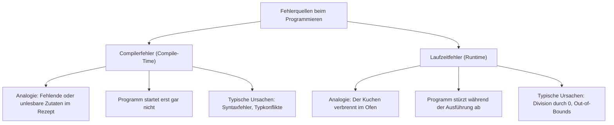
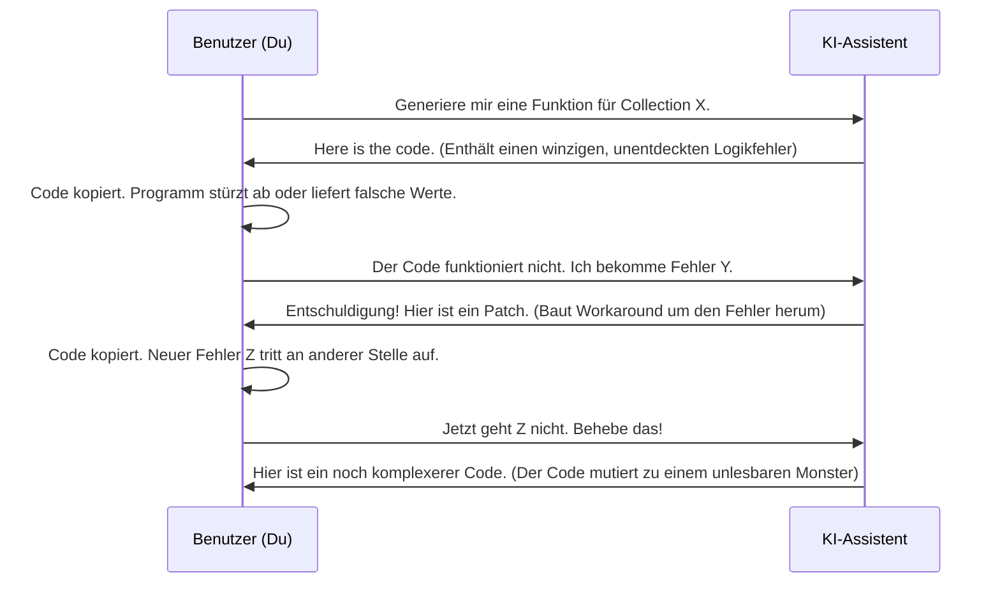
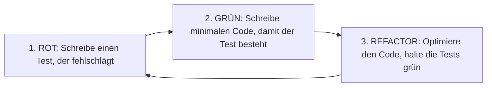

# 💡 Phase 3: Fehlerbehandlung & Collections (Debugging & Testen)

## Willkommen in der Welt des robusten Codes! 🛡️

Bisher hast du gelernt, wie man grundlegende Logik schreibt, Datenstrukturen entwirft und die KI als deinen persönlichen Assistenten nutzt. Deine Programme liefen wahrscheinlich unter idealen Bedingungen fehlerfrei. Doch in der echten Softwareentwicklung ist der "Schönwetter-Code" eine Seltenheit. 

Was passiert, wenn ein Benutzer statt einer Zahl ein Wort eingibt? Was passiert, wenn eine Datei nicht existiert, eine Netzwerkverbindung abbricht oder der Speicher deines Programms voll läuft? In dieser Phase lernst du, wie du deine Programme gegen Stürme wappnest. Du wirst dynamische Datenstrukturen (**Collections**) meistern und lernen, systematisch mit **Fehlern** umzugehen.

Dabei steht dir die KI wieder zur Seite – aber diesmal nicht nur als Code-Schreiber, sondern vor allem als **Debugging-Detektiv**, **Qualitätssicherungs-Partner (QA)** und **Testdaten-Generator**. Gemeinsam werdet ihr lernen, wie man Code nicht nur schreibt, sondern ihn auf Herz und Nieren prüft.

---

## 📌 Lernziele für dieses Kapitel

Am Ende dieses Kapitels wirst du in der Lage sein:
1. **Compiler- und Laufzeitfehler** präzise zu unterscheiden und die KI gezielt zur Fehlerursachenanalyse statt zur blinden Reparatur einzusetzen.
2. **Debugging-Workflows** mit Breakpoints, Step Over/Into und Variablen-Inspektion in modernen IDEs (wie VS Code oder Visual Studio) anzuwenden.
3. **Robustheitstrategien** zu entwerfen und die fundamentalen Unterschiede zwischen *Exceptions* und *expliziten Fehlerobjekten* sprachenunabhängig zu verstehen.
4. Den gefürchteten **Compound Error** (das Aufschaukeln von Fehlern in KI-Systemen) zu erkennen und durch strukturierte Refactoring-Schritte zu beheben.
5. Die KI als **Qualitätssicherungs-Partner** einzusetzen, um Edge-Cases und Lücken in deiner Testabdeckung aufzudecken.
6. **Synthetische Testdaten** für dynamische Listen und Schlüssel-Wert-Speicher (HashMaps/Dictionaries) generieren zu lassen.
7. **Unit- und Integrationstests** mit KI-Unterstützung zu entwerfen, ohne in die "Bestätigungsfalle" des Modells zu laufen.
8. **Test-Driven Development (TDD)** im Wechselspiel mit der KI zu praktizieren.
9. Deinen Code durch KI-gestützte **Evaluierung und Validierung** kontinuierlich zu verbessern.
10. Die KI zur **Datenanalyse, Data Science & Visualisierung** einsetzen, um große Datenmengen zu aggregieren, Muster zu erkennen und Diagramme zu generieren.

---

## 🧠 Theorie

### 1. Compiler- und Laufzeitfehler richtig interpretieren und beheben lassen
*Referenz: Kofler, Kap. 4*

Bevor wir Fehler beheben können, müssen wir verstehen, wann und warum sie auftreten. In der Programmierung unterscheiden wir primär zwei Arten von Fehlern. Stell dir vor, du backst einen Kuchen nach Rezept:



#### Compilerfehler: Die statische Schutzmauer
Ein Compiler (oder der statische Code-Analyser deiner IDE) liest deinen Code, bevor er ausgeführt wird. Er prüft, ob du die Grammatikregeln der Programmiersprache eingehalten hast. Findet er einen Fehler, bricht er ab. 
*Vorteil:* Diese Fehler erreichen niemals den Endnutzer.
*Wie dir die KI hilft:* Kopiere die Fehlermeldung zusammen mit dem fehlerhaften Codefragment in den Chat. Bitte die KI nicht um "Reparatur", sondern um eine Erklärung.

#### Laufzeitfehler: Die dynamische Falle
Diese Fehler treten erst auf, wenn das Programm bereits läuft. Der Code ist syntaktisch völlig korrekt, versucht aber während der Ausführung eine unlogische oder verbotene Operation auszuführen (z. B. den Zugriff auf das 11. Element einer Liste, die nur 10 Elemente hat).
*Gefahr:* Diese Fehler führen zu Abstürzen oder Fehlverhalten beim Nutzer.

> [!IMPORTANT]
> **Didaktischer Lern-Prompt für Fehlermeldungen:**
> Wenn du eine Fehlermeldung erhältst, nutze diesen Prompt, um die Ursache wirklich zu verstehen, anstatt nur Code zu kopieren:
> 
> ```text
> Ich lerne gerade Programmieren und habe folgenden Fehler erhalten:
> [HIER FEHLERMELDUNG EINFÜGEN]
> 
> Dies ist der relevante Codeabschnitt:
> [HIER RELEVANTEN CODE EINFÜGEN]
> 
> Bitte erkläre mir:
> 1. Was diese Fehlermeldung genau bedeutet (in einfachen Worten).
> 2. Warum dieser Fehler in meinem Code auftritt.
> 3. Gib mir keine fertige Codelösung, sondern stelle mir 2-3 Leitfragen, die mich zur Selbsthilfe anleiten.
> ```

---

### 2. Debugging-Workflows in IDEs (VS Code & Visual Studio)
*Referenz: Kofler, Kap. 4; Taulli*

Viele Anfänger versuchen, Fehler durch das wahllose Einfügen von Ausgabe-Befehlen (wie `print()` oder `console.log()`) zu finden. Das ist wie ein Detektiv, der im Dunkeln mit einer Taschenlampe herumfuchtelt. Professionelles Debugging funktioniert anders: Du hältst die Zeit an und inspizierst den Speicher.

#### Die wichtigsten Debugging-Konzepte:
1. **Breakpoint (Haltepunkt):** Eine rote Markierung an einer Codezeile. Startest du das Programm im Debug-Modus, stoppt es exakt vor der Ausführung dieser Zeile.
2. **Step Over (Schritt darüber):** Führt die aktuelle Zeile aus und springt zur nächsten Zeile im selben Kontext.
3. **Step Into (Hineingehen):** Wenn die aktuelle Zeile eine Funktion aufruft, springt der Debugger *in* diese Funktion hinein, damit du deren Einzelschritte sehen kannst.
4. **Step Out (Hinausgehen):** Führt den Rest der aktuellen Funktion aus und springt zurück zum Aufrufer.
5. **Variables / Watch:** Ein Fenster in deiner IDE, das dir in Echtzeit anzeigt, welche Werte deine Variablen in diesem Moment im Arbeitsspeicher haben.

#### Der KI-gestützte Debugging-Workflow:
Wenn du an einem Breakpoint stehst und feststellst, dass eine Variable einen unerwarteten Wert hat (z. B. `anzahl = -1` statt einer positiven Zahl), kannst du die KI als Hypothesen-Generator nutzen.

> [!TIP]
> **Lern-Prompt für Debugging-Hypothesen:**
> ```text
> Ich debugge gerade mein Programm. An einem Haltepunkt stelle ich fest, dass meine Variable 'wert' den Wert [WERT] hat. Erwartet habe ich aber [ERWARTETER WERT].
> Der logische Ablauf vor dieser Stelle sieht so aus:
> [KAPITEL/FUNKTIONSBESCHREIBUNG ODER PSEUDOCODE]
> 
> Welche 3 logischen Fehlerursachen in meinem Ablauf könnten zu diesem falschen Zustand führen? Hilf mir, Hypothesen aufzustellen, die ich mit dem Debugger überprüfen kann.
> ```

---

### 3. Fehlerbehandlung: Strategien für robuste Systeme
*Referenz: Kofler*

Jede Programmiersprache bietet Mechanismen, um auf Fehler zur Laufzeit zu reagieren. Grundsätzlich gibt es zwei große Denkschulen:

#### A. Exceptions (Ausnahmen) – "Try-Catch"
Sprachen wie Python, JavaScript, Java, C# und C++ nutzen Exceptions. Wenn ein Fehler auftritt, wird der normale Programmfluss abgebrochen und eine Exception "geworfen" (*throw* oder *raise*). Diese wandert so lange durch die Aufrufkette nach oben, bis sie von einem Sicherheitsnetz (*catch* oder *except*) abgefangen wird.

**Konzeptskizze (Sprachneutral):**
```text
VERSUCHE (Try):
    Lese Datei "daten.txt"
    Verarbeite Daten
FANGE FEHLER (Catch - Wenn Datei nicht existiert):
    Zeige Warnung: "Bitte überprüfe den Dateipfad!"
FANGE FEHLER (Catch - Für alle anderen Probleme):
    Zeige Warnung: "Ein unbekannter Fehler ist aufgetreten."
```

#### B. Explizite Fehlerobjekte – "Result/Error Codes"
Sprachen wie Rust oder Go gehen einen anderen Weg. Sie werfen keine Exceptions. Stattdessen sind Fehler normale Rückgabewerte von Funktionen. Eine Funktion, die fehlschlagen kann, gibt einen zusammengesetzten Datentyp zurück, der entweder das erfolgreiche Ergebnis *oder* ein Fehlerobjekt enthält (z. B. das `Result<T, E>` in Rust oder `(Value, Error)` in Go).

**Konzeptskizze (Sprachneutral):**
```text
Funktion lese_daten() -> RückgabeTyp (ErfolgsWert ODER FehlerWert)

Ergebnis = lese_daten()
WENN Ergebnis ist Erfolg:
    Nutze Daten (ErfolgsWert)
WENN Ergebnis ist Fehler:
    Behandele den Fehler (FehlerWert)
```

#### Best Practices für robuste Fehlerbehandlung:
* **Fehler nicht verschlucken:** Fange niemals eine Exception ab, ohne etwas damit zu tun. Ein leerer Catch-Block (`catch (Exception e) {}`) macht dein Programm blind für Fehler.
* **Spezifisch sein:** Fange nur die Fehler ab, die du an dieser Stelle auch wirklich sinnvoll behandeln kannst.
* **Benutzerfreundliche Nachrichten:** Zeige dem Endnutzer verständliche Meldungen und schreibe die technischen Details (Stack Trace) in eine Logdatei.

---

### 4. Wie Fehler in KI-generiertem Code sich aufschaukeln (Compound Error)
*Referenz: Pawar, Teil 1*

Ein **Compound Error** (zusammengesetzter/sich aufschaukelnder Fehler) ist eines der frustrierendsten Phänomene beim Programmieren mit KI. Er entsteht durch ein typisches Interaktionsmuster zwischen Mensch und Maschine:



#### Wie man die Compound-Error-Spirale durchbricht:
Wenn du merkst, dass der Code nach zwei Korrekturversuchen der KI immer länger, unübersichtlicher und fehlerhafter wird, wende die **3-Schritt-Regel** an:

1. **STOPP:** Kopiere keine weiteren Korrekturvorschläge mehr.
2. **RESET:** Lösche den fehlerhaften Codeblock komplett oder gehe in deiner Versionsverwaltung (Git) einen Schritt zurück.
3. **MODULARISIEREN:** Zerlege das Problem in noch kleinere, isolierte Einzelfunktionen. Lass die KI nur ein winziges Teilproblem lösen und teste dieses separat, bevor du weitermachst.

---

### 5. Die KI als QA-Partner: Testabdeckung und Edge-Cases ermitteln
*Referenz: Pawar, Teil 1; Kim & Yegge, Teil 3*

Als Entwickler neigen wir dazu, nur den "Happy Path" zu testen – also den Ablauf, bei dem der Benutzer genau das tut, was wir erwarten. Die KI ist eine hervorragende Sparringspartnerin, um diese Betriebsblindheit zu überwinden, indem sie uns auf **Edge-Cases** (Grenzfälle) aufmerksam macht.

#### Was sind typische Edge-Cases bei Collections?
* **Die leere Struktur:** Was passiert, wenn wir das Maximum in einer leeren Liste suchen?
* **Das einzige Element:** Verhält sich der Algorithmus bei einer Liste mit nur einem Element korrekt?
* **Duplikate:** Was passiert, wenn in einer Namensliste derselbe Name dreimal vorkommt?
* **Ungültige Schlüssel:** Was passiert, wenn wir in einer HashMap nach einem Schlüssel suchen, der nicht existiert?

> [!TIP]
> **Lern-Prompt zur Ermittlung von Edge-Cases:**
> ```text
> Ich habe folgende Funktion entworfen, die mit einer Collection arbeitet.
> 
> Spezifikation der Funktion:
> [BESCHREIBUNG DER FUNKTION ODER PSEUDOCODE]
> 
> Welche 5 Edge-Cases (Grenzfälle, extreme Eingabewerte, leere Strukturen) sollte ich unbedingt testen, um sicherzustellen, dass diese Funktion niemals abstürzt?
> Erkläre mir die Risiken für jeden dieser Fälle.
> ```

---

### 6. Synthetische Testdaten generieren
*Referenz: Kofler, Kap. 6*

Um Funktionen zu testen, die mit Collections (Listen, Vektoren, Key-Value-Speichern) arbeiten, benötigen wir Daten. Das manuelle Tippen von 100 Test-Einträgen ist mühsam. Hier glänzt die KI: Sie kann in Sekundenschnelle strukturierte, synthetische Testdaten erstellen.

Dabei unterscheidet man zwei Arten von Collections:
* **Sequenzielle Speicher (Listen/Vektoren):** Daten liegen in einer bestimmten Reihenfolge hintereinander (z. B. eine Liste von Messwerten).
* **Assoziative Speicher (Key-Value-Maps/Dictionaries):** Daten sind über einen eindeutigen Schlüssel abrufbar (z. B. Benutzer-ID verknüpft mit Benutzerprofil).

#### Anwendungsbeispiel:
Du möchtest eine Funktion testen, die den Notendurchschnitt einer Schulklasse berechnet. Du benötigst dafür eine HashMap, die Schülernamen (Schlüssel) Vektoren von Noten (Werte) zuordnet.

> [!TIP]
> **Lern-Prompt für synthetische Testdaten:**
> ```text
> Ich beiötige synthetische Testdaten für mein Programm.
> Ich arbeite mit folgender Datenstruktur:
> Eine Map (Key-Value), bei der der Key ein String (Produktname) und der Value ein Objekt mit den Attributen 'preis' (Dezimalzahl) und 'bestand' (Ganzzahl) ist.
> 
> Bitte generiere mir Testdaten in [DEINE PROGRAMMIERSPRACHE]:
> 1. Einen Datensatz mit 5 normalen Produkten.
> 2. Einen Datensatz für Edge-Cases (z. B. Preis = 0, Bestand = 0, sehr lange Produktnamen).
> Erstelle den Code so, dass die Daten in die Collection eingefügt werden. Gib mir keinen Anwendungs-Code, nur die Definition der Testdaten-Befüllung.
> ```

---

### 7. Unit-Tests und Integrationstests automatisch erstellen lassen
*Referenz: Kofler, Kap. 6*

Automatisierte Tests sind das Sicherheitsnetz jedes professionellen Entwicklers. Wir teilen Tests meist in zwei Kategorien ein:

* **Unit-Tests (Einzeltests):** Sie prüfen eine einzelne, isolierte Funktion. Sie sind extrem schnell und zeigen dir genau, welche Zeile Code fehlerhaft ist.
* **Integrationstests (Zusammenspiel-Tests):** Sie prüfen, ob mehrere Komponenten deines Programms (z. B. deine Datenbank und deine Benutzeroberfläche) korrekt zusammenarbeiten.

```
+-------------------------------------------------------------+
|                     INTEGRATIONSTEST                        |
|   +-------------------+             +-------------------+   |
|   |   Komponente A    | <---------> |   Komponente B    |   |
|   |  (z.B. Datenbank) |             |  (z.B. Logik)     |   |
|   +-------------------+             +-------------------+   |
|             ^                                 ^             |
|        [Unit-Test]                       [Unit-Test]        |
+-------------------------------------------------------------+
```

#### Die Testfalle bei der KI-Generierung:
Wenn du der KI deinen geschriebenen Code givst und sagst: *"Schreibe mir Tests dafür"*, wird die KI Tests generieren, die den Code so testen, wie er aktuell geschrieben ist. Wenn dein Code aber einen Logikfehler enthält, wird die KI diesen Fehler im Test als "erwartetes Verhalten" festschreiben. Der Test wird immer grün sein, obwohl der Code falsch ist!

#### Die Lösung: Spezifikationsbasiertes Testen
Lass die KI Tests schreiben, **bevor** du den eigentlichen Code implementierst, oder gib der KI nur die Funktionssignatur und die textuelle Beschreibung der Anforderungen.

---

### 8. Test-Driven Development (TDD) mit KI-Unterstützung
*Referenz: Kofler, Kap. 6*

Test-Driven Development (testgetriebene Entwicklung) dreht den klassischen Programmierprozess um:



#### Wie du TDD mit der KI als Partner spielst:
Das Wechselspiel zwischen dir und der KI eignet sich hervorragend für TDD:
1. **Schritt 1 (KI):** Du beschreibst der KI eine Funktion in natürlicher Sprache. Die KI generiert ausschließlich den Unit-Test für diese Funktion.
2. **Schritt 2 (Du):** Du fügst den Test in dein Projekt ein. Er schlägt fehl (Rot), da die Funktion noch nicht existiert.
3. **Schritt 3 (Du/KI):** Du schreibst das Grundgerüst der Funktion. Du kannst die KI bitten, dir beim Implementieren zu helfen, bis der Test besteht (Grün).
4. **Schritt 4 (Gemeinsam):** Du überarbeitest den Code (Refactoring) für bessere Lesbarkeit und Struktur. Die Tests stellen sicher, dass du dabei nichts kaputt machst.

---

### 9. KI-gestützte Evaluierung und Validierung von Code
*Referenz: Lelek & Skowroński*

Nachdem dein Code läuft und alle Tests grün sind, kommt die Kür: das **Code-Review**. Die KI kann als unbestechlicher Reviewer eingesetzt werden, um die Qualität deines Codes zu bewerten (Evaluierung) und sicherzustellen, dass er gängigen Standards entspricht (Validierung).

Gute Review-Kriterien sind:
* **Lesbarkeit:** Sind die Variablen- und Funktionsnamen selbsterklärend?
* **Komplexität:** Gibt es zu tief verschachtelte Schleifen oder Bedingungen, die man vereinfachen kann?
* **Ressourceneffizienz:** Werden unnötige Kopien von großen Collections im Speicher angelegt?
* **Sicherheit:** Werden alle potenziellen Fehlerquellen abgefangen?

---

### 10. Datenanalyse, Data Science & Visualisierung mit KI
*Referenz: Kofler, Kap. 6 & Lelek & Skowroński*

Wenn du mit größeren Datenmengen arbeitest, reicht reines Debugging oft nicht mehr aus. Du musst verstehen, was die Daten dir sagen wollen. Datenanalyse und Data Science nutzen Programmierung, um aus ungeordneten Datenbergen wertvolle Erkenntnisse zu gewinnen. Die KI kann dich in jeder Phase dieses Prozesses unterstützen:

#### A. Mustererkennung in großen Datenmengen
Stell dir vor, du hast eine Tabelle mit Millionen von Logbucheinträgen deines Programms oder Sensorwerten einer Wetterstation. Für uns Menschen ist das nur eine unlesbare Textwüste. Die KI kann hier als detektivischer Analyst dienen. Sie hilft dir, Auffälligkeiten (Anomalien), Trends oder wiederkehrende Muster zu finden.
* **Analogie:** Die Nadel im Heuhaufen finden. Statt den ganzen Haufen Halm für Halm zu durchsuchen, nutzt du einen starken Magneten (die KI), der dich auf verdächtige Stellen hinweist.

#### B. Datenaggregation (Zusammenführung)
Bevor man Daten visualisieren kann, muss man sie vereinfachen. Das nennt man Aggregation. Rohdaten werden gefiltert, sortiert, gruppiert und zusammengefasst (z. B. die Summe bilden, den Mittelwert berechnen oder den Median bestimmen).
* **Konzeptskizze (Sprachneutral):**
```text
ROHDATEN:
  [Tag 1, Abteilung A, Umsatz: 100]
  [Tag 1, Abteilung B, Umsatz: 150]
  [Tag 2, Abteilung A, Umsatz: 120]

AGGREGATION (Gruppiere nach Abteilung und berechne Summe):
  Abteilung A -> Gesamtumsatz: 220
  Abteilung B -> Gesamtumsatz: 150
```
Die KI hilft dir dabei, die mathematisch und logisch passenden Aggregationsfunktionen für dein Problem auszuwählen und den entsprechenden Code zu entwerfen.

#### C. Generierung von Plots und Diagrammen (Visualisierung)
Bilder sagen mehr als tausend Zeilen Text. Um deine aggregierten Daten verständlich zu machen, erstellst du Diagramme (Plots). Ob Linien-, Balken- oder Streudiagramme – Visualisierungsbibliotheken (wie *matplotlib* in Python, *Chart.js* in JavaScript oder *plotters* in Rust) haben oft eine sehr komplexe Syntax.
Die KI eignet sich hervorragend dafür, dir den nötigen Boilerplate-Code für diese Bibliotheken zu schreiben. Du musst die Syntax nicht auswendig lernen, sondern beschreibst der KI einfach, wie deine Daten strukturiert sind und wie das fertige Diagramm aussehen soll.

> [!TIP]
> **Lern-Prompt für Datenanalyse und Plots:**
> ```text
> Ich habe einen Datensatz mit folgendem Schema:
> [BESCHREIBUNG DER SPALTEN ODER JSON-STRUKTUR]
> 
> Ich möchte diesen Datensatz analysieren und visualisieren. Bitte liefere mir keine fertige Komplettlösung, sondern:
> 1. Welche Datenaggregation (z.B. Mittelwert, Median, Gruppierung) ist hier am sinnvollsten, um [DEINE FRAGE] zu beantworten?
> 2. Welcher Diagrammtyp (z.B. Balken-, Linien- oder Streudiagramm) eignet sich am besten für diese Darstellung und warum?
> 3. Ein unvollständiges Code-Gerüst in [DEINE PROGRAMMIERSPRACHE] unter Verwendung einer gängigen Visualisierungsbibliothek, das didaktische Platzhalter (wie TODOs) für die Filterung und das eigentliche Zeichnen des Diagramms enthält.
> ```

---

## 🛠️ Praxis-Aufgaben

### Aufgabe 1: Die Compound-Error-Spirale durchbrechen
**Hintergrund:** Stell dir vor, du möchtest eine Funktion schreiben, die Duplikate aus einer Liste von Benutzernamen entfernt, aber die ursprüngliche Reihenfolge beibehält.
Die KI hat dir einen hochkomplexen, verschachtelten Code geliefert, der bei leeren Listen abstürzt. Beim Versuch, das zu reparieren, stürzt er nun bei Listen mit nur einem Element ab.

**Deine Aufgabe:**
1. Lösche den gesamten komplizierten Code aus deinem Editor.
2. Definiere die API/Schnittstelle der Funktion neu.
3. Nutze den folgenden didaktischen Prompt, um das Problem in zwei Teilschritte zu zerlegen (1. Erkennung von Duplikaten mittels einer Set/HashMap-Struktur, 2. Filtern der Liste).

> [!IMPORTANT]
> **Lern-Prompt zur Modularisierung:**
> ```text
> Ich habe einen Compound Error in meinem Code. Ich möchte das Problem neu und modular anfangen.
> Mein Ziel: Eine Funktion, die Duplikate aus einer Liste entfernt, die Reihenfolge beibehält und stabil bei leeren Eingaben läuft.
> 
> Bitte liefere mir keine fertige Implementierung! Liefere mir stattdessen:
> 1. Eine Schritt-für-Schritt-Logikbeschreibung (Pseudocode).
> 2. Ein unvollständiges Code-Gerüst in [PROGRAMMIERSPRACHE], das didaktische Platzhalter (wie Kommentare oder todo-Marker) an den entscheidenden Stellen enthält.
> ```

---

### Aufgabe 2: Testdaten- & Testfallgenerierung für Collections
**Ausgangssituation:** Du hast ein einfaches Bewertungssystem für Produkte. Die Bewertungen werden in einer Liste von Zahlen (Ganzzahlen von 1 bis 5) gespeichert. Du möchtest eine Funktion schreiben, die den Durchschnitt berechnet.

**Deine Aufgabe:**
1. Erstelle ein leeres Code-Gerüst für die Funktion `berechne_durchschnitt(bewertungen)`.
2. Bringe die KI dazu, dir eine Test-Suite mit genau 5 Unit-Tests zu schreiben. Die Tests müssen folgende Szenarien abdecken:
   * Eine normale Liste mit verschiedenen Bewertungen.
   * Eine Liste, die nur aus der Note 5 besteht.
   * Eine leere Liste (Achtung vor Division durch Null!).
   * Eine Liste mit ungültigen Werten (z. B. Note 6 oder negative Zahlen), sofern deine Sprache das zulässt.
3. Implementiere die Funktion selbstständig, bis alle 5 Tests erfolgreich bestanden werden.

---

### Aufgabe 3: Datenanalyse & Visualisierung
**Ausgangssituation:** Du hast eine Liste von täglichen Verkaufsdaten eines kleinen Onlineshops. Jeder Eintrag enthält das Datum, die Produktkategorie und den Umsatz. Du möchtest wissen, welche Kategorie den meisten Umsatz generiert hat, und dies grafisch darstellen.

**Deine Aufgabe:**
1. Definiere eine sprachneutrale Datenstruktur (z. B. eine Klasse oder ein Struct) für einen einzelnen Verkaufseintrag.
2. Formuliere einen Prompt an die KI, um dir das logische Vorgehen (Pseudocode) zur Aggregation der Umsätze pro Produktkategorie erklären zu lassen.
3. Lass dir von der KI ein unvollständiges Code-Gerüst für eine Visualisierung (z. B. als Balkendiagramm) generieren. Der Code soll didaktische Platzhalter für die Aggregationslogik und das Zeichnen enthalten (nutze z. B. `todo!()` oder Kommentare).
4. Vervollständige die Logik selbstständig, um die Umsätze korrekt zu summieren und darzustellen.

---

## 🚀 Projektvorschläge

### Projekt 1: Der robuste E-Commerce Warenkorb
Erstelle eine Warenkorb-Verwaltung, die Artikel speichert und Preise berechnet. Sie muss robust gegenüber ungültigen Benutzereingaben sein und darf bei Berechnungsfehlern nicht abstürzen.

#### Anforderungen:
* Nutze eine passende Collection (z. B. eine HashMap/Dictionary), um Artikelnamen mit ihren Mengen zu verknüpfen.
* Implementiere Funktionen zum Hinzufügen, Entfernen und Aktualisieren von Artikeln.
* Behandle Fehlerfälle explizit (z. B. das Entfernen eines Artikels, der gar nicht im Warenkorb existiert).

#### Code-Gerüst (Sprachneutraler Pseudocode):
```text
Klasse Warenkorb:
    // Eine Collection zur Zuordnung von Artikelname (Text) zu Menge (Ganzzahl)
    Attribute artikel_liste
    
    Funktion artikel_hinzufuegen(name, menge):
        WENN menge <= 0:
            GIB FEHLER ZURÜCK ("Menge muss größer als 0 sein")
        
        // HIER: Artikel zur Collection hinzufügen oder menge erhöhen
        // ...
        GIB ERFOLG ZURÜCK
        
    Funktion artikel_entfernen(name, menge):
        // HIER: Prüfen, ob der Artikel existiert
        // WENN nicht: GIB FEHLER ZURÜCK ("Artikel nicht im Warenkorb")
        // WENN menge >= vorhandene_menge: Artikel ganz löschen
        // SONST: menge reduzieren
        // ...
        GIB ERFOLG ODER FEHLER ZURÜCK
```

> [!TIP]
> **Lern-Prompt für dieses Projekt:**
> ```text
> Ich möchte das Projekt 'Warenkorb-Verwaltung' umsetzen. Ich nutze die Programmiersprache [DEINE SPRACHE].
> Bitte erstelle mir ein detailliertes Code-Gerüst mit Schnittstellendefinitionen (Funktionsköpfen) und didaktischen Kommentaren an den Stellen, an denen ich den Code selbst schreiben soll.
> Baue in das Gerüst auch leere Testfunktionen (Unit-Tests) ein, die ich später mit Logik füllen muss.
> ```

---

### Projekt 2: Der intelligent Key-Value-Cache mit Ablaufzeit (TTL)
Entwirf einen einfachen In-Memory-Cache. Daten werden als Schlüssel-Wert-Paare gespeichert. Jedes Paar hat eine maximale Lebensdauer (Time-To-Live). Nach Ablauf dieser Zeit gilt der Wert als ungültig.

#### Anforderungen:
* Verwendung einer Map/HashMap als Hauptspeicher.
* Speicherung des Werts zusammen mit einem Zeitstempel der Erstellung.
* Beim Abfragen eines Werts muss geprüft werden, ob die Zeit abgelaufen ist. Wenn ja, muss der Wert gelöscht und ein Fehler/leeres Ergebnis zurückgegeben werden.

#### Code-Gerüst (Sprachneutraler Pseudocode):
```text
Struktur CacheEintrag:
    wert
    erstellungs_zeit
    lebensdauer_sekunden

Klasse Cache:
    // Collection zur Zuordnung von Schlüssel (Text) zu CacheEintrag
    Attribute speicher
    
    Funktion schreiben(schluessel, wert, ttl_sekunden):
        // HIER: CacheEintrag erstellen und in Collection speichern
        // ...
        
    Funktion lesen(schluessel):
        // HIER: Prüfen, ob Schlüssel existiert.
        // WENN nicht existiert: GIB FEHLER/NICHTS ZURÜCK
        // WENN existiert: Prüfen, ob (aktuelle_zeit - erstellungs_zeit) > lebensdauer_sekunden
        // WENN abgelaufen: Eintrag aus Collection löschen, GIB FEHLER/NICHTS ZURÜCK
        // SONST: GIB wert ZURÜCK
```

---

## 💡 Zusammenfassung

| Konzept | Kernidee | KI-Nutzen | Worauf du achten musst |
| :--- | :--- | :--- | :--- |
| **Fehlerbehandlung** | Schutz vor Abstürzen durch Absichern unvorhersehbarer Ereignisse. | Erklärt kryptische Fehlermeldungen und entwirft Fehlerklassen. | Fehler nicht ungesehen verschlucken (leere Catch-Blocks vermeiden). |
| **Collections** | Dynamische Datenstrukturen (Listen, Maps) zur flexiblen Datenverwaltung. | Generiert synthetische Testdaten zum Befüllen der Strukturen. | Speicherüberläufe und Out-of-Bounds-Zugriffe durch Prüfungen verhindern. |
| **Compound Errors** | Fehler schaukeln sich auf, wenn fehlerhafter KI-Code immer wieder gepatcht wird. | Kann durch klare Modularisierungsvorgaben gestoppt werden. | Bei unlesbarem KI-Code: Stoppen, Code verwerfen und modular neu starten. |
| **Automatisierte Tests** | Sicherheitsnetz, das sicherstellt, dass Änderungen keine bestehende Logik zerstören. | Erstellt Unit- und Integrationstests basierend auf Spezifikationen. | Schreibe Tests vor dem Code oder unabhängig, um die "Bestätigungsfalle" zu meiden. |
| **Datenanalyse & Visualisierung** | Auswertung großer Datenmengen durch Aggregation und visuelle Darstellung. | Hilft bei der Auswahl von Aggregationsmethoden und generiert Diagramm-Code. | KI-generierte Grafiken auf logische Fehler und falsche Achsenskalierungen prüfen. |

---

## 📚 Links

* **Michael Kofler – Der Programmier-Kurs:** [Kapitel 4: Fehlersuche (Debugging) & Kapitel 6: Datenstrukturen und Testverfahren](https://kofler.info)
* **Dave Taulli – Artificial Intelligence for Beginners:** [Kapitel 1: Evolution of Software & Kapitel 2: Code Assistants and IDE integration](https://example.com)
* **Abhinav Pawar – Software Engineering with Generative AI:** [Teil 1: Quality Assurance and Compound Errors in AI Systems](https://example.com)
* **Peter Kim & Michael Yegge – Modern QA Practices:** [Teil 3: Edge Case Detection and LLM-assisted Testing](https://example.com)
* **Łukasz Lelek & Jakub Skowroński – Generative AI for Software Creators:** [Code Evaluation, Validation and Prompt Engineering Patterns](https://example.com)
