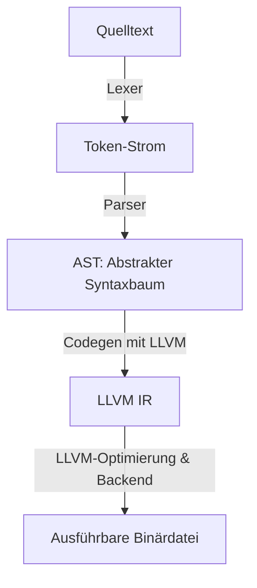

# 🧠 Eigener Compiler: Schritt für Schritt mit Rust & LLVM

Herzlich willkommen zum Königsdisziplin der Softwareentwicklung: dem **Compilerbau**.

Vielleicht hast du dich schon oft gefragt, wie Sprachen wie Rust, C oder C++ unter der Haube wirklich funktionieren. Wie wird aus einem Text wie `let x = 5 + 3;` ein echter CPU-Befehl? In diesem detaillierten Programmier-Handbuch bauen wir gemeinsam unseren eigenen Compiler für eine einfache, imperative Sprache namens **TinyLang**. 

Als Backend nutzen wir das mächtige **LLVM-Framework** über die Rust-Bibliothek **Inkwell**. Damit generieren wir echten, optimierten Maschinencode auf professionellem Niveau.

---

## 🎯 Lernziele

In diesem umfassenden Kapitel wirst du:
1. Die theoretischen Säulen des Compilerbaus (Lexer, Parser, AST, CodeGen) im Detail verstehen.
2. Einen eigenen Lexer und Parser in Rust schreiben.
3. Den abstrakten Syntaxbaum (AST) deiner Sprache entwerfen.
4. Mit **Inkwell** (LLVM-Wrapper) Schnittstellen zu LLVM bauen, um LLVM IR zu generieren.
5. Kontrollstrukturen (`if/else`) mittels Basic Blocks und PHI-Knoten in LLVM umsetzen.
6. Maschinencode emittieren (Objektdateien) und eine ausführbare Binärdatei verlinken.

---

## 🧠 Theorie: Die Anatomie eines Compilers

Ein Compiler ist im Grunde eine Übersetzungsmaschine. Er liest eine Quellbibliothek (Eingabe) und übersetzt sie in eine Zielsprache (Ausgabe). Dieser Prozess ist in zwei Hauptteile unterteilt: das **Frontend** (Analysieren des Codes) und das **Backend** (Synthetisieren des Maschinencodes).



### 1. Das Frontend: Den Code verstehen

#### Der Lexer (Lexikalische Analyse)
* **Konzept:** Der Lexer nimmt den rohen Zeichenstrom (Quelltext) und wandelt ihn in eine Liste von Bedeutungseinheiten, sogenannte **Tokens** (z. B. Zahlen, Bezeichner, Operatoren), um. Whitespaces und Kommentare werden hier meistens ignoriert.
* **Theorie-Hintergrund:** Mathematisch basiert ein Lexer auf einem **Deterministischen Endlichen Automaten (DFA)**. Er liest Zeichen für Zeichen und wechselt je nach Eingabe den Zustand (z. B. vom Zustand "Lese Zahl" in den Zustand "Lese Bezeichner").

#### Der Parser (Syntaktische Analyse)
* **Konzept:** Der Parser nimmt die Tokens und baut daraus eine hierarchische Baumstruktur auf: den **Abstrakten Syntaxbaum (AST)**. Der AST spiegelt die logische Schachtelung deines Programms wider.
* **Theorie-Hintergrund:** Die Grammatik einer Programmiersprache wird meistens in der **Backus-Naur-Form (BNF)** definiert. Unser Parser nutzt das Prinzip des **rekursiven Abstiegs (Recursive Descent)**. Er arbeitet sich von der obersten Grammatikregel (z. B. "Programm") Schritt für Schritt hinab zu den kleinsten Einheiten (z. B. "Zahl").

---

### 2. Das Backend: Code für die CPU erzeugen

#### Was ist LLVM?
LLVM ist eine Sammlung von Compiler-Technologien. Anstatt dass jeder Programmiersprachen-Entwickler eigene Optimierer und Assembler-Generatoren für x86, ARM, MIPS und WASM schreiben muss, stellt LLVM ein universelles Zwischen-Backend bereit.
Wir müssen unseren Code nur in die **LLVM Intermediate Representation (LLVM IR)** übersetzen. LLVM übernimmt dann die extrem komplexe Optimierung und die Übersetzung in die jeweilige Maschinensprache.

#### LLVM IR (Intermediate Representation) und die SSA-Form
LLVM IR ist eine maschinennahe, aber plattformunabhängige Sprache. Sie basiert auf dem Prinzip der **Single Static Assignment (SSA)**.
* **SSA-Regel:** Jedes virtuelle Register (Variable) darf im Code **genau ein einziges Mal** zugewiesen werden.
* **Warum SSA?** Dies vereinfacht Optimierungen massiv. Wenn der Compiler weiß, dass eine Variable ihren Wert niemals ändern kann, kann er sie leichter durch Konstanten ersetzen (*Constant Propagation*) oder ungenutzten Code entfernen (*Dead Code Elimination*).

---

## 🛠️ Praxis-Projekt: Wir bauen TinyLang

Unsere Sprache **TinyLang** soll folgende Features unterstützen:
1. Ganzzahlige Zahlen (z. B. `42`).
2. Mathematische Operationen (`+`, `-`, `*`, `/`).
3. Variablenzuweisungen (z. B. `let x = 5;`).
4. Funktionen mit Parametern und Rückgabewerten.
5. Kontrollfluss mit Verzweigungen (`if` und `else`).

### 📦 Die Vorbereitung: Cargo.toml
Erstelle ein neues Rust-Projekt:
```bash
cargo new tinylang_compiler --bin
```

Füge folgende Abhängigkeit in deine `Cargo.toml` ein. Stelle sicher, dass LLVM 15 auf deinem System installiert ist (z. B. unter Ubuntu via `sudo apt install llvm-15-dev clang-15`).

```toml
[dependencies]
# Sichere Schnittstelle zu LLVM
inkwell = { git = "https://github.com/TheLobster/inkwell", branch = "master", features = ["llvm15-0"] }
```

---

### Schritt 1: Der Lexer (`lexer.rs`)

Der Lexer liest die `.rs`-Quelltextdatei Zeichen für Zeichen und gruppiert diese zu sinntragenden Wörtern (Tokens).

Erstelle die Datei `src/lexer.rs`:

```rust
#[derive(Debug, Clone, PartialEq)]
pub enum Token {
    // Schlüsselwörter
    Def,    // "def"
    Let,    // "let"
    If,     // "if"
    Else,   // "else"
    
    // Literale & Bezeichner
    Ident(String), // Variablen- oder Funktionsnamen (z. B. "x")
    Number(i32),   // Ganzzahlen (z. B. "42")
    
    // Operatoren
    Assign, // "="
    Plus,   // "+"
    Minus,  // "-"
    Star,   // "*"
    Slash,  // "/"
    Eq,     // "=="
    Lt,     // "<"
    
    // Trennzeichen
    LParen,    // "("
    RParen,    // ")"
    LBrace,    // "{"
    RBrace,    // "}"
    Semicolon, // ";"
    Comma,     // ","
    
    EOF, // Dateiende
}

pub struct Lexer {
    input: Vec<char>,
    position: usize,
}

impl Lexer {
    pub fn new(input: &str) -> Self {
        Self {
            input: input.chars().collect(),
            position: 0,
        }
    }

    // Liefert das aktuelle Zeichen, ohne den Lesezeiger weiterzubewegen.
    // Nützlich, um vorauszuschauen (z. B. ob auf '=' ein weiteres '=' folgt).
    fn peek(&self) -> Option<char> {
        if self.position >= self.input.len() {
            None
        } else {
            Some(self.input[self.position])
        }
    }

    // Konsumiert das aktuelle Zeichen und bewegt den Lesezeiger ein Zeichen vorwärts.
    fn advance(&mut self) -> Option<char> {
        if self.position >= self.input.len() {
            None
        } else {
            let ch = self.input[self.position];
            self.position += 1;
            Some(ch)
        }
    }

    // Ignoriert Leerzeichen, Zeilenumbrüche und Tabs, da diese für die Semantik 
    // von TinyLang unbedeutend sind.
    fn skip_whitespace(&mut self) {
        while let Some(ch) = self.peek() {
            if ch.is_whitespace() {
                self.advance();
            } else {
                break;
            }
        }
    }

    // Die Hauptmethode des Lexers: Extrahiert das nächste Token aus dem Zeichenstrom.
    pub fn next_token(&mut self) -> Token {
        self.skip_whitespace();

        let ch = match self.advance() {
            Some(c) => c,
            None => return Token::EOF,
        };

        match ch {
            '+' => Token::Plus,
            '-' => Token::Minus,
            '*' => Token::Star,
            '/' => Token::Slash,
            '(' => Token::LParen,
            ')' => Token::RParen,
            '{' => Token::LBrace,
            '}' => Token::RBrace,
            ';' => Token::Semicolon,
            ',' => Token::Comma,
            '<' => Token::Lt,
            '=' => {
                // Vorausschau: Wenn ein zweites '=' folgt, ist es ein Vergleichsoperator (==)
                if self.peek() == Some('=') {
                    self.advance();
                    Token::Eq
                } else {
                    Token::Assign
                }
            }
            
            // Bezeichner und reservierte Schlüsselwörter lesen
            c if c.is_alphabetic() => {
                let mut ident = String::new();
                ident.push(c);
                while let Some(next) = self.peek() {
                    if next.is_alphanumeric() {
                        ident.push(self.advance().unwrap());
                    } else {
                        break;
                    }
                }
                match ident.as_str() {
                    "def" => Token::Def,
                    "let" => Token::Let,
                    "if" => Token::If,
                    "else" => Token::Else,
                    _ => Token::Ident(ident),
                }
            }
            
            // Ganzzahlen einlesen
            c if c.is_ascii_digit() => {
                let mut num_str = String::new();
                num_str.push(c);
                while let Some(next) = self.peek() {
                    if next.is_ascii_digit() {
                        num_str.push(self.advance().unwrap());
                    } else {
                        break;
                    }
                }
                let val = num_str.parse::<i32>().unwrap();
                Token::Number(val)
            }
            
            _ => panic!("Unerwartetes Zeichen im Lexer: '{}'", ch),
        }
    }
}
```

#### 🔍 Zeile für Zeile erklärt: Der Lexer
1. **`Token` Enum:** Definiert alle syntaktischen Elemente. Bezeichner (`Ident`) tragen ihren Namen als String mit sich, Zahlen (`Number`) ihren geparsten Wert als 32-Bit-Integer.
2. **`peek()` & `advance()`:** Die Kernfunktionen zur Navigation. `peek()` schaut nach vorne (wichtig, um `==` von `=` zu unterscheiden), `advance()` liest das Zeichen und schreitet fort.
3. **`skip_whitespace()`:** Befreit den Zeichenstrom von Leerzeichen.
4. **`next_token()`:** Der Verzweigungsbaum. Trifft er auf einen Buchstaben, liest er so lange alphanumerische Zeichen, bis ein Wort fertig ist, und prüft, ob es ein Schlüsselwort (`def`, `let`, `if`, `else`) oder ein Variablenname (`Ident`) ist. Bei Ziffern wird die Zahl zusammengebaut und geparst.

---

### Schritt 2: Der Parser und der AST (`parser.rs`)

Der Parser nimmt den flachen Token-Strom und überführt ihn in den hierarchischen Abstrakten Syntaxbaum (AST).

Erstelle die Datei `src/parser.rs`:

```rust
use crate::lexer::{Lexer, Token};

// --- AST Definitionen ---

#[derive(Debug, Clone)]
pub enum Expr {
    Number(i32),
    Variable(String),
    Binary(Box<Expr>, Op, Box<Expr>),
    Call(String, Vec<Expr>),
    If(Box<Expr>, Vec<Statement>, Vec<Statement>),
}

#[derive(Debug, Clone, Copy)]
pub enum Op {
    Add,
    Sub,
    Mul,
    Div,
    Eq,
    Lt,
}

#[derive(Debug, Clone)]
pub enum Statement {
    Let(String, Expr),
    Expr(Expr),
}

#[derive(Debug, Clone)]
pub struct Prototype {
    pub name: String,
    pub args: Vec<String>,
}

#[derive(Debug, Clone)]
pub struct Function {
    pub prototype: Prototype,
    pub body: Vec<Statement>,
}

// --- Der Parser ---

pub struct Parser {
    lexer: Lexer,
    current_token: Token,
}

impl Parser {
    pub fn new(mut lexer: Lexer) -> Self {
        let current_token = lexer.next_token();
        Self {
            lexer,
            current_token,
        }
    }

    // Konsumiert das aktuelle Token, wenn es dem erwarteten entspricht,
    // und liest das nächste ein. Andernfalls bricht der Parser mit einem Fehler ab.
    fn consume(&mut self, expected: Token) {
        if self.current_token == expected {
            self.current_token = self.lexer.next_token();
        } else {
            panic!("Parser-Fehler: Erwartete Token {:?}, fand {:?}", expected, self.current_token);
        }
    }

    // Parst primäre Ausdrücke (Ausdrücke mit der höchsten Bindungsstärke)
    fn parse_primary(&mut self) -> Expr {
        match self.current_token.clone() {
            Token::Number(val) => {
                self.current_token = self.lexer.next_token();
                Expr::Number(val)
            }
            Token::Ident(name) => {
                self.current_token = self.lexer.next_token();
                
                // Funktionsaufruf (wenn eine geöffnete Klammer folgt)
                if self.current_token == Token::LParen {
                    self.consume(Token::LParen);
                    let mut args = Vec::new();
                    if self.current_token != Token::RParen {
                        loop {
                            args.push(self.parse_expression());
                            if self.current_token == Token::Comma {
                                self.consume(Token::Comma);
                            } else {
                                break;
                            }
                        }
                    }
                    self.consume(Token::RParen);
                    Expr::Call(name, args)
                } else {
                    Expr::Variable(name)
                }
            }
            Token::LParen => {
                self.consume(Token::LParen);
                let expr = self.parse_expression();
                self.consume(Token::RParen);
                expr
            }
            Token::If => {
                self.consume(Token::If);
                let cond = self.parse_expression();
                
                self.consume(Token::LBrace);
                let mut then_branch = Vec::new();
                while self.current_token != Token::RBrace {
                    then_branch.push(self.parse_statement());
                }
                self.consume(Token::RBrace);
                
                self.consume(Token::Else);
                self.consume(Token::LBrace);
                let mut else_branch = Vec::new();
                while self.current_token != Token::RBrace {
                    else_branch.push(self.parse_statement());
                }
                self.consume(Token::RBrace);
                
                Expr::If(Box::new(cond), then_branch, else_branch)
            }
            _ => panic!("Parser-Fehler: Unerwartetes Token im Ausdruck: {:?}", self.current_token),
        }
    }

    // Ermittelt die Punkt-vor-Strich-Priorität des aktuellen Operators.
    // Je höher der Rückgabewert, desto stärker bindet der Operator.
    fn get_tok_precedence(&self) -> i32 {
        match self.current_token {
            Token::Eq | Token::Lt => 5,
            Token::Plus | Token::Minus => 10,
            Token::Star | Token::Slash => 20,
            _ => -1,
        }
    }

    // Einstiegspunkt für das Parsen eines Ausdrucks
    pub fn parse_expression(&mut self) -> Expr {
        let lhs = self.parse_primary();
        self.parse_binop_rhs(0, lhs)
    }

    // Der Pratt-Parser-Algorithmus für mathematische Ausdrücke.
    // Verarbeitet Operatorketten unter Beachtung der Prioritäten.
    fn parse_binop_rhs(&mut self, expr_prec: i32, mut lhs: Expr) -> Expr {
        loop {
            let tok_prec = self.get_tok_precedence();
            
            // Wenn der nächste Operator schwächer bindet als der aktuelle Kontext,
            // geben wir die linke Seite zurück.
            if tok_prec < expr_prec {
                return lhs;
            }

            let op = match self.current_token {
                Token::Plus => Op::Add,
                Token::Minus => Op::Sub,
                Token::Star => Op::Mul,
                Token::Slash => Op::Div,
                Token::Eq => Op::Eq,
                Token::Lt => Op::Lt,
                _ => return lhs,
            };

            self.current_token = self.lexer.next_token(); // Konsumiere den Operator

            let mut rhs = self.parse_primary();
            let next_prec = self.get_tok_precedence();
            
            // Wenn der nächste Operator stärker bindet, klammern wir die rechte Seite
            if tok_prec < next_prec {
                rhs = self.parse_binop_rhs(tok_prec + 1, rhs);
            }

            lhs = Expr::Binary(Box::new(lhs), op, Box::new(rhs));
        }
    }

    // Parst ein Statement (Zuweisung oder reiner Ausdruck mit Semikolon)
    fn parse_statement(&mut self) -> Statement {
        match self.current_token {
            Token::Let => {
                self.consume(Token::Let);
                if let Token::Ident(name) = self.current_token.clone() {
                    self.consume(Token::Ident(name.clone()));
                    self.consume(Token::Assign);
                    let expr = self.parse_expression();
                    self.consume(Token::Semicolon);
                    Statement::Let(name, expr)
                } else {
                    panic!("Parser-Fehler: Variablenname erwartet");
                }
            }
            _ => {
                let expr = self.parse_expression();
                self.consume(Token::Semicolon);
                Statement::Expr(expr)
            }
        }
    }

    // Parst eine Funktionsdefinition: def name(args) { body }
    pub fn parse_function(&mut self) -> Function {
        self.consume(Token::Def);
        
        let name = if let Token::Ident(n) = self.current_token.clone() {
            self.consume(Token::Ident(n.clone()));
            n
        } else {
            panic!("Parser-Fehler: Funktionsname erwartet");
        };

        self.consume(Token::LParen);
        let mut args = Vec::new();
        if self.current_token != Token::RParen {
            loop {
                if let Token::Ident(arg_name) = self.current_token.clone() {
                    args.push(arg_name);
                    self.consume(Token::Ident(self.current_token.clone()));
                }
                if self.current_token == Token::Comma {
                    self.consume(Token::Comma);
                } else {
                    break;
                }
            }
        }
        self.consume(Token::RParen);

        self.consume(Token::LBrace);
        let mut body = Vec::new();
        while self.current_token != Token::RBrace && self.current_token != Token::EOF {
            body.push(self.parse_statement());
        }
        self.consume(Token::RBrace);

        Function {
            prototype: Prototype { name, args },
            body,
        }
    }
}
```

#### 🔍 Zeile für Zeile erklärt: Der Parser
1. **`consume()`:** Dient als Assert-Schutz. Passt das gelesene Token nicht zum erwarteten Standard (z. B. ein fehlendes Semikolon), bricht die Kompilierung ab.
2. **`parse_primary()`:** Behandelt die Blätter des Syntaxbaums. Bei einem `If`-Token parst es die Bedingung rekursiv als Ausdruck, gefolgt von Statements im `then`- und `else`-Block.
3. **`parse_binop_rhs()`:** Löst das Problem von Ausdrücken wie `3 + 4 * 2`. Durch den Vergleich von `tok_prec` (Priorität des aktuellen Operators) mit `next_prec` (Priorität des Folgenden) entscheidet der Algorithmus, ob der Baum nach rechts tiefer wächst (Multiplikation bindet stärker als Addition) oder links geschlossen wird.
4. **`parse_function()`:** Parst den Header (`def name(args)`) und sammelt in einer Schleife alle Statements im Rumpf, bis das Token `RBrace` (`}`) erreicht wird.

---

### Schritt 3: Der Code-Generator mit LLVM (`codegen.rs`)

Der Code-Generator erzeugt aus dem AST die plattformunabhängige LLVM IR.

Erstelle die Datei `src/codegen.rs`:

```rust
use crate::parser::{Expr, Function, Op, Statement};
use inkwell::context::Context;
use inkwell::builder::Builder;
use inkwell::module::Module;
use inkwell::values::{BasicValue, BasicValueEnum, FunctionValue, IntValue};
use std::collections::HashMap;

pub struct CodeGen<'ctx> {
    // Kontext verwaltet das globale LLVM-Speicher- und Typen-System
    context: &'ctx Context,
    // Modul entspricht einer Übersetzungsdatei
    module: Module<'ctx>,
    // Builder schreibt Instruktionen in Basic Blocks
    builder: Builder<'ctx>,
    // Symboltabelle ordnet Variablennamen ihren LLVM-Registern zu
    variables: HashMap<String, IntValue<'ctx>>,
}

impl<'ctx> CodeGen<'ctx> {
    pub fn new(context: &'ctx Context, module_name: &str) -> Self {
        let module = context.create_module(module_name);
        let builder = context.create_builder();
        Self {
            context,
            module,
            builder,
            variables: HashMap::new(),
        }
    }

    pub fn get_module(&self) -> &Module<'ctx> {
        &self.module
    }

    // Kompiliert eine Liste von Statements nacheinander
    fn compile_statements(&mut self, statements: &[Statement]) -> Option<IntValue<'ctx>> {
        let mut last_val = None;
        for stmt in statements {
            match stmt {
                Statement::Let(name, expr) => {
                    let val = self.compile_expr(expr);
                    self.variables.insert(name.clone(), val);
                    last_val = Some(val);
                }
                Statement::Expr(expr) => {
                    let val = self.compile_expr(expr);
                    last_val = Some(val);
                }
            }
        }
        last_val
    }

    // Rekursive Übersetzung der AST-Ausdrücke in LLVM IR-Instruktionen
    fn compile_expr(&mut self, expr: &Expr) -> IntValue<'ctx> {
        match expr {
            Expr::Number(val) => {
                // Konvertiert den i32 Wert in eine LLVM Konstante
                self.context.i32_type().const_int(*val as u64, false)
            }
            Expr::Variable(name) => {
                // Liest die Variable aus dem lokalen Scope (Symboltabelle)
                *self.variables.get(name)
                    .unwrap_or_else(|| panic!("Compiler-Fehler: Undefinierte Variable '{}'", name))
            }
            Expr::Binary(lhs, op, rhs) => {
                let lhs_val = self.compile_expr(lhs);
                let rhs_val = self.compile_expr(rhs);
                
                match op {
                    Op::Add => self.builder.build_int_add(lhs_val, rhs_val, "addtmp").unwrap(),
                    Op::Sub => self.builder.build_int_sub(lhs_val, rhs_val, "subtmp").unwrap(),
                    Op::Mul => self.builder.build_int_mul(lhs_val, rhs_val, "multmp").unwrap(),
                    Op::Div => self.builder.build_int_signed_div(lhs_val, rhs_val, "divtmp").unwrap(),
                    Op::Eq => {
                        // Vergleiche liefern in LLVM ein 1-Bit-Integer (i1)
                        let cmp = self.builder.build_int_compare(inkwell::IntPredicate::EQ, lhs_val, rhs_val, "eqtmp").unwrap();
                        // Wir dehnen (extend) das i1 zu einem i32 aus (0 oder 1)
                        self.builder.build_int_z_extend(cmp, self.context.i32_type(), "booltmp").unwrap()
                    }
                    Op::Lt => {
                        let cmp = self.builder.build_int_compare(inkwell::IntPredicate::SLT, lhs_val, rhs_val, "lttmp").unwrap();
                        self.builder.build_int_z_extend(cmp, self.context.i32_type(), "booltmp").unwrap()
                    }
                }
            }
            Expr::Call(func_name, args) => {
                let function = self.module.get_function(func_name)
                    .unwrap_or_else(|| panic!("Compiler-Fehler: Undefinierte Funktion '{}'", func_name));
                
                let mut compiled_args = Vec::new();
                for arg in args {
                    compiled_args.push(self.compile_expr(arg).into());
                }
                
                let call_site = self.builder.build_call(function, &compiled_args, "calltmp").unwrap();
                call_site.try_as_basic_value().left().unwrap().into_int_value()
            }
            Expr::If(cond, then_statements, else_statements) => {
                let cond_val = self.compile_expr(cond);
                
                // Wir erzeugen einen Bool-Vergleich mit 0 (Falsch)
                let zero = self.context.i32_type().const_int(0, false);
                let cond_bool = self.builder.build_int_compare(inkwell::IntPredicate::NE, cond_val, zero, "ifcond").unwrap();
                
                // Finde die umgebende Funktion
                let parent_func = self.builder.get_insert_block().unwrap().get_parent().unwrap();
                
                // Drei Sprungziele (Basic Blocks) definieren
                let then_bb = self.context.append_basic_block(parent_func, "then");
                let else_bb = self.context.append_basic_block(parent_func, "else");
                let merge_bb = self.context.append_basic_block(parent_func, "ifcont");
                
                // Bedingten Sprung schreiben
                self.builder.build_conditional_branch(cond_bool, then_bb, else_bb).unwrap();
                
                // --- THEN-PFAD ---
                self.builder.position_at_end(then_bb);
                let then_val = self.compile_statements(then_statements)
                    .unwrap_or_else(|| self.context.i32_type().const_int(0, false));
                self.builder.build_unconditional_branch(merge_bb).unwrap();
                let then_bb = self.builder.get_insert_block().unwrap();
                
                // --- ELSE-PFAD ---
                self.builder.position_at_end(else_bb);
                let else_val = self.compile_statements(else_statements)
                    .unwrap_or_else(|| self.context.i32_type().const_int(0, false));
                self.builder.build_unconditional_branch(merge_bb).unwrap();
                let else_bb = self.builder.get_insert_block().unwrap();
                
                // --- PHI-ZUSAMMENFÜHRUNG ---
                self.builder.position_at_end(merge_bb);
                let phi = self.builder.build_phi(self.context.i32_type(), "iftmp").unwrap();
                phi.add_incoming(&[
                    (&then_val, then_bb),
                    (&else_val, else_bb)
                ]);
                
                phi.as_basic_value().into_int_value()
            }
        }
    }

    pub fn compile_function(&mut self, func: &Function) -> FunctionValue<'ctx> {
        let i32_type = self.context.i32_type();
        let arg_types: Vec<inkwell::types::BasicMetadataTypeEnum> = vec![i32_type.into(); func.prototype.args.len()];
        let func_type = i32_type.fn_type(&arg_types, false);
        
        let function = self.module.add_function(&func.prototype.name, func_type, None);
        let entry_block = self.context.append_basic_block(function, "entry");
        self.builder.position_at_end(entry_block);
        
        // Scope leeren (Variablengültigkeit ist funktionslokal)
        self.variables.clear();
        for (i, arg_val) in function.get_param_iter().enumerate() {
            let arg_name = &func.prototype.args[i];
            let int_val = arg_val.into_int_value();
            int_val.set_name(arg_name);
            self.variables.insert(arg_name.clone(), int_val);
        }
        
        let ret_val = self.compile_statements(&func.body)
            .unwrap_or_else(|| self.context.i32_type().const_int(0, false));
            
        self.builder.build_return(Some(&ret_val)).unwrap();
        
        if !function.verify(true) {
            panic!("Compiler-Fehler: Ungültige Funktion generiert: {}", func.prototype.name);
        }
        
        function
    }
}
```

#### 🔍 Zeile für Zeile erklärt: Der Code-Generator
1. **`Context` & `Module`:** Der `Context` ist der Container für alle grundlegenden LLVM-Typen. Das `Module` hält alle Funktionen und globalen Symbole zusammen (entspricht einer `.o`-Datei).
2. **`compile_expr()` bei `Op::Eq` und `Op::Lt`:** LLVM-Vergleiche liefern ein `i1` (1-Bit, Boolean) zurück. Da TinyLang nur 32-Bit-Integer kennt, nutzen wir `build_int_z_extend`, um den 1-Bit-Wert zu `0` oder `1` in einem 32-Bit-Register zu strecken.
3. **`Expr::If` Kontrollfluss:**
   * Wir benötigen drei Basic Blocks: `then` für den Wahren-Zweig, `else` für den Falsch-Zweig und `ifcont` zum Zusammenführen.
   * `build_conditional_branch` führt den Sprung aus.
   * Am Ende jedes Zweigs springen wir mit `build_unconditional_branch` zwingend zum `ifcont`-Block.
   * Im `ifcont`-Block initialisieren wir mit `build_phi` den PHI-Knoten. Wir fügen ihm die Tupel hinzu: `(then_val, then_bb)` und `(else_val, else_bb)`. LLVM weiß dadurch, welchen Wert er der Variable zuweisen soll, je nachdem, über welchen Pfad die CPU angelaufen kam.

---

### Schritt 4: Die Orchestrierung & Maschinencode-Ausgabe (`main.rs`)

Wir verbinden alles. Wir parsen eine komplexere Funktion mit einer `if/else`-Verzweigung und weisen LLVM an, echten Maschinencode für unseren Prozessor (x86_64, ARM etc.) direkt auf die Festplatte zu schreiben.

Erstelle die Datei `src/main.rs`:

```rust
mod lexer;
mod parser;
mod codegen;

use lexer::Lexer;
use parser::Parser;
use codegen::CodeGen;

use inkwell::context::Context;
use inkwell::targets::{CodeModel, FileType, InitializationConfig, RelocMode, Target, TargetMachine};
use inkwell::OptimizationLevel;
use std::path::Path;

fn main() {
    // Quellcode in TinyLang mit einer Verzweigung
    let source_code = "
        def max_wert(a, b) {
            if a < b {
                let ergebnis = b;
                ergebnis;
            } else {
                let ergebnis = a;
                ergebnis;
            }
        }
    ";

    println!("--- 1. Lexikalische Analyse & Parsing ---");
    let lexer = Lexer::new(source_code);
    let mut parser = Parser::new(lexer);
    let ast = parser.parse_function();
    println!("AST erfolgreich generiert: {:#?}", ast);

    println!("\n--- 2. Code-Generierung & LLVM IR ---");
    let context = Context::create();
    let mut codegen = CodeGen::new(&context, "tinylang_module");
    codegen.compile_function(&ast);
    
    // LLVM IR ausgeben
    println!("Generierte LLVM IR:\n");
    codegen.get_module().print_to_stderr();

    println!("\n--- 3. Maschinencode-Generierung (Objektdatei) ---");
    
    // LLVM-Zielarchitekturen initialisieren (hier: native CPU des Host-Systems)
    Target::initialize_native(&InitializationConfig::default())
        .expect("Fehler bei der LLVM-Initialisierung");
        
    let triple = TargetMachine::get_default_triple();
    let target = Target::from_triple(&triple).expect("Fehler beim Abrufen des Targets");
    
    // Target Machine erstellen (CPU, Features, Optimierungslevel)
    let cpu = "generic";
    let features = "";
    let target_machine = target
        .create_target_machine(
            &triple,
            cpu,
            features,
            OptimizationLevel::Aggressive, // -O3 Optimierung!
            RelocMode::Default,
            CodeModel::Default,
        )
        .expect("Fehler beim Erstellen der Target Machine");

    // Objektdatei auf Festplatte schreiben
    let output_path = Path::new("output.o");
    target_machine
        .write_to_file(codegen.get_module(), FileType::Object, output_path)
        .expect("Fehler beim Schreiben der Objektdatei");
        
    println!("Objektdatei erfolgreich als 'output.o' exportiert!");
}
```

#### 🔍 Zeile für Zeile erklärt: Die Code-Synthese
1. **`Target::initialize_native()`:** Teilt LLVM mit, Unterstützung für den aktuellen Prozessor (auf dem der Compiler gerade läuft) zu aktivieren.
2. **`TargetMachine::get_default_triple()`:** Holt das "Target Triple" des Betriebssystems (z. B. `x86_64-pc-linux-gnu` oder `aarch64-apple-darwin`).
3. **`create_target_machine()`:** Konfiguriert das eigentliche Backend. Hier legen wir fest, wie stark optimiert werden soll (`OptimizationLevel::Aggressive` entspricht `-O3`).
4. **`write_to_file()`:** Das LLVM-Backend übersetzt das Modul in Maschinensprache und schreibt den Binärcode als standardisierte ELF- oder Mach-O-Objektdatei (`output.o`).

---

## 🛠️ Praxis-Aufgaben

### Aufgabe 1: Das Linken auf der Festplatte ausführen
Nach dem Ausführen deines Compilers (`cargo run`) liegt eine Datei `output.o` in deinem Projektordner. Das ist nackter Maschinencode, aber noch kein eigenständiges Programm. Um daraus eine ausführbare Binärdatei zu machen, müssen wir sie mit dem System-Linker (z. B. `gcc` oder `clang`) verlinken.

Schreibe eine kleine C-Datei `main.c`, die unsere in TinyLang geschriebene Funktion `max_wert` aufruft:

```c
#include <stdio.h>

// Deklaration unserer TinyLang-Funktion
extern int max_wert(int a, int b);

int main() {
    int ergebnis = max_wert(15, 42);
    printf("Das Maximum ist: %d\n", ergebnis);
    return 0;
}
```

**Deine Aufgabe:**
1. Compiliere dein TinyLang-Programm mit `cargo run`, um `output.o` zu generieren.
2. Linke die C-Datei und die Objektdatei im Terminal zusammen:
   ```bash
   clang main.c output.o -o programm
   ```
3. Führe das Programm aus `./programm`. Gibt es das korrekte Maximum aus?

---

## 🚀 Compiler-Experimente

### Experiment 1: Den PHI-Knoten in der LLVM IR identifizieren
Schau dir die von deinem Compiler ausgegebene LLVM IR im Terminal genau an. Du wirst einen Abschnitt im `ifcont`-Block sehen, der so aussieht:

```llvm
ifcont:                                           ; preds = %else, %then
  %iftmp = phi i32 [ %ergebnis, %then ], [ %ergebnis1, %else ]
  ret i32 %iftmp
```

Verstehe, was hier passiert: 
* Der PHI-Knoten (`phi`) weist `%iftmp` den Wert `%ergebnis` zu, falls die CPU aus dem Block `%then` in diesen Block gesprungen ist. 
* Kam sie stattdessen aus dem Block `%else`, wird `%ergebnis1` gewählt. 
* Das ist die Magie der SSA-Form!

---

## 💡 Zusammenfassung

| Compiler-Konzept | Bedeutung | Entsprechung in LLVM |
| :--- | :--- | :--- |
| **Variable** | Lokaler Speicherplatz | Register (z. B. `%addtmp`) |
| **Codeblock** | Sequenz von Befehlen | `BasicBlock` |
| **Bedingung** | Weichenstellung | `build_conditional_branch` |
| **Wert-Zusammenführung** | Fallunterscheidungs-Variable | `build_phi` |
| **Optimierung** | Performance-Tuning | `OptimizationLevel` der `TargetMachine` |

---

## 📚 Links
* [LLVM Architecture Overview](https://llvm.org/docs/index.html) – Offizielle Dokumentation zur Architektur von LLVM.
* [Inkwell Builder API Reference](https://thedan64.github.io/inkwell/inkwell/builder/struct.Builder.html) – Detaillierte Liste aller Befehle, die du mit dem Builder in LLVM-Code einfügen kannst.
* [Pratt Parsing Method](https://tdop.github.io/) – Fortgeschrittene Methode zum Parsen von Ausdrücken mit Operatoren.
