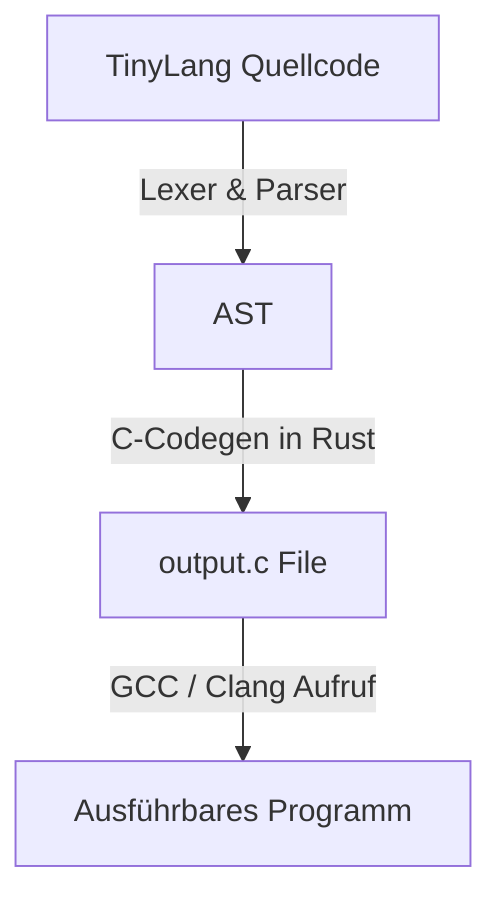

# 📝 Eigenen Transpiler bauen: C-Code-Generierung mit Rust

Im vorherigen Kapitel haben wir gelernt, wie man mit LLVM Maschinencode erzeugt. Es gibt jedoch einen noch einfacheren und extrem eleganten Weg, einen funktionierenden Compiler für deine eigene Sprache zu schreiben: **C-Code-Generierung** (Transpilation).

In diesem Kapitel bauen wir einen Transpiler in Rust, der den AST unserer Sprache TinyLang liest, sauberen C-Code erzeugt und diesen über `gcc` oder `clang` kompilieren lässt.

---

## 🧠 Theorie: Wie funktioniert der C-Transpiler?

Der Transpiler nutzt das gleiche Frontend wie ein klassischer Compiler (Lexer, Parser, AST). Aber anstelle von LLVM IR erzeugt der Code-Generator einen einfachen String mit C-Quellcode.



### Die Vorteile dieses Ansatzes:
1. **Keine C++-LLVM-Abhängigkeiten:** Dein Compiler benötigt nur die Rust-Standardbibliothek (`std`).
2. **Blitzschnell programmiert:** Der Generator ist im Grunde nur Textformatierung (`format!`).
3. **Portabilität & Optimierung umsonst:** Da C-Compiler auf jeder CPU existieren und hochgradig optimieren (`-O3`), ist deine Sprache sofort überall schnell.

---

## 🛠️ Praxis: Der C-Code-Generator in Rust

Wir bauen einen Generator, der TinyLang-Ausdrücke in C-Syntax übersetzt.

Erstelle die Datei `src/c_codegen.rs`:

```rust
// Wir nutzen die gleichen AST-Definitionen aus unserem Parser
use crate::parser::{Expr, Function, Op, Statement};

pub struct CCodegen {
    output: String,
}

impl CCodegen {
    pub fn new() -> Self {
        Self {
            output: String::new(),
        }
    }

    // Wandelt einen Operator in die entsprechende C-Syntax um
    fn codegen_op(op: Op) -> &'static str {
        match op {
            Op::Add => "+",
            Op::Sub => "-",
            Op::Mul => "*",
            Op::Div => "/",
            Op::Eq => "==",
            Op::Lt => "<",
        }
    }

    // Übersetzt einen Ausdruck rekursiv in C-Code
    fn codegen_expr(&self, expr: &Expr) -> String {
        match expr {
            Expr::Number(val) => val.to_string(),
            Expr::Variable(name) => name.clone(),
            Expr::Binary(lhs, op, rhs) => {
                let lhs_code = self.codegen_expr(lhs);
                let rhs_code = self.codegen_expr(rhs);
                let op_str = Self::codegen_op(*op);
                format!("({} {} {})", lhs_code, op_str, rhs_code)
            }
            Expr::Call(func_name, args) => {
                let compiled_args: Vec<String> = args.iter().map(|a| self.codegen_expr(a)).collect();
                format!("{}({})", func_name, compiled_args.join(", "))
            }
            Expr::If(cond, then_branch, else_branch) => {
                // Wir nutzen in C den Ternären Operator (cond ? then : else) für Ausdrücke
                let cond_code = self.codegen_expr(cond);
                let then_code = self.codegen_statements(then_branch);
                let else_code = self.codegen_statements(else_branch);
                format!("(({}) ? ({}) : ({}))", cond_code, then_code, else_code)
            }
        }
    }

    // Generiert C-Code für eine Liste von Statements
    fn codegen_statements(&self, stmts: &[Statement]) -> String {
        let mut parts = Vec::new();
        for stmt in stmts {
            match stmt {
                Statement::Let(name, expr) => {
                    let expr_code = self.codegen_expr(expr);
                    parts.push(format!("int {} = {};", name, expr_code));
                }
                Statement::Expr(expr) => {
                    parts.push(self.codegen_expr(expr));
                }
            }
        }
        parts.join(" ")
    }

    // Übersetzt eine TinyLang-Funktion in eine C-Funktion
    pub fn compile_function(&mut self, func: &Function) -> String {
        let mut c_code = String::new();
        
        // Header inkludieren
        c_code.push_str("#include <stdio.h>\n\n");
        
        // Funktionssignatur: int name(int arg1, int arg2)
        let args_code: Vec<String> = func.prototype.args.iter().map(|arg| format!("int {}", arg)).collect();
        c_code.push_str(&format!("int {}({}) {{\n", func.prototype.name, args_code.join(", ")));

        // Body verarbeiten
        for stmt in &func.body {
            match stmt {
                Statement::Let(name, expr) => {
                    let expr_code = self.codegen_expr(expr);
                    c_code.push_str(&format!("    int {} = {};\n", name, expr_code));
                }
                Statement::Expr(expr) => {
                    let expr_code = self.codegen_expr(expr);
                    // Der letzte Ausdruck wird zum return-Statement
                    c_code.push_str(&format!("    return {};\n", expr_code));
                }
            }
        }

        c_code.push_str("}\n");
        c_code
    }
}
```

---

## 🛠️ Ausführung des C-Compilers aus Rust heraus (`main.rs`)

Wir schreiben die generierte `.c`-Datei auf die Festplatte und rufen `gcc` oder `clang` über Rusts `std::process::Command` auf:

```rust
use std::fs;
use std::process::Command;

fn main() {
    let source_code = "
        def doppelt(x) {
            let ergebnis = x * 2;
            ergebnis
        }
    ";

    // 1. Lexen & Parsen (AST erstellen)
    let lexer = lexer::Lexer::new(source_code);
    let mut parser = parser::Parser::new(lexer);
    let ast = parser.parse_function();

    // 2. C-Code generieren
    let mut codegen = c_codegen::CCodegen::new();
    let c_code = codegen.compile_function(&ast);

    println!("Generierter C-Code:\n{}", c_code);

    // 3. C-Code in Datei schreiben
    fs::write("output.c", c_code).expect("Konnte output.c nicht schreiben");

    // 4. GCC oder Clang über Process Command aufrufen!
    let status = Command::new("gcc")
        .args(&["-O3", "-c", "output.c", "-o", "output.o"])
        .status()
        .expect("Fehler beim Ausführen von GCC");

    if status.success() {
        println!("Erfolgreich mit GCC zu 'output.o' kompiliert!");
    }
}
```

---

## 💡 Zusammenfassung

| Vorgehen | Transpiler (C-Generierung) | LLVM-Compiler (Inkwell) |
| :--- | :--- | :--- |
| **Komplexität** | 🟢 Extrem einfach (Text) | 🔴 Hoch (C++ C-APIs) |
| **Abhängigkeiten** | 🟢 Nur Rust Std-Lib | 🔴 LLVM15/16 dev paket |
| **Generierungs-Ziel** | `.c` Textdatei | `.o` Objektdatei / LLVM IR |
| **Performance des Codes** | 🚀 Ausgezeichnet (via GCC -O3) | 🚀 Ausgezeichnet (via LLVM -O3) |
