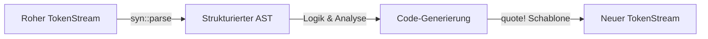

# 🧬 Prozedurale Makros – Das Fließband-Robotermuster

Während deklarative Makros wie einfache Plätzchenformen (Schablonen) funktionieren, die Textmuster vergleichen und ersetzen, sind **prozedurale Makros** wie **hochentwickelte Roboter an einem Industrie-Fließband**.

Der Compiler schickt diesem Roboter den von dir geschriebenen Code als rohes Material – einen Strom aus Code-Bausteinen (den **`TokenStream`**). 

Der Roboter nimmt diesen Code, zerlegt ihn in seine Einzelteile (er baut einen abstrakten Syntaxbaum, den **AST**), führt ein kleines, vollwertiges Rust-Programm aus, um den Code nach deinen Wünschen umzubauen, zu erweitern oder völlig neuen Code daraus zu gießen. Anschließend legt er das fertige Produkt (einen neuen `TokenStream`) zurück auf das Fließband, damit der Compiler es fertig backen (kompilieren) kann.

Weil prozedurale Makros vollwertige Rust-Programme sind, die während des Kompilierens ausgeführt werden, müssen sie **zwingend in einem eigenen Bibliotheks-Crate** liegen. Der Compiler muss diesen Roboter nämlich erst selbst kompilieren und starten, bevor er dein eigentliches Hauptprogramm bearbeiten kann.

---

## 🧠 Theorie

### 1. Die drei Arten von prozeduralen Makros

In Rust gibt es drei Möglichkeiten, wie diese Fließband-Roboter in deinen Code eingreifen können:

#### A) Custom Derive-Makros (Eigenschaften herleiten)
Sie fügen einem Struct oder Enum neuen Code hinzu (meistens Trait-Implementierungen), ohne den ursprünglichen Code zu verändern. Du kennst sie bereits von `#[derive(Debug)]` oder `#[derive(Serialize)]`.

```rust
// Der Programmierer schreibt:
#[derive(MeinLogFormat)]
struct Benutzer {
    name: String,
}
// Der Derive-Roboter generiert im Hintergrund automatisch:
// impl MeinLogFormat for Benutzer { ... }
```

#### B) Attribut-Makros (Code umschreiben)
Sie erstellen neue, benutzerdefinierte Attribute (wie `#[mein_attribut]`), die über Strukturen, Enums oder Funktionen geschrieben werden. Im Gegensatz zu Derive-Makros dürfen sie den markierten Code komplett verändern, umschreiben oder sogar löschen.

```rust
// Bekannt aus Web-Frameworks oder Async-Runtimes:
#[tokio::main]
async fn main() { ... }
```

#### C) Funktionsähnliche (Function-like) Makros
Sie werden wie deklarative Makros aufgerufen (z. B. `mein_makro!(...)`), können aber völlig freie, benutzerdefinierte Syntax parsen (z. B. SQL-Abfragen zur Compile-Zeit auf Korrektheit prüfen).

```rust
let query = sql!("SELECT name FROM user WHERE id = $1");
```

---

### 2. Die Werkzeuge des Roboters: `syn` und `quote`
Ein roher `TokenStream` ist für uns Programmierer schwer zu lesen. Er ist nur eine flache Liste von Symbolen (wie `struct`, `Benutzer`, `{`, `name`, `:`, `String`, `}`). 

Deshalb nutzt fast jedes prozedurale Makro zwei extrem mächtige Hilfs-Crates:

1.  **`syn` (Syntax-Parser):**
    Nimmt den `TokenStream` und parst ihn in eine strukturierte Baumstruktur aus Rust-Typen (z. B. ein Struct `DeriveInput`, das Felder für den Struct-Namen, die Generics und die Attribute enthält).
2.  **`quote` (Code-Erzeuger):**
    Das Gegenstück zu `syn`. Es erlaubt uns, Rust-Code wie in einer Textvorlage zu schreiben und Platzhalter dynamisch einzusetzen. Es wandelt diese Vorlage zurück in einen `TokenStream`.

Ein typischer Ablauf im Makro-Roboter sieht so aus:



---

### 3. Anatomie eines Derive-Makros (Konzeptionell)
In dem speziellen Makro-Crate (in dessen `Cargo.toml` der Eintrag `proc-macro = true` steht) sieht die Definition eines Derive-Makros wie folgt aus:

```rust
extern crate proc_macro;
use proc_macro::TokenStream;
use quote::quote;
use syn::{parse_macro_input, DeriveInput};

// Wir deklarieren das Derive-Makro
#[proc_macro_derive(MeinDebugFormat)]
pub fn mein_debug_derive(input: TokenStream) -> TokenStream {
    // 1. AST parsen
    let ast = parse_macro_input!(input as DeriveInput);
    
    // 2. Den Namen des Structs/Enums extrahieren
    let name = &ast.ident;
    
    // 3. Neuen Code generieren mit quote!
    let generierter_code = quote! {
        impl MeinDebugFormat for #name {
            fn formatieren(&self) -> String {
                format!("Objekt vom Typ {}", stringify!(#name))
            }
        }
    };
    
    // 4. Zurück an das Compiler-Fließband übergeben
    generierter_code.into()
}
```

---

## 🛠️ Praxis-Aufgaben (Keine Codelösungen)

Versuche, die folgenden Aufgaben theoretisch zu lösen, indem du die Strukturen skizzierst und die Konzepte planst.

### Aufgabe 1: Das Beschreibungs-Derive `#[derive(Beschreibe)]` 🔍
Wir wollen ein Derive-Makro entwerfen, das für ein Struct automatisch eine Methode `beschreibe(&self)` generiert.
*   Das Makro soll den Namen des Structs ermitteln (z.B. `Benutzer`).
*   Es soll eine Ausgabe auf der Konsole erzeugen: `"Ich bin eine Instanz des Typs: Benutzer"`.
*   *Aufgabe:* Skizziere die `quote!`-Schablone für dieses Makro. Wie schleust du den Namen des Structs dynamisch in die Impl-Bedingung ein?

### Aufgabe 2: Das Rätsel des separaten Crates 📦
Ein Entwickler versucht, ein prozedurales Makro direkt in seinem Hauptprojekt (`src/main.rs`) zu definieren und scheitert.
*   *Aufgabe:* Erkläre präzise, warum prozedurale Makros nicht im selben Crate wie der restliche Programmcode liegen dürfen. Was macht der Compiler beim Kompilieren mit dem Makro-Code im Unterschied zum normalen Programm-Code?

### Aufgabe 3: Attribut-Makro vs. Deklaratives Makro ⚖️
Stell dir vor, du möchtest ein Web-Framework schreiben. Der Benutzer soll Routen so definieren können:
```rust
#[get("/api/status")]
fn status() -> &'static str { "OK" }
```
*   *Aufgabe:* Warum ist ein deklaratives Makro (`macro_rules!`) für dieses Vorhaben ungeeignet und warum eignet sich hier ein prozedurales Attribut-Makro perfekt? Was darf das Attribut-Makro mit der Funktion `status` tun?

### Aufgabe 4: Das tokenbasierte Parsing-Gedankenspiel 🧩
Ein funktionsähnliches Makro wird wie folgt aufgerufen: `prüfe_syntax!(ALTER: 25, NAME: "Lisa")`.
*   Der `TokenStream` enthält die Symbole: `ALTER`, `:`, `25`, `,`, `NAME`, `:`, `"Lisa"`.
*   *Aufgabe:* Wenn du diesen Stream parst, wie unterscheidest du zwischen Bezeichnern (Identifiers wie `ALTER`), Satzzeichen (Punctuation wie `:` und `,`) und Literalen (wie `25` und `"Lisa"`)? Welche Werkzeuge aus dem `syn`-Crate helfen dir dabei?

---

## 💡 Zusammenfassung

*   **Prozedurale Makros** sind Rust-Funktionen, die während des Kompilierens ausgeführt werden.
*   Sie müssen zwingend in einem eigenen Bibliotheks-Crate mit **`proc-macro = true`** definiert sein.
*   Sie nehmen einen **`TokenStream`** entgegen und geben einen modifizierten **`TokenStream`** zurück.
*   **Derive-Makros** fügen Code hinzu; **Attribut-Makros** dürfen bestehenden Code umschreiben; **Funktionsähnliche Makros** parsen freie Syntax.
*   **`syn`** parst rohe Token-Ströme in einen Abstract Syntax Tree (AST); **`quote`** generiert Token-Ströme aus Codevorlagen.

---

## 📚 Links

*   [Das offizielle Rust-Buch: Prozedurale Makros (Englisch)](https://doc.rust-lang.org/book/ch19-06-macros.html#procedural-macros-for-generating-code-from-attributes)
*   [Die deutsche Übersetzung des Rust-Buchs: Prozedurale Makros (Deutsch)](https://rust-lang-de.github.io/rustbook-de/ch19-06-macros.html#prozedurale-makros-zur-codegenerierung-aus-attributen)
*   [Die syn Crate-Dokumentation (Umfangreiche API-Referenz - Englisch)](https://docs.rs/syn/latest/syn/)
*   [Die quote Crate-Dokumentation (Umfangreiche API-Referenz - Englisch)](https://docs.rs/quote/latest/quote/)
*   [Konzept: Deklarative Makros (Die einfachere Alternative)](file:///home/thorsten/Anfaenger/rust-projekte/src/konzept-makros-deklarativ.md)
