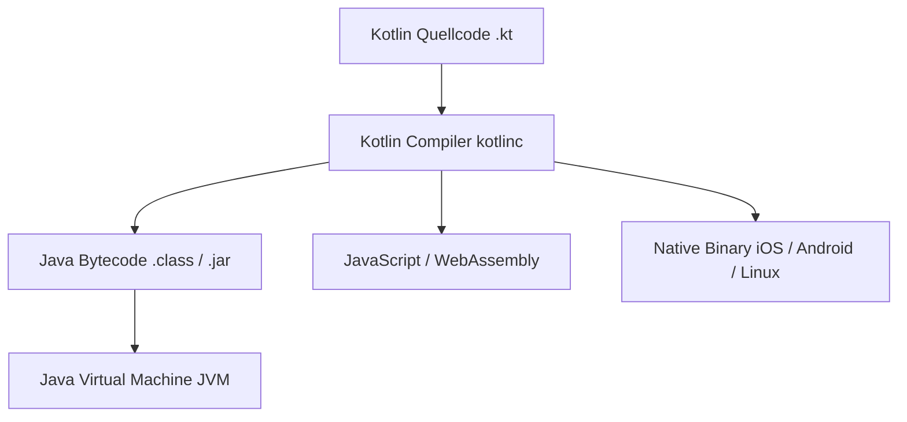

# 1 Einstieg in die Welt von Kotlin

Herzlich willkommen in der Welt von Kotlin! Wenn du eine moderne, elegante und extrem ausdrucksstarke Programmiersprache lernen möchtest, bist du hier genau richtig. Kotlin kombiniert die Leistungsfähigkeit der Java-Plattform mit moderner Syntax, maximaler Typsicherheit und einer hervorragenden Entwicklererfahrung.

In diesem Kapitel legen wir das Fundament. Du erfährst, warum Kotlin entwickelt wurde, welche Werkzeuge du benötigst, schreibst dein allererstes Kotlin-Programm und lernst, wie du Kotlin-Code auf der Kommandozeile kompilierst und ausführst.

---

## Warum Kotlin?

Kotlin wurde 2010 vom Softwareunternehmen **JetBrains** (den Machern der beliebten Entwicklungsumgebung IntelliJ IDEA) ins Leben gerufen und 2012 als Open-Source-Projekt veröffentlicht. Das Ziel war es, eine Sprache zu schaffen, die genauso leistungsfähig ist wie Java, aber viel pragmatischer, kürzer und vor allem frei von veralteten Entwurfsmustern und unötigem Boilerplate-Code.

### Die wichtigsten Eigenschaften auf einen Blick

- **Offiziell von Google unterstützt:** Im Jahr 2017 kündigte Google die Erstklasse-Unterstützung für Kotlin auf Android an. Seit 2019 ist Kotlin sogar die bevorzugte Sprache (*Kotlin-first*) für die Android-App-Entwicklung.
- **Modern & Prägnant:** Kotlin verringert die Menge an Schreibarbeit (Boilerplate) um bis zu 40 % im Vergleich zu klassischem Java. Quellcode wird dadurch lesbarer und weniger fehleranfällig.
- **100 % Java-interoperabel:** Kotlin läuft auf der Java Virtual Machine (JVM). Du kannst bestehende Java-Bibliotheken nahtlos in Kotlin verwenden – und umgekehrt!
- **Null-Sicherheit (Null Safety):** Das Typsystem von Kotlin ist darauf ausgelegt, die gefürchtete `NullPointerException` ("Der Milliarden-Dollar-Fehler") bereits zur Kompilierzeit weitgehend zu verhindern.
- **Kotlin Multiplatform (KMP):** Neben der JVM kann Kotlin auch nach JavaScript/TypeScript, Native Code (iOS, macOS, Linux, Windows, WebAssembly) kompiliert werden, um Quellcode plattformübergreifend wiederzuverwenden.



---

## 1.1 Die Entwicklungsumgebung & Werkzeuge

Um mit Kotlin durchzustarten, benötigst du ein paar grundlegende Werkzeuge. Das Schöne an Kotlin ist, dass die Einrichtung in wenigen Minuten erledigt ist.

### 1. Das Java Development Kit (JDK)
Da Kotlin standardmäßig zu Java-Bytecode kompiliert wird, benötigst du ein aktuelles JDK (empfohlen: **JDK 17** oder **JDK 21 LTS**).
- **Prüfen:** Gib im Terminal `java -version` und `javac -version` ein.
- **Installation:** 
  - **Linux (Debian/Ubuntu):** `sudo apt install openjdk-21-jdk`
  - **macOS:** `brew install openjdk`
  - **Plattformübergreifend:** Über [SDKMAN!](https://sdkman.io/) mit `sdk install java`.

### 2. Der Kotlin Compiler (`kotlinc`)
Der eigentliche Compiler verwandelt deinen Kotlin-Quellcode (`.kt`) in ausführbare Bytecode-Dateien (`.class` / `.jar`).
- **Installation:**
  - **SDKMAN! (empfohlen für Linux & macOS):** `sdk install kotlin`
  - **Homebrew (macOS):** `brew install kotlin`
  - **Linux Paketmanager:** `sudo apt install kotlin` oder `pacman -S kotlin`
- **Prüfen:** Gib im Terminal `kotlinc -version` ein, um die erfolgreiche Installation zu prüfen.

### 3. Interaktives Lernen: REPL & `ki` Shell
Kotlin bringt eine interaktive Konsole (REPL = *Read-Eval-Print Loop*) mit.
- Starte die Standard-REPL einfach mit dem Befehl:
  ```bash
  kotlinc
  ```
  Hier kannst du Zeile für Zeile Kotlin-Code eintippen und sofort ausführen. Beende die REPL mit `:quit`.
- Eine erweiterte, modernere REPL ist die **Kotlin Interactive Shell (`ki`)**, die Syntax-Highlighting, Autovervollständigung und erweiterte Befehle auf der Kommandozeile bietet.

### 4. IDE-Unterstützung (Entwicklungsumgebungen)
Für größere Projekte empfiehlt sich die Nutzung einer visuellen Entwicklungsumgebung:
- **IntelliJ IDEA (Community oder Ultimate):** Die "Heimat" von Kotlin. IntelliJ bringt Kotlin-Support direkt ab Werk mit. Für Einsteiger die allerbeste Wahl!
- **Android Studio:** Basiert auf IntelliJ IDEA und ist die offizielle IDE für mobile Android-Apps.
- **VS Code:** Mit der offiziellen **Kotlin**-Extension (oder Kotlin Language Server) lässt sich VS Code hervorragend als schlanker Editor nutzen.

---

## 1.2 Das erste Kotlin-Programm

Schreiben wir unser erstes Kotlin-Programm! Erstelle eine Datei namens `main.kt` und füge den folgenden Code ein:

```kotlin
fun main() {
    println("Hallo, Kotlin-Welt!")
}
```

### Die Syntax im Detail erklärt

- `fun`: Dieses Schlüsselwort leitet eine **Funktion** ein (kurz für *function*).
- `main()`: Der Name der Hauptfunktion. Sie dient als Einstiegspunkt (*Entry Point*) für dein Programm, wenn es ausgeführt wird. In modernem Kotlin benötigt `main()` keine zwingenden Parameter mehr!
- `{ ... }`: Die geschweiften Klammern definieren den **Funktionskörper** (*Body*), also den Bereich, in dem deine Anweisungen stehen.
- `println("...")`: Gibt den Text in der Konsole aus und fügt automatisch einen Zeilenumbruch am Ende hinzu.
- **Kein Semikolon `;`!** In Kotlin sind Semikolons am Zeilenende optional und werden in der Praxis fast nie geschrieben.

### Vergleich: Kotlin vs. Java

Schauen wir uns an, wie genau dieses "Hallo Welt"-Programm in klassischem Java aussieht:

```java
// Java - Sehr viel Boilerplate!
public class Main {
    public static void main(String[] args) {
        System.out.println("Hallo, Java-Welt!");
    }
}
```

Und hier noch einmal in Kotlin:

```kotlin
// Kotlin - Schlank und klar!
fun main() {
    println("Hallo, Kotlin-Welt!")
}
```

> [!NOTE]
> **Was fällt beim Vergleich auf?**
> 1. In Kotlin benötigst du keine umgebende Klasse (`public class Main`), nur um einen Einstiegspunkt zu schreiben (*Top-Level Functions*).
> 2. Du musst keine `public static void` Modifikatoren lernen.
> 3. Der Parameter `String[] args` bzw. `Array<String>` ist optional, wenn du keine Kommandozeilenargumente benötigst.
> 4. `println()` ist direkt verfügbar, ohne langes `System.out.println()`.

---

## 1.3 Kotlin ausführen & kompilieren

Es gibt verschiedene Wege, wie du dein Kotlin-Programm ausführen kannst.

### Weg 1: Kompilieren zu einer Standalone JAR-Datei (Standard)

1. Öffne dein Terminal im Ordner deiner `main.kt`.
2. Kompiliere die Datei mit folgendem Befehl:
   ```bash
   kotlinc main.kt -include-runtime -d main.jar
   ```
   - `-include-runtime`: Bettet die Kotlin-Standardbibliothek in die JAR-Datei ein, damit das Programm auf jedem System mit installiertem Java ohne zusätzliche Kotlin-Installation ausgeführt werden kann.
   - `-d main.jar`: Definiert den Namen der Ausgabedatei (JAR = Java Archive).

3. Führe das fertige Programm mit Java aus:
   ```bash
   java -jar main.jar
   ```

### Weg 2: Direktes Ausführen als Skript

Für kleine Experimente oder Skripte kannst du Kotlin-Dateien direkt ohne manuellen JAR-Befehl ausführen.

Führe dafür dein Kotlin-Skript mit dem `-script` Flag aus:

```bash
kotlinc -script main.kt
```

Alternativ kannst du die Datei mit der Endung `.kts` abspeichern (*Kotlin Script*), welche direkt vom Compiler als Skript interpretiert wird.

> [!TIP]
> Während der Entwicklung in IntelliJ IDEA musst du diesen Befehl nicht manuell eingeben. Dort klickst du einfach auf den grünen **Play-Button** neben `fun main()`. Dennoch ist es wertvoll zu verstehen, wie der Compiler auf der Kommandozeile arbeitet!

---

## 1.4 Praxis-Aufgaben & Experimente

Jetzt bist du an der Reihe! Versuche die folgenden Aufgaben selbstständig zu lösen. Wenn du feststeckst, nutze die Fehlermeldungen des Compilers als Hinweisschilder.

> [!IMPORTANT]
> **Erinnerung:** Ersetze den `TODO(...)`-Block im Code-Gerüst durch deinen eigenen Code!

### 🟢 Aufgabe 1 (Leicht): Mehrzeilige Begrüßung

Erstelle eine Kotlin-Funktion `main()`, die drei Zeilen Text in der Konsole ausgibt:
1. Eine Begrüßung mit deinem Namen.
2. Das heutige Thema ("Ich lerne jetzt Kotlin!").
3. Eine abschließende Zeile.

**Code-Gerüst:**

```kotlin
fun main() {
    // TODO: Gib die drei Zeilen mit println() aus
    TODO("Ersetze diesen Block durch deine drei println() Anweisungen")
}
```

---

### 🟡 Aufgabe 2 (Mittel): Kommandozeilen-Argumente nutzen

Wenn du deiner `main`-Funktion den Parameter `args: Array<String>` übergibst, kannst du beim Programmaufruf Argumente von der Konsole entgegennehmen.

Vervollständige den Code so, dass das erste übergebene Argument (`args[0]`) in einer Begrüßung verwendet wird.

**Code-Gerüst:**

```kotlin
fun main(args: Array<String>) {
    if (args.isNotEmpty()) {
        // TODO: Gib "Hallo " gefolgt vom ersten Argument (args[0]) aus
        TODO("Ersetze diesen Block durch die Ausgabe von args[0]")
    } else {
        println("Hallo, unbekannter Besucher!")
    }
}
```

*Tipp zum Testen:* Kompiliere das Programm und starte es mit `java -jar main.jar Thorsten`.

---

### 🔴 Aufgabe 3 (Schwer): Das REPL-Experiment

Starte den Kotlin-Compiler im interaktiven Modus in deiner Konsole:

```bash
kotlinc
```

Führe nacheinander folgende Schritte in der REPL aus:
1. Definiere eine Variable: `val name = "Kotlin"`
2. Gib die Länge des Textes aus: `println(name.length)`
3. Rechne zwei Zahlen zusammen: `println(40 + 2)`
4. Beende die REPL mit `:quit`.

Notiere deine Beobachtungen!

---

## 1.5 Zusammenfassung & Quick Reference

Hier sind die wichtigsten Erkenntnisse aus diesem Kapitel auf einen Blick:

| Konzept | Beschreibung | Beispiel / Befehl |
| :--- | :--- | :--- |
| **Entwickler** | JetBrains (offizieller Google Android Support) | - |
| **Funktions-Keyword** | `fun` leitet eine Funktion ein | `fun main() { ... }` |
| **Konsolen-Ausgabe** | `println()` gibt Text mit Zeilenumbruch aus | `println("Text")` |
| **Compiler** | `kotlinc` übersetzt `.kt` in `.class` / `.jar` | `kotlinc main.kt -include-runtime -d app.jar` |
| **Ausführung** | Mit `java -jar` ausführen | `java -jar app.jar` |
| **Skript-Modus** | Direktes Ausführen ohne JAR-Erstellung | `kotlinc -script main.kt` |
| **REPL** | Interaktive Konsole | Befehl: `kotlinc` |

### Dein Spickzettel für den Einstieg:

```kotlin
// Ein minimalistisches Kotlin-Programm
fun main() {
    println("Willkommen in der Kotlin-Welt!")
}
```

Glückwunsch! Du hast das erste Kapitel gemeistert und dein erstes Kotlin-Programm verstanden. Im nächsten Kapitel schauen wir uns Variablen, Datentypen und das leistungsfähige Typsystem von Kotlin im Detail an!
