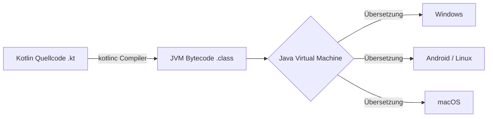
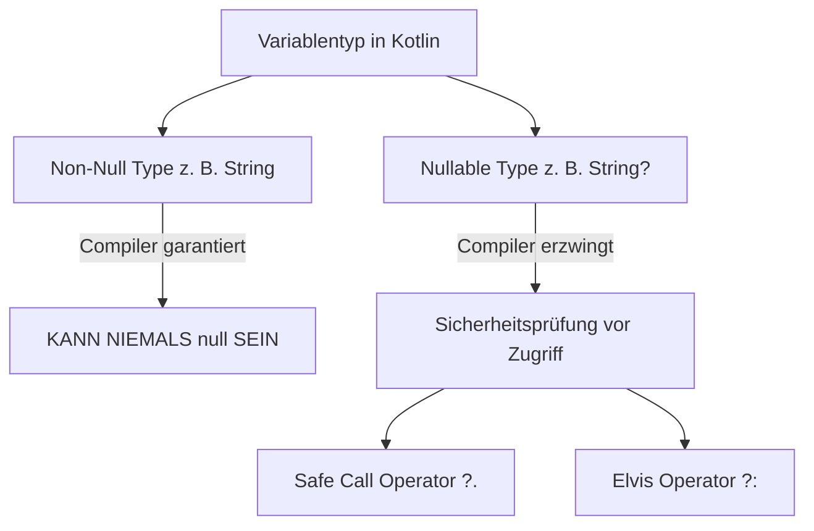
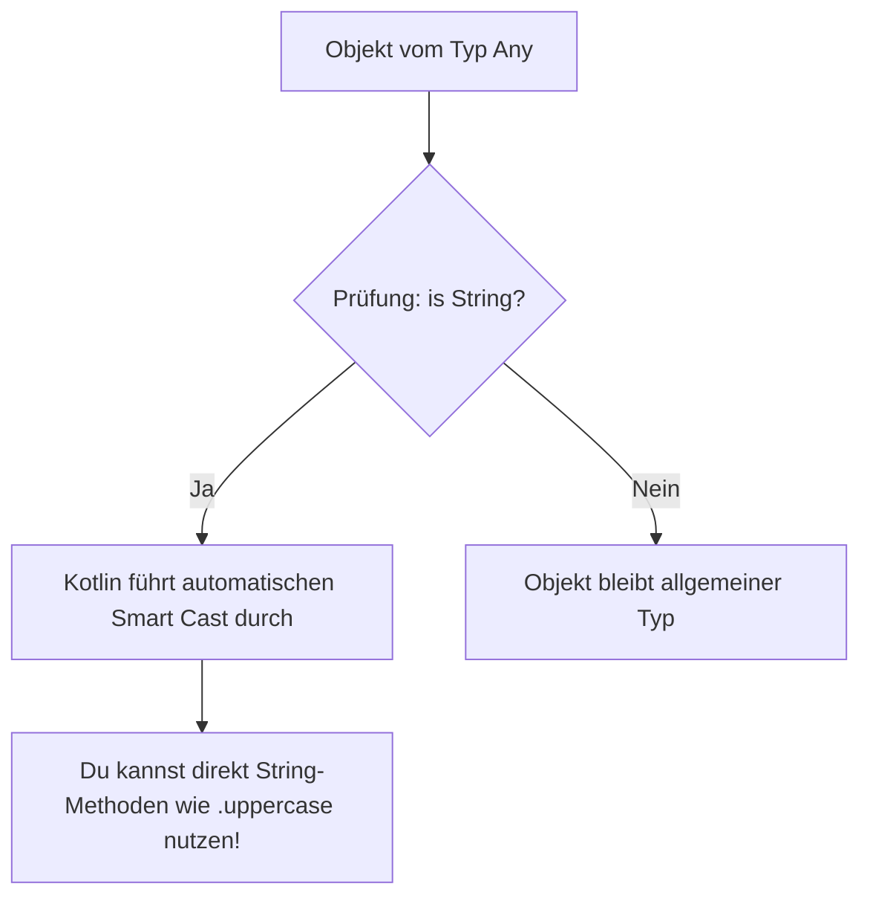
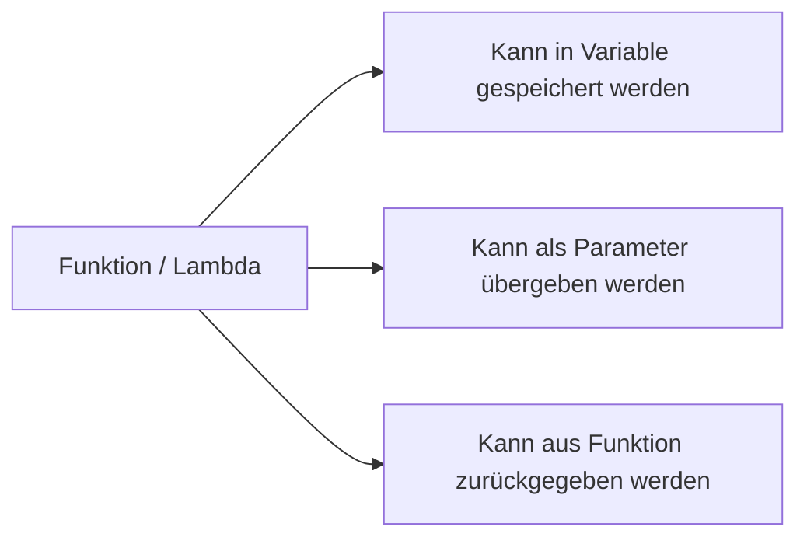

# Konzepte statt Syntax lernen (Kotlin-Programmierung Phase 1) 🚀

Der Einstieg in eine neue Programmiersprache fällt viel leichter, wenn du zuerst die grundlegenden **Ideen und Konzepte** verstehst, anstatt nur auswendig gelernte Codezeilen (Syntax) abzutippen. Kotlin wurde von JetBrains entwickelt, um die Schmerzen älterer Sprachen (wie Java) zu heilen: weniger Redundanz, maximale Sicherheit und moderne Ausdrucksstärke.

Dieses Kapitel erklärt die fünf wichtigsten Kernkonzepte der Kotlin-Programmierung für Einsteiger anhand von anschaulichen Analogien, Flussdiagrammen und interaktiven Denkanstößen.

---

## ☕ 1. JVM & Bytecode: Der Universal-Dolmetscher

### Die Analogie: Der Reise-Dolmetscher
Stell dir vor, du möchtest ein Buch in 50 verschiedenen Ländern veröffentlichen. Anstatt das Buch für jedes einzelne Land von Grund auf neu zu schreiben, übersetzt du es in eine verständliche **Weltsprache** (z. B. Englisch). Vor Ort gibt es dann in jedem Land einen lokalen Dolmetscher, der diesen englischen Text direkt in die Landessprache übersetzt.

*   **Dein Kotlin-Code (`.kt`):** Das Originalmanuskript.
*   **Bytecode (`.class`):** Der in die Weltsprache übersetzte Text.
*   **JVM (Java Virtual Machine):** Der lokale Dolmetscher, der auf dem jeweiligen Betriebssystem (Windows, Linux, macOS, Android) installiert ist und den Bytecode in echten Maschinencode verwandelt.



### Theorie: Plattformunabhängigkeit & Java-Interoperabilität
Weil Kotlin auf der JVM läuft, profitierst du von zwei gewaltigen Vorteilen:
1.  **Write Once, Run Anywhere:** Einmal geschriebener Kotlin-Code läuft auf fast jedem Gerät, das eine JVM besitzt.
2.  **100% Java-Interoperabilität:** Du kannst in deinem Kotlin-Projekt problemlos bestehende Java-Bibliotheken aufrufen und umgekehrt. Kotlin nutzt das gesamte, über Jahrzehnte gewachsene Java-Ökosystem.

> [!NOTE]
> Obwohl Kotlin meistens auf der JVM läuft, kann Kotlin über **Kotlin/Native** auch direkt in Maschinencode (für iOS oder embedded Systeme) oder über **Kotlin/JS** in JavaScript kompiliert werden!

---

## 🛡️ 2. Null-Safety: Das Sicherheitsnetz gegen den "Billion-Dollar-Mistake"

### Die Analogie: Der leere Tresor vs. das Sicherheitsnetz
Stell dir vor, du kaufst eine Schachtel Pralinen im Supermarkt. 
*   In älteren Sprachen wie Java öffnest du die Schachtel, möchtest eine Praline essen – aber die Schachtel ist völlig leer! Das Programm stürzt mit einem lauten Knall ab (`NullPointerException`).
*   In **Kotlin** gibt es zwei Arten von Schachteln: Solche, die **garantiert Pralinen enthalten**, und solche, auf denen ausdrücklich ein **Warnhinweis** klebt, dass sie leer sein könnten!

Der Erfinder der `null`-Referenz (Sir Tony Hoare) bezeichnete sie rückblickend als seinen *"Billion-Dollar Mistake"*, weil sie weltweit zu Unmengen an Abstürzen und Sicherheitslücken geführt hat. Kotlin eliminiert dieses Problem direkt auf Compiler-Ebene.



### Theorie: Nullable Types (`String?`) vs. Non-Null (`String`)
Standardmäßig ist in Kotlin **kein** Typ `null`-fähig!

```kotlin
// 1. Non-Null Typ (Standard)
var name: String = "Thorsten"
// name = null // ❌ COMPILER-FEHLER! Kotlin lässt das gar nicht erst zu.

// 2. Nullable Typ (mit Fragezeichen ?)
var spielerName: String? = "Gamer123"
spielerName = null // ✅ Erlaubt! Die Variable darf leer sein.
```

### Wie geht man sicher mit `Nullable Types` um?

1. **Safe Call Operator (`?.`):** Führt den Befehl nur aus, wenn der Wert nicht `null` ist.
   ```kotlin
   val laenge: Int? = spielerName?.length // Gibt die Länge zurück oder null, aber stürzt NIEMALS ab.
   ```

2. **Elvis Operator (`?:`):** Liefert einen Standardwert, falls das Ergebnis `null` ist (sieht aus wie Elvis Presleys Schopf mit Augen!).
   ```kotlin
   val laengeSicher: Int = spielerName?.length ?: 0 // Wenn null, nimm 0!
   ```

> [!IMPORTANT]
> Es gibt auch den Not-Null Assertion Operator `!!` (z. B. `spielerName!!`). Dieser erzwingt den Zugriff und schaltet Kotlins Sicherheitsnetz aus. Benutze `!!` in der Praxis fast **nie**, da es wieder zu Abstürzen führen kann!

---

## 🔒 3. Smart Casts & Immutability: Unveränderliche Beschriftung & Schlaues Typ-Erkennen

### Die Analogie: Der versiegelte Karton & der erfahrene Detektiv
*   **Immutability (`val` vs. `var`):** Stell dir vor, du beschriftest eine Kiste mit einem Stift. `val` (Value) ist wie eine eingravierte Beschriftung – einmal festgelegt, ändert sie sich nie wieder. `var` (Variable) ist ein wiederbeschreibbares Schild. In Kotlin gilt: Bevorzuge immer `val`, weil unveränderlicher Code viel seltener zu überraschenden Fehlern führt!
*   **Smart Casts:** Ein Detektiv sieht einen Hund im Raum und prüft kurz die Rasse. Ab diesem Moment behandelt er das Tier ganz selbstverständlich als Schäferhund – er muss nicht vor jeder Bewegung neu nachfragen.



### Theorie: Smart Casts mit dem `is`-Operator
In vielen Sprachen musst du Variablen nach einer Typ-Prüfung umständlich manuell umwandeln (casten). Kotlin erkennt Typen durch **Smart Casts** automatisch!

```kotlin
val meinWert: Any = "Hallo Kotlin!"

if (meinWert is String) {
    // Innerhalb dieses Blocks weiß der Kotlin-Compiler automatisch,
    // dass 'meinWert' ein String ist. Manuelles Casten entfällt!
    println(meinWert.uppercase()) // ✅ Funktioniert sofort!
}
```

> [!TIP]
> Benutze wann immer möglich `val` statt `var`. Unveränderliche Datenstrukturen sind vor allem bei paralleler Programmierung (Multi-Threading) extrem sicher und leicht zu verstehen.

---

## 🔄 4. Expression-Driven Code: Alles hat einen Wert

### Die Analogie: Der Verkaufsautomat vs. das Hinweisschild
*   **Statement (Anweisung):** Wie ein Hinweisschild auf der Straße ("Biege hier rechts ab"). Es führt eine Aktion aus, liefert selbst aber keinen konkreten Wert zurück.
*   **Expression (Ausdruck):** Wie ein Verkaufsautomat. Du gibst etwas hinein und erhältst sofort ein **Ergebnis** (einen Wert) heraus, den du direkt weiterverwenden oder einer Variable zuweisen kannst.

In Kotlin sind fast alle Kontrollstrukturen (`if`, `when`, Try-Catch) **Expressions**!

### Theorie: `if` und `when` als Ausdrücke

In älteren Sprachen musstest du oft Hilfsvariablen anlegen:

```kotlin
// Klassischer Weg (Statement-Stil):
val alter = 18
val status: String
if (alter >= 18) {
    status = "Volljährig"
} else {
    status = "Minderjährig"
}

// Der moderne Kotlin-Weg (Expression-Stil):
val statusSicher = if (alter >= 18) "Volljährig" else "Minderjährig"
```

Das `when`-Konstrukt ist Kotlins mächtiger Ersatz für das klassische `switch` – und ebenfalls ein Ausdruck:

```kotlin
val note = 2

val bewertung = when (note) {
    1 -> "Sehr gut"
    2 -> "Gut"
    3 -> "Befriedigend"
    else -> "Unbekannte Note"
}
```

---

## 🧩 5. Funktionen als Erste-Klasse-Bürger (First-Class Citizens)

### Die Analogie: Werkzeuge als Pakete verschicken
In rein objektorientierten Sprachen musstest du Werkzeuge (Funktionen) immer in riesige Werkzeugkisten (Klassen) verpacken, um sie überhaupt transportieren zu können. 

In Kotlin sind Funktionen **Erste-Klasse-Bürger**: Sie stehen gleichberechtigt neben Zahlen und Texten! Du kannst Funktionen:
*   Einzeln im Dokument definieren (Top-Level Functions),
*   Als Argumente an andere Funktionen übergeben,
*   In Variablen speichern oder aus Funktionen zurückgeben.



### Theorie: Top-Level Functions, Single-Expression & Lambdas

#### 1. Keine unnötigen Klassen-Hüllen!
Du brauchst für eine einfache Main-Funktion in Kotlin keine Klasse drumherum:

```kotlin
fun main() {
    println("Hallo aus Kotlin!")
}
```

#### 2. Einzeilige Funktionen (Single-Expression Functions)
Wenn eine Funktion nur aus einem einzigen Ausdruck besteht, kannst du die geschweiften Klammern `{}` und das `return` weglassen:

```kotlin
fun verdoppeln(x: Int): Int = x * 2
```

#### 3. Lambdas (Anonyme Funktionen)
Ein Lambda ist ein kleiner, namenloser Codeblock, den du wie einen Wert weitergeben kannst:

```kotlin
val quadrat = { n: Int -> n * n }
println(quadrat(4)) // Ausgabe: 16
```

---

## 🏋️ Didaktische Übungen & Denkanstöße

Jetzt bist du an der Reihe! Wendest du die Konzepte an. Erstelle dir eine Datei (z. B. `Main.kt`) in deiner Kotlin-Umgebung und versuche, die Aufgaben zu lösen.

> [!IMPORTANT]
> **Hinweis:** Vervollständige den Code selbst! Ersetze die `TODO(...)`-Blöcke durch deine eigene Logik.

### Übung 1: Null-Safety mit dem Elvis-Operator absichern 🛡️

**Aufgabenstellung:** Du entwickelst ein Begrüßungssystem. Der Name des Benutzers kann `null` sein. Wenn ein Name vorhanden ist, gib seine Länge zurück. Wenn der Name `null` ist, soll die Länge `0` sein.

```kotlin
fun ermittleNamensLaenge(name: String?): Int {
    // TODO("Nutze den Safe Call ?. und den Elvis-Operator ?:, um die Länge sicher zu berechnen")
    TODO("Dein Code hier")
}

fun main() {
    println(ermittleNamensLaenge("Anna")) // Erwartet: 4
    println(ermittleNamensLaenge(null))   // Erwartet: 0
}
```

---

### Übung 2: Notenbewertung mit `when` als Expression 🔄

**Aufgabenstellung:** Schreibe eine Funktion `bewertePunkte`, die eine Punktezahl (0 bis 100) entgegennimmt und einen passenden Text als `String` zurückgibt:
*   90 bis 100 -> "Ausgezeichnet"
*   50 bis 89 -> "Bestanden"
*   Unter 50 -> "Nicht bestanden"

```kotlin
fun bewertePunkte(punkte: Int): String {
    // TODO("Nutze 'when' als Expression für die Notenberechnung")
    // Tipp: In 'when' kannst du Bereiche wie 'in 90..100' verwenden!
    return when (punkte) {
        in 90..100 -> "Ausgezeichnet"
        // TODO("Füge die restlichen Fälle hinzu")
        else -> TODO("Dein Code für den Standardfall")
    }
}
```

---

### Übung 3: Smart Casts und Funktionen in Aktion 🧩

**Aufgabenstellung:** Erstelle eine Funktion `verarbeiteEingabe`, die ein Objekt vom Typ `Any` (kann alles sein) empfängt. 
*   Wenn es ein `String` ist, gib den String in GROSSBUCHSTABEN zurück.
*   Wenn es eine `Int` (Zahl) ist, verdopple die Zahl.
*   Für alle anderen Typen gib den Text `"Unbekannter Typ"` zurück.

```kotlin
fun verarbeiteEingabe(eingabe: Any): Any {
    // TODO("Nutze 'when' oder 'if (is ...)' für den Smart Cast")
    return when (eingabe) {
        is String -> TODO("Gib den String in Großbuchstaben zurück (Tipp: .uppercase())")
        is Int -> TODO("Verdopple die Zahl")
        else -> "Unbekannter Typ"
    }
}
```

---

## 📋 Zusammenfassung

| Konzept | Kerngedanke | Warum wichtig? |
| :--- | :--- | :--- |
| **JVM & Bytecode** | Dolmetscher-Prinzip | Code läuft überall, wo Java läuft. |
| **Null-Safety** | `String` vs. `String?` | Verhindert Laufzeit-Abstürze (`NullPointerException`). |
| **Immutability & Smart Casts** | `val` & `is`-Operator | Sicherer Code und automatische Typ-Erkennung. |
| **Expression-Driven** | `if` & `when` haben Werte | Weniger Hilfsvariablen, sauberer Code. |
| **First-Class Functions** | Lambdas & Top-Level | Flexible, funktionale Ansätze ohne Klassen-Zwang. |
