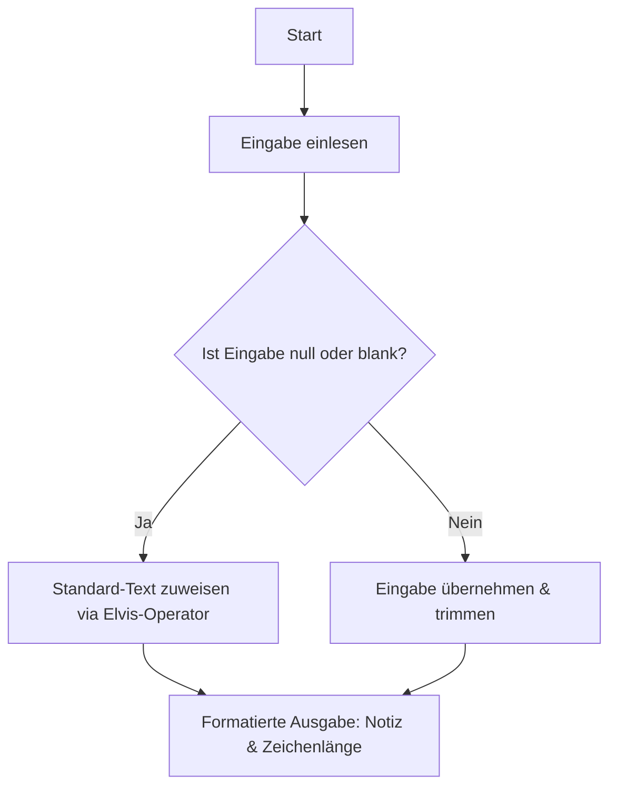
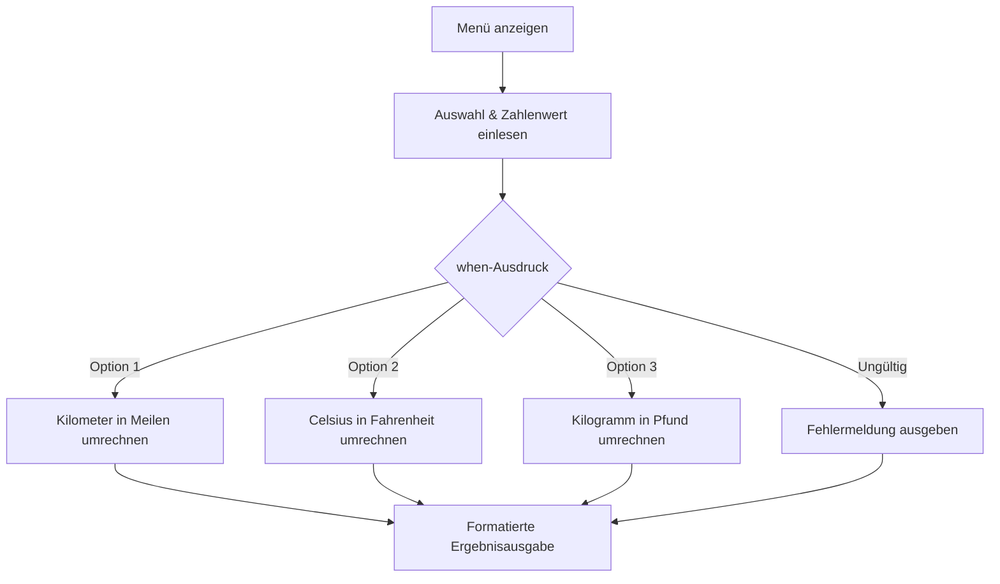
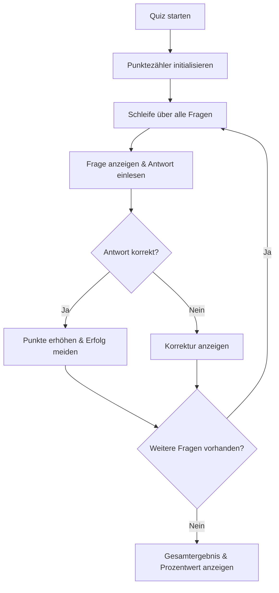
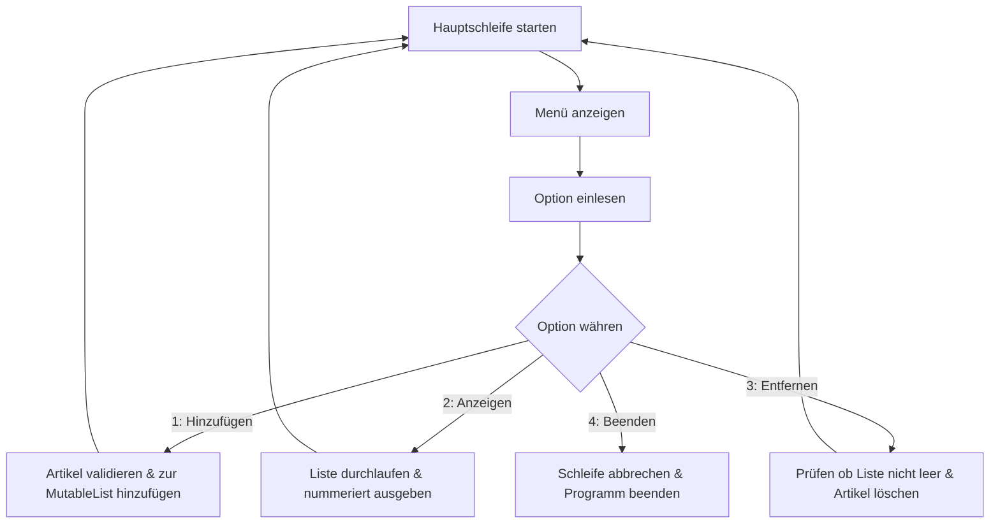

# 💡 Projektvorschläge Phase 1 (Kotlin)

Willkommen zu den Praxisprojekten der **Phase 1**! Hier wendest du die Kernkonzepte von Kotlin in kleinen, überschaubaren Konsolenanwendungen an.

> **Hinweis:** Alle Projekte werden ohne fertige Code-Vorschläge begleitet. Erarbeite die Lösung eigenständig!

---

## 🎯 Überblick über die Kernkonzepte der Phase 1

In dieser Phase festigst du dein Fundament in Kotlin durch eigenständige Implementierung:

| Thema | Was du lernst & anwendest |
|---|---|
| 🛡️ **Null-Safety & Eingabe** | `String?`, Elvis-Operator (`?:`), Safe-Calls (`?.`), `readlnOrNull()` |
| 🔀 **Kontrollstrukturen** | `when`-Ausdrücke als Expression, `if/else`, Verzweigungen |
| 🔄 **Schleifen & Iteration** | `for`, `while`, `do-while`, Bereichsabfragen (`indices`, `1..10`) |
| 🧱 **Kollektionen & Immutability** | `List` (unveränderbar) vs. `MutableList` (veränderbar) |
| ⚙️ **Funktionen & Modulatität** | Deklaration mit `fun`, Parameter, Rückgabewerte, Auslagerung von Logik |

---

## 📓 Projekt 1: Das sichere Notizbuch (Null-Safety & Terminal-Eingabe)

### Problemstellung
In vielen Programmiersprachen führen unbehandelte `null`-Werte zu unerwarteten Abstürzen. Kotlins Typsystem unterscheidet strikt zwischen Werten, die `null` sein können (`String?`), und solchen, die garantiert einen Wert enthalten (`String`). In diesem Projekt baust du ein Konsolen-Notizbuch, das Benutzereingaben entgegennimmt und leere oder fehlerhafte Eingaben elegant abfängt.

### Anforderungen
1. Lies Text über die Konsole ein.
2. Sichere den eingelesenen Wert mit Kotlins Null-Safety-Mechanismen ab.
3. Wenn der Benutzer nichts oder nur Leerzeichen eingibt, soll automatisch ein vordefinierter Standardtext zugewiesen werden.
4. Gib die abgesicherte Notiz sowie ihre genaue Zeichenlänge auf der Konsole aus.

### Didaktische Leitfragen & Denkanstöße
- *Wie unterscheidet Kotlin bei der Typdeklaration zwischen einer Nullable-Variable und einer Non-Null-Variable?*
- *Welcher elegante Operator (oft nach einer bekannten Rocklegende benannt) ermöglicht es dir, im Falle von `null` einen Standardwert bereitzustellen?*
- *Mit welcher Methode kannst du prüfen, ob ein eingegebener String nur aus Leerzeichen besteht oder echten Inhalt bietet?*
- *Wie kannst du String-Interpolation nutzen, um Variablenwerte direkt in Textausgaben einzubinden?*

### Architektur- & Ablaufskizze

---

## 🔄 Projekt 2: Der interaktive Einheiten-Umrechner (when-Ausdrücke & Funktionen)

### Problemstellung
Einheitenumrechnungen (wie Kilometer in Meilen, Celsius in Fahrenheit oder Kilogramm in Pfund) erfordern eine übersichtliche Menüführung. In Kotlin lässt sich eine Fallunterscheidung besonders elegant mit dem `when`-Ausdruck lösen, der Werte direkt als Expression zurückgeben kann.

### Anforderungen
1. Zeige dem Benutzer ein strukturiertes Hauptmenü zur Auswahl der Umrechnungsart.
2. Lies die Menüauswahl und den umzurechnenden Zahlenwert von der Konsole ein.
3. Verwende `when` als Ausdruck, um den passenden Berechnungsschritt auszuwählen.
4. Lagere die mathematischen Formeln in separate, gut benannte Funktionen aus.
5. Fange ungültige Menüoptionen sowie fehlerhafte Zahleneingaben ab.

### Didaktische Leitfragen & Denkanstöße
- *Was bedeutet es, dass `when` in Kotlin ein Ausdruck (Expression) und keine reine Anweisung (Statement) ist?*
- *Welche Methode nutzt du, um einen eingelesenen String sicher in eine Fließkommazahl (`Double`) umzuwandeln, ohne dass das Programm bei einer Fehleingabe abstürzt?*
- *Wie baust du eigene Funktionen mit Eingabeparametern und Rückgabewerten in Kotlin auf?*
- *Wie behandelst du den `else`-Zweig in deinem `when`-Ausdruck, wenn der Benutzer eine Zahl außerhalb des Menübereichs eingibt?*

### Architektur- & Ablaufskizze

---

## 🎯 Projekt 3: Das Mini-Quizsystem (Schleifen, Bedingungen & Punktezähler)

### Problemstellung
Ein Quizsystem eignet sich hervorragend, um das Zusammenspiel von Datensammlungen, Schleifen und Zählervariablen zu üben. Das Programm stellt nacheinander mehrere Fragen, vergleicht die Antworten und gibt am Ende eine Zusammenfassung der Punkte und eine Erfolgsquote aus.

### Anforderungen
1. Speichere Fragen und dazu passende Antworten in geeigneten Datenstrukturen (z. B. Listen oder Arrays).
2. Durchlaufe die Fragen mithilfe einer Schleife.
3. Vergleiche die Benutzereingabe mit der korrekten Antwort (Groß- und Kleinschreibung soll ignoriert werden).
4. Führe einen Punktezähler mit, der bei jeder richtigen Antwort erhöht wird.
5. Gib nach Ablauf aller Fragen die Gesamtpunktzahl und eine prozentuale Auswertung aus.

### Didaktische Leitfragen & Denkanstöße
- *Mit welcher Schleifenvariante kannst du direkt über den Index oder die Elemente einer Liste/eines Arrays iterieren?*
- *Welche Methode der Klasse `String` erlaubt einen Textvergleich, bei dem die Groß-/Kleinschreibung ignoriert wird?*
- *Welche Art von Variable (`val` oder `var`) musst du für den Punktezähler wählen und warum?*
- *Wie berechnest du die Erfolgsquote in Prozent und wie vermeidest du dabei eine ungewollte Ganzzahl-Division?*

### Architektur- & Ablaufskizze

---

## 🛒 Projekt 4: Der Einkaufslisten-Planer (MutableList & Konsolen-Menü)

### Problemstellung
In Kotlin wird strikt zwischen unveränderbaren Kollektionen (`List`) und veränderbaren Kollektionen (`MutableList`) unterschieden. In diesem Projekt erstellst du eine interaktive Einkaufsliste, bei der Artikel während der Laufzeit hinzugefügt, aufgelistet und entfernt werden können.

### Anforderungen
1. Verwende eine veränderbare Liste (`MutableList`), um Artikel dynamisch zu verwalten.
2. Baue eine interaktive Hauptschleife mit folgenden Optionen:
   - Artikel hinzufügen (leere Eingaben vermeiden).
   - Einkaufsliste anzeigen (mit fortlaufender Nummerierung).
   - Artikel entfernen (nach Namen oder Index).
   - Programm beenden.
3. Informiere den Benutzer angemessen, falls die Liste leer ist.

### Didaktische Leitfragen & Denkanstöße
- *Warum ist es in Kotlin guter Stil, standardmäßig unveränderbare Listen zu bevorzugen und `MutableList` nur dort zu nutzen, wo Elemente verändert werden müssen?*
- *Mit welcher Hilfsmethode kannst du eine Liste durchlaufen und dabei gleichzeitig auf das Element und dessen aktuellen Index zugreifen?*
- *Welche Sicherheitsprüfung solltest du durchführen, bevor der Benutzer versucht, ein Element aus der Liste zu entfernen?*
- *Wie verhinderst du, dass Duplikate oder leere Zeichenketten in deine Einkaufsliste gelangen?*

### Architektur- & Ablaufskizze

---

## 📊 Projekt 5: Der Notenspiegel-Analysator (Zahlenverarbeitung & Schleifen)

### Problemstellung
Du möchtest eine Reihe von Prüfungsnoten eingeben und statistisch auswerten. Das Programm soll Noten entgegennehmen, bis der Nutzer die Eingabe beendet, und anschließend Notendurchschnitt, beste Note sowie schlechteste Note berechnen.

### Anforderungen
1. Lies wiederholt Noten (Dezimalzahlen) über die Konsole ein, bis ein Abbruchsignal (z. B. das Wort `"ende"`) eingegeben wird.
2. Validiere, dass eingegebene Noten im gültigen Notenbereich (z. B. 1.0 bis 6.0) liegen.
3. Speichere die gültigen Noten in einer Liste.
4. Berechne nach Abschluss der Eingabe den Notendurchschnitt, das Minimum und das Maximum.
5. Behandle Sonderfälle (z. B. wenn gar keine Note eingegeben wurde).

### Didaktische Leitfragen & Denkanstöße
- *Welche Schleifenform (`while` oder `do-while`) eignet sich besonders gut für eine Eingabeschleife mit ungewisser Anzahl an Durchläufen?*
- *Welche vorgefertigten Funktionen bietet Kotlins Standardbibliothek für Listen von Zahlen, um Summe, Minimum oder Maximum zu ermitteln?*
- *Wie schützt du dein Programm vor einer Division durch 0 bei der Durchschnittsberechnung?*

---

## 🔐 Projekt 6: Der Passwort-Sicherheitsprüfer (String-Analyse & Logik)

### Problemstellung
Ein sicheres Passwort sollte bestimmte Kriterien erfüllen (Mindestlänge, Großbuchstaben, Ziffern, Sonderzeichen). Du baust ein Werkzeug, das ein Passwort analysiert und dem Nutzer detailliertes Feedback zur Passwortstärke gibt.

### Anforderungen
1. Lies ein Passwort als Text von der Konsole ein.
2. Überprüfe folgende Sicherheitsregeln:
   - Mindestens 8 Zeichen lang.
   - Enthält mindestens einen Großbuchstaben.
   - Enthält mindestens eine Ziffer.
   - Enthält mindestens ein Sonderzeichen.
3. Gib für jede nicht erfüllte Regel einen konkreten Hinweis aus.
4. Eruiere eine Gesamtbewertung (z. B. *Schwach*, *Mittel*, *Stark*).

### Didaktische Leitfragen & Denkanstöße
- *Welche nützlichen Prüfmethoden bietet die Klasse `Char` in Kotlin (z. B. `isUpperCase()`, `isDigit()`)?*
- *Wie kannst du mit der Kotlin-Funktion `any { ... }` prüfen, ob mindestens ein Zeichen in einem String eine Bedingung erfüllt?*
- *Wie strukturierst du deine Prüflogik, damit alle Schwachstellen auf einmal angezeigt werden und nicht nur die erste fehlerhafte Regel?*
