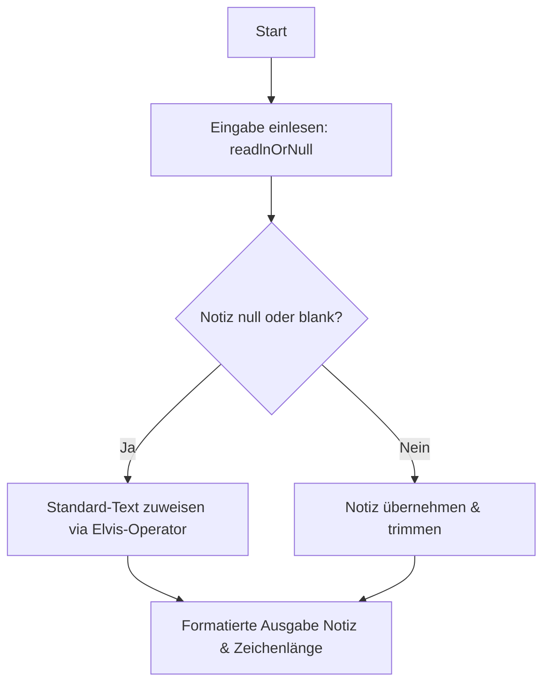
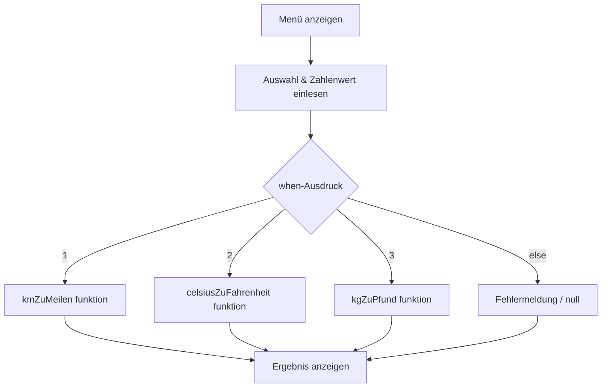
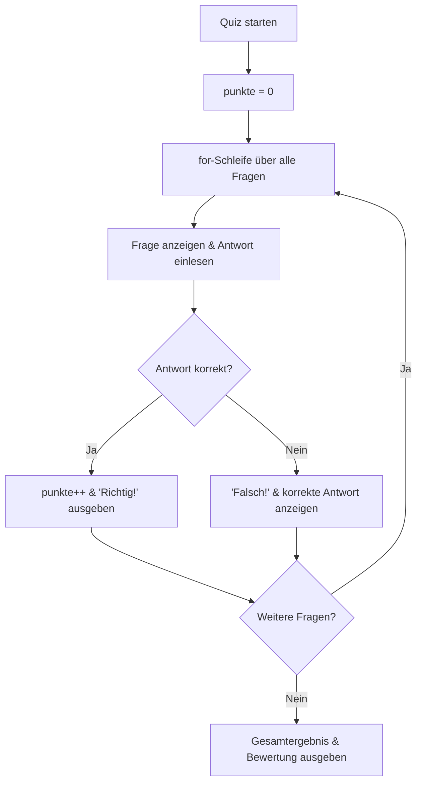
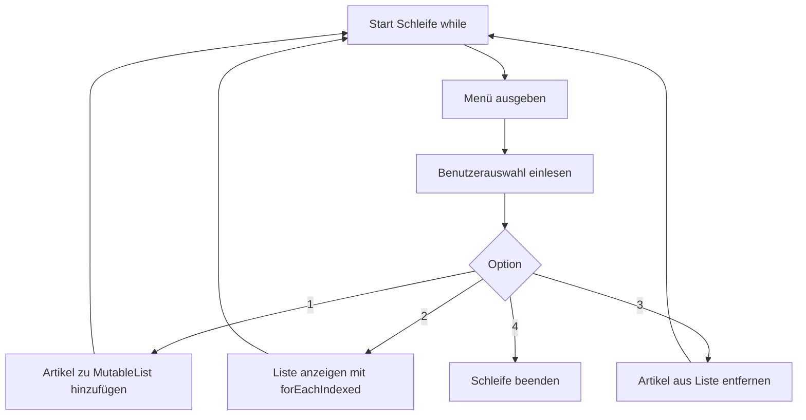

# 💡 Projektvorschläge Phase 1 (Kotlin)

Willkommen zu den Praxisprojekten der **Phase 1**! Hier wendest du die Kernkonzepte von Kotlin in kleinen, überschaubaren Konsolenanwendungen an. 

In dieser Phase vertiefst du folgende Grundlagen:
- **Null-Safety & Terminal-Eingabe:** Der sichere Umgang mit `String?`, Elvis-Operator (`?:`), Safe-Calls (`?.`) und `readlnOrNull()`.
- **Kontrollstrukturen & Funktionen:** Der mächtige `when`-Ausdruck als Expression sowie saubere Funktionsdeklarationen.
- **Schleifen & Bedingungen:** `for`- und `while`-Schleifen, Zählerlogik und Auswertungen.
- **Kollektionen & Immutability:** Der Unterschied zwischen `List` (unveränderbar) und `MutableList` (veränderbar).

> [!TIP]
> **Hinweis zum Lernen:** Alle Projekte enthalten ein unvollständiges Starter-Gerüst mit `TODO()`. Deine Aufgabe ist es, den Code eigenständig zu vervollständigen. Es gibt hier bewusst keine vorgefertigten Lösungen!

---

## 📓 Projekt 1: Das sichere Notizbuch (Null-Safety & Terminal-Eingabe)

### Problemstellung
In vielen Programmiersprachen führen unbehandelte `null`-Werte zu unerwarteten Abstürzen (`NullPointerException`). Kotlin löst dieses Problem durch sein striktes Typsystem. Ziel dieses Projekts ist es, ein kleines Konsolen-Notizbuch zu bauen, das Benutzereingaben entgegennimmt und fehlerfrei mit `null` oder leeren Eingaben umgeht.

### Anforderungen
1. Lies Text über die Konsole mit `readlnOrNull()` ein.
2. Sichere den optionalen String (`String?`) mit Kotlins Null-Safety-Mechanismen ab (z. B. Elvis-Operator `?:` oder `takeIf`).
3. Wenn der Benutzer nichts oder nur Leerzeichen eingibt, soll automatisch eine Standardnachricht (*"Leere Notiz"* oder *"Keine Notiz vorhanden"*) verwendet werden.
4. Gib die abgesicherte Notiz sowie ihre genaue Zeichenlänge auf der Konsole aus.

### Architektur-Skizze


### TODO()-Starter-Gerüst
```kotlin
fun main() {
    println("=== Das sichere Notizbuch ===")
    print("Bitte gib deine Notiz ein: ")
    
    // 1. Notiz einlesen (Rückgabetyp ist String?)
    val eingabe: String? = readlnOrNull()
    
    // 2. Null-Safety nutzen: 
    // Nutze eingabe?.trim() und takeIf { it.isNotBlank() } zusammen mit dem Elvis-Operator `?:`,
    // um im Falle von null oder leeren Eingaben einen Standardtext zuzuweisen.
    val notiz: String = TODO("Sichere die Eingabe ab (z. B. eingabe?.trim()?.takeIf { it.isNotEmpty() } ?: \"[Keine Notiz eingegeben]\")")
    
    // 3. Ausgabe der Notiz und ihrer Länge
    TODO("Gib die Notiz und ihre Zeichenlänge mit String-Interpolation ($notiz / ${notiz.length}) aus")
}
```

### Erweiterungsideen
- Ergänze eine Abfrage, ob die Notiz in Großbuchstaben umgewandelt werden soll (nutze `uppercase()`).
- Füge ein Datums- oder Zeitstempel-Präfix vor die Notiz ein.

---

## 🔄 Projekt 2: Der interaktive Einheiten-Umrechner (when-Ausdrücke & Funktionen)

### Problemstellung
Einheitenumrechnungen (wie Kilometer in Meilen oder Celsius in Fahrenheit) erfordern eine klare Menüführung. In Kotlin lässt sich eine solche Fallunterscheidung besonders elegant und übersichtlich mit dem `when`-Ausdruck lösen, der zudem direkt Werte zurückgeben kann.

### Anforderungen
1. Zeige dem Benutzer ein strukturiertes Hauptmenü zur Auswahl der Umrechnungsart.
2. Lies die Menüauswahl und den umzurechnenden Zahlenwert von der Konsole ein.
3. Verwende `when` als Ausdruck (Expression), um den passenden Berechnungsschritt auszuwählen.
4. Lager die eigentlichen mathematischen Formeln in separate, gut benannte Funktionen aus (z. B. `kmZuMeilen`).
5. Fange ungültige Menüoptionen über den `else`-Zweig des `when`-Ausdrucks ab.

### Architektur-Skizze


### TODO()-Starter-Gerüst
```kotlin
fun main() {
    println("=== Einheiten-Umrechner ===")
    println("1: Kilometer -> Meilen")
    println("2: Celsius -> Fahrenheit")
    println("3: Kilogramm -> Pfund")
    print("Wähle eine Option (1-3): ")
    
    val auswahl = readlnOrNull()?.toIntOrNull()
    
    if (auswahl == null) {
        println("Fehler: Ungültige Menüauswahl!")
        return
    }
    
    print("Gib den umzurechnenden Wert ein: ")
    val wert = readlnOrNull()?.toDoubleOrNull() ?: 0.0
    
    // Nutze when als Expression für die Zuweisung
    val ergebnis: Double? = when (auswahl) {
        1 -> TODO("Rufe kmZuMeilen(wert) auf")
        2 -> TODO("Rufe celsiusZuFahrenheit(wert) auf")
        3 -> TODO("Rufe kgZuPfund(wert) auf")
        else -> {
            println("Unbekannte Option!")
            null
        }
    }
    
    // Ausgabe des Ergebnisses
    if (ergebnis != null) {
        TODO("Gib das formatierte Ergebnis aus (z.B. 'Ergebnis: $ergebnis')")
    }
}

fun kmZuMeilen(km: Double): Double {
    TODO("Berechne Meilen: km * 0.621371")
}

fun celsiusZuFahrenheit(celsius: Double): Double {
    TODO("Berechne Fahrenheit: celsius * 1.8 + 32")
}

fun kgZuPfund(kg: Double): Double {
    TODO("Berechne Pfund: kg * 2.20462")
}
```

### Erweiterungsideen
- Füge Rückwärts-Umrechnungen hinzu (z. B. Meilen in Kilometer).
- Verpacke die Anwendung in eine `do-while`-Schleife, damit der Benutzer beliebig viele Umrechnungen durchführen kann.

---

## 🎯 Projekt 3: Das Mini-Quizsystem (Schleifen, Bedingungsprüfungen & Punktezähler)

### Problemstellung
Ein Quizsystem ist ideal, um das Zusammenspiel von Arrays/Listen, Schleifen und Zählervariablen zu üben. Das Programm soll nacheinander mehrere Fragen stellen, die Eingaben prüfen und am Ende eine Zusammenfassung der erreichten Punkte ausgeben.

### Anforderungen
1. Speichere Fragen und dazugehörige Antworten in passenden Datenstrukturen (z. B. `arrayOf` oder `listOf`).
2. Durchlaufe die Fragen mithilfe einer `for`-Schleife (`for (i in fragen.indices)`).
3. Vergleiche die Benutzereingabe mit der korrekten Antwort (ignoriere dabei Groß- und Kleinschreibung mit `equals(..., ignoreCase = true)`).
4. Führe eine Zählervariable (`var punkte`), die bei jeder richtigen Antwort erhöht wird.
5. Gib nach Durchlauf aller Fragen die Gesamtpunktzahl und eine prozentuale Bewertung aus.

### Architektur-Skizze


### TODO()-Starter-Gerüst
```kotlin
fun main() {
    println("=== Kotlin Mini-Quiz ===")
    
    val fragen = arrayOf(
        "1. Welches Schlüsselwort deklariert eine unveränderbare Variable in Kotlin?",
        "2. Wie heißt der Operator '?:' in Kotlin?",
        "3. Mit welchem Schlüsselwort werden Funktionen in Kotlin eingeleitet?"
    )
    val antworten = arrayOf("val", "elvis", "fun")
    
    var punkte = 0
    
    for (i in fragen.indices) {
        println("\n${fragen[i]}")
        print("Deine Antwort: ")
        val eingabe = readlnOrNull()?.trim() ?: ""
        
        // Prüfung der Antwort
        TODO("Prüfe, ob eingabe.equals(antworten[i], ignoreCase = true). Erhöhe 'punkte' um 1 bei Erfolg.")
    }
    
    println("\n=== Quiz Beendet ===")
    TODO("Gib die Punkte aus (z.B. '$punkte von ${fragen.size} richtig') und berechne die Erfolgsquote")
}
```

### Erweiterungsideen
- Mische die Fragen vor Quizbeginn nach dem Zufallsprinzip (`shuffled()`).
- Ziehe bei falschen Antworten Punkte ab oder vergebe Zusatzpunkte für schnelle Eingaben.

---

## 🛒 Projekt 4: Der Einkaufslisten-Planer (Listen & basic Immutability)

### Problemstellung
In Kotlin wird streng zwischen unveränderbaren Kollektionen (`List`) und veränderbaren Kollektionen (`MutableList`) unterschieden. In diesem Projekt erstellst du eine interaktive Einkaufsliste, bei der Artikel dynamically hinzugefügt, aufgelistet und entfernt werden können.

### Anforderungen
1. Verwende eine `MutableList<String>`, um Artikel während der Laufzeit zu verwalten.
2. Baue eine interaktive `while`-Hauptschleife mit folgenden Optionen:
   - `1`: Artikel hinzufügen (leere Eingaben oder Duplikate vermeiden).
   - `2`: Einkaufsliste anzeigen (mit Zeilennummern via `forEachIndexed`).
   - `3`: Artikel entfernen (nach Namen oder Index).
   - `4`: Beenden.
3. Achte auf saubere Rückmeldungen an den Benutzer, wenn die Liste leer ist.

### Architektur-Skizze


### TODO()-Starter-Gerüst
```kotlin
fun main() {
    val einkaufsliste = mutableListOf<String>()
    var laeuft = true
    
    while (laeuft) {
        println("\n=== Einkaufslisten-Planer ===")
        println("1. Artikel hinzufügen")
        println("2. Einkaufsliste anzeigen")
        println("3. Artikel entfernen")
        println("4. Beenden")
        print("Wähle eine Option: ")
        
        val wahl = readlnOrNull()?.trim()
        
        when (wahl) {
            "1" -> {
                print("Artikelname: ")
                val artikel = readlnOrNull()?.trim()
                TODO("Füge 'artikel' der Liste hinzu, sofern er nicht null oder leer ist")
            }
            "2" -> {
                TODO("Gib die Einkaufsliste formatiert mit forEachIndexed aus. Behandle den Fall, dass die Liste leer ist.")
            }
            "3" -> {
                print("Welcher Artikel soll entfernt werden? ")
                val artikel = readlnOrNull()?.trim()
                TODO("Entferne den Artikel aus der Liste (z.B. mit einkaufsliste.remove(artikel))")
            }
            "4" -> {
                println("Programm wird beendet. Viel Erfolg beim Einkaufen!")
                laeuft = false
            }
            else -> println("Ungültige Option, bitte erneut versuchen.")
        }
    }
}
```

### Erweiterungsideen
- Implementiere eine Option zum Sortieren der Einkaufsliste (`sort()`).
- Erlaube das Hinzufügen von Mengenangaben zu jedem Artikel.
