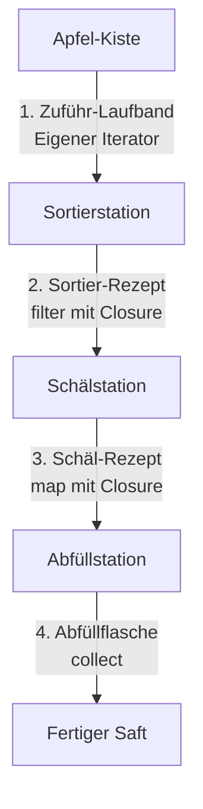

# 📦 Mitmach-Workshop: Phase 8 bildhaft verstehen

Herzlich willkommen zum praktischen Workshop von Phase 8! In diesem Kapitel bringen wir die drei Säulen der funktionalen Programmierung in Rust – **Closures**, **eigene Iteratoren** und **Iterator-Ketten** – zusammen. 

Damit du die Konzepte nicht nur auswendig lernst, sondern wirklich verinnerlichst, starten wir mit einer alltagsnahen Analogie. Danach werfen wir einen Blick auf kompakte Spickzettel (Micro-Learnings), bevor du selbst im Programmier-Workshop und in vier Übungen aktiv wirst.

---

## 🍎 1. Die Analogie: Die automatische Saftpresse-Sortieranlage

Stell dir eine moderne, vollautomatische Saftpresse-Sortieranlage in einer Obstplantage vor. Wie hängen unsere Rust-Konzepte damit zusammen?



### Die Äpfel = Der Datenstrom
Die einzelnen Äpfel (oder Birnen), die verarbeitet werden sollen, sind unsere **Daten**. Sie liegen anfangs ungeordnet in einer Kiste. In Rust entspricht das einer Datenstruktur wie einem `Vec` oder einem Array.

### Das Zuführ-Laufband = Der eigene Iterator
Bevor wir die Äpfel verarbeiten können, müssen sie einzeln nacheinander auf das Band gelegt werden. Das **Zuführ-Laufband** ist unser **eigener Iterator**. Es steuert, *wie* die Äpfel in die Anlage gelangen:
* Bringt es jede Sekunde einen Apfel?
* Sortiert es bereits beim Auflegen faule Früchte aus?
* Wann stoppt das Band? (Wenn keine Äpfel mehr in der Kiste sind = `None`).

### Die Rezepte für die Geräte = Die Closures
Die Maschinen an den Stationen sind flexibel. Sie wissen nicht von selbst, was sie tun sollen. Sie brauchen eine genaue Arbeitsanweisung. Diese Anweisungen sind die **Closures** (anonyme Funktionen).
* Die Sortierstation erhält das Rezept: `|apfel| apfel.ist_reif && apfel.gewicht > 100`.
* Die Schälmaschine erhält das Rezept: `|apfel| apfel.schaelen()`.
Die Closures fangen zudem die Umgebung ein – zum Beispiel könnte das Rezept auf eine Waage zugreifen, die neben der Maschine steht (Capture-Eigenschaften von Closures!).

### Die Sortier-, Schäl- und Entkernschritte = Die Iterator-Ketten (Method Chaining)
Die Anlage besteht aus hintereinandergeschalteten Stationen. Die Früchte wandern von einer Station zur nächsten:
* **`filter`**: Die Sortierstation lässt nur Früchte durch, die das Rezept (die Closure) erlauben. Alle anderen fliegen aus der Bahn.
* **`map`**: Die Schäl- und Entkernstation wandelt das Objekt um. Aus einem rohen Apfel wird ein geschälter Apfel (oder direkt Saft).

### Die Abfüllflasche = `collect()`
**Wichtig:** Solange am Ende des Fließbandes keine Flasche steht, die den Saft auffängt, steht die gesamte Anlage still! In Rust sind Iteratoren *lazy* (faul). Sie tun absolut nichts, bis ein sogenannter *Consumer* (ein Verbraucher) wie `.collect()` oder ein `for`-Loop die Daten aktiv anfordert. Erst das Aufdrehen der Abfüllflasche (`collect`) setzt das Laufband und alle Stationen in Bewegung.

---

## 🧠 2. Micro-Learnings (Spickzettel)

### 📋 Spickzettel 1: Closures und ihre Fn-Traits
Closures fangen Variablen aus ihrer Umgebung ein. Je nachdem, was sie mit diesen Variablen tun, implementieren sie automatisch eines oder mehrere dieser drei Traits:

| Trait | Zugriffstyp | Erklärung | Wie oft aufrufbar? |
| :--- | :--- | :--- | :--- |
| **`Fn`** | `&T` (unveränderlich) | Liest Werte nur. Keine Veränderung der Umgebung. | Beliebig oft |
| **`FnMut`**| `&mut T` (veränderlich) | Darf Werte in der eingefangenen Umgebung verändern. | Beliebig oft |
| **`FnOnce`**| `T` (Ownership) | Konsumiert Werte. Übernimmt die Ownership einer Variable. | **Nur einmal** |

> [!TIP]
> Rust wählt immer den restriktivsten Trait, der gerade noch möglich ist, um maximale Flexibilität zu gewährleisten. Wenn eine Closure als `Fn` arbeiten kann, implementiert sie automatisch auch `FnMut` und `FnOnce`.

---

### 📋 Spickzettel 2: Eigene Iteratoren (Das Counter-Skelett)
Um eine eigene Datenquelle zum Iterator zu machen, musst du das `Iterator`-Trait implementieren. Das erfordert nur eine einzige Methode: `next`.

```rust
struct EinfacherCounter {
    wert: u32,
    max: u32,
}

impl Iterator for EinfacherCounter {
    // Welchen Typ liefert der Iterator zurück?
    type Item = u32;

    // Liefert das nächste Element oder None, wenn das Ende erreicht ist
    fn next(&mut self) -> Option<Self::Item> {
        if self.wert < self.max {
            let aktueller_wert = self.wert;
            self.wert += 1;
            Some(aktueller_wert)
        } else {
            None // Das Band stoppt
        }
    }
}
```

---

### 📋 Spickzettel 3: Wichtige Iterator-Adapter

* **`map`**: Transformiert jedes Element.
  * *Analogie*: Apfel schälen.
  * *Signatur*: `fn map<B, F>(self, f: F) -> Map<Self, F> where F: FnMut(Self::Item) -> B`
* **`filter`**: Behält nur Elemente, für die eine Bedingung zutrifft.
  * *Analogie*: Faule Äpfel aussortieren.
  * *Signatur*: `fn filter<P>(self, predicate: P) -> Filter<Self, P> where P: FnMut(&Self::Item) -> bool`
* **`fold`**: Reduziert alle Elemente auf einen einzigen Endwert (Akkumulator).
  * *Analogie*: Alle Äpfel in einen Topf werfen und zu einem gemeinsamen Mus zerkochen.
  * *Signatur*: `fn fold<B, F>(self, init: B, f: F) -> B where F: FnMut(B, Self::Item) -> B`

---

## 🛠️ 3. Programmier-Workshop: Die Obst-Saftpresse

In diesem Workshop baust du die Steuerung für eine Obst-Saftpresse.
Kopiere das folgende Skelett in deine lokale Entwicklungsumgebung (z. B. in die Datei `src/main.rs` eines neuen Projekts) und ersetze die `todo!()`-Markierungen so, dass das Programm erfolgreich kompiliert und die Tests bestanden werden.

> [!IMPORTANT]
> Versuche, die Aufgaben ohne fremde Hilfe zu lösen. Nutze die Compiler-Fehlermeldungen als Leitfaden!

```rust
#[derive(Debug, PartialEq, Clone)]
enum ObstSorte {
    Apfel,
    Birne,
    Banane,
}

#[derive(Debug, PartialEq, Clone)]
struct Frucht {
    sorte: ObstSorte,
    gewicht: u32, // in Gramm
    ist_reif: bool,
}

#[derive(Debug, PartialEq)]
struct Saft {
    sorte: ObstSorte,
    menge: u32, // in Millilitern (ml)
}

// Unser eigenes Zuführ-Laufband (Iterator)
struct ObstLaufband {
    fruechte: Vec<Frucht>,
}

impl ObstLaufband {
    fn new(fruechte: Vec<Frucht>) -> Self {
        ObstLaufband { fruechte }
    }
}

// Wir implementieren den Iterator für unser Laufband.
// Das Laufband soll die Früchte in *umgekehrter* Reihenfolge ausgeben (von hinten nach vorne).
impl Iterator for ObstLaufband {
    type Item = Frucht;

    fn next(&mut self) -> Option<Self::Item> {
        // HINWEIS: Nutze eine Methode von Vec, die das letzte Element entfernt und zurückgibt.
        todo!("Implementiere die Entnahme der Früchte vom Laufband (Tipp: pop)")
    }
}

// Die eigentliche Verarbeitungsfunktion der Saftpresse
fn presse_saft(laufband: ObstLaufband) -> Vec<Saft> {
    laufband
        // 1. Sortiere unreife Früchte aus
        .filter(|frucht| {
            todo!("Behalte nur reife Früchte")
        })
        // 2. Sortiere zu kleine Früchte aus (Gewicht muss mindestens 100g sein)
        .filter(|frucht| {
            todo!("Behalte nur Früchte mit einem Gewicht >= 100 Gramm")
        })
        // 3. Verarbeite die Frucht zu Saft.
        //    Regel: Ein Apfel ergibt 150ml Saft, eine Birne 120ml und eine Banane 80ml.
        .map(|frucht| {
            let menge = match frucht.sorte {
                ObstSorte::Apfel => todo!("Apfelsaft-Menge"),
                ObstSorte::Birne => todo!("Birnensaft-Menge"),
                ObstSorte::Banane => todo!("Bananensaft-Menge"),
            };
            Saft {
                sorte: frucht.sorte,
                menge,
            }
        })
        // 4. Fülle das Ergebnis ab
        .collect()
}

fn main() {
    let fruechte = vec![
        Frucht { sorte: ObstSorte::Apfel, gewicht: 120, ist_reif: true },   // Sollte gepresst werden
        Frucht { sorte: ObstSorte::Birne, gewicht: 90, ist_reif: true },    // Zu leicht!
        Frucht { sorte: ObstSorte::Banane, gewicht: 150, ist_reif: false }, // Unreif!
        Frucht { sorte: ObstSorte::Birne, gewicht: 130, ist_reif: true },   // Sollte gepresst werden
    ];

    let laufband = ObstLaufband::new(fruechte);
    let saft_flaschen = presse_saft(laufband);

    println!("Gepresste Säfte: {:?}", saft_flaschen);
}

#[cfg(test)]
mod tests {
    use super::*;

    #[test]
    fn test_saftpresse() {
        let fruechte = vec![
            Frucht { sorte: ObstSorte::Apfel, gewicht: 120, ist_reif: true },
            Frucht { sorte: ObstSorte::Birne, gewicht: 80, ist_reif: true }, // Zu leicht
            Frucht { sorte: ObstSorte::Birne, gewicht: 110, ist_reif: true },
            Frucht { sorte: ObstSorte::Banane, gewicht: 130, ist_reif: false }, // Unreif
        ];

        let laufband = ObstLaufband::new(fruechte);
        let ergebnis = presse_saft(laufband);

        // Wegen der umgekehrten Reihenfolge des Laufbands (pop) 
        // kommt die Birne (Index 2) vor dem Apfel (Index 0) an!
        assert_eq!(ergebnis.len(), 2);
        assert_eq!(ergebnis[0], Saft { sorte: ObstSorte::Birne, menge: 120 });
        assert_eq!(ergebnis[1], Saft { sorte: ObstSorte::Apfel, menge: 150 });
    }
}
```

---

## 🏋️ 4. Übungen zum Vertiefen

Erstelle eine neue Rust-Datei oder ein Testmodul und versuche, die folgenden vier Übungen zu lösen. Schreibe die Tests und fülle die `todo!()`-Lücken aus.

### Übung 1 (Leicht): Der Blaubeer-Filter
Schreibe eine Funktion, die eine Liste von Blaubeeren filtert. Es sollen nur Blaubeeren übrig bleiben, die einen bestimmten Mindest-Süßegrad (auf einer Skala von 1 bis 10) überschreiten.

```rust
#[derive(Debug, PartialEq)]
struct Blaubeere {
    suesse_grad: u32,
}

fn filtere_suesse_blaubeeren(blaubeeren: Vec<Blaubeere>, mindest_suesse: u32) -> Vec<Blaubeere> {
    blaubeeren
        .into_iter()
        .filter(|beere| {
            todo!("Prüfe, ob der Süßegrad der Beere größer oder gleich dem Mindest-Süßegrad ist")
        })
        .collect()
}

#[test]
fn test_blaubeer_filter() {
    let beeren = vec![
        Blaubeere { suesse_grad: 3 },
        Blaubeere { suesse_grad: 7 },
        Blaubeere { suesse_grad: 9 },
        Blaubeere { suesse_grad: 5 },
    ];
    let ergebnis = filtere_suesse_blaubeeren(beeren, 6);
    assert_eq!(ergebnis.len(), 2);
    assert_eq!(ergebnis[0].suesse_grad, 7);
    assert_eq!(ergebnis[1].suesse_grad, 9);
}
```

---

### Übung 2 (Mittel): Die zählende Saftpresse (FnMut)
Nutze eine veränderliche Closure (`FnMut`), um beim Filtern einer Liste von Früchten mitzuzählen, wie viele Früchte aussortiert wurden.

```rust
fn zaehle_aussortierte(fruechte: Vec<Frucht>) -> (Vec<Frucht>, u32) {
    let mut aussortiert_counter = 0;
    
    // Die filter-Funktion erwartet eine Closure.
    // Verwende den Counter innerhalb der Closure, um jedes Mal hochzuzählen,
    // wenn eine Frucht NICHT reif ist.
    let reife_fruechte: Vec<Frucht> = fruechte
        .into_iter()
        .filter(|f| {
            if f.ist_reif {
                true
            } else {
                todo!("Erhöhe den Counter und gib false zurück")
            }
        })
        .collect();

    (reife_fruechte, aussortiert_counter)
}

#[test]
fn test_zaehlende_saftpresse() {
    let fruechte = vec![
        Frucht { sorte: ObstSorte::Apfel, gewicht: 120, ist_reif: true },
        Frucht { sorte: ObstSorte::Birne, gewicht: 100, ist_reif: false },
        Frucht { sorte: ObstSorte::Banane, gewicht: 80, ist_reif: true },
        Frucht { sorte: ObstSorte::Apfel, gewicht: 150, ist_reif: false },
    ];
    let (reife, count) = zaehle_aussortierte(fruechte);
    assert_eq!(reife.len(), 2);
    assert_eq!(count, 2);
}
```

---

### Übung 3 (Mittel): Der selektive FruchtKorb-Iterator
Implementiere einen Iterator für einen `FruchtKorb`, der bei jedem Aufruf von `next` nur jede zweite Frucht (also Element 0, 2, 4 usw.) zurückgibt und die dazwischen liegenden überspringt.

```rust
struct FruchtKorb {
    fruechte: Vec<Frucht>,
    aktueller_index: usize,
}

impl FruchtKorb {
    fn new(fruechte: Vec<Frucht>) -> Self {
        FruchtKorb {
            fruechte,
            aktueller_index: 0,
        }
    }
}

impl Iterator for FruchtKorb {
    type Item = Frucht;

    fn next(&mut self) -> Option<Self::Item> {
        if self.aktueller_index < self.fruechte.len() {
            let index = self.aktueller_index;
            // Erhöhe den Index so, dass beim nächsten Aufruf ein Element übersprungen wird
            todo!("Aktualisiere den Index passend");
            Some(self.fruechte[index].clone())
        } else {
            None
        }
    }
}

#[test]
fn test_fruchtkorb_iterator() {
    let fruechte = vec![
        Frucht { sorte: ObstSorte::Apfel, gewicht: 100, ist_reif: true }, // Index 0 (wird geliefert)
        Frucht { sorte: ObstSorte::Birne, gewicht: 110, ist_reif: true }, // Index 1 (wird übersprungen)
        Frucht { sorte: ObstSorte::Banane, gewicht: 120, ist_reif: true }, // Index 2 (wird geliefert)
    ];
    
    let mut korb = FruchtKorb::new(fruechte);
    assert_eq!(korb.next().unwrap().sorte, ObstSorte::Apfel);
    assert_eq!(korb.next().unwrap().sorte, ObstSorte::Banane);
    assert_eq!(korb.next(), None);
}
```

---

### Übung 4 (Schwer): Das Mischen der Säfte (`fold`)
Verwende die Methode `fold`, um eine Liste von Säften zu einer einzigen Saftmischung zu vereinen. Berechne das Gesamtvolumen des gemischten Saftes.

```rust
fn mische_saefte(saefte: Vec<Saft>) -> u32 {
    saefte
        .into_iter()
        // fold nimmt einen Startwert (0 ml) und eine Closure entgegen.
        // Die Closure addiert die menge des aktuellen Safts zum bisherigen Akkumulator.
        .fold(0, |akkumulator, saft| {
            todo!("Addiere die Saftmenge zum Akkumulator")
        })
}

#[test]
fn test_saft_mischung() {
    let saefte = vec![
        Saft { sorte: ObstSorte::Apfel, menge: 150 },
        Saft { sorte: ObstSorte::Birne, menge: 120 },
        Saft { sorte: ObstSorte::Banane, menge: 80 },
    ];
    
    let gesamt_menge = mische_saefte(saefte);
    assert_eq!(gesamt_menge, 350);
}

```

---

## ❓ 5. Quiz: Teste dein Wissen!

Überprüfe, ob du die Kernkonzepte verstanden hast. (Die Antworten findest du ganz unten im Kapitel versteckt).

### Frage 1: Was bedeutet es, dass Iteratoren in Rust "lazy" (faul) sind?
* **A)** Sie verbrauchen beim Erstellen extrem viel Arbeitsspeicher.
* **B)** Sie führen keine Berechnungen durch, bis sie von einer Methode (wie `collect` oder einem Loop) aktiv abgefragt werden.
* **C)** Sie können nur in Threads ausgeführt werden, die eine niedrige Priorität haben.

### Frage 2: Welches Closure-Trait wird benötigt, wenn die Closure eine Variable aus der Umgebung mittels Ownership (`move`) konsumieren muss?
* **A)** `Fn`
* **B)** `FnMut`
* **C)** `FnOnce`

### Frage 3: Was passiert, wenn du bei einer Iterator-Kette das abschließende `.collect()` vergisst?
* **A)** Das Programm kompiliert nicht, weil der Rückgabetyp nicht übereinstimmt (oder eine Warnung wegen eines ungenutzten Typs ausgegeben wird), und es wird kein einziges Element verarbeitet.
* **B)** Rust führt die Kette im Hintergrund asynchron aus.
* **C)** Es kommt zu einem Laufzeitfehler (Panic).

---

<details>
<summary><b>💡 Auflösung des Quiz (Klicke zum Aufklappen)</b></summary>

* **Antwort zu Frage 1:** **B**. Iteratoren tun nichts, solange kein Verbraucher sie antreibt. Das spart Ressourcen!
* **Antwort zu Frage 2:** **C**. Wenn Ownership übernommen wird, kann die Closure nur einmal aufgerufen werden (`FnOnce`), da das eingefangene Objekt danach nicht mehr existiert.
* **Antwort zu Frage 3:** **A**. Die Kette ist ein reiner Bauplan. Ohne `.collect()` (oder einen anderen Consumer) läuft kein Element durch das Band. Rust warnt dich meistens mit: `warning: unused iterators must be zipped, folded or collected`.
</details>
