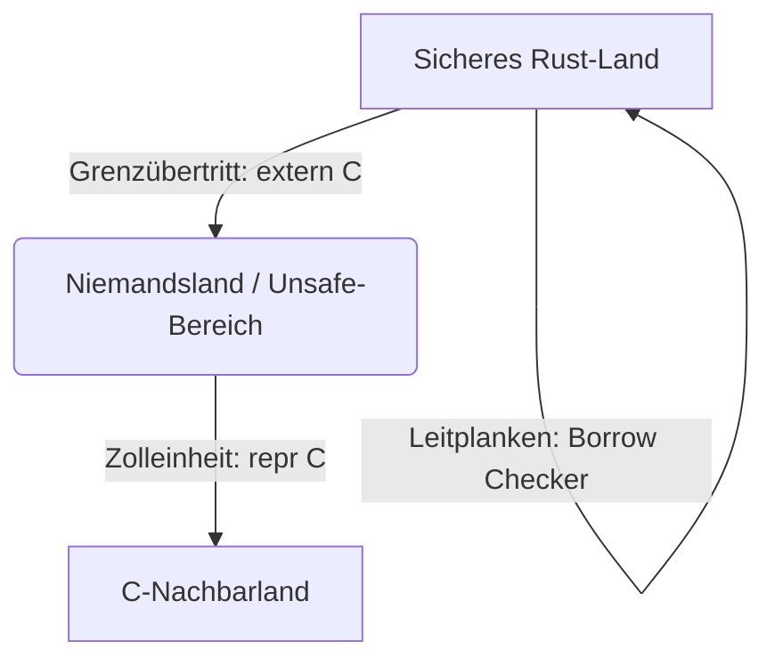

# 📦 Mitmach-Workshop: Phase 9 bildhaft verstehen

Herzlich willkommen zum Mitmach-Workshop für **Phase 9**! In diesem Kapitel beschäftigen wir uns mit den dunkelsten, aber auch mächtigsten Ecken von Rust: **Unsafe Rust**, **rohen Zeigern (Raw Pointers)** und der Zusammenarbeit mit anderen Sprachen über die **Foreign Function Interface (FFI)**-Schnittstelle.

Da diese Konzepte sehr abstrakt sein können, starten wir mit einer alltagsnahen Analogie, werfen einen Blick auf einen schnellen Spickzettel und steigen dann direkt in praktische Programmier-Workshops und Übungen ein.

---

## 1. Die Analogie: Der Grenzübergang

Stell dir vor, du befindest dein Land namens **Rust-Land** in perfekter Ordnung.



### Der normale Inlandsverkehr (Sicheres Rust)
Im Inland von Rust-Land gibt es strenge Gesetze, Leitplanken an allen Straßen und eine allgegenwärtige Polizei (den **Borrow Checker**). Jedes Fahrzeug ist geprüft, und es ist unmöglich, aus Versehen in den Gegenverkehr zu geraten oder eine Klippe hinabzustürzen. Du musst dir keine Sorgen um Geisterfahrer oder kaputte Straßen machen. Das ist **sicheres Rust**.

### Der Grenzübertritt (FFI / `extern "C"`)
Am Rande von Rust-Land liegt die Grenze zum Nachbarland **C-Land**. C-Land hat keine Leitplanken, keine Geschwindigkeitsbegrenzungen und keine Verkehrsregeln. Wenn du dorthin reisen möchtest, musst du über einen offiziellen **Grenzübergang** fahren. Dieser Grenzübergang ist der `extern "C"`-Block. Du meldest an, welche Fahrzeuge (Funktionen) hinüberwechseln dürfen.

### Der kontrollfreie Raum (Unsafe Rust)
Direkt an der Grenze und im Niemandsland zwischen den Ländern befindet sich eine kontrollfreie Zone – eine Offroad-Strecke. Hier gibt es keine Straßenschilder und keine Polizei. Das ist der `unsafe`-Block. Hier darfst du Dinge tun, die im Inland streng verboten sind:
* Auf unbefestigten Wegen fahren (**rohe Zeiger dereferenzieren**).
* Ohne Gurt und Airbag beschleunigen (**Speicher direkt manipulieren**).

Aber Vorsicht: Wenn du hier einen Unfall baust, stürzt das gesamte Programm ab oder deine Daten werden unbemerkt korrumpiert (**Undefined Behavior**). Rust vertraut dir in dieser Zone blind. Du bist als Fahrer selbst dafür verantwortlich, dass nichts passiert.

### Die Zolleinheit und standardisierte Container (`#[repr(C)]`)
Damit die Fracht aus Rust-Land im C-Land überhaupt entladen und verstanden werden kann, darf sie nicht in den speziellen, hochmodernen Kisten von Rust verpackt sein. Sie muss in genormten Containern transportiert werden, die weltweit verstanden werden. Das Attribut `#[repr(C)]` zwingt Rust dazu, das Speicherlayout eines Structs exakt so anzuordnen, wie es der C-Standard ausweist. So weiß der Zoll in C-Land genau, an welcher Stelle im Container welches Byte liegt.

---

## 2. Micro-Learnings: Dein Spickzettel

Hier ist dein kompakter Überblick über die drei Kernkonzepte.

### Rohe Zeiger (Raw Pointers)
Rohe Zeiger sind wie GPS-Koordinaten in der Wüste. Sie zeigen auf eine Speicheradresse, garantieren aber nicht, dass dort wirklich eine Straße existiert.

* **Erstellen (Sicher):**
  Das Erstellen von rohen Zeigern ist in sicherem Rust erlaubt. Du machst es über eine Typkonvertierung von Referenzen:
  ```rust
  let mut zahl = 42;
  let raw_const: *const i32 = &zahl;        // Unveränderlicher roher Zeiger
  let raw_mut: *mut i32 = &mut zahl;       // Veränderlicher roher Zeiger
  ```
* **Dereferenzieren (Unsafe):**
  Um den Wert an der Adresse zu lesen oder zu überschreiben, musst du einen `unsafe`-Block nutzen:
  ```rust
  unsafe {
      println!("Wert: {}", *raw_const);
      *raw_mut = 100;
  }
  ```

### Unsafe-Blöcke
Ein `unsafe`-Block ist kein Freibrief für schlechten Code, sondern ein Versprechen an den Compiler: *"Ich weiß, was ich tue, und übernehme die Verantwortung."*

**Was `unsafe` erlaubt:**
1. Rohe Zeiger dereferenzieren.
2. Unsafe Funktionen oder Methoden aufrufen.
3. Mutable statische Variablen ändern oder lesen.
4. Felder einer `union` lesen.
5. FFI-Funktionen aufrufen.

### `extern "C"`-Blöcke
Um Funktionen aus C-Bibliotheken aufzurufen, deklarierst du sie in einem `extern`-Block. Da Rust nicht prüfen kann, ob die C-Funktion sicher arbeitet, ist ihr Aufruf immer `unsafe`.

```rust
extern "C" {
    // Deklaration der C-Funktion "abs"
    fn abs(input: i32) -> i32;
}
```

---

## 3. Programmier-Workshop: Der eigene Mini-Speicherpuffer (`RawBuffer`)

In diesem Workshop baust du einen rudimentären Speicherpuffer namens `RawBuffer`. Er allokiert Speicher direkt auf dem Heap unter Verwendung von `std::alloc`, schreibt Werte hinein und liest sie über rohe Zeiger wieder aus. Zum Schluss gibt er den Speicher manuell wieder frei.

**Deine Aufgabe:** Fülle die Lücken mit `todo!()` aus, um den Puffer funktionsfähig zu machen!

```rust
use std::alloc::{alloc, dealloc, Layout};
use std::ptr;

/// Ein einfacher, generischer Speicherpuffer, der direkt mit rohem Speicher arbeitet.
pub struct RawBuffer<T> {
    ptr: *mut T,
    capacity: usize,
    layout: Layout,
}

impl<T> RawBuffer<T> {
    /// Erstellt einen neuen Puffer auf dem Heap für die angegebene Anzahl an Elementen.
    pub fn new(capacity: usize) -> Self {
        assert!(capacity > 0, "Kapazität muss größer als 0 sein");
        
        // Berechne das Speicherlayout für den Typ T mit der gegebenen Kapazität
        let layout = Layout::array::<T>(capacity).expect("Ungültiges Speicherlayout");
        
        // Speicher allokieren (gibt einen rohen Zeiger auf u8 zurück)
        let raw_ptr = unsafe { alloc(layout) };
        if raw_ptr.is_null() {
            panic!("Speicherallokation fehlgeschlagen!");
        }
        
        RawBuffer {
            ptr: raw_ptr as *mut T,
            capacity,
            layout,
        }
    }

    /// Schreibt einen Wert an eine bestimmte Index-Position.
    ///
    /// # Safety
    /// Der Index muss kleiner als die Kapazität sein.
    pub fn write(&mut self, index: usize, value: T) {
        assert!(index < self.capacity, "Index außerhalb des Puffers!");
        
        unsafe {
            // 1. Berechne die Zieladresse für den Index (Hinweis: add-Methode auf Zeigern).
            let target_address = todo!("Berechne die Speicheradresse des Elements am Index");
            
            // 2. Schreibe den Wert an diese Speicheradresse (Hinweis: ptr::write).
            todo!("Schreibe den Wert an die berechnete Adresse");
        }
    }

    /// Liest einen Wert von einer bestimmten Index-Position.
    ///
    /// # Safety
    /// Der Index muss kleiner als die Kapazität sein und ein gültiger Wert muss
    /// vorher dorthin geschrieben worden sein.
    pub fn read(&self, index: usize) -> T {
        assert!(index < self.capacity, "Index außerhalb des Puffers!");
        
        unsafe {
            // 1. Berechne die Quelladresse für den Index.
            let source_address = todo!("Berechne die Speicheradresse des Elements am Index");
            
            // 2. Lies den Wert von dieser Speicheradresse (Hinweis: ptr::read) und gib ihn zurück.
            todo!("Lies den Wert an der berechneten Adresse");
        }
    }
}

/// Da wir den Speicher manuell allokiert haben, müssen wir ihn auch manuell wieder freigeben!
impl<T> Drop for RawBuffer<T> {
    fn drop(&mut self) {
        unsafe {
            // Gib den allokierten Speicher wieder frei (Hinweis: dealloc).
            // Beachte, dass dealloc den u8-Zeiger und das Layout benötigt.
            todo!("Implementiere die Speicherfreigabe mit dealloc");
        }
    }
}

#[cfg(test)]
mod tests {
    use super::*;

    #[test]
    fn test_buffer_write_read() {
        let mut buffer = RawBuffer::<i32>::new(5);
        
        // Werte in den Puffer schreiben
        buffer.write(0, 10);
        buffer.write(1, 20);
        buffer.write(4, 100);
        
        // Werte wieder auslesen
        assert_eq!(buffer.read(0), 10);
        assert_eq!(buffer.read(1), 20);
        assert_eq!(buffer.read(4), 100);
    }
}
```

---

## 4. Übungen zum Vertiefen

Versuche, die folgenden vier Übungen zu lösen, indem du die `todo!()`-Lücken in deinem eigenen Projekt ausfüllst.

### Übung 1: Den Spiegel manipulieren (Leicht)
Erstelle einen veränderlichen rohen Zeiger auf eine lokale Variable `x` und verdopple ihren Wert direkt über den Zeiger.

```rust
#[test]
fn test_uebung_1() {
    let mut x = 42;
    
    // 1. Erstelle hier einen veränderlichen rohen Zeiger auf x
    let raw_ptr: *mut i32 = todo!("Referenz in rohen Zeiger casten");
    
    // 2. Ändere den Wert im unsafe-Block über den Zeiger
    unsafe {
        todo!("Den Zeiger dereferenzieren und den Wert mit 2 verdoppeln");
    }
    
    assert_eq!(x, 84);
}
```

---

### Übung 2: Pointer Swap (Mittel)
Schreibe eine Hilfsfunktion, die zwei rohe Zeiger entgegennimmt und deren Werte im Speicher vertauscht. Nutze dazu keine fertigen Standardbibliotheksfunktionen für Swaps, sondern lies und schreibe direkt über die Zeiger.

```rust
/// Vertauscht die Werte hinter den beiden Zeigern.
/// 
/// # Safety
/// Beide Zeiger müssen auf gültigen Speicher zeigen und dürfen nicht Null sein.
pub unsafe fn raw_swap<T>(a: *mut T, b: *mut T) {
    // Tipp: Nutze ptr::read und ptr::write, um Werte zu kopieren, ohne die ownership-Regeln zu brechen.
    todo!("Lies die Werte temporär aus und schreibe sie über Kreuz wieder zurück");
}

#[test]
fn test_uebung_2() {
    let mut val1 = 100;
    let mut val2 = 999;
    
    unsafe {
        raw_swap(&mut val1, &mut val2);
    }
    
    assert_eq!(val1, 999);
    assert_eq!(val2, 100);
}
```

---

### Übung 3: FFI mit der C-Standardbibliothek (Schwer - Teil 1)
Binde die Funktion `abs` (berechnet den Betrag einer Ganzzahl) aus der C-Standardbibliothek an und schreibe einen sicheren Rust-Wrapper darum.

```rust
// 1. Deklariere die externe C-Funktion abs
extern "C" {
    fn abs(i: i32) -> i32;
}

/// Berechnet den Absolutwert einer Zahl sicher über FFI.
pub fn safe_abs(x: i32) -> i32 {
    // 2. Rufe die FFI-Funktion abs in einem unsafe Block auf
    todo!("Rufe die C-Funktion abs auf und gib das Ergebnis zurück")
}

#[test]
fn test_uebung_3() {
    assert_eq!(safe_abs(-5), 5);
    assert_eq!(safe_abs(42), 42);
    assert_eq!(safe_abs(0), 0);
}
```

---

### Übung 4: Sichere FFI-String-Länge (Schwer - Teil 2)
Binde die C-Funktion `strlen` (ermittelt die Länge eines C-Strings) an. Konvertiere einen normalen Rust-`&str` in einen FFI-kompatiblen C-String und ermittle dessen Länge über die FFI-Funktion.

```rust
use std::ffi::CString;
use std::os::raw::c_char;

// 1. Deklariere die FFI-Funktion strlen
extern "C" {
    fn strlen(s: *const c_char) -> usize;
}

/// Ermittelt die Länge eines Rust-Strings unter Verwendung von C-FFI strlen.
pub fn safe_strlen(s: &str) -> usize {
    // 2. Erstelle einen CString aus dem Rust-String.
    // Ein CString garantiert, dass der String mit einem Null-Byte '\0' endet.
    let c_str = CString::new(s).expect("String darf keine Null-Bytes enthalten");
    
    // 3. Rufe strlen mit dem rohen Zeiger des CStrings auf (c_str.as_ptr())
    unsafe {
        todo!("Rufe strlen mit dem Zeiger von c_str auf")
    }
}

#[test]
fn test_uebung_4() {
    assert_eq!(safe_strlen("Hallo Rust"), 10);
    assert_eq!(safe_strlen(""), 0);
}
```

---

## 5. Abschluss-Quiz

Teste dein Wissen! Versuche, die Fragen im Kopf zu beantworten, und lies dir danach die Erläuterungen durch.

### Frage 1
**Was passiert, wenn du einen ungültigen rohen Zeiger dereferenzierst?**
* A) Der Compiler bricht mit einem Fehler ab.
* B) Das Programm stürzt garantiert sofort ab.
* C) Es entsteht Undefined Behavior (undefiniertes Verhalten) – es kann abstürzen, falsche Daten liefern oder unbemerkt weiterlaufen.

### Frage 2
**Hebt ein `unsafe`-Block den Borrow Checker für das gesamte darin enthaltene Programm auf?**
* A) Ja, innerhalb von `unsafe` gelten keinerlei Typ- und Ausleihprüfungen mehr.
* B) Nein, normale Rust-Variablen und Referenzen unterliegen auch im `unsafe`-Block den üblichen Prüfungen des Borrow Checkers. Nur bestimmte zusätzliche "Superkräfte" werden freigeschaltet.
* C) Ja, aber nur für mutable Variablen.

### Frage 3
**Warum müssen wir Structs, die wir an C-Funktionen übergeben, mit `#[repr(C)]` auszeichnen?**
* A) Weil C-Code sonst keine Rust-Funktionen aufrufen kann.
* B) Um Rust anzuweisen, das Speicherlayout exakt so anzuordnen, wie es C erwartet, da Rust die Felder sonst zur Optimierung umsortieren darf.
* C) Damit das Struct automatisch auf dem Heap allokiert wird.

---

### Auflösung und Erläuterungen

* **Frage 1: Antwort C**
  Der Compiler kann Fehler zur Laufzeit bei rohen Zeigern nicht vorhersagen. Wenn der Zeiger ungültig ist, kommt es zu *Undefined Behavior*. Das Programm kann abstürzen (z. B. Segfault), aber es kann auch unbemerkt falschen Speicher auslesen, was zu schwer auffindbaren Sicherheitslücken führt.
* **Frage 2: Antwort B**
  Das ist ein häufiges Missverständnis! Der Borrow Checker läuft auch innerhalb von `unsafe`-Blöcken unverändert weiter. Du kannst dort beispielsweise nicht zwei veränderliche *Referenzen* (`&mut`) auf dieselbe Variable erstellen. Der `unsafe`-Block erlaubt dir lediglich die fünf oben gelisteten Aktionen (wie die Dereferenzierung von *rohen Zeigern*, auf die der Borrow Checker nicht reagiert).
* **Frage 3: Antwort B**
  Rust optimiert das Speicherlayout von Structs standardmäßig (z. B. um Polster-Bytes zu minimieren oder Felder umzusortieren). C-Compiler tun dies nach festen, standardisierten Regeln. Mit `#[repr(C)]` zwingst du Rust, das Layout kompatibel zu C zu machen, damit die Speicheradressen der Felder übereinstimmen.
