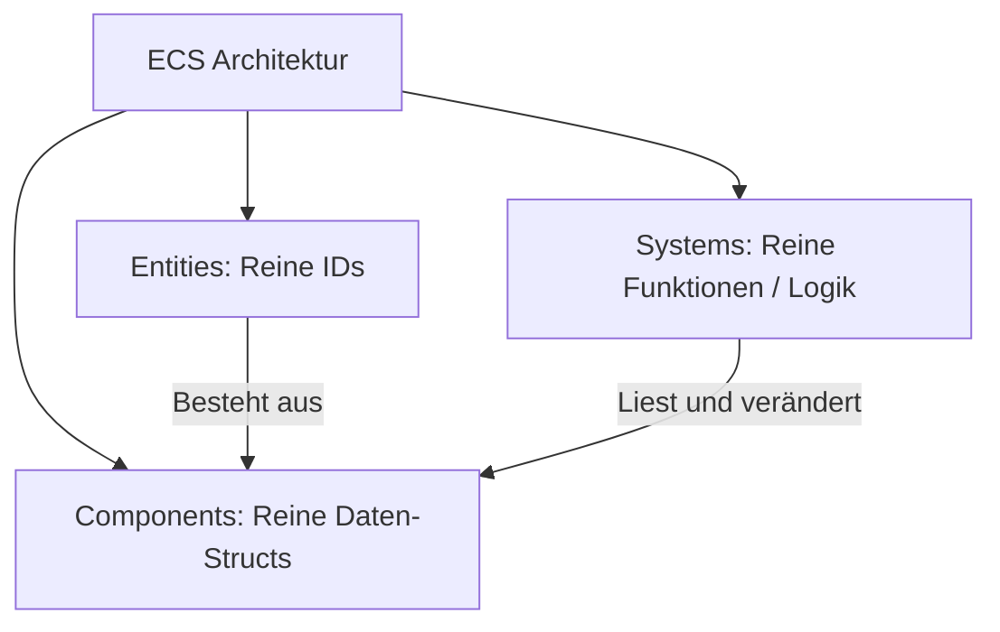

# 🎮 Spieleentwicklung & Grafik (Bevy & WGPU)

Spiele-Entwicklung gehört zu den anspruchsvollsten Disziplinen der Informatik. Rust hat sich durch seine kompromisslose Leistung und Speichersicherheit als traumhafte Sprache für moderne Game Engines etabliert.

In diesem Kapitel lernen wir das **ECS-Muster (Entity Component System)** mit der **Bevy Engine** kennen und schauen uns an, wie **wgpu** hardware-beschleunigte 3D-Grafik auf der GPU rendert.

---

## 🧠 Theorie: Was ist ein Entity Component System (ECS)?

Klassische objektorientierte Spiele-Engines nutzen Vererbung (`GameObject -> Actor -> Player`). Das führt bei komplexen Spielen schnell zu unübersichtlichen Klassenhierarchien und schlechter CPU-Cache-Ausnutzung.

Bevy nutzt das moderne **ECS-Paradigma**:



1. **Entity:** Eine einfache ID (z. B. Entity #42). Besitzt von sich aus keinen Code.
2. **Component:** Reine Datenstrukturen (z. B. `Position { x: 10.0, y: 5.0 }` oder `Health(100)`), die einer Entity angeheftet werden.
3. **System:** Funktionen, die über alle Entities iterieren, welche bestimmte Components besitzen (z. B. "Bewege alle Entities, die `Position` und `Geschwindigkeit` haben").

---

## 🛠️ Praxis: Ein Mini-Spiel mit Bevy bauen

### 📦 `Cargo.toml`:
```toml
[dependencies]
bevy = "0.13"
```

### Der Code (`src/main.rs`):
```rust
use bevy::prelude::*;

// 1. COMPONENT DEFINITIONEN (Daten)
#[derive(Component)]
struct Spieler {
    name: String,
}

#[derive(Component)]
struct Position {
    x: f32,
    y: f32,
}

#[derive(Component)]
struct Geschwindigkeit {
    vx: f32,
    vy: f32,
}

fn main() {
    App::new()
        .add_plugins(DefaultPlugins) // Bevy Standard-Plugins (Fenster, Audio, Rendering)
        .add_systems(Startup, setup_spiel) // Wird genau einmal beim Start ausgeführt
        .add_systems(Update, (bewegung_system, position_anzeigen_system)) // Läuft in jedem Frame (60 FPS)
        .run();
}

// 2. STARTUP SYSTEM: Spawnt Entitäten in die Spielwelt
fn setup_spiel(mut commands: Commands) {
    println!("Spielewelt wird initialisiert...");

    // Erzeuge eine Spieler-Entität mit Komponenten
    commands.spawn((
        Spieler { name: "Held".to_string() },
        Position { x: 0.0, y: 0.0 },
        Geschwindigkeit { vx: 1.5, vy: 0.5 },
    ));
}

// 3. UPDATE SYSTEM: Bewegungslogik
// Bevy führt dieses System automatisch aus und injiziert nur die Entities, 
// die sowohl Position als auch Geschwindigkeit haben!
fn bewegung_system(mut query: Query<(&mut Position, &Geschwindigkeit)>) {
    for (mut pos, geschw) in &mut query {
        pos.x += geschw.vx;
        pos.y += geschw.vy;
    }
}

// 4. UPDATE SYSTEM: Positionsausgabe
fn position_anzeigen_system(query: Query<(&Spieler, &Position)>) {
    for (spieler, pos) in &query {
        println!("Spieler {} steht bei ({:.1}, {:.1})", spieler.name, pos.x, pos.y);
    }
}
```

---

## 🛠️ Hardware-Grafik mit `wgpu`

Unter der Haube nutzt Bevy das Crate **`wgpu`**. `wgpu` ist die Rust-Implementierung des neuen **WebGPU-Standards**. 

Es stellt eine einheitliche, sichere Schicht bereit, um direkt mit modernen Grafik-APIs der Grafikkarte zu kommunizieren:
* **Vulkan** (Linux / Android / Windows)
* **Metal** (macOS / iOS)
* **DirectX 12** (Windows)
* **WebGPU** (Webbrowser)

---

## 🛠️ Praxis-Aufgabe

### Aufgabe: Gesundheitssystem hinzufügen
Erstelle ein neues Component `Health(i32)` und ein System, das bei jeder Entity mit `Health` den Wert pro Frame um 1 reduziert.

```rust
#[derive(Component)]
struct Health(i32);

// todo: Schreibe ein Update-System 'schaden_system', das über mut Health iteriert!
fn schaden_system(mut query: Query<&mut Health>) {
    /* for mut health in &mut query { health.0 -= 1; } */
}
```

---

## 💡 Zusammenfassung

| ECS Begriff | Rolle | Analogie |
| :--- | :--- | :--- |
| **Entity** | Objekt-Identifikator | Eine leere Marionette. |
| **Component** | Eigenschaft / Daten | Kleidung, Gewicht oder Waffen, die man der Marionette anzieht. |
| **System** | Logik / Verhalten | Der Puppenspieler, der alle Marionetten mit Schwertern bewegen lässt. |
