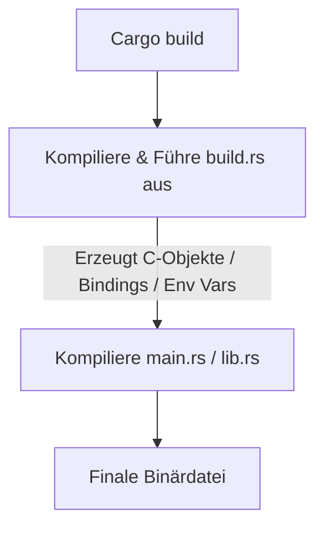

# ⚙️ Build-Skripte (`build.rs`) & C/C++-Integration

Manchmal reicht reiner Rust-Code nicht aus. Vielleicht möchtest du eine bestehende C-Bibliothek nutzen, C-Code direkt beim Bauen mitkompilieren oder vor der Kompilierung automatisch Code generieren.

In diesem Kapitel lernen wir das mächtige Build-System-Feature von Cargo kennen: das Skript **`build.rs`**.

---

## 🧠 Theorie: Was ist `build.rs`?

Wenn Cargo im Stammverzeichnis deines Crates eine Datei namens `build.rs` findet, führt es diese Datei **vor** der eigentlichen Kompilierung deines Projekts auf dem Host-System aus.



### Typische Anwendungsfälle für `build.rs`:
1. **C/C++ Code kompilieren:** Vorhandene C-Dateien automatisch über den System-C-Compiler bauen und einlinken.
2. **FFI Bindings automatisch generieren:** Mit Werkzeugen wie `bindgen` C-Header-Dateien (`.h`) in Rust-Funktionsdeklarationen umwandeln.
3. **Umgebungsvariablen oder Code generieren:** Z. B. die Git-Commit-Hash oder Build-Zeitstempel einbinden.

---

## 🛠️ Praxis: C-Code automatisch mit dem `cc`-Crate kompilieren

Stell dir vor, du hast eine legacy C-Datei `src/rechner.c`, die du in deinem Rust-Projekt nutzen möchtest.

### 1. `Cargo.toml` anpassen:
```toml
[package]
name = "c_integration_demo"
version = "0.1.0"
edition = "2021"

# Das cc-Crate ist die Standardbibliothek zum Kompilieren von C-Code in build.rs
[build-dependencies]
cc = "1.0"
```

### 2. Das C-Skript (`src/rechner.c`):
```c
int dreifache(int n) {
    return n * 3;
}
```

### 3. Das Build-Skript (`build.rs` im Projektstammverzeichnis):
```rust
fn main() {
    // Kompiliere rechner.c mit dem System-C-Compiler zu einer statischen Bibliothek
    cc::Build::new()
        .file("src/rechner.c")
        .compile("rechner"); // Name der generierten lib (librechner.a)

    // Teilt Cargo mit, dass build.rs nur neu ausgeführt werden muss, 
    // wenn sich src/rechner.c ändert
    println!("cargo:rerun-if-changed=src/rechner.c");
}
```

### 4. Die C-Funktion in Rust aufrufen (`src/main.rs`):
```rust
extern "C" {
    // Deklaration der C-Funktion
    fn dreifache(n: i32) -> i32;
}

fn main() {
    let wert = 14;
    let ergebnis = unsafe { dreifache(wert) };
    println!("Das Dreifache von {} ist {}", wert, ergebnis);
}
```

---

## 🛠️ Automatische Bindings mit `bindgen`

Manuelle `extern "C"`-Deklarationen für große C-Header sind fehleranfällig. Das Werkzeug **`bindgen`** liest eine `.h`-Datei und generiert automatisch 100% korrekte Rust-FFI-Bindings!

### In `build.rs`:
```rust
// Beispiel für automatische Bindgen-Generierung (Pseudocode-Auszug)
fn generate_bindings() {
    let bindings = bindgen::Builder::default()
        .header("src/header.h")
        .parse_callbacks(Box::new(bindgen::CargoCallbacks::new()))
        .generate()
        .expect("Konnte Bindings nicht generieren");

    let out_path = std::path::PathBuf::from(std::env::var("OUT_DIR").unwrap());
    bindings
        .write_to_file(out_path.join("bindings.rs"))
        .expect("Konnte bindings.rs nicht schreiben");
}
```

---

## 🛠️ Praxis-Aufgabe

### Aufgabe: Umgebungsvariablen im Build-Skript setzen
Mit Spezialanweisungen über `println!("cargo:...")` kannst du dem Haupt-Build Umgebungsvariablen übergeben.

```rust
// build.rs
fn main() {
    // todo: Sende eine Anweisung an Cargo, um eine Umgebungsvariable "BUILD_VERSION" mit dem Wert "1.0.0" zu setzen.
    // Syntaktischer Hinweis: println!("cargo:rustc-env=VARIABLE=WERT");
}
```

Im Hauptprogramm (`src/main.rs`) kannst du diese Variable dann mit dem `env!`-Makro abfragen:
```rust
fn main() {
    let version = env!("BUILD_VERSION");
    println!("Version: {}", version);
}
```

---

## 💡 Zusammenfassung

| Cargo-Befehl in `build.rs` | Wirkung |
| :--- | :--- |
| `println!("cargo:rerun-if-changed=FILE")` | Führt `build.rs` nur neu aus, wenn `FILE` geändert wurde. |
| `println!("cargo:rustc-link-lib=foo")` | Linkt gegen die Systembibliothek `libfoo`. |
| `println!("cargo:rustc-env=VAR=VAL")` | Setzt die Umgebungsvariable `VAR` für das `env!`-Makro. |
| `cc::Build::new()` | Hilfsklasse zum Kompilieren von C/C++-Dateien. |
