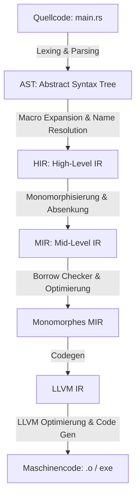

# ⚙️ Die Rust-Compiler-Pipeline: Von Code zu LLVM

Wenn du in Rust ein Programm schreibst und `cargo build` tippst, passiert Magie. Fast augenblicklich verwandelt sich dein menschenlesbarer Text in blitzschnellen, sicheren Maschinencode. 

Doch was genau passiert in dieser "Blackbox" namens `rustc` (dem Rust-Compiler)? Wie arbeitet er mit **LLVM** zusammen, dem modernen Industriestandard für Compiler-Backends? 

In diesem Kapitel werfen wir einen Blick unter die Haube und begleiten deinen Quellcode auf seiner Reise durch die verschiedenen Übersetzungsphasen bis hin zur fertigen Maschine.

---

## 🧠 Theorie: Die Stufen der Verwandlung

Der Rust-Compiler übersetzt deinen Code nicht in einem einzigen, riesigen Schritt. Stattdessen nutzt er eine Pipeline aus mehreren **Zwischenrepräsentationen (Intermediate Representations, IR)**. Jede Stufe hat eine spezielle Aufgabe.

### Die Analogie: Der Bau eines Fertighauses

Stell dir den Compilerbau wie den Bau eines modernen Fertighauses vor:
1. **Der Text** ist deine handgezeichnete Skizze (Quellcode).
2. **Der AST** ist die professionelle CAD-Zeichnung des Architekten (Struktur).
3. **Das HIR** ist der detaillierte Bauplan mit Elektro- und Wasseranschlüssen (Typen und Gültigkeit).
4. **Das MIR** ist die Schritt-für-Schritt-Anleitung für die Fabrik (Borrow Checker und Kontrollfluss).
5. **LLVM IR** ist die standardisierte Sprache der Fertigungsroboter (Optimierung).
6. **Maschinencode** ist das fertige, bezugsfertige Haus (Binärdatei).

---

### Die Phasen der Pipeline im Detail



#### 1. Lexing, Parsing und der AST (Abstract Syntax Tree)
Zuerst liest der Compiler den Text deiner `.rs`-Datei.
* **Lexer:** Zerlegt den Text in sinnvolle Token (z. B. `let`, `x`, `=`, `5`, `;`).
* **Parser:** Baut aus diesen Tokens eine Baumstruktur auf, den **AST**. Dieser repräsentiert die grammatikalische Struktur deines Programms. In dieser Phase werden auch Makros (wie `println!`) expandiert.

#### 2. Das HIR (High-Level Intermediate Representation)
Der AST ist noch sehr nah am geschriebenen Code. Der Compiler übersetzt ihn nun in das **HIR**.
* Das HIR bereinigt den Code von syntaktischen Feinheiten.
* In dieser Phase finden die **Namensauflösung** (welche Variable gehört zu welcher Deklaration?) und die **Typprüfung (Type Checking)** statt. Hier wird sichergestellt, dass du nicht versuchst, einen Text zu einer Zahl zu addieren.

#### 3. Das MIR (Mid-Level Intermediate Representation) – Der Borrow Checker
Das HIR wird weiter vereinfacht und in das **MIR** übersetzt. Das MIR ist eine extrem vereinfachte, kontrollflussbasierte Darstellung. Es gibt keine Schleifen (`for`, `loop`) mehr – alles wird auf einfache Sprünge (`goto`) und Bedingungen reduziert.
* **Das Reich des Borrow Checkers:** Weil das MIR so simpel und strukturiert ist, führt Rust hier die berühmte **Lebensdauer- und Ownership-Prüfung** durch. Der Borrow Checker analysiert im MIR exakt, wann Variablen erstellt, ausgeliehen und wieder freigegeben (gedroppt) werden.
* **Monomorphisierung:** Wenn du Generics verwendest (z. B. `Option<T>`), erzeugt der Compiler im MIR für jeden konkret genutzten Typ eine eigene Kopie des Codes (z. B. eine für `Option<i32>` und eine für `Option<String>`).

#### 4. Die Brücke zu LLVM: LLVM IR
Sobald der Borrow Checker grünes Licht gibt, übersetzt `rustc` das optimierte MIR in die **LLVM IR (Intermediate Representation)**.
* LLVM IR sieht aus wie eine universelle, plattformunabhängige Assemblersprache.
* Sie beschreibt Variablen als unendlich viele virtuelle Register.
* **Warum LLVM?** LLVM (Low Level Virtual Machine) ist ein extrem ausgereiftes Compiler-Framework. Es nimmt `rustc` die Arbeit ab, Code für hunderte verschiedene Prozessoren (Intel, AMD, ARM, Apple Silicon, WASM) optimieren zu müssen.

#### 5. Das Kraftpaket: LLVM-Optimierung und Maschinencode
LLVM nimmt die LLVM IR entgegen und wirft seine weltklasse Optimierungs-Engines an:
* **Dead Code Elimination:** Code, der niemals ausgeführt wird, fliegt raus.
* **Inlining:** Kleine Funktionen werden direkt an der Aufrufstelle eingesetzt, um den Overhead des Funktionsaufrufs zu sparen.
* **Loop Unrolling:** Schleifen werden entrollt, um CPU-Verzweigungen zu reduzieren.
* Am Ende übersetzt LLVM die optimierte IR in echten, physikalischen **Maschinencode** (z. B. x86-64- oder ARM-Assembler) und schreibt ihn in eine Objektdatei. Der Linker verbindet diese schließlich mit Bibliotheken zu deiner fertigen Binärdatei.

---

## 🛠️ Praxis-Aufgaben & Experimente

Da wir die Zwischenschritte des Compilers nicht blind glauben müssen, können wir sie uns selbst anzeigen lassen!

### Aufgabe 1: Makros expandieren und AST sehen
Erstelle eine einfache Rust-Datei `main.rs`:

```rust
fn main() {
    println!("Hallo, Compiler!");
}
```

Führe im Terminal folgenden Befehl aus, um zu sehen, wie das Programm nach der Makro-Expansion aussieht (also der Übergang vom AST zum HIR):

```bash
cargo rustc -- -Z unstable-options --pretty=expanded
```
*(Hinweis: Dieser Befehl benötigt den Nightly-Compiler. Alternativ kannst du im [Rust Playground](https://play.rust-lang.org/) oben rechts auf "MIRI" oder "LLVM IR / MIR" klicken!)*

**Deine Frage zum Nachdenken:** Wie viel Code generiert das einfache Makro `println!` im Hintergrund tatsächlich?

### Aufgabe 2: Das MIR ausgeben lassen
Lass uns das MIR für eine einfache Additionsfunktion generieren.

```rust
fn addieren(a: i32, b: i32) -> i32 {
    a + b
}
```

Verwende im Playground die Option **MIR** oder tippe lokal:

```bash
cargo rustc -- --emit=mir
```

Suche in der generierten `.mir`-Datei nach der Funktion `addieren`. Sieh dir die grundlegenden Blöcke (`bb0`, `bb1`) und die Zuweisungen an. 

**Deine Aufgabe:** Finde im generierten MIR heraus, wo die Werte an temporäre Variablen (oft gekennzeichnet mit `_1`, `_2` oder `_0` für den Rückgabewert) zugewiesen werden.

---

## 🚀 Compiler-Experimente

### Experiment: LLVM-Optimierung sichtbar machen
LLVM ist berühmt für seine aggressive Optimierung. Schau dir diese Funktion an:

```rust
pub fn berechne() -> i32 {
    let mut summe = 0;
    for i in 0..100 {
        summe += i;
    }
    summe
}
```

Wenn du diesen Code ohne Optimierung übersetzt, baut der Compiler eine echte Schleife im Maschinencode. Wenn du ihn jedoch im Release-Modus übersetzt, passiert folgendes:

1. **Erzeuge LLVM IR:**
   ```bash
   cargo rustc --release -- --emit=llvm-ir
   ```
2. Öffne die `.ll`-Datei im Ordner `target/release/deps/`.
3. Du wirst feststellen: Die Schleife ist komplett verschwunden! LLVM hat die Summe von 0 bis 99 bereits zur Compilezeit berechnet und gibt einfach nur die fertige Konstante `4950` zurück. Das nennt man **Constant Folding** (Konstantenfaltung).

---

## 💡 Zusammenfassung

| Stufe | Wer verarbeitet sie? | Hauptaufgabe |
| :--- | :--- | :--- |
| **Quellcode** | Entwickler | Menschenlesbare Logik schreiben. |
| **AST** | Parser | Syntaktische Struktur prüfen, Makros expandieren. |
| **HIR** | Typ-Checker | Typen prüfen, Variablen zuordnen. |
| **MIR** | Borrow Checker | Gültigkeit von Referenzen mathematisch beweisen. |
| **LLVM IR** | Code-Generator | Plattformunabhängige Zwischenstufe erzeugen. |
| **Maschine** | LLVM | Aggressive Optimierungen durchführen, CPU-Befehle schreiben. |

---

## 📚 Links
* [The Rustc Dev Guide (Englisch)](https://rustc-dev-guide.rust-lang.org/) – Die offizielle Dokumentation für alle, die am Rust-Compiler mitarbeiten wollen.
* [Rust Playground](https://play.rust-lang.org/) – Der einfachste Weg, um mit einem Klick MIR, LLVM IR und Assemblercode zu erzeugen.
* [LLVM Project Homepage](https://llvm.org/) – Hintergrundinformationen zum LLVM-Compiler-Framework.
