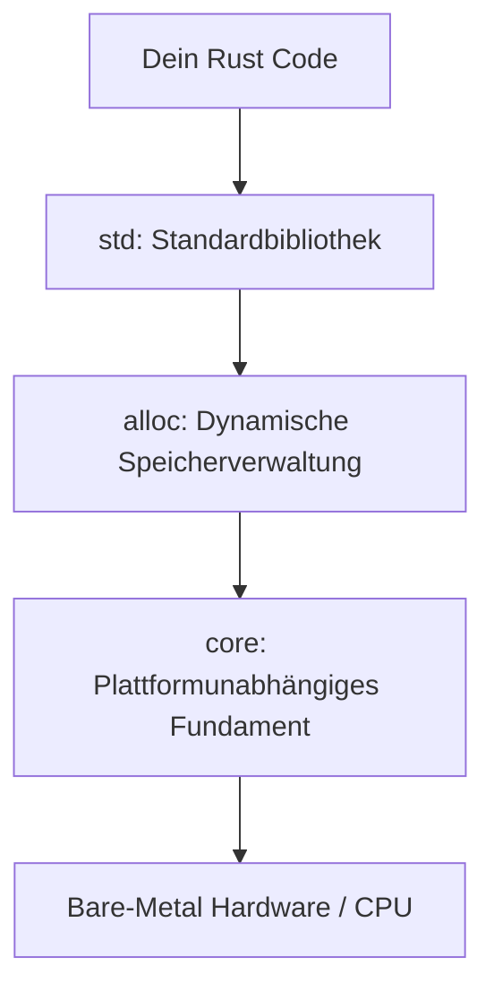

# 📟 Bare-Metal & Embedded Rust (`no_std`)

In der klassischen Programmierung verlassen wir uns auf das Betriebssystem: Es verwaltet Speicher, stellt Dateien bereit und fängt Abstürze ab. Doch was ist, wenn du auf einem Mikrocontroller (z. B. ARM Cortex-M, ESP32) programmierst oder deinen eigenen Betriebssystem-Kernel schreibst? Dort gibt es kein Betriebssystem und keine Standardbibliothek!

In diesem Kapitel lernst du, wie du Rust im **`no_std`**-Modus betreibst und direkt auf nackter Hardware (Bare-Metal) programmierst.

---

## 🧠 Theorie: `std` vs. `core`

Die Rust-Standardbibliothek besteht aus mehreren Schichten:



* **`core`**: Die kleinste, reine Plattformunabhängigkeit. Enthält Typen wie `Option`, `Result`, `i32`, `slice` und grundlegende Operationen. Benötigt **kein** Betriebssystem und keine Allokations-Engine!
* **`alloc`**: Stellt dynamische Heap-Typen bereit (`Vec`, `String`, `Box`). Benötigt einen Speicherallokator.
* **`std`**: Die vollständige Bibliothek (Dateien, Threads, Netzwerke, I/O). Benötigt ein Betriebssystem.

Wenn du `#![no_std]` am Anfang deiner Datei deklarierst, deaktivierst du `std`. Dein Code greift nur noch auf `core` zu.

---

## 🛠️ Praxis: Eine Bare-Metal-Anwendung aufbauen

### 1. Das Grundgerüst (`main.rs`)

Wenn wir kein Betriebssystem haben, gibt es auch keine klassische `main`-Funktion, die vom Betriebssystem aufgerufen wird. Wir müssen daher `#[no_main]` nutzen und unseren eigenen Panic-Handler definieren:

```rust
// Deaktiviert die Standardbibliothek
#![no_std]
// Deaktiviert den normalen Laufzeit-Einstiegspunkt
#![no_main]

use core::panic::PanicInfo;

// 1. Eigener Panic-Handler
// Wenn im Bare-Metal-Code ein Panic auftritt, weiß die CPU nicht, wo sie hin soll.
// Dieser Handler definiert das Verhalten (z. B. unendliche Schleife oder Reset).
#[panic_handler]
fn panic(_info: &PanicInfo) -> ! {
    loop {
        // Unendliche Schleife: Friert die CPU im Fehlerfall sicher ein
    }
}

// 2. Eigener Einstiegspunkt (Reset Handler)
// #[no_mangle] stellt sicher, dass der Linker den Symbolnamen '_start' findet
#[no_mangle]
pub extern "C" fn _start() -> ! {
    // Hier startet die Ausführung direkt nach dem Einschalten der CPU!
    let x = 42;
    let y = 10;
    let _ergebnis = x + y;

    loop {
        // Die Hauptschleife der Hardware (Embedded Event Loop)
    }
}
```

---

## 🛠️ Direkter Speicherzugriff (MMIO - Memory Mapped I/O)

Auf Mikrocontrollern werden Peripheriegeräte (z. B. LEDs, Sensoren, Pins) über bestimmte Speicheradressen gesteuert. Wenn wir ein Bit an Adresse `0x40021018` auf `1` setzen, leuchtet eine LED.

Da der Compiler Lese- und Schreibzugriffe auf Speicheradressen wegoptimieren könnte (weil er nicht weiß, dass an der Adresse eine Hardware hängt), müssen wir **`volatile`** Zugriffe nutzen:

```rust
use core::ptr;

pub fn led_einschalten() {
    // Adresse des GPIO-Registers für die LED
    let gpio_port_b = 0x4002_1018 as *mut u32;

    unsafe {
        // Liest den aktuellen Wert des Registers
        let aktueller_wert = ptr::read_volatile(gpio_port_b);
        
        // Setzt das 5. Bit auf 1 (LED an)
        ptr::write_volatile(gpio_port_b, aktueller_wert | (1 << 5));
    }
}
```

---

## 🛠️ Praxis-Aufgabe

### Aufgabe: Ein eigener Panic-Handler mit Zähler
Stell dir vor, du möchtest im Panic-Handler zählen, wie oft die Hardware zurückgesetzt werden musste.

```rust
#![no_std]
#![no_main]

use core::panic::PanicInfo;

static mut PANIC_COUNT: u32 = 0;

#[panic_handler]
fn panic(_info: &PanicInfo) -> ! {
    unsafe {
        // todo: Erhöhe den PANIC_COUNT um 1
        /* PANIC_COUNT += 1; */
    }

    loop {}
}
```

---

## 💡 Zusammenfassung

| Konzept | Bedeutung |
| :--- | :--- |
| `#![no_std]` | Schaltet `std` aus; nutzt nur die Betriebssystem-freie `core`-Bibliothek. |
| `#![no_main]` | Deaktiviert den C-Runtime-Einstiegspunkt; verlangt eine eigene `_start`-Funktion. |
| `#[panic_handler]` | Definiert, was bei einem Absturz ohne Betriebssystem passiert. |
| `read_volatile` / `write_volatile` | Erzwingt Speicherzugriffe für Hardware-Register (MMIO). |
