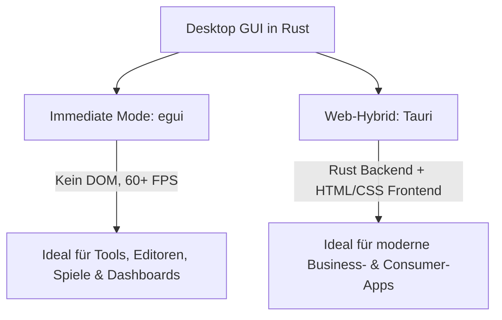

# 🖥️ GUI-Entwicklung: Benutzeroberflächen mit Tauri & egui

Möchtest du grafische Desktop-Anwendungen (GUIs) für Windows, macOS und Linux in Rust bauen? Rust hat sich zu einer hervorragenden Sprache für Benutzeroberflächen entwickelt.

In diesem Kapitel lernen wir die zwei führenden Ansätze kennen: **`egui`** (Leichtgewichtige Immediate-Mode GUI in reinem Rust) und **`Tauri`** (Verbindung von Rust mit moderner Web-Technologie als schlanker Electron-Konkurrent).

---

## 🧠 Theorie: Die zwei GUI-Paradigmen



### 1. Immediate Mode GUI (`egui`)
Im *Immediate Mode* wird die komplette Benutzeroberfläche in jedem Frame neu gezeichnet (wie bei einem Videospiel).
* **Vorteil:** Kein komplexes Zustandsmanagement (kein DOM, keine Event-Listener). Extrem leichtgewichtig, blitzschnell und 100 % in Rust geschrieben.
* **Einsatz:** Werkzeuge, Audio-Visualisierer, Spiele-Editoren.

### 2. Web-Hybrid GUI (`Tauri`)
Tauri nutzt das Betriebssystem-eigene WebView (z. B. WebKit unter macOS/Linux, WebView2 unter Windows) für die Anzeige. Du schreibst das Frontend mit HTML, CSS und TypeScript (z. B. mit React, Vue oder Svelte) und das hochperformante Backend in **Rust**.
* **Vorteil:** Wunderschöne, moderne UIs bei winzigen Dateigrößen (oft unter 5 MB!) und minimalem RAM-Verbrauch (im Vergleich zu Electron).

---

## 🛠️ Praxis 1: Eine Immediate-Mode GUI mit `egui`

### 📦 `Cargo.toml`:
```toml
[dependencies]
eframe = "0.26" # eframe ist das offizielle Framework zum Starten von egui-Apps
```

### Der Code (`src/main.rs`):
```rust
use eframe::egui;

fn main() -> Result<(), eframe::Error> {
    let options = eframe::NativeOptions::default();
    eframe::run_native(
        "Meine egui App",
        options,
        Box::new(|_cc| Box::<MeinApp>::default()),
    )
}

struct MeinApp {
    name: String,
    alter: i32,
}

impl Default for MeinApp {
    fn default() -> Self {
        Self {
            name: "Rust-Entwickler".to_owned(),
            alter: 25,
        }
    }
}

impl eframe::App for MeinApp {
    fn update(&mut self, ctx: &egui::Context, _frame: &mut eframe::Frame) {
        egui::CentralPanel::default().show(ctx, |ui| {
            ui.heading("Willkommen zu meiner Rust GUI!");
            
            ui.horizontal(|ui| {
                ui.label("Dein Name: ");
                ui.text_edit_singleline(&mut self.name);
            });

            ui.add(egui::Slider::new(&mut self.alter, 0..=100).text("Alter"));

            if ui.button("Geburtstag feiern!").clicked() {
                self.alter += 1;
            }

            ui.separator();
            ui.label(format!("Hallo {}, du bist {} Jahre alt.", self.name, self.alter));
        });
    }
}
```

---

## 🛠️ Praxis 2: Die Tauri-Architektur

In Tauri kommuniziert das JavaScript-Frontend über einen sicheren IPC-Kanal (*Inter-Process Communication*) mit dem Rust-Backend:

### Rust Command (`src-tauri/src/main.rs`):
```rust
// Eine Rust-Funktion, die aus JavaScript aufgerufen werden kann!
#[tauri::command]
fn greet(name: &str) -> String {
    format!("Hallo {}, gegrüßt aus dem Rust-Backend!", name)
}

fn main() {
    tauri::Builder::default()
        .invoke_handler(tauri::generate_handler![greet])
        .run(tauri::generate_context!())
        .expect("Fehler beim Starten der Tauri-Anwendung");
}
```

### Aufruf in JavaScript (`src/App.js`):
```javascript
import { invoke } from '@tauri-apps/api/tauri';

// Ruft die Rust-Funktion 'greet' asynchron auf!
invoke('greet', { name: 'Thorsten' })
  .then((response) => console.log(response));
```

---

## 🛠️ Praxis-Aufgabe

### Aufgabe: Einen Reset-Button in `egui` hinzufügen
Erweitere die `update`-Methode der `MeinApp`-Struktur um einen "Reset"-Button, der das Alter wieder auf 0 zurücksetzt.

```rust
// Innerhalb der update-Methode in MeinApp:
if ui.button("Reset").clicked() {
    // todo: Setze self.alter auf 0 zurück
    /* self.alter = 0; */
}
```

---

## 💡 Zusammenfassung

| Framework | Technologie | Vorteile |
| :--- | :--- | :--- |
| **`egui`** | Rein Rust (Immediate Mode) | Keine Web-Abhängigkeiten, 60+ FPS, minimaler Setup-Aufwand. |
| **`Tauri`** | Web-UI + Rust Backend | Moderne UI-Designs (HTML/CSS), winzige Binärgrößen, sehr sicher. |
