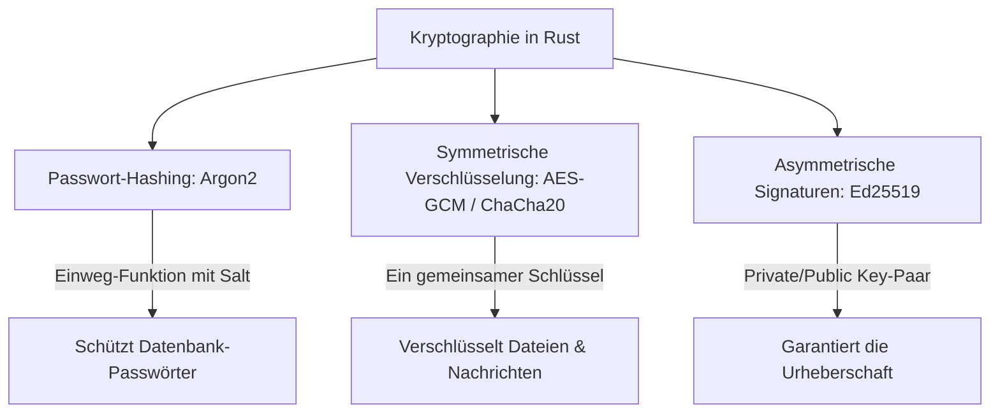

# 🔒 Kryptographie & Sicherheit in Rust

Sicherheit ist eines der wichtigsten Fundamente von Rust. Aber Speichersicherheit allein schützt nicht vor kryptographischen Fehlern. 

In diesem Kapitel lernen wir, wie man in Rust Passwörter sicher hasht (Argon2), Daten symmetrisch verschlüsselt (AES-GCM), digitale Signaturen erstellt (Ed25519) und TLS-Verbindungen ohne C-Abhängigkeiten aufbaut.

---

## 🧠 Theorie: Die Säulen der Kryptographie



### 1. Passwort-Hashing (Argon2)
Niemals Passwörter im Klartext oder mit einfachen Hash-Funktionen (wie MD5 oder SHA-256) in der Datenbank speichern! Angreifer nutzen *Rainbow Tables* und GPUs, um Millionen SHA-256-Hashes pro Sekunde zu knacken. 
Verwende immer speicherintensive, moderne Hashing-Algorithmen wie **Argon2** (Gewinner der Password Hashing Competition).

---

## 🛠️ Praxis 1: Sicheres Passwort-Hashing mit Argon2

### 📦 `Cargo.toml`:
```toml
[dependencies]
argon2 = "0.5"
rand = "0.8"
```

### Der Code (`src/main.rs`):
```rust
use argon2::{
    password_hash::{rand_core::OsRng, PasswordHash, PasswordHasher, PasswordVerifier, SaltString},
    Argon2,
};

fn main() {
    let passwort = b"GeheimesPasswort123!";

    // 1. Erzeuge ein kryptographisch sicheres Zufalls-Salt (Schutz vor Rainbow Tables)
    let salt = SaltString::generate(&mut OsRng);

    // 2. Passwort mit Argon2 hashen
    let argon2 = Argon2::default();
    let passwort_hash = argon2.hash_password(passwort, &salt).unwrap().to_string();

    println!("Generierter Hash für DB:\n{}", passwort_hash);

    // 3. Passwort-Verifikation bei der Anmeldung
    let eingegebenes_passwort = b"GeheimesPasswort123!";
    let parsed_hash = PasswordHash::new(&passwort_hash).unwrap();

    let verifiziert = Argon2::default().verify_password(eingegebenes_passwort, &parsed_hash);

    if verifiziert.is_ok() {
        println!("✅ Anmeldung erfolgreich! Passwort stimmt überein.");
    } else {
        println!("❌ Falsches Passwort!");
    }
}
```

---

## 🛠️ Praxis 2: Symmetrische Verschlüsselung mit AES-GCM

AES-GCM ist ein **AEAD**-Algorithmus (Authenticated Encryption with Associated Data). Er verschlüsselt nicht nur die Daten, sondern garantiert gleichzeitig, dass die Daten unterwegs nicht manipuliert wurden.

```rust
use aes_gcm::{
    aead::{Aead, AeadCore, KeyInit, OsRng},
    Aes256Gcm, Key, Nonce
};

pub fn verschluessele_nachricht(nachricht: &[u8], schluessel_bytes: &[u8; 32]) -> (Vec<u8>, Vec<u8>) {
    let key = Key::<Aes256Gcm>::from_slice(schluessel_bytes);
    let cipher = Aes256Gcm::new(key);
    
    // Nonce (Einmal-Zahl) muss für jede Verschlüsselung eindeutig sein!
    let nonce = Aes256Gcm::generate_nonce(&mut OsRng);
    
    let geheimtext = cipher.encrypt(&nonce, nachricht)
        .expect("Fehler bei der Verschlüsselung");
        
    (geheimtext, nonce.to_vec())
}
```

---

## 🛠️ Praxis-Aufgabe

### Aufgabe: Falsche Passwort-Eingabe testen
Passe das Argon2-Beispiel so an, dass ein falsches Passwort übergeben wird, und fange den Verifikations-Fehler ab.

```rust
let falsches_passwort = b"FalschesPasswort!";
let parsed_hash = PasswordHash::new(&passwort_hash).unwrap();

// todo: Führe den verify_password Check aus und prüfe, ob ein Err zurückgegeben wird!
/* let ergebnis = Argon2::default().verify_password(falsches_passwort, &parsed_hash); */
```

---

## 💡 Zusammenfassung

| Kryptographischer Zweck | Empfohlener Algorithmus | Rust Crate |
| :--- | :--- | :--- |
| **Passwort-Hashing** | Argon2id | `argon2` |
| **Symmetrische Verschlüsselung** | AES-256-GCM / ChaCha20-Poly1305 | `aes-gcm` / `chacha20poly1305` |
| **Digitale Signatur** | Ed25519 | `ed25519-dalek` |
| **Sichere Zufallszahlen** | OS Random Generator | `rand::rngs::OsRng` |
