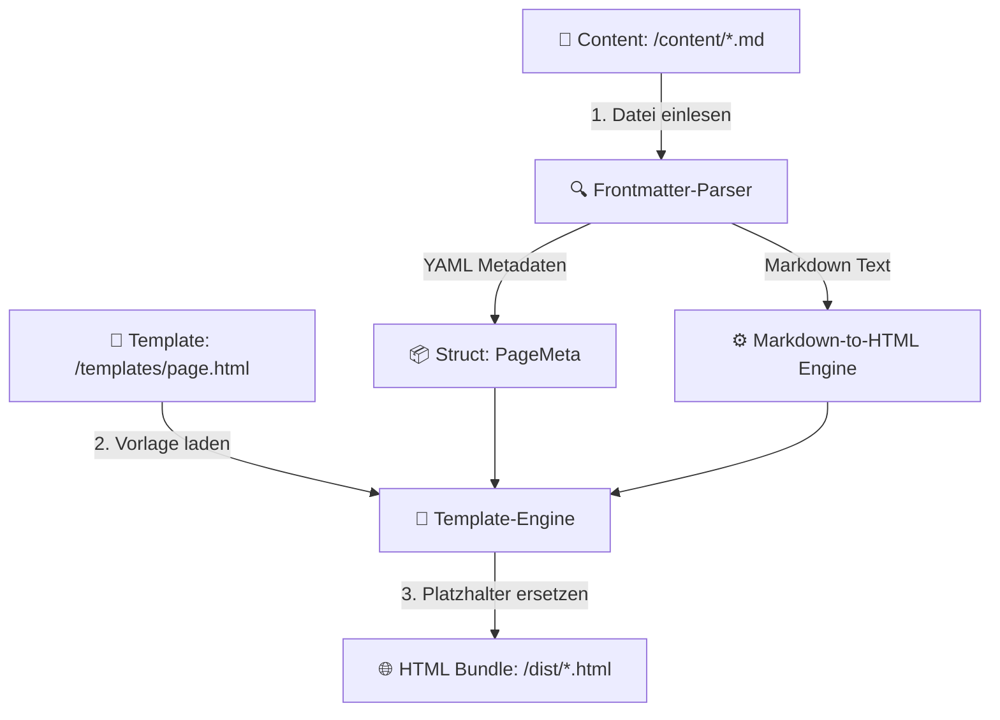

# ⚡ Static Site Generator: Eigene Website mit Rust bauen

Statische Website-Generatoren (Static Site Generators, kurz **SSG**) wie Hugo, Jekyll oder Eleventy treiben Millionen von modernen Websites an. Sie nehmen Textdateien (z. B. Markdown) und Vorlagen (HTML-Templates) entgegen und erzeugen daraus blitzschnell fertige HTML-Seiten.

Warum sollte man einen SSG **in Rust selbst bauen**?
1. **Perfektes Praxisprojekt:** Du verknüpfst Dateisystem-Operationen, String-Parsing, Datenstrukturen (`Structs`), Fehlerbehandlung (`Result`) und Serialisierung (`serde`).
2. **Unglaubliche Performance:** Ein selbstgebauter Rust-SSG generiert hunderte Seiten in wenigen Millisekunden – komplett ohne Laufzeit-Overhead.
3. **Maximale Kontrolle:** Du verstehst exakt, wie Inhalte verarbeitet, geparst und in HTML umgewandelt werden.

In diesem Kapitel lernst du die Theorie hinter einem Static Site Generator kennen und baust Schritt für Schritt die Kernlogik eines eigenen SSG in Rust.

---

## 🧠 Theorie & Architektur

Ein Static Site Generator arbeitet wie eine Verarbeitungs-Pipeline in der Industrie: Auf der linken Seite fließen Rohstoffe hinein (Markdown-Dateien & HTML-Templates), in der Mitte wird transformiert, und auf der rechten Seite kommen fertig verpackte HTML-Dateien für deinen Webserver heraus.



### Die 4 Phasen der SSG-Pipeline:

1. **Datei-Traversal & Einlesen:** Das Programm durchsucht das Eingabeverzeichnis (z. B. `content/`) nach allen Markdown-Dateien (`.md`) und liest deren Inhalt in den Speicher.
2. **Frontmatter & Markdown Parsing:**
   - **Frontmatter:** Der Kopfbereich einer Datei (meist zwischen `---`-Zeilen) enthält Metadaten wie Titel, Datum oder Tags im YAML- oder TOML-Format.
   - **Body:** Der eigentliche Artikeltext im Markdown-Format wird in HTML-Tags (`<h1>`, `<p>`, `<strong>`) umgewandelt.
3. **Template Rendering:** Die HTML-Vorlage (`templates/page.html`) besitzt Platzhalter wie `{{ title }}` oder `{{ content }}`. Diese werden durch die echten Daten ersetzt.
4. **Output & Dateisystem-Export:** Die fertig gerenderte HTML-Datei wird im Zielordner `dist/` gespeichert (z. B. `dist/blog-post.html`).

---

## 🛠️ Praxis-Aufgaben: Den eigenen SSG Schritt für Schritt bauen

Nun bist **du** an der Reihe! Wir stellen dir das Architektur-Gerüst bereit. Deine Aufgabe ist es, die Funktionen Stück für Stück zu vervollständigen, indem du die `todo!()`-Makros durch deinen eigenen Code ersetzt.

### Schritt 1: Das Datenmodell (`src/models.rs`)

Zuerst definieren wir die Datenstrukturen für unsere Metadaten und die verarbeitete Seite.

```rust
use serde::{Deserialize, Serialize};

/// Metadaten aus dem YAML-Frontmatter einer Markdown-Datei
#[derive(Debug, Serialize, Deserialize, PartialEq, Clone)]
pub struct PageMeta {
    pub title: String,
    pub date: String,
    pub author: String,
}

/// Eine vollständig aufbereitete Webseite vor der Speicherung
#[derive(Debug, PartialEq)]
pub struct Page {
    pub meta: PageMeta,
    pub html_content: String,
    pub slug: String,
}
```

---

### Schritt 2: Frontmatter & Content trennen (`src/parser.rs`)

Ein typischer Blogbeitrag sieht so aus:

```markdown
---
title: Mein erster Rust Blogbeitrag
date: 2026-07-18
author: Alex
---
# Hallo Welt!
Das ist mein **eigener** Static Site Generator in Rust.
```

Deine erste Aufgabe: Schreibe eine Funktion, die den Frontmatter-Block (zwischen den ersten beiden `---`) vom verbleibenden Markdown-Text trennt.

#### Leitfragen zur Umsetzung:
- Wie kannst du einen `&str` an bestimmten Trennzeichen teilen? (Hinweis: `str::splitn` oder `str::lines`)
- Was passiert, wenn die Datei gar keine `---`-Trennzeichen enthält? (Fehlerbehandlung mit `Result`!)

```rust
/// Trennt den YAML-Frontmatter-String vom Markdown-Hauptteil.
/// 
/// Gibt ein Tuple zurück: (frontmatter_yaml, markdown_body)
pub fn split_frontmatter(raw_content: &str) -> Result<(&str, &str), String> {
    // DENKANSTOSS:
    // 1. Prüfe, ob der String mit "---" beginnt.
    // 2. Suche nach dem zweiten "---".
    // 3. Schneide Frontmatter (ohne ---) und Content entsprechend ab.
    
    todo!("Implementiere die Trennung von Frontmatter und Markdown-Inhalt!")
}
```

---

### Schritt 3: Markdown in HTML umwandeln (`src/markdown.rs`)

Als Nächstes verwandeln wir Markdown-Syntax in valides HTML.

#### Einfache Regeln für dein Parser-Gerüst:
- `# Überschrift` $\rightarrow$ `<h1>Überschrift</h1>`
- `## Überschrift 2` $\rightarrow$ `<h2>Überschrift 2</h2>`
- Normaler Text $\rightarrow$ `<p>Normaler Text</p>`

```rust
/// Wandelt einfachen Markdown-Text zeilenweise in HTML um.
pub fn markdown_to_html(markdown: &str) -> String {
    let mut html = String::new();

    for line in markdown.lines() {
        let line = line.trim();
        if line.is_empty() {
            continue;
        }

        // DENKANSTOSS:
        // Nutze pattern matching oder line.starts_with("# ")
        // um Überschriften und Absätze zu erzeugen.
        if line.starts_with("# ") {
            // z. B. line[2..] extrahieren und in <h1>...</h1> verpacken
            todo!("Verarbeite H1 Überschriften");
        } else if line.starts_with("## ") {
            todo!("Verarbeite H2 Überschriften");
        } else {
            todo!("Verarbeite normale Absätze <p>...</p>");
        }
    }

    html
}
```

> 💡 **Tipp für Fortgeschrittene:** In produktiven Projekten nutzt man in Rust meist das Crate `pulldown-cmark`. Aber das eigene Bauen eines einfachen Parsers zeigt dir genau, wie Textanalyse funktioniert!

---

### Schritt 4: Die HTML-Template Engine (`src/template.rs`)

Unsere HTML-Vorlage (`templates/page.html`) sieht wie folgt aus:

```html
<!DOCTYPE html>
<html lang="de">
<head>
    <meta charset="UTF-8">
    <title>{{ title }}</title>
    <style>
        body { font-family: sans-serif; max-width: 800px; margin: 0 auto; padding: 2rem; background: #121212; color: #e0e0e0; }
        header { border-bottom: 1px solid #333; margin-bottom: 2rem; }
    </style>
</head>
<body>
    <header>
        <h1>{{ title }}</h1>
        <small>Veröffentlicht am {{ date }} von {{ author }}</small>
    </header>
    <main>
        {{ content }}
    </main>
</body>
</html>
```

Implementiere die Funktion, die diese Vorlage nimmt und die Platzhalter `{{ title }}`, `{{ date }}`, `{{ author }}` und `{{ content }}` durch die echten Werte ersetzt!

```rust
use crate::models::PageMeta;

/// Fügt die Metadaten und den HTML-Content in das HTML-Template ein.
pub fn render_template(template: &str, meta: &PageMeta, content_html: &str) -> String {
    // DENKANSTOSS:
    // Nutze die String-Methode `.replace("{{ title }}", &meta.title)`
    // führe das schrittweise für alle Platzhalter durch!

    todo!("Ersetze alle {{ ... }} Platzhalter durch die echten Daten")
}
```

---

### Schritt 5: Der Haupt-Workflow (`src/generator.rs`)

Schließe alle Komponenten im Generator zusammen:

```rust
use std::fs;
use std::path::Path;
use crate::models::PageMeta;
use crate::parser::split_frontmatter;
use crate::markdown::markdown_to_html;
use crate::template::render_template;

/// Verarbeitet eine einzelne Markdown-Datei und schreibt das fertige HTML in dist/
pub fn process_file(file_path: &Path, template: &str, output_dir: &Path) -> Result<(), String> {
    // 1. Datei einlesen mit fs::read_to_string
    // 2. Frontmatter & Content trennen (split_frontmatter)
    // 3. Frontmatter mit serde_yaml (oder manuell) parsen
    // 4. Markdown zu HTML konvertieren (markdown_to_html)
    // 5. HTML in Template einbetten (render_template)
    // 6. Output-Pfad bestimmen (z.B. dist/dateiname.html) und mit fs::write speichern

    todo!("Verknüpfe alle Schritte zu einer durchgängigen Pipeline!")
}
```

---

## 🧪 Automatische Tests für dein Projekt

Sobald du deinen Code geschrieben hast, kannst du ihn mit diesen vorgefertigten Unit-Tests prüfen. Führe in deinem Terminal `cargo test` aus!

```rust
#[cfg(test)]
mod tests {
    use super::*;
    use crate::models::PageMeta;
    use crate::parser::split_frontmatter;
    use crate::markdown::markdown_to_html;
    use crate::template::render_template;

    #[test]
    fn test_split_frontmatter() {
        let input = "---\ntitle: Test\ndate: 2026-01-01\nauthor: Rustacean\n---\n# Inhalt";
        let (front, body) = split_frontmatter(input).expect("Sollte Frontmatter trennen");
        
        assert!(front.contains("title: Test"));
        assert_eq!(body.trim(), "# Inhalt");
    }

    #[test]
    fn test_markdown_to_html() {
        let md = "# Titel\nDies ist ein Test.";
        let html = markdown_to_html(md);
        
        assert!(html.contains("<h1>Titel</h1>"));
        assert!(html.contains("<p>Dies ist ein Test.</p>"));
    }

    #[test]
    fn test_render_template() {
        let template = "<h1>{{ title }}</h1><p>Von {{ author }}</p><div>{{ content }}</div>";
        let meta = PageMeta {
            title: "Mein Titel".into(),
            date: "2026-07-18".into(),
            author: "Thorsten".into(),
        };
        
        let result = render_template(template, &meta, "<p>Hallo</p>");
        assert_eq!(result, "<h1>Mein Titel</h1><p>Von Thorsten</p><div><p>Hallo</p></div>");
    }
}
```

---

## 🚀 Compiler- / Praxis-Experimente

Probiere nach der erfolgreichen Umsetzung folgende Experimente aus, um dein Rust-Wissen zu vertiefen:

1. **Experiment 1: Robustheit bei fehlenden Feldern**
   - Was passiert, wenn im YAML-Frontmatter das Feld `author` fehlt? 
   - *Aufgabe:* Ändere das `PageMeta`-Struct so ab, dass `author: Option<String>` verwendet wird. Wie passt sich dein Template-Rendering an?

2. **Experiment 2: Höchstgeschwindigkeit mit Nebenläufigkeit (`Rayon`)**
   - Wenn du 5.000 Blogbeiträge hast, dauert das sequenzielle Einlesen im Dateisystem eventuell ein paar Hundert Millisekunden.
   - Binde das Crate `rayon` ein und ersetze `.iter()` durch `.par_iter()`. Beobachte, wie Rust alle CPU-Kerne gleichzeitig auslastet!

3. **Experiment 3: Asset-Kopieren (CSS & Bilder)**
   - Baue eine Zusatzfunktion `copy_assets(from: &Path, to: &Path)`, die alle CSS- und Bilddateien aus `static/` unverändert nach `dist/` kopiert.

---

## 💡 Zusammenfassung

| Komponente | Verwendete Rust-Konzepte | Aufgabe im SSG |
| :--- | :--- | :--- |
| **Data Models** | `Struct`, `Derive (Serialize/Deserialize)` | Repräsentieren Metadaten und HTML-Seiten typsicher |
| **Frontmatter Parser** | `&str` Slicing, `Result<T, E>` | Trennt Konfiguration vom Textinhalt |
| **Markdown Converter** | Pattern Matching, String Building | Erzeugt aus Fließtext strukturiertes HTML |
| **Template Engine** | String Replacement (`replace`), Borrowing | Fügt dynamische Werte in statisches HTML-Layout ein |
| **File Generator** | `std::fs`, `std::path::Path` | Liest Quelldateien und schreibt das finale Bundle in `dist/` |

---

## 📚 Links & Weiterführendes

- [📄 Standardbibliothek: std::fs](https://doc.rust-lang.org/std/fs/index.html) – Offizielle Dokumentation für Dateisystem-Operationen in Rust.
- [📦 Serde YAML Crate](https://crates.io/crates/serde_yaml) – Für automatisches Parsen von YAML-Frontmatter.
- [🌐 Web-Backend & REST APIs (Axum & SQLx)](./rust-web-backend.md) – Erfahre, wie du Seiten nicht nur statisch generierst, sondern auch dynamisch als Server bereitstellst.
