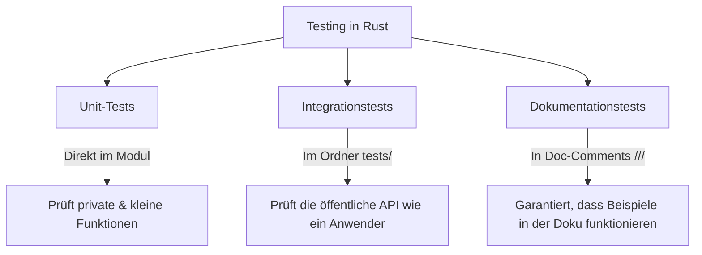

# 🧪 Testen, Dokumentation & Benchmarking in Rust

Schreibst du noch Code oder testest du schon? In der professionellen Softwareentwicklung ist ungetesteter Code ein Risiko. Rust stellt dir von Haus aus erstklassige Werkzeuge zur Verfügung, um Unit-Tests, Integrationstests und Dokumentationstests ohne externe Setup-Hürden zu schreiben.

In diesem Kapitel lernst du, wie du deinen Rust-Code gründlich prüfst, verlässliche Dokumentationsschreibweisen nutzt und die Performance deiner Funktionen mit Benchmarks misst.

---

## 🧠 Theorie: Die drei Säulen des Testens in Rust

Rust unterscheidet drei verschiedene Arten von Tests:



### 1. Unit-Tests
Unit-Tests testen kleine, isolierte Einheiten (meist einzelne Funktionen). Sie liegen in derselben Datei wie der eigentliche Code in einem eigenen Test-Modul:

```rust
pub fn addieren(a: i32, b: i32) -> i32 {
    a + b
}

#[cfg(test)]
mod tests {
    use super::*;

    #[test]
    fn test_addieren() {
        assert_eq!(addieren(2, 3), 5);
    }
}
```

* **`#[cfg(test)]`**: Dieses Attribut weist den Compiler an, den Test-Code nur dann zu kompilieren, wenn du `cargo test` ausführst. Im normalen Release-Build wird dieser Code komplett ignoriert und verbraucht keinen Speicherplatz!
* **`use super::*;`**: Importiert alle Funktionen des äußeren Moduls in das Testmodul.

### 2. Integrationstests
Integrationstests testen das Zusammenspiel mehrerer Module von außen. Sie liegen in einem separaten Ordner namens `tests/` im Wurzelverzeichnis deines Projekts. Jede Datei in `tests/` wird als eigenes Crate kompiliert.

### 3. Dokumentationstests (Doc-Tests)
Rust erlaubt es dir, ausführbaren Testcode direkt in deine Dokumentationskommentare (`///`) zu schreiben. Wenn du `cargo test` ausführst, kompiliert und prüft Rust auch alle Codebeispiele in deiner Dokumentation. Veraltete Codebeispiele in der Dokumentation gehören damit der Vergangenheit an!

---

## 🛠️ Praxis-Aufgaben

### Aufgabe 1: Einen Panic-Test schreiben
Manchmal möchtest du testen, ob eine Funktion bei ungültigen Eingaben kontrolliert abbricht (panict). Dafür nutzt man das Attribut `#[should_panic]`.

Vervollständige das Testmodul für folgende Division-Funktion:

```rust
pub fn dividieren(a: i32, b: i32) -> i32 {
    if b == 0 {
        panic!("Division durch Null ist nicht erlaubt!");
    }
    a / b
}

#[cfg(test)]
mod tests {
    use super::*;

    #[test]
    fn test_normale_division() {
        assert_eq!(dividieren(10, 2), 5);
    }

    #[test]
    #[should_panic(expected = "Division durch Null")]
    fn test_division_durch_null() {
        // todo: Rufe die Funktion dividieren so auf, dass sie panict!
        /* dividieren(10, 0); */
    }
}
```

---

## 🚀 Benchmarking mit Criterion

Wie misst man verlässlich, welche zwei Algorithmen schneller sind? Ein einfaches `Instant::now()` reicht oft nicht aus, da Hintergrundprozesse des Betriebssystems die Ergebnisse verfälschen.

In Rust nutzt man dafür das Crate **`criterion`**. Es führt Testfunktionen hunderte Male aus, nutzt statistische Methoden (wie Standardabweichung) und generiert wunderschöne HTML-Diagramme.

### Einrichtung in `Cargo.toml`:
```toml
[dev-dependencies]
criterion = "0.5"

[[bench]]
name = "mein_benchmark"
harness = false
```

### Ein einfachen Benchmark schreiben (`benches/mein_benchmark.rs`):
```rust
use criterion::{black_box, criterion_group, criterion_main, Criterion};

fn fibonacci(n: u64) -> u64 {
    match n {
        0 => 0,
        1 => 1,
        _ => fibonacci(n - 1) + fibonacci(n - 2),
    }
}

fn criterion_benchmark(c: &mut Criterion) {
    // black_box verhindert, dass der Compiler das Ergebnis als Konstante wegoptimiert!
    c.bench_function("fib 20", |b| b.iter(|| fibonacci(black_box(20))));
}

criterion_group!(benches, criterion_benchmark);
criterion_main!(benches);
```

Ausführen mit: `cargo bench`.

---

## 💡 Zusammenfassung

| Befehl / Attribut | Bedeutung |
| :--- | :--- |
| `cargo test` | Führt alle Unit-, Integrations- und Doc-Tests aus. |
| `cargo bench` | Führt Performance-Benchmarks aus. |
| `#[test]` | Markiert eine Funktion als Test. |
| `#[should_panic]` | Test besteht nur, wenn der Code abbricht. |
| `#[ignore]` | Überspringt zeitintensive Tests (ausführbar mit `cargo test -- --ignored`). |
