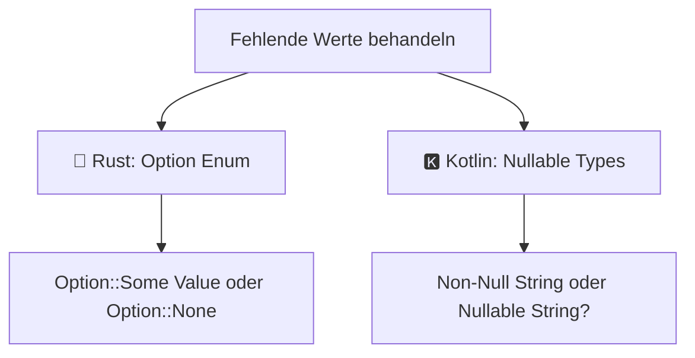

# 🦀⚡ Rust & Kotlin gleichzeitig lernen: Das Synergie-Handbuch

Warum solltest du zwei der modernsten Programmiersprachen der Welt – **Rust** und **Kotlin** – gleichzeitig lernen? 

Die Antwort ist überraschend einfach: Obwohl Rust (Systemprogrammierung ohne Garbage Collector) und Kotlin (Anwendungs- und App-Entwicklung auf der JVM / Multiplatform) völlig unterschiedliche Zielgebiete abdecken, teilen sie dieselbe **Philosophie moderner Programmiersprachen designiert für das 21. Jahrhundert**.

Wenn du Rust und Kotlin parallel lernst, wirst du ein tiefes Verständnis für **Speichersicherheit, Typenlehre und funktionale Sprachkonzepte** entwickeln. Dieses Kapitel dient dir als Kompass und Gegenüberstellung für beide Sprachen.

---

## 🎯 Die perfekte Synergie: Systemebene trifft Produktivität

| Eigenschaft | 🦀 Rust | 🅺 Kotlin |
| :--- | :--- | :--- |
| **Hauptfokus** | Systemprogrammierung, Embedded, High-Performance Backends, WASM | Mobile Apps (Android), Enterprise Web-Backends, Multiplatform (KMP) |
| **Speicherverwaltung** | Ownership & Borrow Checker (Kein Garbage Collector) | Garbage Collector (JVM) / Automatic Reference Counting |
| **Laufzeit-Overhead** | Nahezu 0 (Zero-Cost Abstractions) | Minimal (JVM-Runtime) |
| **Null-Handling** | Kein `null` vorhanden (`Option<T>` Enum) | Strikte Null-Safety (`String` vs `String?`) |
| **Paradigmen** | Multi-Paradigmatisch (Funktional + Systemnah) | Multi-Paradigmatisch (Objektorientiert + Funktional) |

---

## 🧩 1. Immutability by Default (Unveränderlichkeit als Standard)

Sowohl Rust als auch Kotlin zwingen Entwickler dazu, Variablen standardmäßig **unveränderbar** anzulegen. Erst wenn du explizit ankündigst, dass sich ein Wert ändern soll, erlauben die Compiler Änderungen.

### Rust Syntax: `let` vs. `let mut`

```rust
// Unveränderbar (Default in Rust)
let alter = 25;
// alter = 26; // ❌ Fehler: cannot mutate immutable variable `alter`

// Veränderbar (Explizit durch `mut`)
let mut punkte = 100;
punkte = 150; // ✅ Erlaubt
```

### Kotlin Syntax: `val` vs. `var`

```kotlin
// Unveränderbar / Read-Only (Default-Empfehlung in Kotlin)
val alter = 25
// alter = 26 // ❌ Fehler: Val cannot be reassigned

// Veränderbar (Explizit durch `var`)
var punkte = 100
punkte = 150 // ✅ Erlaubt
```

> [!TIP]
> **Merkhilfe:**
> - Rust: `let` (fest) vs. `let mut` (mutable)
> - Kotlin: `val` (Value = fest) vs. `var` (Variable = veränderbar)

---

## 🛡️ 2. Der Kampf gegen Fehler: `Option<T>` vs. Nullable Types (`T?`)

Die meisten Softwareabstürze entstehen durch Zugriffe auf ungültige oder nicht vorhandene Daten. Beide Sprachen lösen dieses Problem bereits **zur Kompilierzeit**, verfolgen dabei jedoch leicht unterschiedliche Ansätze.



### 🦀 Rust: Das `Option<T>` Enum

Rust kennt das Schlüsselwort `null` überhaupt nicht. Ein optionaler Wert ist in einer Aufzählung (`Enum`) verpackt:

```rust
// Ein Wert existiert (Some) oder existiert nicht (None)
let name: Option<String> = Some(String::from("Thorsten"));
let kein_name: Option<String> = None;

// Sicheres Auslesen via Pattern Matching:
match name {
    Some(text) => println!("Hallo, {}!", text),
    None => println!("Kein Name vorhanden."),
}
```

### 🅺 Kotlin: Nullable Types (`T?`) & Safe Calls (`?.`)

Kotlin behält das Literale `null` bei (für 100% Interoperabilität mit Java), unterscheidet aber im Typsystem streng zwischen nullbaren und nicht-nullbaren Typen:

```kotlin
// Darf niemals null sein
val name: String = "Thorsten"

// Darf null sein (Fragezeichen ?)
val keinName: String? = null

// Sicheres Auslesen via Safe Call und Elvis-Operator:
println("Hallo, ${keinName ?: "Unbekannter Besucher"}!")
```

---

## 🔄 3. Alles hat einen Wert: Expression-Oriented Code

Sowohl in Rust als auch in Kotlin sind Anweisungen wie `if` und Kontrollblöcke echte **Ausdrücke (Expressions)**. Das bedeutet: Sie geben das Ergebnis ihrer Berechnung direkt zurück!

### Vergleichende Gegenüberstellung

#### 🦀 Rust (`if` & `match` als Expression)

```rust
let alter = 20;

// if als Ausdruck:
let status = if alter >= 18 { "Volljährig" } else { "Minderjährig" };

// match als Ausdruck:
let bewertung = match alter {
    0..=12 => "Kind",
    13..=17 => "Teenie",
    _ => "Erwachsener",
};
```

#### 🅺 Kotlin (`if` & `when` als Expression)

```kotlin
val alter = 20

// if als Ausdruck:
val status = if (alter >= 18) "Volljährig" else "Minderjährig"

// when als Ausdruck:
val bewertung = when (alter) {
    in 0..12 -> "Kind"
    in 13..17 -> "Teenie"
    else -> "Erwachsener"
}
```

---

## 🧠 4. Speicherverwaltung: Ownership (Rust) vs. Garbage Collector (Kotlin)

Hier liegt der **größte Unterschied** zwischen beiden Sprachen:

1. **Rust (Ownership & Borrowing):**
   - Jedes Objekt hat genau **einen Besitzer**.
   - Verlässt der Besitzer den Gültigkeitsbereich (Scope), wird der Speicher **sofort und automatisch freigegeben**.
   - Keine Pausen zur Laufzeit! Perfekt für Echtzeitsysteme, Spiele-Engines und WebAssembly.

2. **Kotlin (JVM Garbage Collector):**
   - Objekte werden auf dem Heap erzeugt.
   - Ein im Hintergrund laufender **Garbage Collector (GC)** prüft periodisch, welche Objekte nicht mehr referenziert werden, und räumt den Speicher auf.
   - Maximale Entwicklerproduktivität, da man sich um Lebensdauern keine Gedanken machen muss.

---

## 🛠️ Praxis-Doppelübung: Dein Code in beiden Sprachen!

Vervollständige die beiden Starter-Gerüste. Beachte: In Rust nutzt du `todo!()`, in Kotlin `TODO("Dein Code")`.

### 🎯 Die Aufgabe
Erstelle eine Funktion, die das Alter einer Person entgegennimmt und den Status zurückgibt:
- Unter 18: `"Minderjährig"`
- Ab 18: `"Volljährig"`

---

### 🦀 Rust Starter-Gerüst (`src/main.rs`)

```rust
fn bestimme_status(alter: u32) -> &'static str {
    // TODO: Nutze ein if- oder match-Expression, um den Status zurückzugeben
    todo!("Implementiere die Status-Bestimmung in Rust")
}

fn main() {
    let status = bestimme_status(20);
    println!("Rust Status: {}", status);
}
```

---

### 🅺 Kotlin Starter-Gerüst (`Main.kt`)

```kotlin
fun bestimmeStatus(alter: Int): String {
    // TODO: Nutze ein if- oder when-Expression, um den Status zurückzugeben
    return TODO("Implementiere die Status-Bestimmung in Kotlin")
}

fun main() {
    val status = bestimmeStatus(20)
    println("Kotlin Status: $status")
}
```

---

## 💡 Fazit: Das Beste aus beiden Welten nutzen!

Wenn du **Rust** lernst, verstehst du, wie Hardware, Speicher und Betriebssysteme auf tiefster Ebene funktionieren.
Wenn du **Kotlin** lernst, erfährst du, wie man hochproduktive, elegante Anwendungen und Android-Apps in Rekordzeit schreibt.

Beide Sprachen ergänzen sich perfekt in deinem Werkzeugkasten als moderner Software-Entwickler! 🚀
