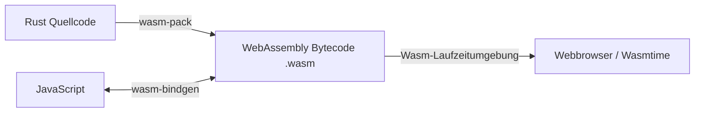

# 🌐 WebAssembly (WASM) & Rust im Browser

WebAssembly (WASM) revolutioniert die Webentwicklung. Es ist ein plattformunabhängiges, kompaktes Bytecode-Format, das in modernen Webbrowsern nahe an nativer Prozessorgeschwindigkeit ausgeführt werden kann. Rust gilt als die beliebteste Sprache zur Generierung von WebAssembly.

In diesem Kapitel lernst du, wie du Rust-Code in WASM übersetzt, wie die Kommunikation zwischen JavaScript und Rust funktioniert und wie WASM auf dem Server eingesetzt wird.

---

## 🧠 Theorie: Warum Rust & WebAssembly?

Früher war JavaScript die einzige Sprache, die nativ im Browser lief. Für rechenintensive Aufgaben (z. B. Bildbearbeitung, 3D-Spiele, Videodekodierung oder Physik-Simulationen) geriet JavaScript jedoch an seine Leistungsgrenzen.



### Die Vorteile von WASM mit Rust:
1. **Kein Garbage Collector:** Im Gegensatz zu Sprachen wie Go oder Java hat Rust keinen Garbage Collector. Das erzeugt extrem kleine `.wasm`-Dateien ohne unvorhersehbare Pausen.
2. **Speichersicherheit:** Das Ownership-System von Rust garantiert, dass im WASM-Modul keine Speicherzugriffsfehler auftreten.
3. **Nahtlose JS-Interoperabilität:** Durch das Tool `wasm-bindgen` können Rust-Funktionen direkt von JavaScript aufgerufen werden und umgekehrt.

---

## 🛠️ Praxis: Ein WebAssembly-Modul mit Rust bauen

### 📦 Vorbereitung
Installiere das offizielle Build-Tool `wasm-pack`:
```bash
cargo install wasm-pack
```

Erstelle ein neues Bibliothek-Projekt:
```bash
cargo new --lib rust_wasm_demo
```

Konfiguriere die `Cargo.toml`:
```toml
[lib]
# crate-type "cdylib" ist zwingend erforderlich für C-kompatible dynamische Bibliotheken (WASM)
crate-type = ["cdylib", "rlib"]

[dependencies]
wasm-bindgen = "0.2"
```

### Der Rust-Code (`src/lib.rs`):
```rust
use wasm_bindgen::prelude::*;

// Bindung an die JavaScript-Funktion 'alert' importieren
#[wasm_bindgen]
extern "C" {
    fn alert(s: &str);
}

// Eine Rust-Funktion exportieren, die von JavaScript aufgerufen werden kann
#[wasm_bindgen]
pub fn begruesse(name: &str) {
    let nachricht = format!("Hallo {} aus Rust & WebAssembly!", name);
    alert(&nachricht);
}

#[wasm_bindgen]
pub fn addieren(a: i32, b: i32) -> i32 {
    a + b
}
```

### Das Modul kompilieren:
Führe folgenden Befehl im Projektordner aus:
```bash
wasm-pack build --target web
```
`wasm-pack` erzeugt einen Ordner `pkg/`, der die `.wasm`-Datei sowie passende JavaScript-Wrapper-Dateien enthält!

---

## 🛠️ Praxis-Aufgaben

### Aufgabe: Einbindung in eine HTML-Seite
Stell dir vor, du hast folgenden HTML-Code:

```html
<!DOCTYPE html>
<html lang="de">
<head>
    <meta charset="UTF-8">
    <title>Rust WASM Demo</title>
</head>
<body>
    <h1>WebAssembly Test</h1>
    <script type="module">
        // Importiere das generierte WASM-Modul aus dem pkg/-Ordner
        import init, { begruesse, addieren } from './pkg/rust_wasm_demo.js';

        async function run() {
            // Initialisiere den WASM-Speicher
            await init();

            // todo: Rufe die Rust-Funktion 'addieren' mit den Werten 15 und 27 auf
            // let ergebnis = ...;
            // console.log("Ergebnis:", ergebnis);

            // todo: Rufe die Rust-Funktion 'begruesse' auf
        }

        run();
    </script>
</body>
</html>
```

**Deine Aufgabe:** Ergänze die zwei auskommentierten Zeilen in der JavaScript `run()`-Funktion, um die aus Rust exportierten WASM-Funktionen aufzurufen.

---

## 🚀 Serverseitiges WASM mit Wasmtime

WebAssembly ist nicht mehr nur auf den Browser beschränkt! Mit Laufzeitumgebungen wie **Wasmtime** oder **Wasmer** kannst du WASM-Dateien sicher auf Servern, Edge-Nodes oder Microservices ausführen.

1. Installiere Wasmtime: `curl https://wasmtime.dev/install.sh | bash`
2. Kompiliere ein Rust-Programm für die WASI-Zielarchitektur:
   ```bash
   rustup target add wasm32-wasip1
   cargo build --target wasm32-wasip1
   ```
3. Führe die `.wasm`-Datei auf dem Server aus:
   ```bash
   wasmtime target/wasm32-wasip1/debug/dein_projekt.wasm
   ```

---

## 💡 Zusammenfassung

| Begriff / Tool | Bedeutung |
| :--- | :--- |
| `wasm32-unknown-unknown` | Zielarchitektur für reine WebAssembly-Dateien im Browser. |
| `wasm-pack` | Tool zum Bauen und Paketieren von Rust-WASM-Crates für npm/Web. |
| `wasm-bindgen` | Rust-Bibliothek zur automatischen Erzeugung von JS-Bindings. |
| `WASI` | WebAssembly System Interface (Standard für WASM außerhalb des Browsers). |
