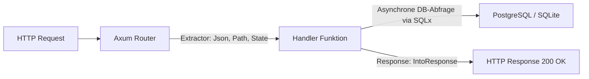

# 🌐 Web-Backend & REST APIs (Axum & SQLx)

Rust ist eine der leistungsfähigsten Sprachen für moderne Web-Backends. Durch das asynchrone Ökosystem (**Tokio**) verarbeitet ein Rust-Webserver zehntausende Anfragen pro Sekunde bei minimaler Speicherlast.

In diesem Kapitel bauen wir ein produktivreifes REST-API mit dem modernen Web-Framework **Axum** und binden eine SQL-Datenbank abfragesicher mit **SQLx** an.

---

## 🧠 Theorie: Das Axum-Framework

**Axum** ist ein extrem performantes, typsicheres Web-Framework aus dem Tokio-Ökosystem. 



### Die Schlüsselkonzepte von Axum:
1. **Routing:** Verknüpft HTTP-Pfade (`/users`) und Methoden (`GET`, `POST`) mit Handler-Funktionen.
2. **Extractors:** Parameter werden automatisch durch den Funktions-Kopf extrahiert (z. B. `Path(id)` liest Pfad-Variablen, `Json(payload)` parst den JSON-Body).
3. **Typgeprüfte SQL-Abfragen (`SQLx`):** SQLx prüft deine SQL-Queries bereits während der Kompilierung gegen die echte Datenbank Schema-Struktur!

---

## 🛠️ Praxis: Ein REST-API bauen

### 📦 `Cargo.toml` Einrichtung:
```toml
[dependencies]
tokio = { version = "1.0", features = ["full"] }
axum = "0.7"
serde = { version = "1.0", features = ["derive"] }
serde_json = "1.0"
```

### Der Web-Server Code (`src/main.rs`):

```rust
use axum::{
    extract::{Path, State},
    http::StatusCode,
    routing::{get, post},
    Json, Router,
};
use serde::{Deserialize, Serialize};
use std::sync::{Arc, Mutex};

// Datenmodell für einen Benutzer
#[derive(Debug, Serialize, Deserialize, Clone)]
pub struct User {
    pub id: u64,
    pub name: String,
    pub email: String,
}

// Eingabe-Struktur für die Erstellung eines Benutzers
#[derive(Debug, Deserialize)]
pub struct CreateUser {
    pub name: String,
    pub email: String,
}

// Gemeinsamer Anwendungszustand (In-Memory Datenbankspeicher)
type Db = Arc<Mutex<Vec<User>>>;

#[tokio::main]
async fn main() {
    let db: Db = Arc::new(Mutex::new(Vec::new()));

    // Router konfigurieren
    let app = Router::new()
        .route("/users", get(get_users).post(create_user))
        .route("/users/:id", get(get_user_by_id))
        .with_state(db);

    println!("Server startet auf http://localhost:3000");
    let listener = tokio::net::TcpListener::bind("0.0.0.0:3000").await.unwrap();
    axum::serve(listener, app).await.unwrap();
}

// Handler 1: Alle Benutzer abrufen
async fn get_users(State(db): State<Db>) -> Json<Vec<User>> {
    let users = db.lock().unwrap().clone();
    Json(users)
}

// Handler 2: Neuen Benutzer anlegen
async fn create_user(
    State(db): State<Db>,
    Json(payload): Json<CreateUser>,
) -> (StatusCode, Json<User>) {
    let mut users = db.lock().unwrap();
    let new_user = User {
        id: (users.len() + 1) as u64,
        name: payload.name,
        email: payload.email,
    };
    users.push(new_user.clone());
    (StatusCode::CREATED, Json(new_user))
}

// Handler 3: Benutzer nach ID finden
async fn get_user_by_id(
    Path(id): Path<u64>,
    State(db): State<Db>,
) -> Result<Json<User>, StatusCode> {
    let users = db.lock().unwrap();
    if let Some(user) = users.iter().find(|u| u.id == id) {
        Ok(Json(user.clone()))
    } else {
        Err(StatusCode::NOT_FOUND)
    }
}
```

---

## 🛠️ Compile-Time SQL mit SQLx

Wenn du anstelle von In-Memory-Vektoren eine echte Datenbank nutzt, bietet **SQLx** ein gigantisches Feature:

```rust
// Dieser SQL-String wird während des cargo build gegen deine DB geprüft!
// Wenn die Spalte 'user_name' in der DB nicht existiert, bricht der BUILD ab!
let user = sqlx::query_as!(
    User,
    "SELECT id, name, email FROM users WHERE id = $1",
    user_id
)
.fetch_one(&pool)
.await?;
```

---

## 🛠️ Praxis-Aufgabe

### Aufgabe: Einen Lösch-Endpoint hinzufügen
Erweitere den Router um eine `DELETE`-Route für einen Benutzer:

```rust
// In main():
// .route("/users/:id", get(get_user_by_id).delete(delete_user))

async fn delete_user(
    Path(id): Path<u64>,
    State(db): State<Db>,
) -> StatusCode {
    let mut users = db.lock().unwrap();
    
    // todo: Finde den Index des Benutzers mit der angegebenen ID und entferne ihn aus dem Vektor.
    // Falls gefunden: StatusCode::NO_CONTENT zurückgeben, sonst StatusCode::NOT_FOUND.
    StatusCode::NOT_IMPLEMENTED
}
```

---

## 💡 Zusammenfassung

| Axum Konzept | Aufgabe |
| :--- | :--- |
| `Router::new()` | Registriert Pfade und HTTP-Methoden. |
| `State(db)` | Teilt Datenbankverbindungen oder Zustände über Thread-Grenzen hinweg. |
| `Json(data)` | Automatisches Parsen (Deserialisieren) und Senden (Serialisieren) von JSON. |
| `StatusCode` | Antwortet mit 표준 HTTP Status Codes (200 OK, 201 Created, 404 Not Found). |
