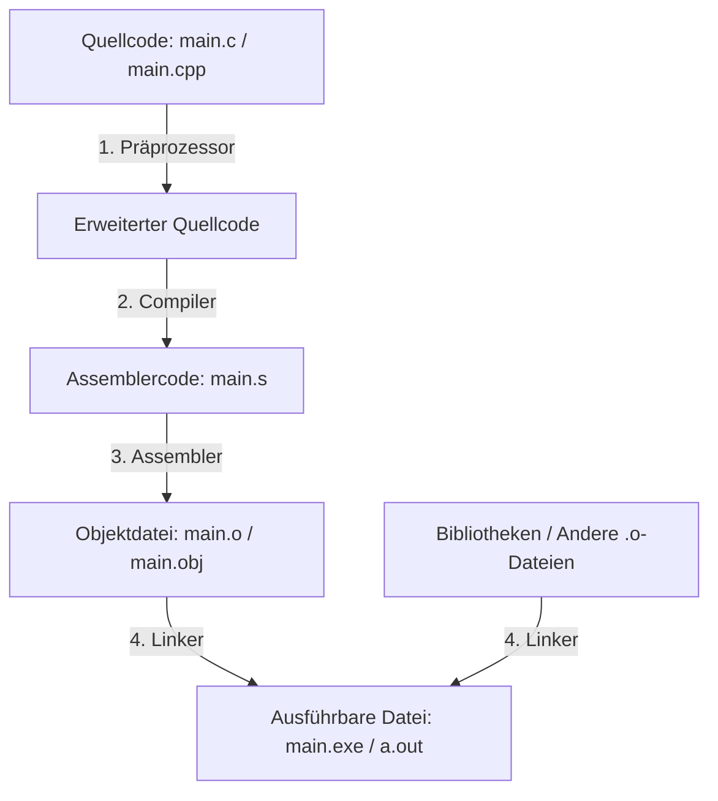
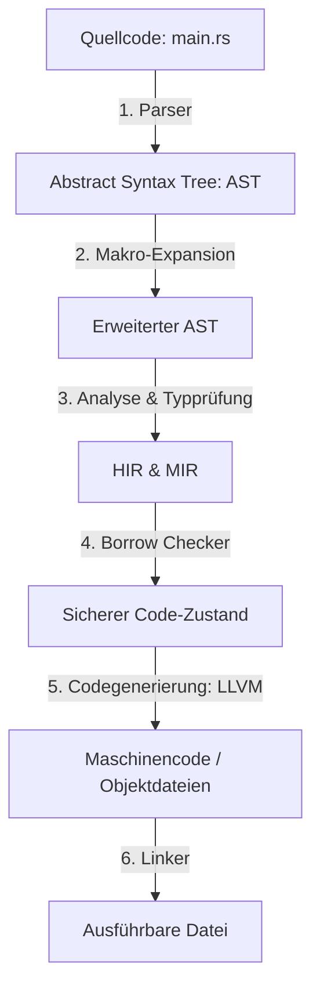

# Die Übersetzungsphasen: C, C++ und Rust im Vergleich

Wenn du ein Programm schreibst, ist das zunächst nur Text für Menschen. Der Computer (bzw. die CPU) versteht aber nur Maschinencode – also Nullen und Einsen. Um aus deinem Text ein lauffähiges Programm zu machen, muss der Code übersetzt werden.

In diesem Kapitel vergleichen wir, wie **C**, **C++** und **Rust** diesen Übersetzungsprozess (Kompilierung) bewältigen. Du wirst sehen, warum C und C++ zwar extrem schnell, aber fehleranfällig sind und wie Rust durch einen moderneren Übersetzungsansatz Sicherheitsgarantien gibt, ohne an Geschwindigkeit zu verlieren.

---

## 🎯 Lernziele

In diesem Kapitel lernst du:
- Welche Phasen ein C- und C++-Programm durchläuft, bevor es ausgeführt werden kann.
- Wie Rusts Übersetzungsprozess ohne einen klassischen Präprozessor auskommt.
- An welcher Stelle der berühmte **Borrow Checker** von Rust eingreift.
- Warum Compiler-Fehler in Rust oft hilfreicher sind als Linker-Fehler in C/C++.

---

## 🏛️ Der klassische Weg: C und C++

Der Kompilierungsprozess von C und C++ ist historisch gewachsen und in vier strikte Phasen unterteilt. Jede Phase hat ein eigenes Werkzeug, das nacheinander ausgeführt wird.

### Phase 1: Der Präprozessor (Der "Suchen-und-Ersetzen"-Roboter)
Bevor der eigentliche Compiler deinen Code sieht, läuft der **Präprozessor** darüber. Er ist im Grunde ein einfacher Text-Editor, der keine Programmierlogik versteht. Er sucht nach Zeilen, die mit einem `#` beginnen:
*   `#include <stdio.h>`: Kopiert den gesamten Inhalt der Header-Datei blind an diese Stelle.
*   `#define PI 3.14`: Ersetzt jedes Wort `PI` im restlichen Text stumpf durch `3.14`.

> **Die Analogie:** Stell dir den Präprozessor vor wie ein Fließband-Mitarbeiter, der blind kopierte Zettel in dein Buch klebt, ohne zu prüfen, ob die Sätze Sinn ergeben oder Grammatikfehler enthalten.

**Das Problem:** Da der Präprozessor keine Typen oder Syntax versteht, können sich hier tückische Fehler einschleichen. Wenn du versehentlich `#define MAX 10;` (mit Semikolon) schreibst, wird dieses Semikolon in jede Rechnung kopiert – was zu schwer verständlichen Compiler-Fehlern in der nächsten Phase führt.

### Phase 2: Der Compiler (Der Übersetzer)
Der Compiler nimmt den erweiterten Quellcode und übersetzt ihn in **Assemblercode** (eine menschenlesbare Darstellung von CPU-Befehlen, z. B. `mov`, `add`, `jmp`). In dieser Phase prüft der Compiler die Syntax (Grammatik) des C- oder C++-Codes.

### Phase 3: Der Assembler (Der Stanzer)
Der Assembler nimmt den Assemblercode und übersetzt ihn in reinen **Maschinencode** (Binärcode). Das Ergebnis ist eine sogenannte **Objektdatei** (meist mit der Endung `.o` oder `.obj`). Diese Datei enthält fertige CPU-Befehle, ist aber noch nicht ausführbar, weil Verweise auf externe Funktionen (wie `printf` oder `std::cout`) noch nicht verbunden sind.

### Phase 4: Der Linker (Der Puzzler)
Ein C/C++-Programm besteht meist aus vielen verschiedenen Dateien. Der **Linker** hat die Aufgabe, alle einzelnen Objektdateien und Bibliotheken zusammenzukleben. Er löst Adressen auf: Wenn Datei A eine Funktion aus Datei B aufruft, sorgt der Linker dafür, dass der Sprungbefehl im Maschinencode an die richtige Stelle zeigt.

**Das Problem:** Wenn du eine Funktion zwar im Header (Deklaration) versprochen hast, sie aber in keiner Datei ausprogrammiert (Definition) ist, scheitert der Linker. Er gibt einen berüchtigten **Linker-Fehler** aus (z. B. `undefined reference to 'meine_funktion'`). Diese Fehler sind oft schwer zu debuggen, da sie keine Zeilennummern im Quellcode enthalten.

---

## 🦀 Der moderne Weg: Rust

Rust bricht mit dem alten 4-Phasen-Modell von C/C++. Es verzichtet vollständig auf einen textbasierten Präprozessor und integriert viele Prüfungen direkt in einen einzigen, intelligenten Compiler-Prozess.

### Phase 1: Parsing (Syntaxprüfung)
Der Rust-Compiler `rustc` liest deinen Code und wandelt ihn in einen **Abstract Syntax Tree (AST)** um. Das ist eine baumartige Struktur, die die logische Grammatik deines Codes darstellt. Anders als C/C++ fängt Rust gar nicht erst an, Text blind hin- und herzukopieren.

### Phase 2: Makro-Expansion & Namensauflösung
In Rust gibt es Makros (erkennbar am `!`, wie `println!` oder `vec!`). Rust-Makros sind jedoch **keine** textbasierten Präprozessor-Tricks! Sie arbeiten direkt auf dem Syntaxbaum (AST). Sie sind strukturell, typsicher und "hygienisch" (sie können nicht unabsichtlich Variablen in deinem Code überschreiben).

### Phase 3: Typprüfung und statische Analyse
Nun übersetzt Rust den AST in Zwischenstufen (HIR = High-Level Intermediate Representation). Hier prüft der Compiler, ob alle Typen zusammenpassen. Da Rust Typinferenz besitzt, leitet er Typen oft automatisch her – prüft sie aber genauso streng wie C/C++.

### Phase 4: Der Borrow Checker (Die Sicherheitskontrolle)
Hier geschieht die Rust-Magie. Bevor Maschinencode erzeugt wird, prüft der **Borrow Checker** auf der MIR-Ebene (Mid-Level Intermediate Representation):
*   Wer besitzt welche Variable?
*   Gibt es verwaiste Referenzen (Dangling Pointer)?
*   Wird versucht, Daten gleichzeitig von zwei verschiedenen Stellen aus zu verändern?

Wenn der Borrow Checker ein Problem findet, bricht die Übersetzung sofort ab. C/C++ haben diesen Schritt überhaupt nicht – dort fällt Speicherpfusch erst beim Absturz zur Laufzeit auf.

### Phase 5: Codegenerierung (LLVM-Backend)
Ist der Code sicher, übergibt Rust die Zwischenrepräsentation an **LLVM** (Low Level Virtual Machine). LLVM ist eine hochoptimierte Compiler-Maschine, die auch von modernen C++-Compilern genutzt wird. LLVM optimiert den Code und übersetzt ihn schließlich in Maschinencode (Objektdateien).

### Phase 6: Linken
Wie bei C/C++ verknüpft ein Linker die Objektdateien zur finalen ausführbaren Datei. Cargo nimmt dir diese Arbeit im Hintergrund jedoch komplett ab.

---

## 📊 Der direkte Vergleich

| Merkmal | C / C++ 🇨 / 🚀 | Rust 🦀 |
| :--- | :--- | :--- |
| **Präprozessor** | Ja (Textbasiert, fehleranfällig) | Nein (Makros arbeiten strukturell auf dem AST) |
| **Modulsystem** | Nein / C++20-Module (historisch Header-Texte) | Ja (Kompakte, saubere `mod` und `use`-Imports) |
| **Speicherprüfung** | Keine (Fehler zeigen sich zur Laufzeit) | **Borrow Checker** (Garantierte Sicherheit vor dem Start) |
| **Zentrales Tool** | Oft manuelle Makefiles / CMake | **Cargo** (Paketmanager und Build-System in einem) |
| **Compilerfehler** | Oft kryptisch (besonders Linker-Fehler) | Extrem detailliert mit Lösungsvorschlägen |
| **Optimierung** | Durch Compiler-Backend | Durch LLVM (auf Augenhöhe mit C/C++) |

---

## 🧠 Analogie zur Veranschaulichung

Stell dir vor, du möchtest ein komplexes Haus bauen:

*   **Der C/C++ Ansatz:** Du hast verschiedene Bauarbeiter. Arbeiter 1 (Präprozessor) schneidet Teile aus verschiedenen Plänen aus und klebt sie zusammen. Arbeiter 2 (Compiler) zeichnet daraus Detailpläne. Arbeiter 3 (Assembler) fertigt die Bauteile an. Arbeiter 4 (Linker) versucht die Bauteile auf der Baustelle zusammenzusetzen. Wenn Arbeiter 1 schief geklebt hat, merkst du erst beim Zusammenbau (Linker-Fehler) oder – noch schlimmer – beim Einzug (Einsturz zur Laufzeit), dass das Haus fehlerhaft ist.
*   **Der Rust Ansatz:** Du hast einen hochpräzisen 3D-Architektur-Computer. Bevor auch nur ein einziger Stein hergestellt wird, simuliert das System das gesamte Haus im Computer. Es berechnet die Statik (Borrow Checker) und prüft, ob Rohre kollidieren. Erst wenn das System garantiert, dass das Haus absolut stabil steht, gibt es den Bauplan für die Fabrik frei.

---

## ✏️ Verständnisfragen

Teste dein Wissen! Versuche diese Fragen zu beantworten:

1. Warum führt eine fehlerhafte `#define`-Anweisung in C erst beim Compiler zu einem Fehler und nicht schon beim Präprozessor?
2. Was unterscheidet ein Rust-Makro (wie `println!`) von einem C-Präprozessor-Makro?
3. In welcher Phase des Rust-Übersetzungsprozesses wird sichergestellt, dass keine Speicherzugriffsfehler (`Segmentation faults`) auftreten können?

*Hinweis: Wenn du die Antworten nicht direkt parat hast, lies dir die entsprechenden Abschnitte noch einmal durch.*
