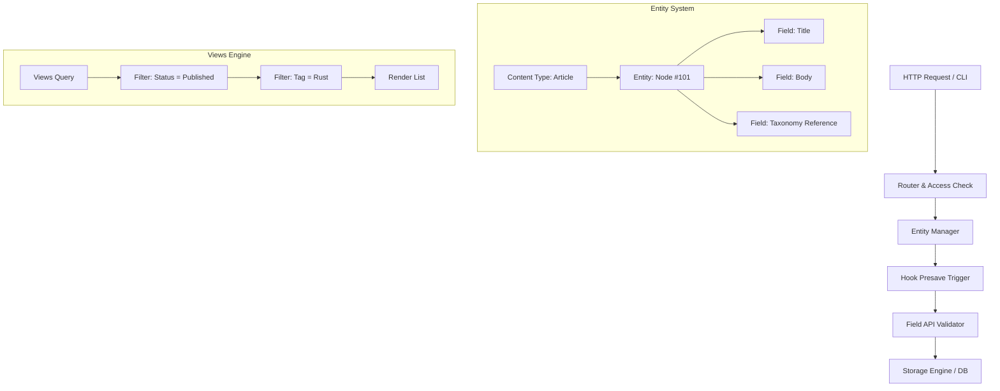

# 💧 Alternativer Ansatz: Eine Drupal-Entity-Engine in Rust nachbauen

In den vorherigen Kapiteln haben wir Markdown-Wikis, MediaWiki und die objektorientierten Strukturen von XWiki behandelt. Wenn es um extrem flexible, skalierbare Enterprise-Content-Management-Systeme geht, führt kein Weg an **Drupal** vorbei.

Drupal treibt globale Regierungsportale, Universitäten und Großkonzerne an. Der Schlüssel zu Drupals Flexibilität ist das **Entity & Field System** in Kombination mit einer **Hook-/Event-Architektur**. In diesem Kapitel lernst du, wie du eine solche Drupal-Engine typsicher in Rust entwirfst.

---

## 🧠 Theorie & Architektur: Das Drupal Entity & Event Modell

In Drupal ist fast alles eine **Entity** (Inhaltselement): Artikel, Benutzer, Produkte, Taxonomie-Begriffe oder Kommentare. Anstatt starrer Datenbanktabellen verwendet Drupal ein dynamisches **Field API**, mit dem Felder zur Laufzeit an beliebige Content-Typen angehängt werden können.

### Die 4 Grundsäulen einer Drupal-Engine in Rust

1. **Entity & Field API:** Universelle Datenknoten (`Node`), die beliebig konfigurierbare Felder (`Field`) besitzen.
2. **Taxonomie-System (Vocabularies & Terms):** Ein flexibles Schlagwort- und Kategorisierungssystem zur Strukturierung von Inhalten.
3. **Hook- & Event-System:** Eine Erweiterungsarchitektur, bei der Module in den Verarbeitungsablauf eingreifen können (z.B. `hook_node_presave`).
4. **Views Engine (Dynamischer Query-Builder):** Eine Abfrage-Engine, die Inhalte nach komplexen Feldkriterien filtert, sortiert und ausgibt.

---

### Die Bildmetapher: Der Baukasten-Aktenschrank

Stell dir Drupals Entity-System wie ein **variables Baukasten-Formular** vor:

```text
┌───────────────────────────────────────────────────────────────────────────────┐
│                      DER DRUPAL ENTITY-BAUKASTEN                              │
│                                                                               │
│  [ Content Type: "Artikel" ]                                                  │
│  ├── 📇 Basic Fields: ID, Titel, ErstelltAm, AutorID                          │
│  └── 🧩 Attached Fields (Field API):                                          │
│       ├── Field "field_image": ImageUrl("hero.png")                           │
│       ├── Field "field_tags": EntityRef(TermID 42 [Rust])                     │
│       └── Field "field_body": FormattedText("Rust ist schnell...")            │
│                                                                               │
│  ⚡ [ Hook Registry ] ──> Vor dem Speichern: validate_fields()                 │
└───────────────────────────────────────────────────────────────────────────────┘
```

- **Der Basis-Stempel (Entity):** Jede Entity hat eine eindeutige ID und einen Typ (`node`, `user`, `taxonomy_term`).
- **Die Anbau-Taschen (Field API):** Neue Felder können dynamisch definiert und an die Entity angehängt werden.
- **Die Kontrollstation (Hook-System):** Vor oder nach Aktionen (z.B. Speichern) feuert das System Events an angemeldete Module.

---

### Architektur-Übersicht in Mermaid



---

## 🏗️ Datenstruktur-Entwurf in Rust

Mit Rusts mächtigem Enums- und HashMap-System lässt sich Drupals flexibles Entity-Modell elegant modellieren:

```rust
use std::collections::HashMap;

/// Identifikator für verschiedene Entity-Typen
#[derive(Debug, Clone, PartialEq, Eq, Hash)]
pub enum EntityType {
    Node(String),       // z. B. Node("article"), Node("page")
    User,
    TaxonomyTerm(String), // z. B. TaxonomyTerm("tags"), TaxonomyTerm("categories")
}

/// Mögliche Feldtypen im Drupal-Style Field API
#[derive(Debug, Clone, PartialEq)]
pub enum FieldValue {
    Text(String),
    Integer(i64),
    Float(f64),
    Boolean(bool),
    EntityRef { target_type: String, target_id: u64 },
    List(Vec<FieldValue>),
}

/// Eine generische Drupal Entity
#[derive(Debug, Clone)]
pub struct Entity {
    pub id: u64,
    pub entity_type: EntityType,
    pub title: String,
    pub created_at: u64,
    pub updated_at: u64,
    pub fields: HashMap<String, FieldValue>,
}

/// Signatur für Event-Hooks (z.B. hook_node_presave)
pub type HookCallback = Box<dyn Fn(&mut Entity) -> Result<(), String> + Send + Sync>;

/// Registrierung aller System-Hooks
#[derive(Default)]
pub struct HookRegistry {
    pub presave_hooks: Vec<HookCallback>,
}
```

---

## 🛠️ Praxis-Aufgaben

Entwickle nun die Kernbausteine einer Drupal-Engine in Rust. Ergänze die Funktionsgerüste und achte auf typsichere Fehlerbehandlung!

### Aufgabe 1 (Leicht): Entity-Feld-Extraktor

Schreibe eine Hilfsmethode für die `Entity`-Struktur, die ein beliebiges Feld abfragt und als `Option<&String>` zurückgibt, wenn es sich um ein `FieldValue::Text` handelt.

```rust
impl Entity {
    /// Versucht, den Textwert eines Feldes auszulesen.
    pub fn get_text_field(&self, field_name: &str) -> Option<&String> {
        // TODO: Greife auf `self.fields` zu
        // TODO: Nutze Pattern Matching (match oder if let), um zu prüfen, ob es `FieldValue::Text` ist
        todo!("Implementiere get_text_field")
    }
}

#[cfg(test)]
mod tests {
    use super::*;

    #[test]
    fn test_get_text_field() {
        let mut fields = HashMap::new();
        fields.insert("field_subtitle".to_string(), FieldValue::Text("Rust Rocks".to_string()));
        
        let entity = Entity {
            id: 1,
            entity_type: EntityType::Node("article".to_string()),
            title: "Test".to_string(),
            created_at: 0,
            updated_at: 0,
            fields,
        };

        assert_eq!(entity.get_text_field("field_subtitle"), Some(&"Rust Rocks".to_string()));
    }
}
```

---

### Aufgabe 2 (Mittel): Hook-Dispatcher (`hook_node_presave`)

Entwickle die Ausführungslogik für das Hook-System. Vor dem Speichern einer Entity müssen alle registrierten `presave_hooks` nacheinander auf der Entity aufgerufen werden. Wenn ein Hook ein `Err` zurückgibt, bricht der Speichervorgang ab.

```rust
impl HookRegistry {
    /// Führt alle Presave-Hooks für eine Entity aus.
    pub fn trigger_presave(&self, entity: &mut Entity) -> Result<(), String> {
        // TODO: Iteriere über alle `self.presave_hooks`
        // TODO: Rufe den Callback mit `entity` auf
        // TODO: Bricht sofort ab, falls ein Callback ein Err zurückgibt
        todo!("Implementiere trigger_presave")
    }
}
```

*Leitfragen zur Lösung:*
- Wie hilft dir Rusts `?`-Operator oder eine `for`-Schleife bei der sauberen Fehlerbehandlung?
- Warum ist die veränderbare Referenz (`&mut Entity`) notwendig, damit Hooks Felder verändern können (z.B. automatische Generierung eines Slugs)?

---

### Aufgabe 3 (Schwer): Die Views Query Engine

Schreibe eine Abfragefunktion `filter_entities`, die eine Liste von `Entity`-Instanzen anhand von Kriterien filtert (z.B. nur Entities eines bestimmten `EntityType` und mit einem bestimmten Tag-EntityRef).

```rust
pub struct ViewFilter {
    pub target_entity_type: EntityType,
    pub required_field_name: String,
    pub required_ref_id: u64,
}

/// Filtert eine Liste von Entities analog zu einem Drupal "View"
pub fn execute_view(entities: &[Entity], filter: &ViewFilter) -> Vec<Entity> {
    // TODO: Filter die Entities mit Rust-Iteratoren (.iter().filter(...))
    // TODO: Prüfe den EntityType
    // TODO: Prüfe, ob das geforderte Feld existiert und als `FieldValue::EntityRef` auf `required_ref_id` zeigt
    todo!("Implementiere die Views-Abfrage")
}
```

---

## 🚀 Compiler- / Praxis-Experimente

1. **Taxonomie-Baumauflösung:**
   Entwirf eine Struktur `TaxonomyVocabulary`, die hierarchische Begriffe (Parent -> Child Terms) verwaltet. Schreibe eine Funktion, die alle untergeordneten Begriffe eines Elternbegriffs rekursiv auflöst.

2. **Entity Access Control (`hook_entity_access`):**
   Erweitere das Hook-System um Berechtigungsprüfungen (View, Update, Delete) für verschiedene Benutzerrollen (z. B. `Anonymous`, `Authenticated`, `Administrator`).

---

## 💡 Zusammenfassung: CMS-Architekturen im Vergleich

| Feature | Drupal Engine | MediaWiki Engine | XWiki Engine |
| :--- | :--- | :--- | :--- |
| **Hauptfokus** | Entity & Field Baukasten | Enzyklopädie & Wikitext | Enterprise Spaces & Objects |
| **Datenverknüpfung** | Taxonomien & Entity References | Wikilinks & Kategorien | Hierarchische Spaces |
| **Erweiterbarkeit** | Hook- & Event-System | Vorlagen & Parser-Funktionen | Makros & XClasses |
| **Abfragesystem** | Views (Dynamische Filter Engine) | Spezialseiten & Kategorien | Live Data & SQL/HQL |

---

## 📚 Links

* [Offizielle Drupal Architecture Docs](https://www.drupal.org/docs/8/api)
* [Konzept: Enums & Pattern Matching](file:///home/thorsten/Anfaenger/rust-projekte/src/konzept-enums.md)
* [Konzept: Iteratoren & Closures](file:///home/thorsten/Anfaenger/rust-projekte/src/konzept-iteratoren.md)
* [Wissenssystem Stufe 3: Das interaktive Web-Wiki](file:///home/thorsten/Anfaenger/rust-projekte/src/wissenssystem-3-web-wiki.md)
