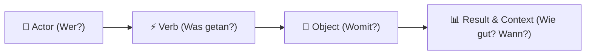

# 📊 LMS-Erweiterung 2: xAPI Analytics & Learning Record Store (LRS)

Willkommen zum zweiten Erweiterungsmodul unseres Learning Management Systems (LMS)! In diesem Kapitel tauchen wir tief in die Welt der **lernbezogenen Datenanalytik (Learning Analytics)** ein. Wir lernen den Industriestandard **xAPI** (Experience API, früher bekannt als *Tin Can API*) kennen und erfahren, wie wir in Rust einen performanten und typsicheren **Learning Record Store (LRS)** aufbauen.

---

## 🚀 1. Einleitung & Vision: Standardisierte Lern-Analytik mit xAPI

Stell dir vor, du absolvierst einen Rust-Kurs. Du liest Kapitel im Buch, löst Aufgaben im Terminal, schaust ein Video-Tutorial und diskutierst im Forum. Traditionelle LMS-Systeme (wie klassisches SCORM) konnten früher nur erfassen: *"Hat der User den Kurs bestanden? Ja/Nein."*

Das ist im Zeitalter des modernen, verteilten Lernens viel zu wenig!

Hier kommt **xAPI** ins Spiel. xAPI ist ein freier Open-Source-Standard zur Verfolgung von Lernerfahrungen – egal wo, wann und auf welchem Gerät sie stattfinden. Mit xAPI erfassen wir jede Interaktion in Form von präzisen Event-Streams. 

Unsere Vision für das Rust-LMS: Wir möchten einen eigenen **Learning Record Store (LRS)** bauen, der Millionen von Lern-Events in Echtzeit empfangen, filterfeste Abfragen ausführen und wertvolle Insights für Lernende und Dozenten generieren kann.

---

## 🧠 2. Die Bildmetapher: Der Flugschreiber des Lern-Flugzeugs

Stell dir eine moderne Passagiermaschine auf dem Flug von "Rust-Anfänger" zu "Rust-Profi" vor.

```
       ✈️  "Lern-Flugzeug" (User lernt im LMS, CLI, Simulator...)
       │
       ▼  (Erzeugt kontinuierlich Telemetrie-Daten / xAPI Statements)
+-------------------------------------------------------------+
|              📟 DER FLUGSCHREIBER (Black Box / LRS)          |
|                                                             |
| [ Thorsten ]  ➡️  [ hat absolviert ]  ➡️  [ Quiz: Ownership ]|
| [ Anna     ]  ➡️  [ hat gestartet  ]  ➡️  [ Video: Lifetimes]|
| [ Maria    ]  ➡️  [ hat fehlgeschlagen]➡️ [ Test: Mutability]|
+-------------------------------------------------------------+
       │
       ▼  (Analyse & Auswertung)
📊 Dashboard / Auswertung für Fluglotsen (Lehrende & Lernende)
```

Ein **Flugschreiber** (Blackbox) registriert während des gesamten Fluges unaufhörlich Daten: Ausgeschlagene Ruder, Flughöhe, Triebwerksleistung und Funksprüche. Er bewertet nichts direkt, sondern speichert unveränderlich (*append-only*), was wann passiert ist.

Genau das ist der **Learning Record Store (LRS)**: Er ist der unbestechliche Flugschreiber deines LMS. Jede Lernaktivität ist ein Datenpunkt in diesem Flugschreiber.

---

## 🏗️ 3. Architektur & xAPI-Standard

### Das xAPI Statement Tripel
Ein xAPI-Statement ist wie ein Grammatik-Satz aufgebaut: **Subjekt - Verb - Objekt** (Actor - Verb - Object).



Die Kernbestandteile eines xAPI Statements:
1. **Actor ("Wer?"):** Identifiziert den Lernenden (z. B. Name, E-Mail oder eindeutige User-ID).
2. **Verb ("Was getan?"):** Die ausgeführte Aktion (z. B. `completed`, `attempted`, `passed`, `failed`, `answered`).
3. **Object ("Womit?"):** Das Lernobjekt oder die Aktivität (z. B. ein Quiz, ein Video, eine Übungsaufgabe).
4. **Result & Context (Optional):** Zusatzinformationen wie Testergebnis (Score 95%), benötigte Zeit, Erfolgsstatus oder Systemumgebung.

#### Beispiel-Tripel:
* `("Student Thorsten", "completed", "Quiz Rust Ownership", score: 95%, timestamp: "2026-07-23T12:00:00Z")`
* `("Studentin Anna", "watched", "Video: Lifetimes erklärt", progress: 80%, timestamp: "2026-07-23T12:05:00Z")`

### Der Learning Record Store (LRS)
Der **LRS** ist die spezialisierte Datenbank, die ausschließlich für das Entgegennehmen, Validieren, Speichern und Abfragen dieser xAPI Statements zuständig ist. In Rust können wir einen LRS extrem speichereffizient und thread-sicher umsetzen.

---

## ⚙️ 4. Code-Gerüst & Typen-Design

Lass uns nun die Datenstrukturen für unsere xAPI-Engine definieren. Achte darauf, wie Rusts Structs und Traits uns helfen, den Standard typsicher abzubilden.

> ⚠️ **WICHTIGER HINWEIS:** Die folgenden Code-Beispiele enthalten `todo!()`-Platzhalter. Deine Aufgabe ist es, die Logik selbst zu entwickeln!

```rust
use std::collections::HashMap;

/// Identifiziert den Lernenden (Actor)
#[derive(Debug, Clone, PartialEq)]
pub struct Agent {
    pub id: String,
    pub name: String,
    pub email: String,
}

/// Das Verb beschreibt die Aktion (z. B. "completed", "attempted")
#[derive(Debug, Clone, PartialEq)]
pub struct Verb {
    pub id: String,          // Oft eine URI, z. B. "http://adlnet.gov/expapi/verbs/completed"
    pub display_name: String,// "completed"
}

/// Das Objekt / die Aktivität
#[derive(Debug, Clone, PartialEq)]
pub struct Activity {
    pub id: String,
    pub title: String,
}

/// Testergebnisse und Zusatzmetriken
#[derive(Debug, Clone, PartialEq)]
pub struct ResultData {
    pub score_raw: f32,      // z. B. 95.0
    pub score_max: f32,      // z. B. 100.0
    pub success: Option<bool>,
    pub duration_seconds: Option<u64>,
}

/// Das zentrale xAPI Statement (Der Logbuch-Eintrag)
#[derive(Debug, Clone, PartialEq)]
pub struct XApiStatement {
    pub actor: Agent,
    pub verb: Verb,
    pub object: Activity,
    pub result: Option<ResultData>,
    pub timestamp: String,   // ISO-Zeitstempel (z. B. "2026-07-23T13:00:00Z")
}

/// Der Learning Record Store (LRS)
pub struct LearningRecordStore {
    statements: Vec<XApiStatement>,
}

impl LearningRecordStore {
    /// Erstellt einen neuen, leeren LRS
    pub fn new() -> Self {
        Self {
            statements: Vec::new(),
        }
    }

    /// Speichert ein neues xAPI Statement im LRS
    pub fn record_statement(&mut self, statement: XApiStatement) {
        self.statements.push(statement);
    }

    /// Filtert Statements nach optionaler Actor-ID und/oder Verb-ID
    pub fn query_statements(
        &self,
        actor_id: Option<&str>,
        verb_id: Option<&str>,
    ) -> Vec<&XApiStatement> {
        // TODO: Implementiere das Filtern der Statements!
        // Leitfrage: Wie kannst du iter() und filter() kombinieren, um 
        // sowohl actor_id als auch verb_id optional zu prüfen?
        todo!("Filtere self.statements anhand von actor_id und verb_id");
    }
}
```

### Denkanstöße für die Implementierung
1. **Iteratoren nutzen:** In Rust ist `self.statements.iter()` ideal, um durch die Referenzen zu wandern.
2. **Option-Matching:** Überlege, wie du mit `if let Some(id) = actor_id` oder `.all(...)` die optionalen Filter elegant verknüpfst.

---

## 🧪 5. Übungsaufgaben

Hier kannst du dein neues Wissen praktisch anwenden. Löse die drei Aufgaben Schritt für Schritt!

### 🟢 Aufgabe 1 (Leicht): Verb-Filter im LRS
**Ziel:** Vervollständige die Methode `query_statements`.
- Schreibe einen Unittest `test_query_by_verb`, der testet, ob nur Statements mit dem Verb `"completed"` zurückgegeben werden.
- **Denkanstoß:**
  ```rust
  #[test]
  fn test_query_by_verb() {
      // 1. Erstelle einen LRS und füge 3 Statements mit verschiedenen Verben hinzu
      // 2. Rufe lrs.query_statements(None, Some("completed")) auf
      // 3. Überprüfe mit assert_eq!(), ob die Anzahl der Treffer stimmt
  }
  ```

---

### 🟡 Aufgabe 2 (Mittel): Lernzeit-Aggregation per Student
**Ziel:** Berechne die gesamte gebuchte Lernzeit (`duration_seconds`) für einen bestimmten Studenten über alle Aktivitäten hinweg.
- Erstelle eine Funktion:
  ```rust
  pub fn total_learning_time(lrs: &LearningRecordStore, actor_id: &str) -> u64 {
      todo!("Summiere alle duration_seconds aus den ResultData aller Statements von actor_id");
  }
  ```
- **Leitfragen:**
  - Nicht jedes Statement hat ein `result` oder `duration_seconds`! Wie gehst du sicher mit `Option<ResultData>` um (`filter_map`)?
  - Welcher Iterator-Befehl eignet sich hervorragend zum Aufsummieren von Werten? (`sum()`)

---

### 🔴 Aufgabe 3 (Schwer): Realtime xAPI Analytics Stream mit Tokio & Channels
**Ziel:** In einer echten Anwendung treffen xAPI Statements asynchron aus vielen Quellen ein. Baue einen Event-Stream!
- Nutze `tokio::sync::mpsc` (Multi-Producer, Single-Consumer Channel), um einen asynchronen xAPI-Receiver zu bauen.
- **Pseudocode / Konzeptionelles Gerüst:**
  ```rust
  // Pseudocode - Entwickle die asynchrone Schleife selbst!
  // async fn process_xapi_stream(mut receiver: mpsc::Receiver<XApiStatement>, lrs: Arc<Mutex<LearningRecordStore>>) {
  //     while let Some(statement) = receiver.recv().await {
  //         // 1. Thread-sicher in den LRS eintragen
  //         // 2. Falls Verb = "failed", Warnung auf der Konsole ausgeben!
  //         todo!()
  //     }
  // }
  ```
- **Herausforderung:** Wie schützt du den `LearningRecordStore` vor concurrent writes, wenn mehrere Tasks gleichzeitig Statements senden? (Stichwort: `Arc<Mutex<...>>`).

---

## 🎯 6. Zusammenfassung

| Konzept | Erklärung | Rust-Entsprechung |
| :--- | :--- | :--- |
| **xAPI Statement** | Grammatikalisch aufgebautes Event (Actor + Verb + Object) | `struct XApiStatement` |
| **LRS (Learning Record Store)** | Append-only Event-Speicher für Lernaktivitäten | `struct LearningRecordStore` |
| **Analytics Query** | Filtern und Aggregieren von Events nach Lernenden/Aktionen | Iteratoren, `filter()`, `filter_map()`, `sum()` |
| **Realtime Stream** | Asynchrones Verarbeiten von Event-Streams in Echtzeit | Async Rust, `tokio::sync::mpsc`, `Arc<Mutex<T>>` |

Mit einem xAPI-fähigen LRS legst du den Grundstein für datengetriebene Didaktik, adaptive Lernpfade und maßgeschneidertes Feedback in deinem Rust-LMS! 🚀
