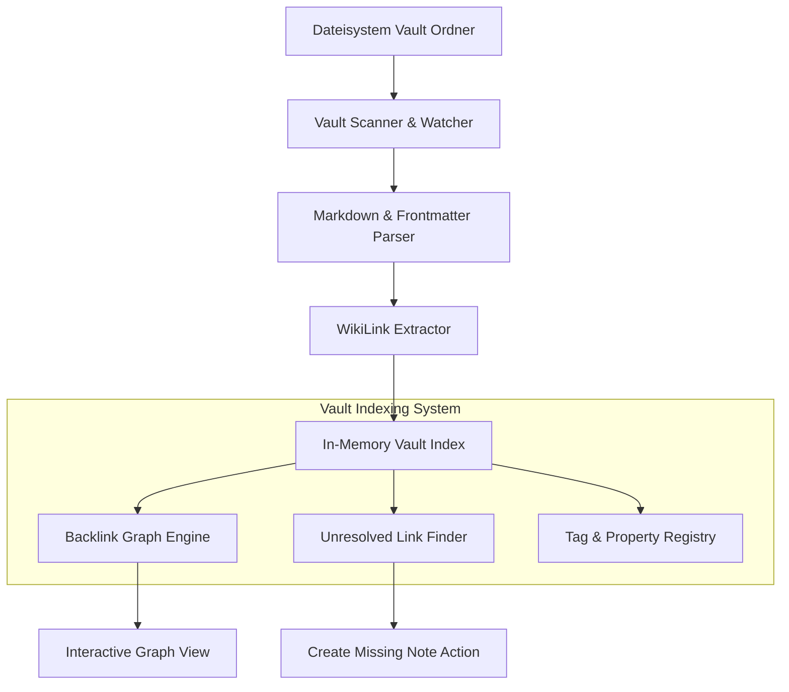

# 📓 Alternativer Ansatz: Eine Obsidian-Engine in Rust nachbauen

In vorherigen Kapiteln haben wir klassische CMS-Engines wie MediaWiki, XWiki, Drupal und TYPO3 untersucht. Doch für das persönliche Wissensmanagement (**Personal Knowledge Management / PKM**) hat sich ein ganz anderes Paradigma durchgesetzt: **Local-First Markdown-Vaults**, wie sie durch die App **Obsidian** populär wurden.

In diesem Kapitel lernst du, wie du eine **Obsidian-Engine in Rust** entwirfst. Wir bauen das Herzstück einer solchen App: Eine datenbanklose Vault-Indexierung mit WikiLinks (`[[Link]]`), YAML-Frontmatter-Parsing, Backlink-Graph und Unresolved-Link-Erkennung.

---

## 🧠 Theorie & Architektur: Das Local-First Vault Modell

Im Gegensatz zu klassischen CMS-Systemen gibt es bei Obsidian keine zentrale SQL-Datenbank. Alle Daten liegen als einfache `.md`-Dateien in einem Ordner auf der Festplatte (dem **Vault**).

### Die 4 Säulen einer Obsidian-Engine in Rust

1. **Local-First Vault Indexer:** Die Engine überwacht einen Ordner auf der Festplatte, liest Dateien ein und hält einen sauberen In-Memory-Index aller Notizen.
2. **WikiLinks & Unresolved Links:** `[[Notiz Name]]` verknüpft Seiten bidirektional. Verweist ein Link auf eine noch nicht existierende Datei, wird ein *Unresolved Link* im Graph markiert.
3. **YAML Frontmatter (Properties):** Metadaten am Anfang einer Notiz (`--- tags: [rust, pkm] ---`) werden isoliert und als strukturierte Key-Value-Paare geparst.
4. **Graph-Netzwerk (Nodes & Edges):** Das System berechnet aus allen Links einen mathematischen Graphen mit Knoten (Notizen) und Kanten (Referenzen).

---

### Die Bildmetapher: Die Wissens-Kartei mit Fadennetz

Stell dir eine Obsidian-Engine wie eine **historische Zettelkartei an einer Korkwand** vor:

```text
┌───────────────────────────────────────────────────────────────────────────────┐
│                      DIE OBSIDIAN KORKWAND (VAULT)                            │
│                                                                               │
│  [ Karteikarte: Rust.md ]                                                     │
│  ├── 📌 Kopfzeile (YAML Frontmatter): { tags: ["dev", "systems"] }            │
│  ├── 📄 Text: "Rust garantiert Speicher-Sicherheit durch [[Ownership]]."       │
│  └── 🧵 Wollfäden (WikiLinks):                                                │
│       ├── Faden zu [ Ownership.md ] (Ausgehende Referenz)                     │
│       └── Faden zu [ MemorySafety.md ] (Noch nicht als Datei existent!)        │
│                                                                               │
│  🧠 [ In-Memory Index ] ──> Berechnet Backlinks & Graph in Echtzeit           │
└───────────────────────────────────────────────────────────────────────────────┘
```

- **Die Karteikarte (Markdown-Datei):** Jede Datei existiert unabhängig auf dem Dateisystem.
- **Der Kopfzettel (Frontmatter):** Enthält strukturierte Tags, Erstellungsdatum und Eigenschaften.
- **Die Wollfäden (WikiLinks):** Verbinden Gedanken flexibel. Existiert eine Karte noch nicht, bleibt der Faden frei hängen (Unresolved Link).

---

### Architektur-Übersicht in Mermaid



---

## 🏗️ Datenstruktur-Entwurf in Rust

Um einen Obsidian Vault in Rust abzubilden, definieren wir typsichere Strukturen für Metadaten, Links und den Vault-Index:

```rust
use std::collections::{HashMap, HashSet};
use std::path::PathBuf;

/// Metadaten aus dem YAML-Frontmatter einer Notiz
#[derive(Debug, Clone, Default)]
pub struct NoteProperties {
    pub tags: Vec<String>,
    pub custom_fields: HashMap<String, String>,
}

/// Ein extrahierter WikiLink: [[Ziel-Notiz|Alias]]
#[derive(Debug, Clone, PartialEq, Eq, Hash)]
pub struct WikiLink {
    pub target_title: String,
    pub alias: Option<String>,
}

/// Eine einzelne Notiz im Obsidian Vault
#[derive(Debug, Clone)]
pub struct ObsidianNote {
    pub file_path: PathBuf,
    pub title: String,
    pub properties: NoteProperties,
    pub raw_content: String,
    pub outgoing_links: Vec<WikiLink>,
}

/// Der komplette Vault-Index im Arbeitsspeicher
#[derive(Debug, Default)]
pub struct ObsidianVault {
    /// Titel -> Notiz
    pub notes: HashMap<String, ObsidianNote>,
    /// Titel -> Liste von Titeln, die auf diese Notiz verweisen (Backlinks)
    pub backlinks: HashMap<String, HashSet<String>>,
    /// Verweise auf Notizen, die im Vault noch als Datei fehlen
    pub unresolved_links: HashSet<String>,
}
```

---

## 🛠️ Praxis-Aufgaben

Verwende das obige Vault-Modell, um die Kernfunktionen einer Obsidian-Engine in Rust Schritt für Schritt zu bauen.

### Aufgabe 1 (Leicht): WikiLink-Parser (`[[Link]]`)

Schreibe eine Funktion, die aus einem Fliesstext alle WikiLinks in der Form `[[Ziel]]` oder `[[Ziel|Alias]]` extrahiert.

```rust
/// Extrahierte WikiLinks aus einem Markdown-Text.
pub fn extract_wikilinks(content: &str) -> Vec<WikiLink> {
    // TODO: Suche nach Mustern der Form [[ ... ]]
    // TODO: Spalte den Inhalt am Trennzeichen '|', falls ein Alias existiert
    // TODO: Gib einen Vektor von `WikiLink` zurück
    todo!("Implementiere das Extrahieren von WikiLinks")
}

#[cfg(test)]
mod tests {
    use super::*;

    #[test]
    fn test_extract_wikilinks() {
        let text = "Rust nutzt [[Ownership]] und [[Borrowing|Leihen]] für Sicherheit.";
        let links = extract_wikilinks(text);
        
        assert_eq!(links.len(), 2);
        assert_eq!(links[0].target_title, "Ownership");
        assert_eq!(links[0].alias, None);
        assert_eq!(links[1].target_title, "Borrowing");
        assert_eq!(links[1].alias, Some("Leihen".to_string()));
    }
}
```

---

### Aufgabe 2 (Mittel): Vault-Index-Rebuilder & Backlink-Calculator

Wenn Notizen eingelesen werden, muss der `ObsidianVault` aktualisiert werden. Schreibe eine Methode `reindex_vault`, die alle ausgehenden Links durchgeht, die `backlinks`-Map füllt und nicht existierende Ziele in `unresolved_links` einträgt.

```rust
impl ObsidianVault {
    /// Berechnet die Backlinks und ungelösten Links für den gesamten Vault neu.
    pub fn reindex_links(&mut self) {
        // TODO: Leere `self.backlinks` und `self.unresolved_links`
        // TODO: Iteriere über alle Notizen in `self.notes`
        // TODO: Prüfe für jeden `outgoing_link`, ob das Ziel in `self.notes` existiert
        // TODO: Wenn ja -> trage den Quellnotiz-Titel in `self.backlinks[target]` ein
        // TODO: Wenn nein -> trage das Ziel in `self.unresolved_links` ein
        todo!("Implementiere die Backlink- und Unresolved-Link-Berechnung")
    }
}
```

*Leitfragen zur Lösung:*
- Wie hilft dir `HashSet::insert`, um doppelte Backlinks von derselben Seite zu verhindern?
- Warum ist die Unterscheidung zwischen existierenden Notizen und `unresolved_links` für die Graphansicht so wichtig?

---

### Aufgabe 3 (Schwer): YAML-Frontmatter-Parser

Notizen beginnen oft mit einem YAML-Frontmatter-Block, der zwischen zwei `---`-Zeilen eingeschlossen ist. Schreibe einen einfachen Parser, der diesen Block vom restlichen Markdown-Inhalt trennt und Tags extrahiert.

```example
---
tags: [rust, programming]
date: 2026-07-23
---
# Meine Notiz
...
```

```rust
pub struct ParsedNote {
    pub properties: NoteProperties,
    pub body_content: String,
}

/// Spaltet den Frontmatter-Block vom Markdown-Body ab.
pub fn parse_frontmatter(raw_file_content: &str) -> ParsedNote {
    // TODO: Prüfe, ob der Text mit "---" beginnt
    // TODO: Suche nach dem schließenden "---"
    // TODO: Extrahiere Zeilen wie "tags: [a, b]" aus dem Frontmatter-Teil
    // TODO: Gib die geparsten Properties und den verbleibenden Body-Text zurück
    todo!("Implementiere den Frontmatter-Parser")
}
```

---

## 🚀 Compiler- / Praxis-Experimente

1. **Echtzeit-File-Watcher (`notify` Crate):**
   Binde die popular Rust Crate `notify` ein, um den Vault-Ordner im Hintergrund zu überwachen. Wenn der Benutzer eine `.md`-Datei extern im Editor speichert, soll dein `ObsidianVault` automatisch die geänderte Notiz neu indexieren.

2. **Graph-Export im DOT / JSON-Format:**
   Schreibe eine Funktion `export_graph_json(&self) -> String`, die alle Notizen und Links in ein Format konvertiert, das von Frontend-Bibliotheken (wie D3.js oder Cytoscape) als interaktiver Wissensgraph gerendert werden kann.

---

## 💡 Zusammenfassung: Obsidian vs. Klassische Wikis

| Feature | Obsidian Local Vault | MediaWiki Engine | Drupal / TYPO3 CMS |
| :--- | :--- | :--- | :--- |
| **Speicherort** | Lokale `.md`-Dateien | Datenbank (MySQL/Postgres) | Datenbank & DB-Entities |
| **Verlinkung** | `[[WikiLinks]]` + Backlinks | `[[Wikitext]]` Links | Entity References |
| **Fehlende Seiten** | Ungelöste Links (Graph Node) | Roter Link (Erstellen) | 404 Nicht Gefunden |
| **Metadaten** | YAML Frontmatter | Infobox Vorlagen | Field API / Content Elements |
| **Einsatzbereich** | Personal Second Brain | Enzyklopädie & Knowledge Base | Enterprise Web-Auftritte |

---

## 📚 Links

* [Offizielle Obsidian Format-Spezifikation](https://help.obsidian.md/Editing+and+formatting/Basic+formatting_syntax)
* [Konzept: HashMaps & HashSets in Rust](file:///home/thorsten/Anfaenger/rust-projekte/src/konzept-hashmaps.md)
* [Wissenssystem Stufe 4: Das Zettelkasten-System mit Backlinks & Graph](file:///home/thorsten/Anfaenger/rust-projekte/src/wissenssystem-4-zettelkasten.md)
* [Wissenssystem: Personal Knowledge Management App](file:///home/thorsten/Anfaenger/rust-projekte/src/wissenssystem-pkm-second-brain-app.md)
