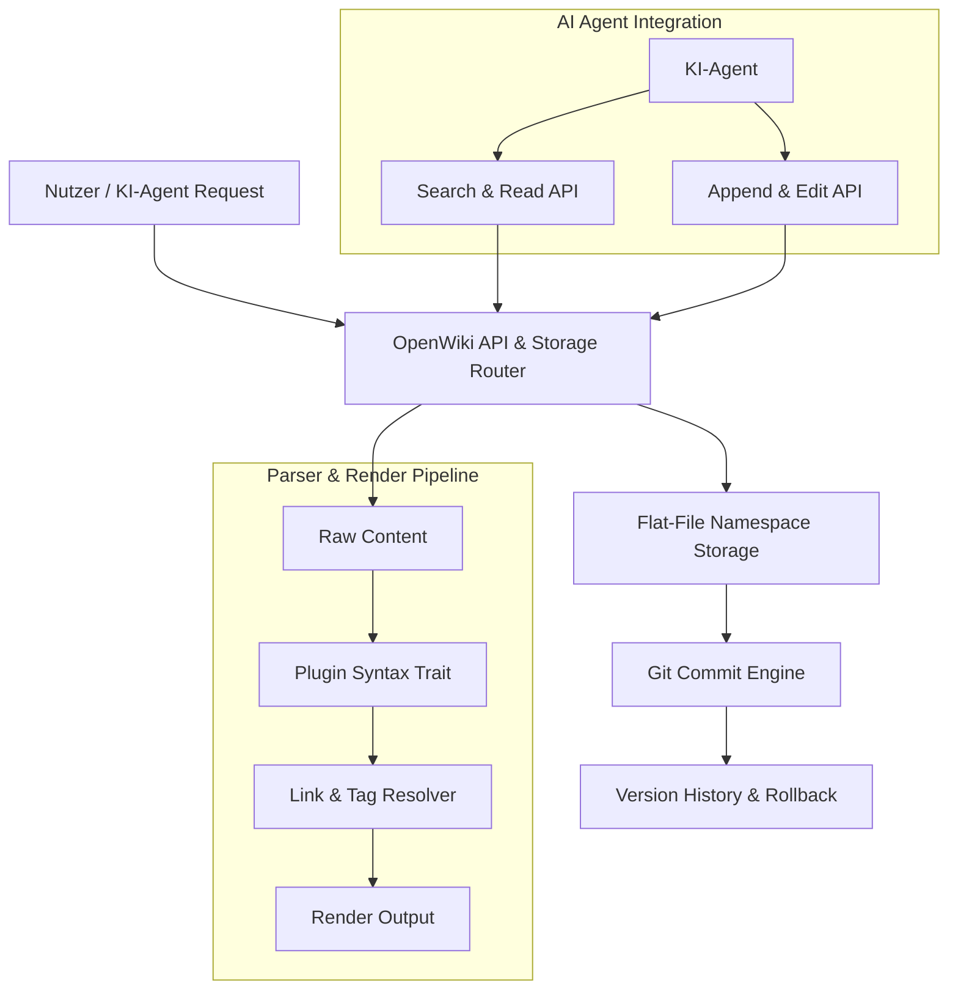

# 🌐 Alternativer Ansatz: Eine OpenWiki-Engine in Rust nachbauen

Neben Schwergewichten wie MediaWiki, XWiki oder dateibasierten Systemen wie Obsidian gibt es in der Open-Source-Welt die Philosophie der **OpenWikis** (wie DokuWiki, OpenWiki oder TiddlyWiki). Sie setzen auf **maximale Offenheit, Datenbanksicherheit ohne SQL (Flat-File Storage)**, **Git-basierte Revisionierung** und eine **offene API für KI-Agenten**.

In diesem Kapitel lernst du, wie du eine **OpenWiki-Engine in Rust** entwirfst. Wir verbinden eine schlanke Flat-File-Architektur mit einem modularen Plugin-Parser und einer Schnittstelle, die es KI-Agenten erlaubt, das Wiki als lebendes Gedächtnis zu lesen und zu erweitern.

---

## 🧠 Theorie & Architektur: Das Open-Architecture Wiki

Ein OpenWiki zeichnet sich dadurch aus, dass es ohne komplexe Datenbanksysteme auskommt. Alle Seiten, Revisionen und Metadaten liegen in einer transparenten Ordnerstruktur und können direkt per Dateisystem, Git-Commit oder API bearbeitet werden.

### Die 4 Säulen einer OpenWiki-Engine in Rust

1. **Flat-File Namespace Storage:** Seiten liegen in verschachtelten Verzeichnissen (z. B. `pages/projekte/rust.txt`), wodurch Verzeichnisse automatisch als Namensräume dienen.
2. **Git-backed Revisioning:** Jede Seitenänderung wird automatisch als Git-Commit erfasst, was verlustfreie Historien und einfache Rollbacks ermöglicht.
3. **Pluggable Parser Pipeline:** Die Engine ist nicht auf eine einzige Syntax festgelegt, sondern verarbeitet Markdown, Creole oder HTML über austauschbare Parser-Traits.
4. **Agent-Friendly Open API:** Eine leichtgewichtige REST/JSON-RPC-Schnittstelle, über die autonome KI-Agenten Seiten abfragen, analysieren und ergänzen können.

---

### Die Bildmetapher: Die offene Bibliothek mit automatischer Registratur

Stell dir ein OpenWiki wie eine **offene Bibliothek mit einem digitalen Archivschreiber** vor:

```text
┌───────────────────────────────────────────────────────────────────────────────┐
│                      DIE OPENWIKI-BIBLIOTHEK                                  │
│                                                                               │
│  [ Ordner: pages/dev/rust.txt ]                                              │
│  ├── 📄 Inhalt: Raw-Text (Markdown / Creole / Custom)                         │
│  ├── 📜 Git-Historie: Commit #a1b2c3 "Update Syntax-Beispiel"                 │
│  └── 🔌 Plugin-Pipeline: [Syntax Plugin] -> [Link Plugin] -> [HTML Render]    │
│                                                                               │
│  🤖 [ KI-Agent Interface ] ──> Liest & Schreibt Seiten per API                │
└───────────────────────────────────────────────────────────────────────────────┘
```

- **Das Regal (Flat-File):** Die Ordnerstruktur auf der Festplatte ist 1:1 die Navigationsstruktur im Wiki.
- **Der Protokollant (Git-Commit):** Jede Änderung wird mit Autor und Zeitstempel unveränderlich versiegelt.
- **Der KI-Hilfsbibliothekar (Agent API):** Ein Roboter kann Bücher aus dem Regal nehmen, zusammenfassen und neue Kapitel einsortieren.

---

### Architektur-Übersicht in Mermaid



---

## 🏗️ Datenstruktur-Entwurf in Rust

Hier ist der typsichere Entwurf für eine OpenWiki-Engine mit Trait-basierter Parser-Pipeline und Git-Anbindung in Rust:

```rust
use std::collections::HashMap;
use std::path::PathBuf;

/// Ein Namensraum-Pfad im OpenWiki (z. B. "projekte:rust:ownership")
#[derive(Debug, Clone, PartialEq, Eq, Hash)]
pub struct WikiPageId {
    pub namespace: Vec<String>,
    pub page_name: String,
}

/// Metadaten einer Wiki-Revision
#[derive(Debug, Clone)]
pub struct PageRevision {
    pub commit_hash: String,
    pub author: String,
    pub timestamp: u64,
    pub summary: String,
}

/// Trait für steckbare Parser-Plugins (z. B. Markdown, Creole, AsciiDoc)
pub trait SyntaxParser: Send + Sync {
    fn name(&self) -> &str;
    fn render_to_html(&self, raw_text: &str) -> String;
}

/// Das OpenWiki-Dokument
#[derive(Debug, Clone)]
pub struct OpenWikiPage {
    pub id: WikiPageId,
    pub file_path: PathBuf,
    pub raw_content: String,
    pub syntax_format: String,
    pub last_revision: Option<PageRevision>,
}

/// Zentrales OpenWiki Engine Repository
pub struct OpenWikiEngine {
    pub storage_root: PathBuf,
    pub parsers: HashMap<String, Box<dyn SyntaxParser>>,
    pub pages_cache: HashMap<WikiPageId, OpenWikiPage>,
}
```

---

## 🛠️ Praxis-Aufgaben

Verwende das obige OpenWiki-Datenmodell, um die Kernkomponenten der Engine schrittweise zu entwickeln.

### Aufgabe 1 (Leicht): WikiPageId Namespace-Resolver

Schreibe eine Funktion, die eine Wiki-ID im Format `"projekte:rust:ownership"` in einen System-Dateipfad wie `pages/projekte/rust/ownership.txt` umwandelt.

```rust
impl WikiPageId {
    /// Wandelt eine Wiki-ID ("namespace:page") in einen relativen Dateipfad um.
    pub fn to_file_path(&self, extension: &str) -> PathBuf {
        // TODO: Baue den Pfad aus den Teilen in `self.namespace` auf
        // TODO: Hänge `self.page_name` mit der Dateiendung an
        todo!("Implementiere to_file_path")
    }
}

#[cfg(test)]
mod tests {
    use super::*;

    #[test]
    fn test_to_file_path() {
        let page_id = WikiPageId {
            namespace: vec!["projekte".to_string(), "rust".to_string()],
            page_name: "ownership".to_string(),
        };

        let path = page_id.to_file_path("txt");
        assert_eq!(path, PathBuf::from("projekte/rust/ownership.txt"));
    }
}
```

---

### Aufgabe 2 (Mittel): Pluggable Syntax-Engine

Implementiere eine Registrierung `ParserRegistry`, die verschiedene Syntax-Parser (z. B. `MarkdownParser` oder `PlaintextParser`) veraltet und anhand des Formats den passenden Parser ausführt.

```rust
pub struct ParserRegistry {
    pub parsers: HashMap<String, Box<dyn SyntaxParser>>,
}

impl ParserRegistry {
    /// Rendert den Rohtext mit dem registrierten Parser für das gegebene Format.
    pub fn render(&self, format: &str, raw_text: &str) -> Result<String, String> {
        // TODO: Schlage den Parser in `self.parsers` für `format` nach
        // TODO: Wenn gefunden -> rufe `render_to_html` auf
        // TODO: Wenn nicht gefunden -> gib eine Fehlermeldung zurück
        todo!("Implementiere das dynamische Rendern")
    }
}
```

*Leitfragen zur Lösung:*
- Wie hilft dir Rusts `Box<dyn SyntaxParser>`, um verschiedene Parser-Typen in einer gemeinsamen `HashMap` zu speichern?
- Welchen Vorteil bietet dieses Trait-basierte Design, wenn Benutzer eigene Markup-Formate als Plugin ergänzen wollen?

---

### Aufgabe 3 (Schwer): KI-Agent API Interface

Schreibe eine API-Funktion `agent_append_section`, die es einem autonomen KI-Agenten erlaubt, eine neue Sektion (z. B. "## KI-Zusammenfassung") sicher an eine bestehende Seite anzuhängen, ohne bestehende Inhalte zu überschreiben.

```rust
/// Erlaubt einem KI-Agenten das strukturierte Anfügen von Inhalten an eine OpenWiki-Seite
pub fn agent_append_section(
    page: &mut OpenWikiPage,
    section_title: &str,
    agent_content: &str,
    agent_name: &str,
) -> Result<(), String> {
    // TODO: Formatiere den anzufügenden Text mit Überschrift und Agent-Autor-Footer
    // TODO: Hänge den formatierten Text an `page.raw_content` an
    // TODO: Aktualisiere die Revisions-Informationen
    todo!("Implementiere die KI-Agenten-Schreibschnittstelle")
}
```

---

## 🚀 Compiler- / Praxis-Experimente

1. **Git-Auto-Commit via Command/Library:**
   Erweitere den Speichervorgang so, dass bei jedem Aufruf von `save_page()` automatisch ein Git-Commit auf dem Vault-Ordner im Hintergrund ausgeführt wird (`git commit -m "Updated page XYZ by Author"`).

2. **Full-Text Inverted-Index Search:**
   Entwirf eine kleine Inverted-Index Suchmaschine für dein OpenWiki, damit sowohl Benutzer als auch KI-Agenten Begriffe blitzschnell über tausende Flat-File-Seiten hinweg finden können.

---

## 💡 Zusammenfassung: Wiki-Architekturen im Gesamtvergleich

| Feature | OpenWiki Engine | Obsidian Vault | MediaWiki Engine | XWiki / Drupal / TYPO3 |
| :--- | :--- | :--- | :--- | :--- |
| **Speicher** | Flat-Files in Ordnern | Lokale `.md`-Dateien | RDBMS (MySQL) | RDBMS & Formulare |
| **Versionierung** | Git-backed Commits | Keine (oder Plugins) | DB-Revisions-Tabelle | DB-Workspaces / Versionen |
| **Syntax** | Pluggable (Markdown/Creole) | Markdown + WikiLinks | Wikitext | Content Elements / Formulare |
| **KI-Agenten API** | Offene REST/JSON-API | Datei-Index API | MediaWiki Action API | Complex Entity API |
| **Fokus** | Offenheit & Entwickler | Personal Knowledge | Enzyklopädie | Enterprise Systems |

---

## 📚 Links

* [DokuWiki Architecture Manual](https://www.dokuwiki.org/devel:architecture)
* [Konzept: Traits & Dynamic Dispatch in Rust](file:///home/thorsten/Anfaenger/rust-projekte/src/konzept-traits.md)
* [Konzept: Dateizugriff & Dateisystem in Rust](file:///home/thorsten/Anfaenger/rust-projekte/src/konzept-eingabe.md)
* [Wissenssystem Stufe 3: Das interaktive Web-Wiki](file:///home/thorsten/Anfaenger/rust-projekte/src/wissenssystem-3-web-wiki.md)
