# 🔍 Profi-Baustein 1: Die eigene Volltext-Suchmaschine (Inverted Index & BM25)

Willkommen zu den Profi-Bausteinen deines eigenen Wissenssystems! In diesem Kapitel wirst du lernen, wie moderne Suchmaschinen wie Elasticsearch, Meilisearch oder Google blitzschnell Millionen von Notizen durchsuchen – und wie du deine eigene Volltext-Suchmaschine in Rust von Grund auf aufbaust.

---

## 🚀 Einleitung & Vision: Millisekunden-Suche in Millionen Notizen

Stell dir vor, dein persönliches Wissenssystem wächst über die Jahre auf zehntausende Notizen, Artikel und Markdown-Dateien an. Wenn du nach einem bestimmten Begriff suchst – zum Beispiel *"Ownership in Async Rust"* –, möchtest du das Ergebnis in Bruchteilen einer Millisekunde auf dem Bildschirm haben.

Wenn du mit einer einfachen Schleife jede Datei Zeile für Zeile durchsuchst (`file_text.contains(query)`), dauert die Suche bei 100.000 Dokumenten mehrere Sekunden. Das ist für eine flüssige Nutzung viel zu langsam!

In diesem Profi-Baustein erlernst du die Architektur moderner Volltext-Suchmaschinen:
* Einen **Inverted Index** (umgekehrten Index), der die Suchzeit von *linear* \(O(N)\) auf *konstant* \(O(1)\) beschleunigt.
* Eine **Text-Processing-Pipeline** (Tokenisierung, Lowercasing, Stopwort-Filterung).
* Den **BM25-Ranking-Algorithmus**, der Suchergebnisse nicht nur findet, sondern nach ihrer tatsächlichen *Relevanz* sortiert.

---

## 🧠 Die Bildmetapher: Der Schlagwort-Index am Ende des Lexikons

Stell dir vor, du hast ein 20-bändiges Lexikon im Regal stehen und suchst alle Informationen zum Thema **"Rust"**.

### Der naive Ansatz: Sequenzielles Durchsuchen
Du schlägst Band 1 auf Seite 1 auf und liest Seite für Seite durch. Nach Band 1 nimmst du Band 2. Das dauert Tage! In der Informatik entspricht das der linearen Suche durch alle Dokumente.

### Der professionelle Ansatz: Der Inverted Index
Du greifst direkt zum allerletzten Band der Enzyklopädie. Ganz hinten befindet sich das **Stichwortverzeichnis (Index)**. Dort sind die Begriffe alphabetisch sortiert:

```text
...
Option     ---> Band 1 (S. 99), Band 3 (S. 45)
Ownership  ---> Band 3 (S. 42), Band 7 (S. 110), Band 12 (S. 15)
Rust       ---> Band 2 (S. 12), Band 5 (S. 200), Band 18 (S. 88)
...
```

Statt das gesamte Lexikon durchzulesen, schlägst du das Wort **"Rust"** nach und erhältst sofort eine Liste aller Bände und Seitenzahlen, auf denen das Wort vorkommt!

Genau das ist ein **Inverted Index** (Umgekehrter Index): 
Statt *Dokument -> Wörter* speichern wir *Wort -> Liste von Dokumenten*.

---

## 🏗️ Architektur & Datenstrukturen

Eine Volltext-Suchmaschine besteht im Wesentlichen aus zwei Hauptkomponenten: der **Textverarbeitungs-Pipeline** und dem **Inverted Index mit Relevanz-Ranking**.

### 1. Die Textverarbeitungs-Pipeline (Tokenisierung)

Bevor ein Text in den Index wandert, muss er gesäubert und in Wörter (Tokens) zerlegt werden. 

```mermaid
graph LR
    A["Rohtext: 'Rust ist EINE tolle Sprache!'"] --> B["1. Tokenisierung & Sanitizing"]
    B --> C["['Rust', 'ist', 'EINE', 'tolle', 'Sprache']"]
    C --> D["2. Lowercasing"]
    D --> E["['rust', 'ist', 'eine', 'tolle', 'sprache']"]
    E --> F["3. Stopword-Filtering"]
    F --> G["['rust', 'tolle', 'sprache']"]
    G --> H["4. Terme im Index"]
    H --> I["Index: 'rust', 'tolle', 'sprache'"]
```



* **Tokenisierung:** Zerlegt den Fließtext an Satzzeichen und Leerzeichen in einzelne Wörter.
* **Lowercasing:** Wandelt alle Zeichen in Kleinbuchstaben um (`"Rust"` -> `"rust"`), damit die Suche unabhängig von Groß-/Kleinschreibung funktioniert.
* **Stopword-Filtering:** Entfernt bedeutungslose Füllwörter wie *"ist"*, *"eine"*, *"und"*, *"der"*. Diese Wörter kommen in fast jedem Dokument vor und liefern keinen Mehrwert für die Relevanz.
* **Stemming (Stammformenreduktion, optional):** Reduziert Wörter auf ihren Wortstamm (z. B. *"Programme"*, *"Programmierung"* -> *"programm"*).

### 2. Der Inverted Index (Datenstruktur)

In Rust bilden wir den Inverted Index mit einer `HashMap` ab:

* **Schlüssel (`Key`):** Das verarbeitete Suchwort (z. B. `"rust"`).
* **Wert (`Value`):** Eine Liste von Treffern, sogenannte **Postings**. Ein Posting speichert die Dokument-ID und die Häufigkeit des Wortes in diesem Dokument (**Term Frequency, TF**).

```rust
use std::collections::HashMap;

/// Identifiziert ein Dokument eindeutig
pub type DocumentId = usize;

/// Ein Eintrags-Treffer im Index für ein bestimmtes Wort
#[derive(Debug, Clone, PartialEq)]
pub struct Posting {
    pub doc_id: DocumentId,
    pub term_frequency: usize, // Wie oft kommt das Wort in DIESEM Dokument vor?
}

/// Der Haupt-Index für die Volltextsuche
#[derive(Debug, Default)]
pub struct InvertedIndex {
    /// Wort -> Liste von Dokument-Treffern
    pub index: HashMap<String, Vec<Posting>>,
    /// Gesamtanzahl der indizierten Dokumente
    pub doc_count: usize,
    /// Dokumentlängen (Anzahl Wörter) pro Dokument-ID
    pub doc_lengths: HashMap<DocumentId, usize>,
    /// Durchschnittliche Dokumentlänge im gesamten Korpus
    pub avg_doc_length: f64,
}
```

### 3. BM25 Relevanz-Ranking Formel

Warum reicht es nicht aus, einfach die Anzahl der Treffer zu zählen?
1. **Dokumentlänge:** Wenn das Wort "Rust" 5-mal in einer kurzen Notiz mit 20 Wörtern vorkommt, ist das Dokument extrem relevant. Wenn es 5-mal in einem Buch mit 100.000 Wörtern vorkommt, ist es eher eine Randnotiz.
2. **Seltenheit des Wortes (IDF):** Wenn du nach *"Rust Borrowing"* suchst: Das Wort *"Rust"* kommt in fast allen deiner Notizen vor, aber *"Borrowing"* nur in wenigen. Ein Treffer bei *"Borrowing"* muss daher viel höher gewichtet werden!

Hier kommt der Industriestandard **Okapi BM25** ins Spiel. Die Formel für den Score eines Dokuments $D$ bzgl. eines Suchbegriffs $q$ lautet:

$$\text{Score}(D, q) = \text{IDF}(q) \cdot \frac{f(q, D) \cdot (k_1 + 1)}{f(q, D) + k_1 \cdot \left(1 - b + b \cdot \frac{|D|}{\text{avgdl}}\right)}$$

* $f(q, D)$: Term Frequency (Häufigkeit des Wortes im Dokument).
* $|D|$: Länge des Dokuments in Wörtern.
* $\text{avgdl}$: Durchschnittliche Dokumentlänge aller Dokumente.
* $k_1$ (z. B. 1.2): Sättigungsparameter (verhindert, dass ein 100-faches Vorkommen den Score unendlich aufbläht).
* $b$ (z. B. 0.75): Stärke der Dokumentlängen-Bestrafung.
* $\text{IDF}(q) = \ln\left(1 + \frac{N - n(q) + 0.5}{n(q) + 0.5}\right)$: Inverse Document Frequency ($N$ = Gesamt-Dokus, $n(q)$ = Dokus mit Wort $q$).

---

## ⚙️ Code-Gerüst zum Selberbauen

Hier ist das didaktische Gerüst für deine Volltext-Suchmaschine. Deine Aufgabe ist es, die Kernlogiken an den mit `todo!()` markierten Stellen zu vervollständigen!

```rust
use std::collections::{HashMap, HashSet};

pub type DocumentId = usize;

#[derive(Debug, Clone, PartialEq)]
pub struct Posting {
    pub doc_id: DocumentId,
    pub term_frequency: usize,
}

#[derive(Debug, Clone, PartialEq)]
pub struct SearchResult {
    pub doc_id: DocumentId,
    pub score: f64,
}

#[derive(Debug, Default)]
pub struct InvertedIndex {
    pub index: HashMap<String, Vec<Posting>>,
    pub doc_count: usize,
    pub doc_lengths: HashMap<DocumentId, usize>,
    pub avg_doc_length: f64,
}

impl InvertedIndex {
    pub fn new() -> Self {
        Self::default()
    }

    /// Hilfsfunktion: Tokenisiert den Text, konvertiert in Kleinschreibung 
    /// und filtert einfache Stopwörter heraus.
    pub fn tokenize(text: &str) -> Vec<String> {
        let stopwords: HashSet<&str> = ["ist", "ein", "eine", "einen", "der", "die", "das", "und", "in", "mit"]
            .iter()
            .cloned()
            .collect();

        text.to_lowercase()
            .map(|c| if c.is_alphanumeric() { c } else { ' ' })
            .collect::<String>()
            .split_whitespace()
            .filter(|word| !stopwords.contains(*word))
            .map(|word| word.to_string())
            .collect()
    }

    /// Fügt ein neues Dokument zum Inverted Index hinzu.
    pub fn add_document(&mut self, doc_id: DocumentId, text: &str) {
        let tokens = Self::tokenize(text);
        let doc_len = tokens.len();

        if doc_len == 0 {
            return;
        }

        // 1. Zähle die Begriffshäufigkeiten (Term Frequencies) im Dokument
        let mut term_counts: HashMap<String, usize> = HashMap::new();
        for token in tokens {
            *term_counts.entry(token).or_insert(0) += 1;
        }

        // TODO: 2. Aktualisiere den Index (`self.index`) für jedes Wort!
        // Denkanstoß:
        // Für jedes (term, count) in `term_counts`:
        // Greife auf die Posting-Liste in `self.index` zu und hänge ein neues `Posting` an.
        // Vergiss nicht, `self.doc_count` und `self.doc_lengths` zu aktualisieren!
        
        todo!("Implementiere das Indizieren von Dokumenten!");
    }

    /// Berechnet die Inverse Document Frequency (IDF) für einen Begriff.
    pub fn calculate_idf(&self, term: &str) -> f64 {
        let docs_with_term = match self.index.get(term) {
            Some(postings) => postings.len(),
            None => return 0.0,
        };

        let n = docs_with_term as f64;
        let total_docs = self.doc_count as f64;
        
        ((total_docs - n + 0.5) / (n + 0.5) + 1.0).ln()
    }

    /// Berechnet den BM25-Score für ein Posting bzgl. eines Begriffs.
    pub fn calculate_bm25_score(&self, term: &str, posting: &Posting) -> f64 {
        let k1 = 1.2;
        let b = 0.75;

        let tf = posting.term_frequency as f64;
        let doc_len = *self.doc_lengths.get(&posting.doc_id).unwrap_or(&0) as f64;
        let idf = self.calculate_idf(term);

        // TODO: Berechne den vollständigen BM25-Score anhand der Formel!
        // Denkanstoß:
        // Nenner = tf + k1 * (1.0 - b + b * (doc_len / self.avg_doc_length))
        // Zähler = tf * (k1 + 1.0)
        // Score = idf * (Zähler / Nenner)
        
        todo!("Berechne den BM25 score")
    }

    /// Durchsucht den Index nach einer Abfrage und liefert sortierte Treffer zurück.
    pub fn search(&self, query: &str) -> Vec<SearchResult> {
        let query_tokens = Self::tokenize(query);
        let mut scores: HashMap<DocumentId, f64> = HashMap::new();

        for token in query_tokens {
            if let Some(postings) = self.index.get(&token) {
                for posting in postings {
                    let score = self.calculate_bm25_score(&token, posting);
                    *scores.entry(posting.doc_id).or_insert(0.0) += score;
                }
            }
        }

        // TODO: Wandle `scores` in eine `Vec<SearchResult>` um und sortiere
        // die Ergebnisse absteigend nach dem Score!
        // Tipp: `results.sort_by(|a, b| b.score.partial_cmp(&a.score)...)`
        
        todo!("Sortiere und liefere die Suchergebnisse zurück!")
    }
}
```

---

## 🧪 Übungsaufgaben

### 🥊 Leicht: Erweiterte Stopwort-Filterung
Erweitere die Funktion `tokenize()`, sodass sie nicht nur eine feste Liste von Wörtern filtert, sondern optional eine benutzerdefinierte Liste von Stopwörtern akzeptiert. Überlege dir auch, wie du Sonderzeichen und Zahlen sauber behandelst (z. B. mit `c.is_alphabetic()`).

### 🥊 Mittel: TF-IDF statt BM25
Implementiere eine vereinfachte Relevanz-Suche basierend auf **TF-IDF** (Term Frequency $\times$ Inverse Document Frequency), ohne die Dokumentenlängen-Normalisierung von BM25. Vergleiche die Suchergebnisse beider Algorithmen bei unterschiedlich langen Dokumenten. Welcher Algorithmus schneidet besser ab, wenn ein Dokument sehr kurz ist?

### 🥊 Schwer: Schreibfehler-Toleranz mit Trigrammen
Was passiert, wenn der Benutzer `"Rustt"` statt `"Rust"` eingibt? Ein exakter Inverted Index findet 0 Ergebnisse!
* **Aufgabe:** Baue eine fuzzy Suche mit N-Grammen (z. B. Trigrammen).
* Zerlege das Suchwort in 3-Gram-Häppchen (z. B. `"rust"` -> `["^ru", "rus", "ust", "st$"]`).
* Erstelle einen separaten Trigram-Index, der schreibfehlertolerante Ähnlichkeitssuche ermöglicht.

---

## 🎯 Zusammenfassung

| Konzept | Erklärung | Vorteil in Rust |
| :--- | :--- | :--- |
| **Inverted Index** | Wörter zeigen auf Listen von Dokumenten (`HashMap<String, Vec<Posting>>`). | $O(1)$ Nachschlagen statt $O(N)$ Volltextscan. |
| **Tokenisierung** | Text in Kleinbuchstaben zerlegen, Satzzeichen & Stopwörter entfernen. | Erhöht Trefferquote und reduziert Index-Größe. |
| **Term Frequency (TF)** | Gibt an, wie oft ein Wort im Dokument vorkommt. | Erfasst lokale Wortbedeutung. |
| **IDF** | Gewichtung seltener Begriffe gegenüber Alltagswörtern. | Wichtige Suchbegriffe zählen mehr. |
| **BM25 Ranking** | Verknüpft TF, IDF und Dokumentlängen-Normalisierung. | Industriestandard für faire Relevanzbewertung. |

Mit diesem Profi-Baustein hast du das Herzstück moderner Suchmaschinen verstanden und in Rust konzipiert!
