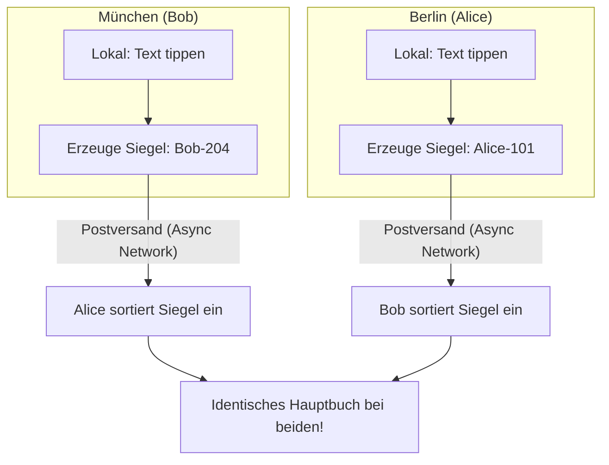

# 👥 Profi-Baustein 2: Echtzeit-Kollaboration mit CRDTs & Parallelem Schreiben

Willkommen im Profi-Segment deines Wissenssystems! In moderne Anwendungen wie Notion, Figma, Apple Notes oder Google Docs tippen mehrere Personen zeitgleich am selben Dokument – sogar im Flugzeug ohne Internetverbindung. Doch wie gelingt es einem verteilten System, alle Änderungen am Ende fehler- und konfliktfrei zusammenzuführen, ohne dass eine zentrale Instanz Texte einfach überschreibt?

In diesem Kapitel lernst du das fundamentale Konzept hinter **CRDTs (Conflict-free Replicated Data Types)** kennen und baust ein eigenes didaktisches Rust-Gerüst für kollaboratives Schreiben.

---

## 🚀 Einleitung & Vision: Das Ende von Merge-Konflikten

Wenn zwei Benutzer – nennen wir sie Alice und Bob – zeitgleich an derselben Notiz arbeiten, stoßen klassische Datenbanksysteme rasch an ihre Grenzen:

* **Sperren (Locking):** Blockiert den Schreibzugriff für alle anderen. Das führt zu Verzögerungen und funktioniert offline überhaupt nicht.
* **Zentraler Schiedsrichter (Operational Transformation / OT):** Benötigt stets einen erreichbaren Server, der jede Position neu berechnet.

**Die Vision mit CRDTs:** 
Alice und Bob können im Zug ohne Internet schreiben, löschen und umstrukturieren. Sobald sich ihre Geräte wieder finden (über Peer-to-Peer oder WebSocket-Server), tauschen sie ihre Änderungen aus. **Mathematisch garantiert** entsteht auf beiden Systemen exakt derselbe Dokumentenzustand (*Eventual Consistency*) – völlig frei von manuellen Konflikt-Dialogen!

---

## 🧠 Die Bildmetapher: Zwei Notare ohne Telefonverbindung

Stell dir zwei Notare vor – **Notarin Alice** in Berlin und **Notar Bob** in München. Beide führen jeweils eine identische Kopie eines wichtigen Hauptbuchs.



1. **Kein Anruf nötig:** Alice und Bob müssen nicht bei jedem geschriebenen Zeichen miteinander telefonieren, um Erlaubnis einzuholen.
2. **Die magischen Siegel (Eindeutige IDs):** Jedes geschriebene Zeichen bekommt ein fälschungssicheres Siegel auf das Blatt gedrückt: den Autorennamen und eine fortlaufende Zeitzähler-Nummer (z. B. `Alice-101`).
3. **Eindeutige Einreihungsregel:** In den Notizbüchern steht nicht *"Füge Buchstabe X an Position 5 ein"*, sondern *"Füge Buchstabe X DIREKT NACH Siegel Alice-100 ein"*.
4. **Postversand:** Wenn Bob abends die Briefe von Alice erhält, sortiert er die Zeichen nach den unumstößlichen Siegel-Regeln ein. Alice tut am nächsten Morgen dasselbe mit Bobs Briefen.

Egal in welcher Reihenfolge die Briefe eintreffen: Am Ende besitzen beide Notare ein **haargenau identisches Dokument**!

---

## 🏗️ Architektur & CRDT-Prinzipien

### 1. Was sind CRDTs?
**CRDT** steht für *Conflict-free Replicated Data Type*. Man unterscheidet zwei Grundarten:

* **Operation-based CRDTs (CmRDT):** Es werden nur die auszuführenden Operationen (z. B. *"Füge 'R' nach ID 12 ein"*) über das Netzwerk gesendet.
* **State-based CRDTs (CvRDT):** Es werden komplette Zustände gesendet und über eine mathematische *Join-Operation* (Halbverband / Semilattice) zusammengeführt.

### 2. Warum normale Array-Indizes bei Kollaboration versagen

Angenommen, im Dokument steht `"RUST"`.
* Alice möchte an Index 2 ein `'S'` einfügen (`"RUSST"`).
* Bob möchte zeitgleich Index 0 löschen (`"UST"`).

Wenn Bobs Löschung vor Alices Einfügung verarbeitet wird, landet Alices Buchstabe an der falschen Stelle! 

**Die CRDT-Lösung (RGA / Yjs-Prinzip):**
Jeder Buchstabe behält eine **globale, unveränderliche ID** (`CharId`). Ein Buchstabe merkt sich, hinter welchem Nachbarn er ursprünglich platziert wurde.

### 3. Tombstones: Warum gelöschtes nie sofort verschwindet
Wenn Bob ein Zeichen löscht, darf es nicht sofort aus dem Speicher gelöscht werden. Warum? Weil Alice eventuell zeitgleich einen neuen Buchstaben direkt *neben* dieses Zeichen setzen möchte!

Statt den Speicher freizugeben, wird das Zeichen mit einem **Tombstone** (Grabstein) markiert:
`deleted = true`. Erst wenn alle Clients die Löschung bestätigt haben, kann im Hintergrund aufgeräumt werden (*Garbage Collection*).

### 4. Lamport Timestamps & Kausale Ordnung
Um festzustellen, welches Zeichen vor welchem anderen geschrieben wurde, nutzen wir **Lamport-Uhren** (logische Zähler):

$$\text{Logische Zeit} = (\text{Zähler}, \text{Client-ID})$$

Wenn Zähler gleich sind, entscheidet die `client_id` als deterministischer Tie-Breaker.

---

## ⚙️ Code-Gerüst zum Selberbauen

Hier ist das didaktische Fundament für dein kollaboratives CRDT-Textsystem. Ergänze die Lücken überall dort, wo `todo!()` steht!

```rust
use std::cmp::Ordering;

/// Die eindeutige Identifikation eines einzelnen Zeichens im Netzwerk
#[derive(Debug, Clone, Copy, PartialEq, Eq, Hash)]
pub struct CharId {
    /// Die eindeutige ID des Autors / Clients (z. B. Alice = 1, Bob = 2)
    pub client_id: u64,
    /// Der logische Zähler (Lamport Clock) des Clients
    pub clock: u64,
}

impl PartialOrd for CharId {
    fn partial_cmp(&self, other: &Self) -> Option<Ordering> {
        Some(self.cmp(other))
    }
}

impl Ord for CharId {
    fn cmp(&self, other: &Self) -> Ordering {
        // Zuerst vergleichen wir die Uhrzeit, bei Gleichstand die Client-ID
        match self.clock.cmp(&other.clock) {
            Ordering::Equal => self.client_id.cmp(&other.client_id),
            ord => ord,
        }
    }
}

/// Ein einzelnes Element in unserem Sequence-CRDT
#[derive(Debug, Clone, PartialEq, Eq)]
pub struct CrdtTextChar {
    /// Die eindeutige ID dieses Buchstabens
    pub id: CharId,
    /// Der eigentliche Buchstabe
    pub value: char,
    /// Die ID des Zeichens, hinter dem dieser Buchstabe eingefügt wurde (None = Anfang)
    pub origin_left: Option<CharId>,
    /// Tombstone-Flag: true bedeutet, dass der Buchstabe gelöscht wurde
    pub deleted: bool,
}

/// Eine Operation, die über das Netzwerk an andere Clients gesendet wird
#[derive(Debug, Clone)]
pub enum CrdtOp {
    Insert(CrdtTextChar),
    Delete { target_id: CharId },
}

/// Das CRDT-Dokument eines lokalen Clients
#[derive(Debug, Default)]
pub struct CrdtDoc {
    pub client_id: u64,
    pub clock: u64,
    pub chars: Vec<CrdtTextChar>,
}

impl CrdtDoc {
    pub fn new(client_id: u64) -> Self {
        Self {
            client_id,
            clock: 0,
            chars: Vec::new(),
        }
    }

    /// Fügt lokal einen neuen Buchstaben hinter der angegebenen `origin_left`-ID ein.
    pub fn insert_local(&mut self, value: char, origin_left: Option<CharId>) -> CrdtOp {
        self.clock += 1;
        let id = CharId {
            client_id: self.client_id,
            clock: self.clock,
        };

        let new_char = CrdtTextChar {
            id,
            value,
            origin_left,
            deleted: false,
        };

        let op = CrdtOp::Insert(new_char.clone());
        self.apply_insert(new_char);
        op
    }

    /// Hilfsfunktion: Fügt ein `CrdtTextChar` an der korrekten Stelle im lokalen Vektor ein.
    fn apply_insert(&mut self, new_char: CrdtTextChar) {
        // TODO: Finde die richtige Einfügeposition für `new_char`.
        // Denkanstoß: 
        // 1. Suche nach der Position des Nachbarn `new_char.origin_left`.
        // 2. Bei gleichzeitigen Einfügungen am selben Nachbarn muss die `CharId`
        //    mittels Ord-Vergleich als Tie-Breaker dienen!
        todo!("Implementiere die Einfügelogik unter Berücksichtigung von origin_left und CharId-Ordnung")
    }

    /// Wendet eine entfernte Operation (Remote Op) auf das eigene Dokument an.
    pub fn merge_remote_op(&mut self, op: CrdtOp) {
        // Passen unsere eigene Zählerzeit an (Lamport Clock Synchronization)
        match op {
            CrdtOp::Insert(ref new_char) => {
                if new_char.id.clock > self.clock {
                    self.clock = new_char.id.clock;
                }
                self.apply_insert(new_char);
            }
            CrdtOp::Delete { target_id } => {
                // TODO: Finde den Buchstaben mit `id == target_id` im Vektor `chars`
                // und setze `deleted = true` (Tombstone).
                todo!("Implementiere das Markieren von Tombstones für entfernte Löschungen")
            }
        }
    }

    /// Liest den sichtbaren Text aus (filtert alle Zeichen mit `deleted == true` heraus).
    pub fn read_text(&self) -> String {
        // TODO: Filter alle nicht-gelöschten Zeichen heraus und sammle sie in einem String.
        todo!("Erstelle den sichtbaren Gesamttext aus den aktiven Zeichen")
    }
}
```

---

## 🧪 Übungsaufgaben

### Aufgabe 1 (Leicht): Char Deletion & Tombstone-Filtering 🟢
Implementiere die Methoden `read_text()` sowie die Löschlogik in `merge_remote_op()`.

```rust
#[test]
fn test_tombstone_deletion() {
    let mut doc = CrdtDoc::new(1);
    let op1 = doc.insert_local('R', None);
    let char_r_id = match op1 { CrdtOp::Insert(ref c) => c.id, _ => panic!() };

    doc.insert_local('U', Some(char_r_id));
    assert_eq!(doc.read_text(), "RU");

    // Lösche das 'R'
    doc.merge_remote_op(CrdtOp::Delete { target_id: char_r_id });

    // 'R' sollte aus dem Text verschwunden sein, aber im Speicher als Tombstone existieren!
    assert_eq!(doc.read_text(), "U");
    assert_eq!(doc.chars.len(), 2);
    assert!(doc.chars[0].deleted);
}
```

### Aufgabe 2 (Mittel): Deterministischer Tie-Breaker bei parallelen Editierungen 🟡
Ergänze `apply_insert()` so, dass bei gleichzeitigen Einfügungen am selben Vorgänger (`origin_left`) die `CharId` deterministisch bestimmt, welcher Buchstabe zuerst steht.

* **Leitfrage:** Wenn Alice (`client_id: 1`) und Bob (`client_id: 2`) gleichzeitig nach dem gleichen Ursprung schreiben, wie verhinderst du eine Endlosschleife oder falsche Sortierung?

### Aufgabe 3 (Schwer): Peer-to-Peer Sync Engine Simulation 🔴
Entwirf ein Test-Szenario mit zwei Instanzen `doc_alice` und `doc_bob`. 
1. Trenne die Verbindung (Netzwerk-Pause).
2. Führe auf beiden Dokumenten abweichende Einfüge- und Löschoperationen durch.
3. Tausche alle entstandenen `CrdtOp`-Objekte in ungeordneter Reihenfolge aus.
4. Prüfe mit `assert_eq!(doc_alice.read_text(), doc_bob.read_text())`, ob beide Seiten absolut identischen Text vorweisen!

---

## 🎯 Zusammenfassung

| Konzept | Beschreibung | Nutzen in Rust |
| :--- | :--- | :--- |
| **CRDT** | Conflict-free Replicated Data Type | Mathematisch garantierte Konvergenz ohne zentrale Sperren. |
| **CharId (Lamport Clock)** | Kombination aus logischem Zähler & Client-ID | Globale, eindeutige Sortierung aller Ereignisse. |
| **Tombstones** | Markieren gelöschter Daten statt direktem `remove()` | Verhindert verwaiste Zeiger bei verzögerten Netzwerk-Paketen. |
| **Eventual Consistency** | Alle Knoten erreichen bei gleichen Ops denselben Zustand | Basis für Offline-First & Echtzeit-Kollaboration. |

---

## 📚 Links & Weiterführendes
* **Yjs & Automerge:** Populäre Produktions-CRDT-Libraries in JavaScript und Rust.
* **RGA (Replicated Growable Array):** Das mathematische Papier hinter Sequenz-CRDTs.
* **Vector Clocks:** Die Erweiterung von Lamport-Uhren zur präzisen Erfassung kausaler Abhängigkeiten.
