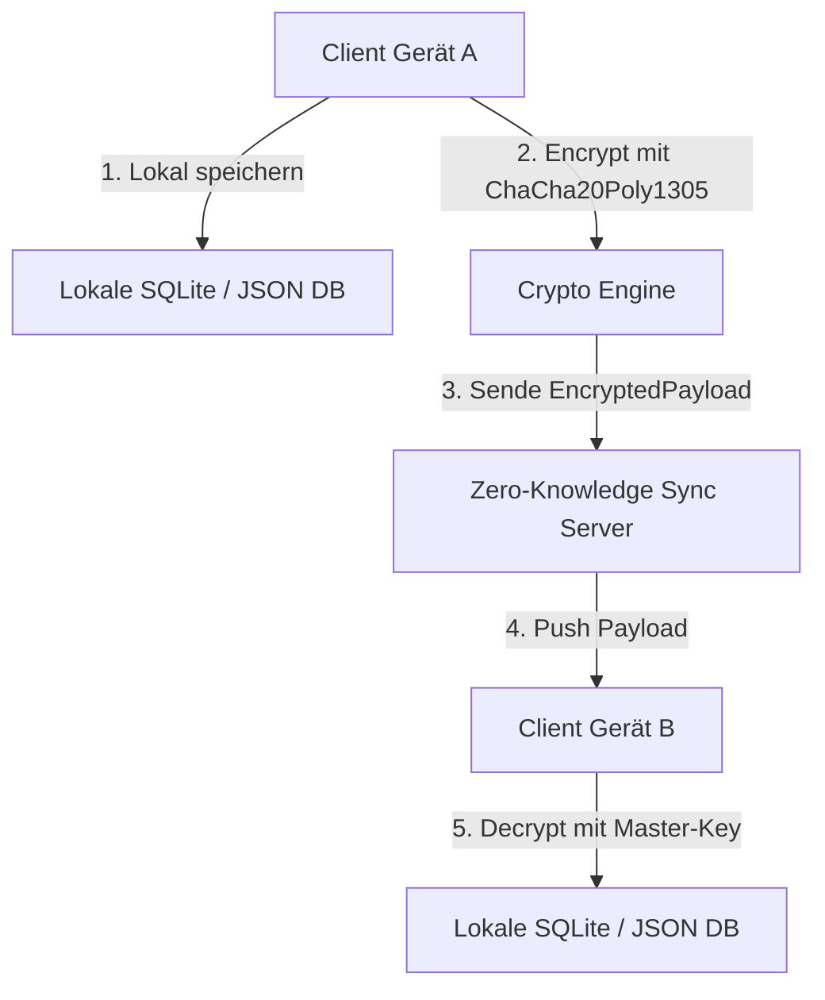

# 🔒 Profi-Baustein 4: Ende-zu-Ende verschlüsselte Synchronisation & Offline-First

Willkommen zum vierten Profi-Baustein unseres Wissenssystems! Bisher hast du gelernt, Notizen lokal zu verwalten, im Web bereitzustellen und als Zettelkasten sowie RAG-System abzufragen. Jetzt gehen wir den entscheidenden Schritt in Richtung **Datenschutz, Souveränität und Hochverfügbarkeit**: Wir bauen eine **Ende-zu-Ende verschlüsselte (E2EE) Offline-First Synchronisation**.

In diesem Kapitel lernst du, wie moderne Notiz-Systeme wie Obsidian, Signal oder Anytype aufgebaut sind: Deine Daten bleiben auch ohne Internetverbindung blitzschnell verfügbar, und wenn du synchronisierst, sieht der Cloud-Server zu keinem Zeitpunkt deine Inhalte im Klartext.

---

## 🚀 1. Einleitung & Vision: Privatsphäre & Offline-First

Stell dir vor, du sitzt im Zug im Funkloch. Du möchtest deine Gedanken aufschreiben, ein wichtiges Konzept aus deinem Zettelkasten nachschlagen oder eine neue Idee festhalten. Nichts ist frustrierender als ein rotierender Ladebalken, weil die App erst eine Cloud-API anfragen muss.

**Offline-First** dreht dieses Paradigma um:
1. **Lokale Datenbank als Single Source of Truth:** Alle Lese- und Schreiboperationen passieren sofort auf deiner lokalen SQLite- oder JSON-Datenbank. Null Verzögerung, volle Verfügbarkeit.
2. **Asynchrone Synchronisation:** Sobald wieder eine Netzwerkverbindung besteht, tauscht deine Anwendung Daten mit dem Server aus.
3. **Ende-zu-Ende Verschlüsselung (E2EE):** Bevor eine Notiz dein Gerät verlässt, wird sie kryptographisch versiegelt. Der Cloud-Server ist lediglich ein blinder Bote ("Zero-Knowledge Server").

---

## 🧠 2. Die Bildmetapher: Der versiegelte Diplomatentresor

Um das Zusammenspiel von E2EE und Synchronisation zu verstehen, hilft uns das Bild des **versiegelten Diplomatentresors**:

```text
┌──────────────────────────────────────────────────────────────────────────────────┐
│                         DER VERSIEGELTE DIPLOMATENTRESOR                         │
│                                                                                  │
│   [ Client A (Notebook) ]                                [ Client B (Smartphone) ]│
│   ┌─────────────────────┐                                ┌─────────────────────┐ │
│   │ Notiz im Klartext   │                                │ Entschlüsselte Notiz│ │
│   └──────────┬──────────┘                                └──────────▲──────────┘ │
│              │ (Master-Key A)                                       │ (Master-Key B)│
│              ▼                                                      │            │
│   ┌─────────────────────┐                                ┌──────────┴──────────┐ │
│   │ Diplomatentresor    │                                │ Diplomatentresor    │ │
│   │ (Ciphertext + Nonce)│                                │ (Ciphertext + Nonce)│ │
│   └──────────┬──────────┘                                └──────────▲──────────┘ │
│              │                                                      │            │
│              └───────────────► [ Zero-Knowledge Server ] ───────────┘            │
│                                (Sieht nur Tresore,                       │
│                                 keine Schlüssel!)                        │
└──────────────────────────────────────────────────────────────────────────────────┘
```

- **Dein Notizinhalt:** Deine vertraulichen Dokumente.
- **Der Master-Key:** Die Geheimzahl für das Kombinationsschloss. Nur du kennst sie. Weder der Server noch externe Dritte besitzen diesen Schlüssel.
- **Die Nonce & das Wachssiegel (Auth-Tag):** Ein einmaliger Stempel auf dem Tresor. Er garantiert, dass niemand unterwegs den Tresor ausgetauscht oder daran herumgepfuscht hat.
- **Der Kurierdienst (Zero-Knowledge Server):** Der Cloud-Server nimmt verschlossene Tresore entgegen, speichert sie und leitet sie an deine anderen Geräte weiter. Der Kurier weiß weder, was sich im Tresor befindet, noch kann er ihn öffnen.

---

## 🏗️ 3. Architektur & Kryptographie

Beim Entwurf unseres E2EE-Wissenssystems kombinieren wir drei fundamentale Säulen:



### A. Offline-First Prinzip
* Die lokale Datenbank (z. B. SQLite via `sqlx` oder JSON-Dateien) ist die **primäre Datenquelle**.
* Jede Änderung erhält einen lokalen Zeitstempel / Revisions-Counter sowie eine eindeutige UUID.
* Ein lokaler Sync-Worker überwacht geänderte Einträge und reiht sie in eine Warteschlange (`Outbox`-Pattern) ein.

### B. Authenticated Encryption (AEAD)
Klassische Verschlüsselung schützt nur vor dem Mitlesen. **AEAD (Authenticated Encryption with Associated Data)** schützt zusätzlich vor **Manipulation**:
* Wir nutzen moderne Chiffren wie `ChaCha20-Poly1305` oder `AES-256-GCM`.
* **Verschlüsselung (Encryption):** Verwandelt deine Notiz in unlesbaren Chiffretext.
* **Authentifizierung (Tag):** Erzeugt eine kryptographische Signatur über den Chiffretext. Wird auch nur ein einziges Bit verändert, schlägt die Entschlüsselung fehl.
* **Nonce (Number Used Once):** Eine kryptographisch zufällige 96-Bit-Zahl, die für **jede einzelne Verschlüsselung genau einmal** verwendet werden darf.

> [!CAUTION]
> **Kryptographisches Gebot:** Verwende eine Nonce niemals zweimal mit demselben Schlüssel! Eine doppelte Verwendung derselben Nonce kann die Geheimhaltung des Schlüssels oder des Klartexts gefährlich schwächen.

### C. Zero-Knowledge Cloud-Server
Der Server stellt lediglich REST- oder WebSocket-Endpunkte bereit, z. B.:
* `POST /sync/push`: Empfängt `EncryptedPayload` (enthält Notiz-ID, Version, Nonce, Chiffretext).
* `GET /sync/pull?since_version=42`: Liefert geänderte Payloads seit der letzten Synchronisation.

Der Server kennt weder Titellisten noch Schlüssel – für ihn existieren nur anonyme Byte-Blobs.

---

## ⚙️ 4. Code-Gerüst mit `todo!()`

Hier ist das architektonische Fundament für deine kryptographische Engine. Versuche, die Logik mithilfe der Denkanstöße und der Dokumentation der Crate `chacha20poly1305` oder `aes-gcm` zu vervollständigen!

```rust
use std::fmt;

/// Eigene Fehlerarten für kryptographische Operationen
#[derive(Debug)]
pub enum CryptoError {
    EncryptionFailed,
    DecryptionFailed,
    InvalidKeyLength,
    InvalidNonceLength,
}

impl fmt::Display for CryptoError {
    fn fmt(&self, f: &mut fmt::Formatter<'_>) -> fmt::Result {
        match self {
            CryptoError::EncryptionFailed => write!(f, "Fehler bei der Verschlüsselung der Notiz."),
            CryptoError::DecryptionFailed => write!(f, "Entschlüsselung fehlgeschlagen: Falscher Schlüssel oder Daten wurden manipuliert!"),
            CryptoError::InvalidKeyLength => write!(f, "Der Master-Schlüssel muss exakt 32 Bytes (256 Bit) lang sein."),
            CryptoError::InvalidNonceLength => write!(f, "Die Nonce besitzt eine ungültige Länge."),
        }
    }
}

impl std::error::Error for CryptoError {}

/// Der verschlüsselte Container, der gefahrlos über das Netzwerk gesendet werden kann.
#[derive(Debug, Clone, serde::Serialize, serde::Deserialize)]
pub struct EncryptedPayload {
    pub note_id: String,
    pub version: u64,
    pub nonce: Vec<u8>,
    pub ciphertext: Vec<u8>,
}

/// Verschlüsselt einen Notiz-String (JSON) mit einem 256-Bit Master-Schlüssel.
/// 
/// LEITFRAGEN & DENKANSTÖSSE:
/// 1. Wie generierst du 12 zufällige Bytes für die Nonce (z.B. mittels `rand::thread_rng()` oder `OsRng`)?
/// 2. Wie initialisierst du das Cipher-Objekt aus `chacha20poly1305::ChaCha20Poly1305` mit dem `master_key`?
/// 3. Wie wendest du `cipher.encrypt(&nonce, note_json.as_bytes())` an und behandelst eventuelle Fehler?
pub fn encrypt_note(
    note_id: &str,
    version: u64,
    note_json: &str,
    master_key: &[u8; 32],
) -> Result<EncryptedPayload, CryptoError> {
    // TIP: Erzeuge hier zuerst eine 12-Byte Nonce
    // UNVOLLSTÄNDIGES GERÜST:
    todo!("Implementiere die Authenticated Encryption (AEAD) für deine Notizen!")
}

/// Entschlüsselt ein `EncryptedPayload` und gibt den ursprünglichen JSON-String zurück.
/// 
/// LEITFRAGEN & DENKANSTÖSSE:
/// 1. Wie wandelst du den `Vec<u8>` der Nonce in eine feste Slice/GenericArray um?
/// 2. Was passiert, wenn jemand den Chiffretext im Transit um 1 Bit verändert hat?
///    (Das Decrypt-Ergebnis liefert `Err`, das du in `CryptoError::DecryptionFailed` umwandeln musst).
/// 3. Wie konvertierst du die entschlüsselten Bytes sicher in einen `String` (`String::from_utf8`)?
pub fn decrypt_note(
    payload: &EncryptedPayload,
    master_key: &[u8; 32],
) -> Result<String, CryptoError> {
    // UNVOLLSTÄNDIGES GERÜST:
    todo!("Implementiere die Entschlüsselung und Integritätsprüfung!")
}
```

---

## 🧪 5. Übungsaufgaben

Testen wir dein Kryptographie- und Systemverständnis! Löse die folgenden Aufgaben Schritt für Schritt in deinem Projekt.

### 🟢 Aufgabe 1: Sichere Schlüsselableitung (Leicht)
Manuelle 32-Byte Schlüssel sind für Benutzer unpraktisch. Niemand merkt sich 32 zufällige Hex-Bytes.
* **Ziel:** Implementiere eine Funktion `pub fn derive_master_key(password: &str, salt: &[u8]) -> [u8; 32]`, die mithilfe von **Argon2id** (Crate `argon2`) aus einem Benutzer-Passwort einen kryptographisch sicheren Master-Key ableitet.
* **Denkanstoß:** Warum reicht ein einfacher `SHA-256` Hash eines Passworts für Verschlüsselungsschlüssel **nicht** aus? Welche Rolle spielt das `salt`?

### 🟡 Aufgabe 2: Anti-Replay & Nonce-Sicherheit (Mittel)
Wenn ein Angreifer verschlüsselte Pakete abfängt, kann er sie eventuell später erneut an den Server senden (Replay-Angriff), selbst wenn er sie nicht lesen kann.
* **Ziel:** Erweitere das `EncryptedPayload` um eine zufällige Client-UUID und einen ansteigenden Revisions-Counter.
* **Denkanstoß:** Wie prüft der Client beim Entschlüsseln, ob ein empfangenes Paket veraltet ist oder erneut eingespielt wurde?

### 🔴 Aufgabe 3: Konfliktauflösung (Conflict Resolution) beim Sync (Schwer)
Was passiert, wenn du auf deinem Smartphone offline eine Notiz bearbeitest und gleichzeitig auf deinem Laptop dieselbe Notiz anpasst?
* **Ziel:** Entwirf ein Konzept oder ein kleines Rust-Trait `pub trait ConflictResolver` für den Offline-Sync.
* **Strategien zum Durchdenken:**
  1. **Last-Write-Wins (LWW):** Einfach, aber Datenverlust droht, wenn Uhren abweichen.
  2. **Vektor-Uhren (Vector Clocks):** Erkennen echte Nebenläufigkeit.
  3. **Verschlüsselte Merge-Branches:** Der Client speichert beide Versionen als Konflikt-Notiz ab und lässt den Benutzer manuell zusammenführen.

---

## 🎯 6. Zusammenfassung

| Konzept | Beschreibung | Vorteil in Rust |
| :--- | :--- | :--- |
| **Offline-First** | Lokale DB als Single Source of Truth | Blitzschneller Zugriff, maximale Unabhängigkeit von Netzwerken |
| **E2EE (AEAD)** | ChaCha20-Poly1305 / AES-GCM | Verhindert sowohl Mitlesen als auch unbefugte Manipulation |
| **Zero-Knowledge** | Server sieht nur unlesbare Payloads | Absoluter Schutz der Privatsphäre deiner Gedanken |
| **Nonce-Hygiene** | Einmaliger Vektor pro Verschlüsselung | Höchster kryptographischer Standard gegen Mitten-in-der-Übertragung-Angriffe |

Du hast jetzt das theoretische und praktische Rüstzeug, um Notiz- und Wissenssysteme zu bauen, die in Puncto Geschwindigkeit **und** Sicherheit auf dem Niveau kommerzieller Top-Anwendungen agieren!
