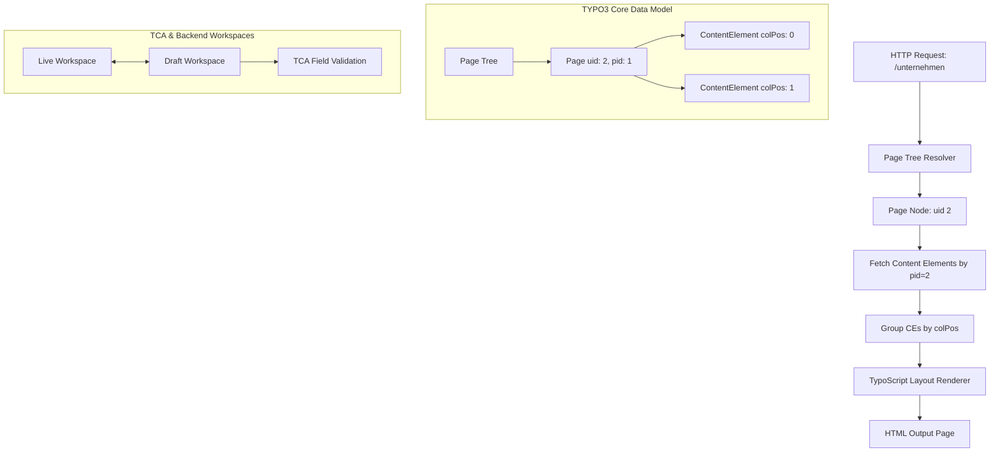

# 🧡 Alternativer Ansatz: Eine TYPO3-PageTree-Engine in Rust nachbauen

Nachdem wir Drupal und XWiki kennengelernt haben, betrachten wir das vor allem im deutschsprachigen Raum führende Enterprise-CMS: **TYPO3**. 

TYPO3 unterscheidet sich grundlegend von anderen Systemen durch sein striktes **Seitenbaum-Konzept (Page Tree)**, die klare Trennung von Seitenstruktur und Content-Elementen (`Content Elements` & `colPos`) sowie die mächtige Konfigurationssprache **TypoScript**. In diesem Kapitel lernst du, wie du eine TYPO3-Core-Engine in Rust modellierst.

---

## 🧠 Theorie & Architektur: Das TYPO3 Seitenbaum- & Content-Modell

Während Wikis oder Drupal flache oder getaggte Dokumentensammlungen sind, baut TYPO3 jede Website zwingend als hierarchischen **Seitenbaum** auf. Jede Seite im Baum besitzt wiederum eigene **Content-Elemente**, die in Layout-Spalten (`Columns` / `colPos`) angeordnet sind.

### Die 4 Grundsäulen einer TYPO3-Engine in Rust

1. **Der Seitenbaum (Page Tree & Doktypes):** Ein hierarchischer Baum aus Seiten-Knoten mit eindeutiger `uid`, `pid` (Parent ID) und Seitentyp (`Standard`, `Shortcut`, `SysFolder`).
2. **Content-Elemente (CType & colPos):** Inhaltsblöcke (`Header`, `TextMedia`, `Plugin`), die einer spezifischen Layout-Spalte (`colPos: 0 = Hauptinhalt`, `colPos: 1 = Sidebar`) zugeordnet sind.
3. **TypoScript Render-Engine:** Eine hierarchische Konfigurations-Engine, die bestimmt, wie Seiten und Content-Elemente in HTML übersetzt werden.
4. **TCA (Table Configuration Array) & Workspaces:** Deklarative Schema-Definitionen für Backend-Masken sowie Entwurfs- und Freigabe-Workflows (`Draft` vs. `Live`).

---

### Die Bildmetapher: Das Hochhaus mit Etagensektoren

Stell dir eine TYPO3-Engine wie ein **großes Unternehmens-Gebäude** vor:

```text
┌───────────────────────────────────────────────────────────────────────────────┐
│                      DAS TYPO3 HOCHHAUS (PAGETREE)                            │
│                                                                               │
│  Root / Startseite (uid: 1, pid: 0)                                           │
│  ├── 🏢 Etage "Unternehmen" (uid: 2, pid: 1)                                  │
│  │    ├── 📄 Spalte 0 (Hauptsaal):  [CE #10: Text "Über uns"]                 │
│  │    └── 📄 Spalte 1 (Infoseite):  [CE #11: Ansprechpartner]                 │
│  └── 🏢 Etage "Produkte" (uid: 3, pid: 1)                                     │
│       └── 📄 Spalte 0 (Hauptsaal):  [CE #12: Produktkatalog Plugin]           │
│                                                                               │
│  ⚙️ [ TypoScript Engine ] ──> Rendert Etage + Spalten in Seiten-Layout        │
└───────────────────────────────────────────────────────────────────────────────┘
```

- **Die Etage (Page Node):** Besitzt eine eindeutige `uid` und verweist auf ihre Vater-Etage (`pid`).
- **Die Sektoren / Spalten (`colPos`):** Jede Etage ist in Spalten unterteilt (z. B. Hauptbereich, Rechte Spalte, Footer).
- **Die Möbelstücke (Content Elements):** Konkrete Inhaltselemente (`CType`), die in eine bestimmte Spalte geschoben werden.

---

### Architektur-Übersicht in Mermaid



---

## 🏗️ Datenstruktur-Entwurf in Rust

Hier ist der typsichere Entwurf für TYPO3s Seitenbaum und Content-Element-System in Rust:

```rust
use std::collections::HashMap;

/// Seitentyp in TYPO3 (doktype)
#[derive(Debug, Clone, PartialEq, Eq)]
pub enum PageType {
    Standard,
    Shortcut { target_page_id: u64 },
    ExternalUrl(String),
    SysFolder,
}

/// Ein Knoten im TYPO3-Seitenbaum
#[derive(Debug, Clone)]
pub struct PageNode {
    pub uid: u64,
    pub pid: u64, // Parent ID (0 = Root)
    pub title: String,
    pub nav_title: Option<String>,
    pub page_type: PageType,
    pub hidden: bool,
    pub sorting: u32,
}

/// Content-Element Typ (CType)
#[derive(Debug, Clone, PartialEq)]
pub enum ContentType {
    Header { text: String, layout_level: u8 },
    TextMedia { bodytext: String, image_url: Option<String> },
    Plugin { extension_name: String, plugin_name: String },
    Shortcut { reference_ce_id: u64 },
}

/// Ein TYPO3 Content-Element auf einer Seite
#[derive(Debug, Clone)]
pub struct ContentElement {
    pub uid: u64,
    pub pid: u64, // Verweist auf die Page-UID!
    pub col_pos: u32, // Spalten-Position (0 = Main, 1 = Left, 2 = Right, 3 = Border)
    pub ctype: ContentType,
    pub sorting: u32,
    pub hidden: bool,
}

/// Der komplette Seitenbaum-Speicher im Arbeitsspeicher
#[derive(Debug, Default)]
pub struct Typo3PageRepository {
    pub pages: HashMap<u64, PageNode>,
    pub content_elements: HashMap<u64, Vec<ContentElement>>, // Page UID -> CEs
}
```

---

## 🛠️ Praxis-Aufgaben

Verwende das obige TYPO3-Datenmodell, um die Kernbausteine der PageTree-Engine in Rust zu programmieren.

### Aufgabe 1 (Leicht): Seitenbaum-Brotkrumen-Navigation (Breadcrumb)

Schreibe eine Funktion, die ausgehend von einer bestimmten `page_id` den Seitenbaum rückwärts über die `pid` bis zur Root-Seite (`pid: 0`) durchläuft und die Titel der Pfad-Seiten als Vektor zurückgibt.

```rust
impl Typo3PageRepository {
    /// Generiert die Brotkrumen-Navigation für eine gegebenen Seiten-ID.
    /// Beispiel: ["Startseite", "Unternehmen", "Team"]
    pub fn build_breadcrumb(&self, start_page_id: u64) -> Result<Vec<String>, String> {
        // TODO: Starte bei `start_page_id`
        // TODO: Verfolge die `pid` rückwärts, solange `pid != 0`
        // TODO: Sammle die Seitentitel und kehre den Vektor am Ende um (.reverse())
        todo!("Implementiere den Breadcrumb-Builder")
    }
}

#[cfg(test)]
mod tests {
    use super::*;

    #[test]
    fn test_breadcrumb() {
        let mut repo = Typo3PageRepository::default();
        repo.pages.insert(1, PageNode { uid: 1, pid: 0, title: "Startseite".into(), nav_title: None, page_type: PageType::Standard, hidden: false, sorting: 1 });
        repo.pages.insert(2, PageNode { uid: 2, pid: 1, title: "Unternehmen".into(), nav_title: None, page_type: PageType::Standard, hidden: false, sorting: 1 });

        let bc = repo.build_breadcrumb(2).unwrap();
        assert_eq!(bc, vec!["Startseite", "Unternehmen"]);
    }
}
```

---

### Aufgabe 2 (Mittel): Layout-Spalten-Grouper (`colPos`)

Wenn eine Seite im Frontend gerendert wird, müssen die `ContentElement`s nach ihrer `col_pos` gruppiert und nach `sorting` sortiert werden. Schreibe eine Funktion, die diese Zuordnung übernimmt.

```rust
impl Typo3PageRepository {
    /// Liefert eine Map von colPos -> Vektor von sortierten ContentElements für eine Seite.
    pub fn get_content_by_columns(&self, page_id: u64) -> HashMap<u32, Vec<ContentElement>> {
        // TODO: Hole alle ContentElements für `page_id` aus `self.content_elements`
        // TODO: Filtere versteckte Elemente (`hidden == true`) heraus
        // TODO: Gruppiere die Elemente nach `col_pos`
        // TODO: Sortiere die Elemente innerhalb jeder Spalte nach `sorting`
        todo!("Implementiere get_content_by_columns")
    }
}
```

*Leitfragen zur Lösung:*
- Wie hilft dir `HashMap::entry` beim Gruppieren von Elementen in Rust?
- Wie kannst du `.sort_by_key(|ce| ce.sorting)` auf einem Vektor anwenden?

---

### Aufgabe 3 (Schwer): TypoScript-Lite-Parser

Schreibe einen einfachen Parser für eine TypoScript-artige Konfigurationszeile wie `page.10 = TEXT` oder `page.10.value = Hallo Welt`.

```rust
#[derive(Debug, PartialEq, Clone)]
pub struct TypoScriptSetting {
    pub key_path: Vec<String>, // z.B. ["page", "10", "value"]
    pub value: String,         // z.B. "Hallo Welt"
}

/// Parst eine TypoScript-Zeile wie "page.10.value = Hallo Welt"
pub fn parse_typoscript_line(line: &str) -> Result<TypoScriptSetting, String> {
    // TODO: Spalte die Zeile am Gleichheitszeichen '='
    // TODO: Spalte den linken Schlüssel-Pfad an Punkten '.'
    // TODO: Trimm Leerzeichen auf beiden Seiten
    todo!("Implementiere den TypoScript-Parser")
}
```

---

## 🚀 Compiler- / Praxis-Experimente

1. **Workspace-Staging-System (Live vs. Draft):**
   Erweitere das `Typo3PageRepository` um ein Workspace-System. Ändert ein Redakteur ein Content-Element, wird eine Kopie im `Draft`-Workspace angelegt. Erst durch den Aufruf einer `publish_workspace()`-Methode werden die Änderungen in den `Live`-Zustand übernommen.

2. **Shortcut-Page Handling:**
   Wenn eine Seite vom Typ `PageType::Shortcut { target_page_id }` aufgerufen wird, soll die Core-Engine automatisch zur Zielseite weiterleiten und deren Inhalt auflösen. Achte darauf, Endlosschleifen (Zirkel-Referenzen) abzufangen!

---

## 💡 Zusammenfassung: CMS-Architekturen im Überblick

| Feature | TYPO3 Engine | Drupal Engine | XWiki Engine |
| :--- | :--- | :--- | :--- |
| **Zentrales Paradigma** | Hierarchischer Seitenbaum | Universelle Entity & Fields | Hierarchische Spaces & XObjects |
| **Content-Zuordnung** | Layout-Spalten (`colPos`) | Felddaten an Content-Types | Objekt-Formulare an Seiten |
| **Konfiguration** | TypoScript Engine | YAML / Module | Wiki-Syntax & XClasses |
| **Stärke** | Komplexe Konzern-Websites | Flexibles Daten-Modelling | Prozess- & Formular-Wikis |

---

## 📚 Links

* [Offizielle TYPO3 Core Architecture Docs](https://docs.typo3.org/m/typo3/reference-coreapi/main/en-us/)
* [Konzept: Tree Data Structures in Rust](file:///home/thorsten/Anfaenger/rust-projekte/src/konzept-structs.md)
* [Konzept: HashMaps & HashSets](file:///home/thorsten/Anfaenger/rust-projekte/src/konzept-hashmaps.md)
* [Wissenssystem Stufe 3: Das interaktive Web-Wiki](file:///home/thorsten/Anfaenger/rust-projekte/src/wissenssystem-3-web-wiki.md)
