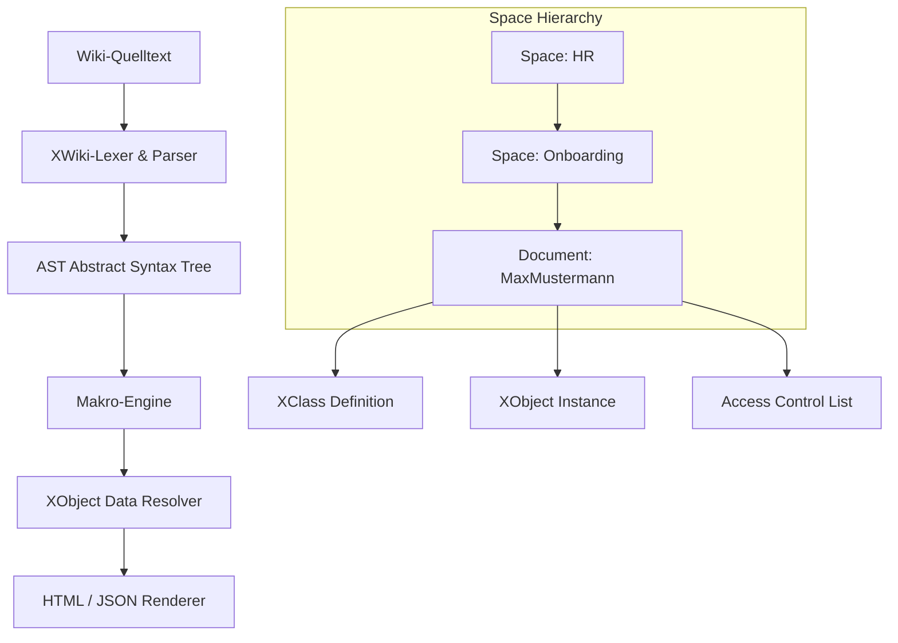

# 🏰 Alternativer Ansatz: Eine XWiki Enterprise-Engine in Rust nachbauen

In vorherigen Kapiteln haben wir einfache Markdown-Wikis und die strukturierte Syntax von MediaWiki kennengelernt. In Unternehmenskontexten reicht reiner Fliesstext jedoch oft nicht aus: Unternehmen benötigen strukturierte Datenfelder (Formulare), hierarchische Arbeitsbereiche (Spaces), Makros, Dokumentenhistorie und feingliedrige Rechteverwaltung.

Genau hier glänzt **XWiki** – eine der mächtigsten Open-Source-Enterprise-Wiki-Plattformen der Welt. In diesem Kapitel lernst du, wie du die Kernarchitektur von XWiki in Rust modellierst und umsetzt.

---

## 🧠 Theorie & Architektur: Das Objektorientierte Wiki-Modell

Während klassische Wikis Seiten primär als flache Textdateien betrachten, kombiniert XWiki Content-Management mit einer **objektorientierten Datenverarbeitung** (Object-Oriented Wiki). 

### Die 4 Säulen einer XWiki-Engine

1. **Hierarchische Namensräume (Nested Spaces):** Seiten liegen nicht flach nebeneinander, sondern sind strukturiert in Pfaden wie `HR.Onboarding.Checkliste` organisiert.
2. **XClasses & XObjects (Strukturierte Daten):** Du kannst einer Wiki-Seite beliebige Formulareigenschaften anhängen. Eine Seite ist damit gleichzeitig Dokument *und* Datenbank-Eintrag.
3. **Erweiterbares Makro-System:** Dynamische Bausteine wie `{{toc /}}` (Inhaltsverzeichnis) oder `{{code language="rust"}}...{{/code}}` transformieren den Quelltext beim Rendern.
4. **Granulare Rechteverwaltung (ACLs):** Zugriffsrechte können auf Space-, Seiten- oder Objekt-Ebene vererbt und überschrieben werden.

---

### Die Bildmetapher: Der Enterprise-Aktenordner mit Formular-Schablonen

Stell dir eine XWiki-Engine wie ein modernes **digitales Archiv-System** vor:

```text
┌───────────────────────────────────────────────────────────────────────────────┐
│                      DAS ENTERPRISE-WIKI-ARCHIV                               │
│                                                                               │
│  [ HR ] -> [ Onboarding ] -> [ MaxMustermann.md ]                             │
│                                ├── 📄 Fliesstext: "Willkommen im Team..."     │
│                                ├── 📋 XObject (Klasse: EmployeeClass)         │
│                                │    ├── Name: "Max Mustermann"                │
│                                │    ├── Rolle: "Senior Rust Developer"        │
│                                │    └── Eintritt: 2026-08-01                  │
│                                └── 🔐 ACL: [HR-Team: Edit, All: Read]          │
└───────────────────────────────────────────────────────────────────────────────┘
```

- **Der Hängeregister-Pfad (Nested Spaces):** Die Seite liegt im Ordner `HR` -> `Onboarding`.
- **Die Schablone (XClass):** Definiert, welche Felder ein Mitarbeiter-Eintrag besitzen muss.
- **Das ausgefüllte Formular (XObject):** Hängt direkt an der Seite an und speichert die konkreten Werte.
- **Der Tresor-Stempel (ACL):** Steuert präzise, wer lesen oder bearbeiten darf.

---

### Architektur-Übersicht in Mermaid



---

## 🏗️ Datenstruktur-Entwurf in Rust

Um dieses mächtige Modell abzubilden, definieren wir typsichere Datenstrukturen mit Rusts `enum` und `struct`:

```rust
use std::collections::HashMap;

/// Eindeutiger hierarchischer Pfad einer XWiki-Seite (z. B. ["HR", "Onboarding", "Welcome"])
#[derive(Debug, Clone, PartialEq, Eq, Hash)]
pub struct PageReference {
    pub space_path: Vec<String>,
    pub page_name: String,
}

/// Datentypen, die in einer XClass definiert werden können
#[derive(Debug, Clone, PartialEq)]
pub enum PropertyType {
    String,
    Number,
    Boolean,
    Date,
    StaticList(Vec<String>),
}

/// Die Definition eines Formulars (XClass)
#[derive(Debug, Clone)]
pub struct XClass {
    pub name: String,
    pub fields: HashMap<String, PropertyType>,
}

/// Der konkrete Wert einer Property in einem XObject
#[derive(Debug, Clone, PartialEq)]
pub enum PropertyValue {
    Text(String),
    Number(i64),
    Bool(bool),
    Choice(String),
}

/// Eine Objekt-Instanz, die an eine Wiki-Seite angehängt wird
#[derive(Debug, Clone)]
pub struct XObject {
    pub class_name: String,
    pub properties: HashMap<String, PropertyValue>,
}

/// Benutzerrechte für das ACL-System
#[derive(Debug, Clone, PartialEq, Eq)]
pub enum Permission {
    Read,
    Edit,
    Delete,
    Admin,
}

/// Zugriffssteuerungsliste (ACL) für Räume und Seiten
#[derive(Debug, Clone, Default)]
pub struct AccessControlList {
    pub user_permissions: HashMap<String, Vec<Permission>>,
    pub group_permissions: HashMap<String, Vec<Permission>>,
}

/// Das vollständige XWiki-Dokument
#[derive(Debug, Clone)]
pub struct XWikiDocument {
    pub reference: PageReference,
    pub title: String,
    pub content: String,
    pub objects: Vec<XObject>,
    pub version: (u32, u32), // Major, Minor Version (z. B. 1.2)
    pub acl: AccessControlList,
}
```

---

## 🛠️ Praxis-Aufgaben

Verwende das obige Datenmodell, um die Kernfunktionen der XWiki-Engine Schritt für Schritt zu entwickeln. Ergänze die vorbereiteten Funktionsgerüste!

### Aufgabe 1 (Leicht): Hierarchischer Pfad-Resolver

Schreibe eine Funktion, die aus einem String-Pfad wie `"HR/Onboarding/Willkommen"` eine strukturierte `PageReference` erzeugt.

```rust
/// Wandelt einen Pfad-String in eine `PageReference` um.
/// Beispiel: "HR/Onboarding/Willkommen" -> space_path: ["HR", "Onboarding"], page_name: "Willkommen"
pub fn parse_page_reference(raw_path: &str) -> Result<PageReference, String> {
    // TODO: Zerlege den Pfad am Trennzeichen '/'
    // TODO: Behandle Fehler (z. B. leere Pfade)
    todo!("Implementiere das Parsen der PageReference")
}

#[cfg(test)]
mod tests {
    use super::*;

    #[test]
    fn test_parse_page_reference() {
        let pref = parse_page_reference("HR/Onboarding/Willkommen").unwrap();
        assert_eq!(pref.space_path, vec!["HR", "Onboarding"]);
        assert_eq!(pref.page_name, "Willkommen");
    }
}
```

---

### Aufgabe 2 (Mittel): XObject-Validierer gegen XClass

Ein XObject muss den Datentypen entsprechen, die in der übergeordneten `XClass` vorgegeben sind. Schreibe eine Validierungsfunktion, die prüft, ob alle Werte im `XObject` den Typen der `XClass` entsprechen.

```rust
/// Prüft, ob die Eigenschaften eines XObjects zu seiner XClass-Definition passen.
pub fn validate_xobject(class_def: &XClass, object: &XObject) -> Result<(), Vec<String>> {
    // TODO: Iteriere über alle Felder in `class_def.fields`
    // TODO: Prüfe, ob das `object` den Wert enthält und ob der `PropertyValue` zum `PropertyType` passt
    // TODO: Sammle alle Fehlermeldungen in einem Vektor
    todo!("Implementiere die Validierung von XObjects")
}
```

*Leitfragen zur Lösung:*
- Was passiert, wenn im `XObject` ein Feld fehlt, das in der `XClass` als verpflichtend gilt?
- Wie kannst du mit Rusts `match` eleganter prüfen, ob z.B. ein `PropertyValue::Text` zu einem `PropertyType::String` passt?

---

### Aufgabe 3 (Schwer): Makro-Engine & Inhaltsverzeichnis (`{{toc /}}`)

In XWiki fügt das Makro `{{toc /}}` dynamisch ein Inhaltsverzeichnis ein, das aus den Überschriften (z.B. `= H1 =` oder `== H2 ==`) des Dokuments generiert wird.

```rust
/// Durchsucht den Wiki-Fliesstext nach Überschriften und ersetzt das Makro {{toc /}}
/// durch eine strukturierte Markdown-/HTML-Liste der Überschriften.
pub fn process_toc_macro(content: &str) -> String {
    // TODO: 1. Prüfe, ob "{{toc /}}" im Content vorhanden ist. Falls nicht, gib den Content unverändert zurück.
    // TODO: 2. Scanne den Text nach Überschriften (z.B. Zeilen, die mit "=" beginnen).
    // TODO: 3. Erstelle einen Inhaltsverzeichnis-Block als String.
    // TODO: 4. Ersetze "{{toc /}}" durch das generierte Inhaltsverzeichnis.
    todo!("Implementiere die Toc-Makro-Ersetzung")
}
```

---

## 🚀 Compiler- / Praxis-Experimente

Probiere folgende Erweiterungen in deinem Projekt aus, um das Verständis für fortgeschrittene Rust-Konzepte zu vertiefen:

1. **Rechte-Vererbung (ACL Inheritance):**
   Erweitere das Rechte-System so, dass eine Seite, die keine eigenen ACL-Regeln definiert, automatisch die Rechte ihres übergeordneten *Space* erbt. Nutze dafür Rusts `Option<&AccessControlList>`.

2. **Dokumenten-Diffing & Historie:**
   Entwirf eine Struktur `DocumentHistory`, die vorherige Versionen eines `XWikiDocument` speichert. Überlege, wie du Speicherplatz sparst, indem du nicht jedes Mal das komplette Dokument duplizierst, sondern Diffs (Unterschiede) speicherst.

---

## 💡 Zusammenfassung: Wiki-Systeme im Vergleich

| Feature | Standard Markdown-Wiki | MediaWiki Engine | XWiki Enterprise Engine |
| :--- | :--- | :--- | :--- |
| **Datenstruktur** | Flache Markdown-Dateien | Wikitext mit Templates | Hierarchische Spaces & XObjects |
| **Formular-Daten** | Keine (nur Freitext) | Begrenzt über Vorlagen | Vollwertige Objektklassen (`XClass`) |
| **Rechteverwaltung** | Meist global | Gruppenbasiert | Granular (Space, Page, Object) |
| **Hauptfokus** | Einfache Notizen & Doku | Enzyklopädie (Wikipedia) | Enterprise Knowledge & Process Apps |

---

## 📚 Links

* [Offizielle XWiki Architektur-Dokumentation](https://www.xwiki.org/xwiki/bin/view/Documentation/)
* [Konzept: Enums & Pattern Matching in Rust](file:///home/thorsten/Anfaenger/rust-projekte/src/konzept-enums.md)
* [Konzept: Structs & Methoden](file:///home/thorsten/Anfaenger/rust-projekte/src/konzept-structs.md)
* [Wissenssystem Stufe 3: Das interaktive Web-Wiki](file:///home/thorsten/Anfaenger/rust-projekte/src/wissenssystem-3-web-wiki.md)
